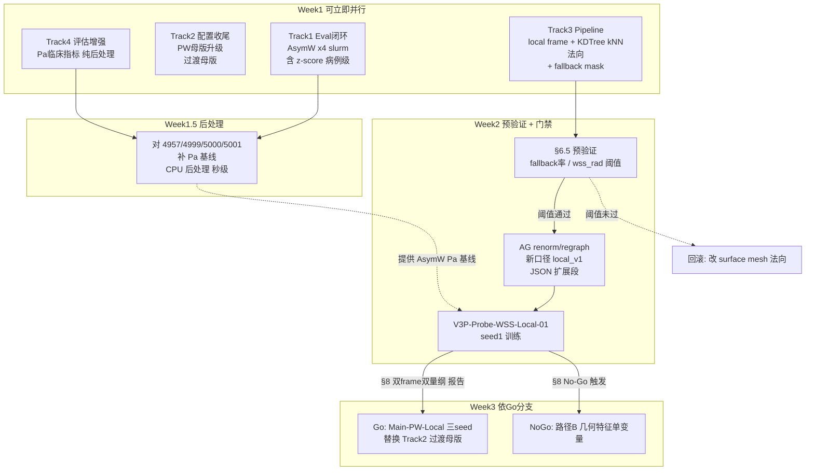
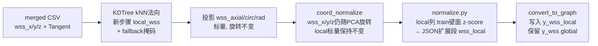

# V3P 后续优化执行计划（可并行版）

> **状态**：**历史文档（2026-05-28 起）** — Track 5/6 No-Go；后续训练以路径 F → 路径 G 门禁为准。
> **当前规划入口**：[V3 README](../README.md) · [路径 G](../00-当前主线/路径G_下一代架构与精度突破方案_2026-06-05.md) · [工程化精度方案（M-E）](V3P_工程化精度优化方案_2026-06-25.md)
> **勿**把本文 Track 顺序当作当前 GPU 队列。
> **日期**：2026-05-25（初版） · 2026-05-26（Track 5 收尾） · **2026-05-27（TODO-12/10/17 收尾 + GeomB1 eval 5169）** · **2026-05-28（复审补充）**
> **范围**：仅 V3P（`split_AG_v1` + `data_new/AG`）；**V3D 全部暂缓**
> **索引**：[README](../README.md) · [精度突破路径](../02-历史路线/V3_精度突破路径与发散方案.md) · [后续优化待办](V3_后续优化待办.md) · [实验跟踪](V3_实验执行跟踪日志.md)
> **修订摘要**：§1.1/§6.1 法向描述与 fallback 策略明确；§6.2 归一化 JSON 改为单文件扩展段；§6.3 加 core/config 向后兼容与 warm-start 禁令；§6.5 fallback 阈值与回滚动作；§7 Pa 脚本纯后处理 + 单位前提；§8 双 frame 双量纲对比模板；§5/§9.1 母版替换路径；§11 GPU 规范分模式

---

## 1. 文档用途

本文是 V3P 单线优化的**可执行计划**，供后续 agent / 人工审查。审查通过后，按 Track 顺序落地；**任何 split / 归一化 / local frame 变更须新口径标签，禁止与旧指标混表**。

### 1.0 复审补充（2026-05-28）

本计划的 Track 1–6 已完成核心 Go/No-Go 闭环，结论是 **local frame / MagOnly / GeomB1 / VelGradB1 / MagCons 均未突破 `~0.40` 带宽**。后续不要再按本文直接派生新的 V3P 训练；本文仅保留为 A/B 路径执行与判定记录。

新的训练必须转到 [V3_发散优化探索路线.md](../02-历史路线/V3_发散优化探索路线.md) 的路径 F 门禁：**TODO-18 MultiK1（5202）已 No-Go**；完成 **TODO-27a + TODO-53 + TODO-32 + oracle** 的 0 重训诊断，再由证据触发 **TODO-31 / 37 / 42 / 29** 中的一条。

### 1.1 已确认的设计决策

| 项 | 决策 |
| --- | --- |
| 优化范围 | **V3P only**；V3D（TODO-19、V3D-WSS-01-PW 等）冻结 |
| 法向来源 | **STL 表面网格点法向（默认，`--normal-source stl`）**；kNN 内部点估计保留为调试/对照（`--normal-source knn`，QA 易未过 §6.5）；CFD 表面法向即 `{CASE}.stl` snap，**无需重跑 vmtk 中心线** |
| TODO-8 剩余 | **纳入本轮**：独立 `eval_wss_clinical_metrics.py` + 接入 `evaluate_field_run_full` |
| 核心突破路径 | **路径 A · TODO-5 局部坐标系**（P0） |

### 1.2 审查清单（已审查 · 修订完成）

> 审查结论见 §12；本节标记每项审查结论与对应修订位置。

- [x] **范围**：V3D 冻结合理（瓶颈异质，单独立项）；V3P 单线覆盖当前 ~0.40 带宽瓶颈 ✅
- [x] **前提事实**：与 [精度突破路径](../02-历史路线/V3_精度突破路径与发散方案.md) §1.1/§2.1 完全一致 ✅
- [x] **并行性**：依赖关系正确；§3 mermaid 图已含 Track 1/4 → AsymW Pa 基线、Track 3 → renorm → Track 5 串行门禁 ✅
- [x] **Track 3 技术方案**：§6.1 改用 KDTree kNN（不直接迁移 hemo）；§6.2 数据流注明 local 标量旋转不变；§6.3 coord_normalize / augmentation 处理策略明确 ✅
- [x] **口径隔离**：§6.2 改为单文件扩展段（与精度突破路径 §A1 统一）；`local_v1` 标签适用范围已限定 ✅
- [x] **Go/No-Go 阈值**：§8 加入跨 frame 比较口径约定（magnitude 可比、单分量仅 local 内部比）+ 双 frame 双量纲报告模板 ✅
- [x] **Track 4**：§7 明确为纯后处理脚本（无 GPU、无重跑 predict）；与 `evaluate_wss_credibility` 边界以"量纲 + 输入"维度区分 ✅
- [x] **资源**：§11 分 slurm / 直接 python / CPU 三种场景给出 GPU 确认流程 ✅
- [x] **遗漏风险**：§5 Track 2 加母版替换路径；§3 已有 Track 1 → AsymW 病例级基线节点；§8 Go 判据加"vs AsymW 不显著退化"项 ✅
- [x] **文档同步**：§10 列表完整（推进记录、待办、实验跟踪）；§12 审查记录已填 ✅

---

## 2. 背景与目标

### 2.1 当前事实（2026-05-24）

| 项 | 值 / 结论 |
| --- | --- |
| V3P AsymW-a 三 seed | **0.394 ± 0.005**（4957/4999/5000）；单 seed 最高 **0.399** |
| 增益来源 | 几乎全在 `wss_z`；test `wss_x/y` ≈ 0 |
| AsymW+WssDO（5001） | **0.398** ≈ 纯 AsymW → TODO-7 关闭 |
| 全局坐标带宽 | ~0.36–0.40；继续扫权重/Dropout ROI 已耗尽 |
| Probe-WSS-01（3645） | 点级 R² **0.364**；病例 p95 Spearman **0.446**；top 10% Dice **0.192** |
| AsymW 四 run eval | 4957/4999/5000/5001 **仅有 checkpoint**，无 `predictions_*` / `evaluation/` |

### 2.2 目标

1. **冲破 ~0.40**：走路径 A（WSS 局部坐标系，TODO-5）
2. **评估可信**：补齐 AsymW 病例级 / 高 WSS 基线 + Pa 临床口径（TODO-8 剩余）
3. **单变量纪律**：local frame / 几何特征 / magnitude loss **分表**，禁止多因素同改

---

## 3. 并行总览



| 轨道 | 内容 | 资源 | 依赖 | 预计周期 |
| --- | --- | --- | --- | --- |
| **Track 1** | AsymW 四 run 完整 eval | GPU×4 并行 | 无 | 1–2 天 |
| **Track 2** | PW 母版升级为 AsymW 权重 | CPU | 无 | 0.5 天 |
| **Track 3** | TODO-5 local frame pipeline（kNN 法向） | CPU + node03 批处理 | 无 | 5–7 天 |
| **Track 4** | Pa 临床指标（TODO-8 剩余） | CPU | 无（与 Track 3 并行） | 3–5 天 |
| **Track 5** | Probe-Local 训练 + eval | GPU×1 | Track 3 完成 renorm | ✅ **No-Go**（5146/5156） |
| **Track 6** | Main-PW-Local 三 seed 或路径 B | GPU×1–3 | Track 5 Go/No-Go | ✅ **No-Go**（5161 GeomB1 / 5160 MagOnly / **5170 VelGradB1**） |

### 3.1 TODO 映射

| Track | 对应 TODO |
| --- | --- |
| Track 1, 4 | TODO-8（评估与选优，路径 D） |
| Track 2 | 母版升级（AsymW 配方固化） |
| Track 3, 5, 6 Go | TODO-5（路径 A） |
| Track 6 边际 | TODO-9, TODO-10 |
| Track 6 No-Go | TODO-12（路径 B） |

---

## 4. Track 1 · 评估闭环（立即可做，零代码）

**现状**：4957/4999/5000/5001 仅有 checkpoint + `summary.json`。Probe 3645 已验证 `training/scripts/evaluate_field_run_full.py` 全链路（历史脚本路径；当前仓库未保留该脚本）。

**动作**：并行提交 4 个 [`run_evaluate_field_run_full.slurm`](../../../../../training/cluster/run_evaluate_field_run_full.slurm)：

```bash
cd /public/newhome/cy/Digital_twin/GNN
for RUN in \
  field_v3_pointnext_localpool_main01_geom_pw_asymw_a_wall13000_near2000_split_AG_v1_seed1_20260522_124946 \
  field_v3_pointnext_localpool_main01_geom_pw_asymw_a_wall13000_near2000_split_AG_v1_seed2_20260523_124511 \
  field_v3_pointnext_localpool_main01_geom_pw_asymw_a_wall13000_near2000_split_AG_v1_seed3_20260523_124511 \
  field_v3_pointnext_localpool_main01_geom_pw_asymw_wssdo_a_wall13000_near2000_split_AG_v1_seed1_20260523_124511
do
  RUN_DIR_REL=outputs/field/$RUN sbatch training/cluster/run_evaluate_field_run_full.slurm
done
```

**产出**（每 run）：

- 点级 / 区域级 Task A 图件
- `training/scripts/evaluate_wss_credibility.py`（历史脚本路径；当前仓库未保留该脚本）：`wss_case_metrics.csv`、`high_wss_overlap.json` 等
- 索引：`evaluation/test_best_wss_model/evaluation_summary.json`

**对照基线**（Probe 3645，归一化空间）：

| 层级 | Probe-WSS-01 |
| --- | --- |
| 点级 R² | 0.364 |
| 病例 p95 Spearman | 0.446 |
| top 10% Dice | 0.192 |

**后续**：Track 4 完成后，对 **4957/4999/5000/5001** 用 `eval_wss_clinical_metrics.py` 做**纯 CPU 后处理**补 Pa 口径报告（输入既有 `predictions_*.npz`，无须重跑 predict_field，秒级出结果）。Pa 基线供 Track 5/6 跨 frame 对比（§8 模板）。

---

## 5. Track 2 · 配置收尾（与 Track 1 并行）

**动作**：

1. 以 [`V3P-Main-01-PW-AsymW-a_seed1.json`](../../../../../training/configs/field/generated/v3_pointcloud/V3P-Main-01-PW-AsymW-a_seed1.json) 为 V3P PW 新母版
2. 默认 `wss_weights` / `val_score_wss_weights` = `[1, 0.05, 0.05, 0.90]`
3. `meta.notes` 标注：**「全局坐标过渡方案，local frame 验证前对照；待 Track 6 Go 后由 `V3P-Main-01-PW-Local` 替换，AsymW-a 降为 global 对照母版」**
4. 同步 [V3_后续优化待办.md](V3_后续优化待办.md) TODO-8 为「基础设施 ✅ / AsymW 批跑 ⏳」

**生命周期**：本次升级为**过渡母版**——若 Track 6 Go，AsymW-a 母版地位被 Main-PW-Local 替换；若 Track 6 No-Go，AsymW-a 保留为 V3P PW 主线母版。

**不做**：V3D 配置、WssDO 新实验、全局权重扫描。

---

## 6. Track 3 · TODO-5 局部坐标系（P0 核心）

### 6.1 设计规格

- **法向 n̂**：**KDTree kNN（CSV 坐标 + `is_wall`，新实现）**几何估计——对每个壁面点，用 KDTree 在内部点（`is_wall=0`）中找 `k_internal=5` 近邻，取「内部均值 → 壁面点」方向作为外法向；逻辑参考 [`hemo._estimate_wall_normals`](../../../../../training/analysis/hemo.py)，但**不直接迁移**（hemo 用 `edge_index` 沿图边找邻居，本步在 `convert_to_graph` 之前尚无图）。
- **Fallback 策略**：无内部邻居时**不**回退到固定方向（避免与 global z 耦合，见 §6.5），改为打 `wss_normal_valid=0` 掩码，下游 loss / metric 跳过该点。
- **切向 t̂**：已有 `Tangent_X/Y/Z`（[`pipeline/extract_features.py`](../../../../../pipeline/extract_features.py)）。
- **第二切向基 b̂**：`b̂ = n̂ × t̂`，再正交化 `b̂ ← b̂ / ‖b̂‖`；`t̂` 与 `b̂` 不正交时（分叉处）记 `wss_basis_valid=0`。
- **投影定义**（与 [精度突破路径 §A1](../02-历史路线/V3_精度突破路径与发散方案.md) 一致）：
  - `wss_axial = WSS_vec · t̂`（轴向，主流方向）
  - `wss_circ = WSS_vec · b̂`（环向）
  - `wss_rad = WSS_vec · n̂`（径向，理论上 ≈ 0，作为质检通道）
  - 保留 `wss` magnitude `‖WSS_vec‖` 作为第 4 维或单独标量（**frame-invariant**，跨 frame 对比用，见 §8）。
- **rotation-invariance 论证**：axial/circ/rad/magnitude 均为标量投影，与 PCA 旋转、随机旋转增强解耦——前提是 `local_wss` 步骤位于 `coord_normalize` **之前**（见 §6.2 数据流）。

### 6.2 Pipeline 数据流



**新口径标签 `local_v1` 适用范围（明确边界）**：

| 适用 | 不适用 |
| --- | --- |
| `data.graphs_subdir` 后缀（如 `processed/graphs_local_v1`） | normalization JSON 文件名 |
| 配置文件 `run.experiment_name` / `meta.exp_id` 后缀 | normalization JSON 内键名 |
| `evaluation_summary.json` 顶层 `frame_tag` 字段 | 训练 ckpt 文件名（依 experiment_name 已隐含） |

**归一化 JSON 策略（与 [精度突破路径 §A1](../02-历史路线/V3_精度突破路径与发散方案.md) 统一）**：**单文件扩展段**，沿用 `normalization_params_global.json`，新增 `wss_local` 顶层键：

```json
{
  "wss":       {"mean": ..., "std": ...},        // 既有，保留给 global 配方
  "wss_local": {
    "axial": {"mean": ..., "std": ...},
    "circ":  {"mean": ..., "std": ...},
    "rad":   {"mean": ..., "std": ...}
  }
}
```

理由：(i) `predict_field` / `evaluate_*` 加载逻辑只需一处改；(ii) AsymW / Probe global 评估的 inverse z-score 继续用 `wss` 段，避免双 JSON 维护；(iii) 口径隔离靠**字段名**（`y_wss` vs `y_wss_local`）+ **配置标签**（`wss_target_frame`、`graphs_subdir`）已足够强。

**禁止与 AsymW 0.399 / Probe 0.364 混表。**

### 6.3 关键改动文件

**Pipeline**

| 文件 | 改动 |
| --- | --- |
| 新 `pipeline/local_wss.py` | KDTree kNN 法向（CSV 坐标 + `is_wall`，不依赖 edge_index）+ 投影；写 `wss_axial/circ/rad` 列与 `wss_normal_valid` / `wss_basis_valid` mask；单 case / 批量入口；QA JSON 见 §6.5 |
| `pipeline/config.py` | 新增 `WSS_LOCAL_TARGET_NAMES = ("wss_axial", "wss_circ", "wss_rad")`、`WSS_LOCAL_MASK_NAMES = ("wss_normal_valid", "wss_basis_valid")` |
| `pipeline/normalize.py` | local 列 train-only 壁面 z-score（**忽略 mask=0 的点**）；写入 `normalization_params_global.json` 的 `wss_local` 扩展段（§6.2） |
| `pipeline/convert_to_graph.py` | 写入 `y_wss_local`（NaN 表掩码）+ `wss_local_mask`；**保留 `y_wss` global** 不变 |
| `pipeline/coord_normalize.py` | **wss_x/y/z 保持现状随 PCA 旋转**（global 口径继续可用）；**新增 axial/circ/rad/mask 列不参与旋转**（标量已 frame-invariant） |
| `pipeline/augmentation.py` | 旋转/镜像增强只作用于坐标与原矢量字段（含 wss_x/y/z）；**local 标量与 mask 列保持不变**；本轮 **n̂/t̂ 不进入节点特征**，故无须随增强旋转（后续 B 系若加入再扩展） |

**Training**

| 文件 | 改动 |
| --- | --- |
| `training/core/config.py` | 新增 `DataConfig.wss_target_frame: Literal["global", "local"] = "global"`；新增 `ModelConfig.wss_dim` 允许 3/4（默认 4 保持兼容）。**向后兼容硬性约束**：字段缺失须能加载旧 ckpt 与 Track 2 升级母版；JSON 解析层须容忍 `wss_target_frame` 缺省 |
| `training/core/data.py` | 按 frame 选择 `y_wss` / `y_wss_local`；local 模式读 `wss_local_mask` 并下传 |
| `training/core/losses.py` | 目标名分支；local 模式按 mask 过滤 NaN 点；`wss_loss_type` / `wss_weights` 保持原语义但作用域切到 local 分量 |
| `training/core/metrics.py` | 新增 `wss_axial` / `wss_circ` / `wss_rad` 指标名；val_score 权重在 local 模式下作用于 local 分量；**同时输出 `wss_r2_mag`**（local 模式下 `‖pred_local‖` vs `‖true_local‖` 的 R²，frame-invariant，供跨 frame 对比） |
| `training/core/trainer.py` | 反归一化键对齐（global 用 `wss` 段，local 用 `wss_local` 段） |
| `training/core/models.py` | **`wss_head` 形状随 `wss_dim` 变（4→3 或权重维度变）；与 AsymW global ckpt 不兼容**，**禁止 warm-start**；local 训练必须从头开始（`load_state_dict` 时 wss_head 段 strict=False 也不允许，须显式重建该层） |
| `predict_field.py` / `evaluate_wss_credibility.py` | local 分量评估；分量与 magnitude 双报告；mask=0 点排除统计 |

### 6.4 数据重跑（node03 集群）

- 范围：AG + `split_AG_v1` train 集统计
- 入口：现有 `run_renorm_regraph.slurm` 或等价单域脚本
- 文档：在 [V3_实验执行跟踪日志.md](V3_实验执行跟踪日志.md) 新开块

### 6.5 预验证（renorm 前，2–3 case，CPU）

**检查项**：

- local 分量 train/test 分位 diff（25/50/75/95 分位 + 标准差）
- 分叉处 `wss_axial` 是否比 global `wss_z` 跨 case 更稳定（同病例不同时刻、不同病例同位置）
- **法向 fallback 率**：`wss_normal_valid=0` 占壁面点比例（无内部 kNN 邻居）
- **基向量退化率**：`wss_basis_valid=0` 占壁面点比例（t̂ 与 n̂ 近平行，分叉处常见）
- `wss_rad` 分布（理论应 ≈0；偏离表示法向估计噪声）

**Fallback 处理策略**（不回退到固定方向，避免与 global z 耦合）：

| 情况 | 处理 | 下游影响 |
| --- | --- | --- |
| `wss_normal_valid=0` | 标 mask；`y_wss_local` 该点写 NaN | loss / metric 跳过；`evaluate_wss_credibility` 报告时排除 |
| `wss_basis_valid=0` | 标 mask；只保留 `wss_axial`（沿已知 t̂），`wss_circ/rad` 写 NaN | 分量 loss 跳过；标量 magnitude 仍可用 |
| 法向估计噪声大（`wss_rad` 极端） | 暂不剔除，记录在 `local_wss_qa.json` | 由 §6.5 阈值判断 |

**硬阈值（任一触发即回滚或方法切换）**：

| 指标 | 阈值 | 触发动作 |
| --- | --- | --- |
| train 集 `wss_normal_valid=0` 率 | **> 5%** | 回滚；改用 surface mesh 法向（CFD 提供） |
| train 集 `wss_basis_valid=0` 率 | **> 10%** | 缩小 `k_internal`、检查切向估计；不达标改方法 |
| `wss_rad` p95 / `wss` p95 | **> 0.3** | 法向估计噪声过大；同上 |

预验证产物：`pipeline/local_wss_qa_<case>.json`，包含上述统计与全表 mask 直方图。预验证未达阈值则**不进入 renorm**。

---

## 7. Track 4 · Pa 临床指标（与 Track 3 并行）

**目标**：补齐 TODO-8 剩余——Pa 量纲病例级 Pearson。

**前置确认（落地前必须核对）**：

- `pipeline/normalize.py` 中 `wss` 段的归一化为 **Pa 量纲的纯 z-score**（无单位换算、无幂次变换）；inverse z-score `x_pa = x_norm * std + mean` 即可还原物理量。若发现上游有单位换算（如 dyn/cm² ↔ Pa）须先在 §7 此处明示并改 inverse 逻辑。

**设计原则：纯后处理脚本**

- `eval_wss_clinical_metrics.py` 设计为**纯后处理**：输入 `predictions_*.npz`（`predict_field` 已产出）+ `normalization_params_global.json`，**不调用 `predict_field`、不需要 GPU、不重跑模型**。
- 这样 Track 1 完成后，对 4957/4999/5000/5001 补 Pa 报告只需 CPU 后处理，秒级出结果；与重跑 `evaluate_field_run_full --clinical-pa` 等价但更轻量。

**动作**：

1. 新增 `training/scripts/eval_wss_clinical_metrics.py`（独立脚本，利于论文追溯）
2. 读 `predictions_<subset>.npz` + `normalization_params_global.json` → inverse z-score → Pa
3. local 模式自动识别（若 npz 中存在 `y_wss_local_pred`）：用 `wss_local` 段反 z-score；同时计算 `‖wss‖` Pa（frame-invariant）
4. 产出：
   - `wss_pa_case_metrics.csv`：病例 mean/p95/max 的 Pearson/Spearman（Pa）
   - `fig_case_level_wss.png`：散点 + 1:1 线 + Pa 单位
   - `wss_pa_summary.json`：汇总入 `evaluation_summary.json`
5. 接入 `evaluate_field_run_full.py` 可选步 `--clinical-pa`（薄包装；不传时不调用，保持原 slurm 不破坏）
6. Track 1 完成后**单独**对 4957/4999/5000/5001 跑后处理建立 global 坐标 **Pa 基线**（无须重跑 predict）

**与现有脚本边界**：

| 脚本 | 量纲 | 输入 | 用途 | 是否需 GPU |
| --- | --- | --- | --- | --- |
| `evaluate_wss_credibility.py` | 归一化空间（z-score） | `predictions_*.npz` | 点级 / 病例级 / top-k，训练选优同源 | ❌（已是后处理） |
| `eval_wss_clinical_metrics.py` | **Pa 物理量纲** | `predictions_*.npz` + normalization JSON | 论文可宣称的临床相关指标 | ❌（纯后处理） |

> 两者均为纯后处理；区别在量纲与汇报口径。`predict_field` 仍由 `evaluate_field_run_full` 主流程统一调用，只跑一次。

---

## 8. Track 5 · 首训：`V3P-Probe-WSS-Local-01`

**前置**：Track 3 renorm/regraph 完成。

**配置**：fork [`V3P-Probe-WSS-01_seed1.json`](../../../../../training/configs/field/generated/v3_pointcloud/V3P-Probe-WSS-01_seed1.json) → `V3P-Probe-WSS-Local-01_seed1.json`

| 字段 | 值 |
| --- | --- |
| `data.wss_target_frame` | `"local"` |
| `model.wss_dim` | `3` 或 `4`（含 magnitude） |
| `optim.wss_weights` | 均匀或 `[1,1,1,0.9]` |
| `optim.domain_loss.lambda_wss` | `1.0`（WSS-only） |
| `data.graphs_subdir` | 新 local 图目录 |

**比较口径约定（重要，避免混表）**：

- **跨 frame 对比统一用 magnitude**：`‖wss‖` 在 global / local 下完全等价（frame-invariant），即新增的 `wss_r2_mag` 与历史 `wss_r2_wss`（4 维 head 第 1 维）**可比**。
- **单分量（axial / circ / rad）是新指标**：无历史对照，**不可**与 0.394（AsymW 标量）/ 0.364（Probe 标量）直接比；只能在 local frame 内部纵向比较。
- **Pa 病例级**：用 Track 4 `eval_wss_clinical_metrics.py` 在 Pa 量纲下计算，跨 frame 也可比（mean/p95/max 是标量统计）。

**Go 判据（seed=1，全部满足）**：

1. **结构信号**：`wss_axial` test R² **> 0.50**（新 frame 内部指标，证明 local 表示有效）
2. **标量信号**：`wss_r2_mag` **> 0.45**（frame-invariant，与 AsymW 0.394 / Probe 0.364 可比）
3. **临床信号 vs Probe**：Pa 病例 p95 Pearson **优于 Probe 3645 基线**（Track 4 后测定）
4. **临床信号 vs AsymW**：Pa 病例 p95 Pearson **不显著低于 AsymW-a 4957（global）同口径**（Δ ≥ −0.05；避免"axial 升而临床退化"漏判，依赖 Track 1 + Track 4 产出的 4957 Pa 基线）

**No-Go 判据（任一触发即转 Track 6 No-Go）**：

- 相对 Probe 3645 点级 `wss_r2_mag` 增益 **< +0.02** 且病例级 Pa 无改善 → 转路径 B
- **`wss_axial` R² 提升 < 0.10** 且 `wss_r2_mag` 无显著抬升 → 触发**法向质量复核**（重检 §6.5 QA、fallback 率、`wss_rad` 分布）；复核合格再判 Go/No-Go，不合格回滚法向方法

**报告模板（强制双 frame 双量纲）**：

| 指标 | global (4957 / Probe 3645) | local_v1 (Probe-Local) | 跨 frame 可比 |
| --- | --- | --- | --- |
| 点级 `wss_r2_mag` | 0.394 / 0.364 | ? | ✅ |
| 点级 `wss_axial` R² | — | ? | ❌（仅 local） |
| Pa 病例 p95 Pearson | ? (Track 4 补) | ? | ✅ |
| Pa 病例 mean Pearson | ? | ? | ✅ |
| top 10% Dice | 0.192 (Probe) / ? (AsymW) | ? | ✅ |

---

## 9. Track 6 · Go/No-Go 分支

### 9.1 Go → Main-PW-Local 三 seed

- 配置：`V3P-Main-01-PW-Local`（AsymW 权重适配 local 分量命名；`wss_weights` 重新校准，不直接套用 global `[1, 0.05, 0.05, 0.90]`——axial 应是主权重，circ/rad 视预验证分布定）
- 三 seed 并行训练 → 完整 eval + Pa 报告（**双 frame 双量纲对比表**，模板见 §8）
- **替换 Track 2 升级的 AsymW-a 过渡母版**，正式成为 V3P PW 主线母版
- AsymW-a 降为 **global 对照母版**（保留配置与 ckpt 用于论文 ablation）

### 9.2 边际（+0.02~0.03）→ A2 单变量

- **TODO-10** magnitude-only（`wss_dim=1`）
- **TODO-9** 3 分量 + magnitude 一致性 loss
- 与 local frame **分表、单变量**

### 9.3 No-Go → 路径 B 单变量

- **TODO-12** ✅ **已完成（5161/5169 · No-Go）**：`dist_to_wall`, `dist_to_bifurcation`, `branch_id` → test **0.396**（best_wss）；eval 病例 p95 Spearman **0.262**（4957 **0.294**）；Pa p95 **0.139**（4957 **0.233**）
- **TODO-17** ✅ **已完成（5170 · 强 No-Go）**：`wss_vel_context=true` → test **0.369**（**−0.030** vs AsymW）；不补 eval
- **TODO-18** ✅ **已完成（5202 · No-Go）**：`pool_k_tiers=[6,18,36]` → test **0.398/0.403**（best_model/best_wss）；**−0.001/+0.004** vs AsymW；SLURM TIMEOUT 72 ep
- **下一跳 · 路径 F**：TODO-27a/53/32/oracle（0 重训）→ 证据触发 TODO-31/37/42/29
- **禁止**与 local frame 同时改

### 9.4 本轮明确不做

- V3D 一切（TODO-19、V3D-WSS-01-PW）
- TODO-7 WssDO、全局权重扫描、加深 backbone
- 路径 E 发散（TTA、MoE、PINN、完整层次化 PointNeXt）

---

## 10. 文档与记录

每完成一 Track，在 [代码修改与实验推进记录.md](../../../../02-推进与变更/代码修改与实验推进记录.md) **开头**追加：

- 日期 / 实验 ID / 作业号
- 口径标签（`global` vs `local_v1`）
- 关键指标与 Go/No-Go 结论

同步更新：

- [V3_后续优化待办.md](V3_后续优化待办.md)
- [V3_实验执行跟踪日志.md](V3_实验执行跟踪日志.md)

---

## 11. 推荐启动顺序

1. **并行**：Track 1（4× eval slurm）+ Track 2（母版 JSON）
2. **并行开发**：Track 3（`pipeline/local_wss.py`）+ Track 4（Pa 脚本）
3. **串行**：Track 3 预验证（§6.5 通过阈值）→ AG renorm/regraph → Track 5 Probe-Local
4. **分支**：Track 6 依 Go/No-Go（§8 报告模板）

**GPU 规范（按 `gpu.mdc` 区分两种模式）**：

| 场景 | 走法 |
| --- | --- |
| **slurm 提交（Track 1 eval、Track 5/6 训练）** | 提交前 `nvidia-smi` 查总体占用，向用户**确认 4 job 并发是否合理**与节点状态；卡号由 SLURM 调度器自动分配，**不**手动设 `CUDA_VISIBLE_DEVICES` |
| **直接 python 调用（Track 3 预验证、Track 4 脚本调试）** | `nvidia-smi` → 向用户确认用几张卡、哪几张 → `CUDA_VISIBLE_DEVICES=...` |
| **CPU 任务（Track 2 配置、Track 3 renorm、Track 4 后处理）** | 不涉及 GPU；renorm 走 `pipeline/cluster/run_renorm_regraph.slurm`（已绑 node03） |

eval slurm 单 job 申请 `--gres=gpu:1`，4 job 同时排队即可并行；renorm 走 node03（已在 `cluster.mdc` 与 slurm 模板中固化）。

---

## 12. 审查记录

> 审查 agent 请在此填写；通过后可将「状态」改为「已批准 · 待执行」。

| 字段 | 内容 |
| --- | --- |
| 审查日期 | 2026-05-25 |
| 审查者 | Cursor Agent（Claude Opus 4.7），对照 [V3_精度突破路径与发散方案.md](../02-历史路线/V3_精度突破路径与发散方案.md) + 现有代码 (`hemo._estimate_wall_normals` / `pipeline/{extract_features,coord_normalize,normalize,augmentation,convert_to_graph}.py` / `evaluate_wss_credibility.py` / `run_evaluate_field_run_full.slurm` / `run_renorm_regraph.slurm` / `V3P-Main-01-PW-AsymW-a_seed1.json` / `V3P-Probe-WSS-01_seed1.json`) |
| 结论 | ☐ 通过　**☑ 有条件通过 → 修订完成（2026-05-25 v2）**　☐ 需修订 |
| 主要意见 | 1. **范围与并行性合理**：V3D 冻结、Track 1/2/4 立即并行、Track 3→5→6 串行门禁清晰，与精度突破路径 §3 ROI 排序一致。<br>2. **技术方向与精度突破路径 §4·A1 一致**：local frame 投影定义、Probe→Main 两步走、Go 判据（axial R²>0.5 / 标量>0.45）均吻合。<br>3. **AsymW 升 PW 母版（Track 2）时机得当**：三 seed 0.394±0.005 已收敛，全局路线信号到顶，作为过渡母版合理。<br>4. **口径隔离机制正确**：新口径标签 + 分表 + 「禁止与 AsymW 0.399 / Probe 0.364 混表」反复强调；但**归一化 JSON 命名与精度突破路径 §A1 不一致**（见需修订项 §2）。<br>5. **法向来源描述偏简化**：`hemo._estimate_wall_normals` 实际依赖 `edge_index + wall_mask`（图边 kNN），不是纯坐标 kNN；离线 pipeline 阶段尚无 edge_index，需 KDTree 重新实现，不能直接"迁移"（见需修订项 §1）。<br>6. **Fallback 法向 `[0,0,1]` 风险未量化**：会让该点 axial 退化为 global z；AsymW 增益正好来自 z 分量，可能导致 axial R² 信号被 fallback 泄漏污染（见需修订项 §3）。<br>7. **Go/No-Go 跨 frame 比较口径需收紧**：axial 与历史标量 `wss_r2_wss` 不可直接比；magnitude 是 frame 不变量，应作为跨 frame 对比的主指标（见需修订项 §4）。<br>8. **Track 1 与 Track 4 时序缺口**：Track 1 slurm 不含 `--clinical-pa`，Track 4 落地后需对 4957/4999/5000/5001 单独补 Pa；建议 `eval_wss_clinical_metrics.py` 设计为纯后处理（读 `predictions_*.npz` + normalization JSON），无需重跑 predict_field（见需修订项 §5）。<br>9. **缺 AsymW 病例级 vs Local 病例级对照表**：Track 5 Go 判据只与 Probe 3645 比，可能掩盖"axial R² 升、临床指标退"的风险（见需修订项 §6）。<br>10. **`core/config.py` 向后兼容未明示**：新增 `wss_target_frame` 字段须 `default="global"` 且字段缺失时回退，否则 Track 2 母版升级后会与 Track 3 改动冲突（见需修订项 §7）。 |
| 需修订项 | **以下 7 项均已落地（2026-05-25 v2 修订）**：<br>**§1（必改）✅**：§1.1 表格"法向来源"行 + §6.1 已改为「KDTree kNN（CSV 坐标 + is_wall，新实现），参考 hemo 逻辑但不直接迁移」。<br>**§2（必改）✅**：§6.2 已统一为**单文件扩展段** `normalization_params_global.json → wss_local`；`local_v1` 标签适用范围以表格限定。<br>**§3（必改）✅**：§6.1 fallback 改为打 mask 不回退固定方向；§6.5 加 QA 检查清单、fallback / basis 失效阈值（5% / 10%）、回滚动作。<br>**§4（必改）✅**：§8 加跨 frame 比较口径约定（magnitude 可比 / 单分量仅 local 内部比）+ 报告模板（双 frame 双量纲）。<br>**§5（建议）✅**：§7 加"前置确认"（Pa 量纲纯 z-score）+ 明确 `eval_wss_clinical_metrics.py` 纯后处理（无 GPU、无重跑 predict）；Track 1 §4 末尾同步说明。<br>**§6（建议）✅**：§8 Go 判据新增第 4 条「Pa 病例 p95 Pearson 不显著低于 AsymW-a 4957（Δ ≥ −0.05）」。<br>**§7（必改）✅**：§6.3 `core/config.py` 改动加"向后兼容硬性约束"；`core/models.py` 改动加"wss_head 形状变、禁止 warm-start"。<br>**§8（建议）✅**：§5 Track 2 + §9.1 已注明母版替换生命周期。<br>**§9（建议）✅**：§11 重写为"slurm / 直接 python / CPU"三场景表格。 |
| 批准执行的 Track | **修订完成后全部解锁，按 §11 顺序执行**：<br>**立即启动**：Track 1（4× eval slurm，零代码）、Track 2（母版 JSON）、Track 3 编码 + 预验证（§6.5 阈值未过须回滚）、Track 4（Pa 脚本纯后处理）。<br>**Track 3 预验证 §6.5 通过后**：renorm/regraph → Track 5（Probe-Local 训练）。<br>**Track 5 完成 §8 双 frame 双量纲报告后**：Track 6（Go → Main-PW-Local 三 seed / No-Go → 路径 B）。<br>**V3D 任何 local 化工作**：本计划不批准；如 Track 6 Go，须**单独立项**（精度突破路径 §6 C2 口径先行）。 |

---

## 变更历史

| 日期 | 内容 |
| --- | --- |
| 2026-05-25 | 初版：V3P 单线、六 Track 并行计划；kNN 法向 + Pa 临床指标；供 agent 审查 |
| 2026-05-25 | 审查记录回填（§12）：**有条件通过**；列出 7 项修订（4 必改 / 3 建议） |
| 2026-05-25 v2 | **修订完成**：7 项修订全部落地——§1.1/§6.1 法向描述（KDTree kNN，非迁移）；§6.1 fallback 改 mask；§6.2 单文件扩展段 + 标签范围限定；§6.3 core/config 向后兼容 + warm-start 禁令；§6.5 QA 阈值与回滚动作；§7 Pa 脚本纯后处理 + 单位前提；§8 跨 frame 比较口径 + 双 frame 双量纲报告模板；§5/§9.1 母版替换路径；§11 GPU 三场景；§3 mermaid 加 Pa 后处理节点；§1.2 清单标记完成；状态升级为"待执行" |
| 2026-05-25 v3 | **执行落地**：kNN QA 未过（rad_ratio 0.32–0.48）→ 改 **STL 表面法向**为默认；§6.5 三 case 预验证通过（rad≈0.011）；AG 合规 86 例 renorm 作业 **5122** 已提交 node03 |
| 2026-05-25 v4 | **5122 审核通过**（3:15:18，6966 pt，`wss_local` JSON 齐套）；Track 1 eval **5111–5114** 完成；Track 5 前置满足 |
| 2026-05-25 v5 | Track 4 Pa 基线补齐（4957 p95 Pearson=0.233）；修复 `eval_wss_clinical_metrics` save_json；Track 5 **5146** 提交 `V3P-Probe-WSS-Local-01` |
| 2026-05-26 v6 | Track 5 **5146** 训练完成（66 ep，No-Go）；eval **5156** 闭环（`wss_mag_r2=0.411`，Pa p95 **0.333**）；Track 6 **冻结待立项** → 候选 **§9.3 路径 B · TODO-12** |
| 2026-05-27 v7 | Track 6 路径 B/A 首训完成：**5161** GeomB1 test **0.401**（No-Go）；**5160** MagOnly **0.383**（No-Go）；AsymW **0.394±0.005** 仍为 global 上限；下一跳 **TODO-17** |
| 2026-05-27 v8 | **5170** VelGradB1 test **0.369**（强 No-Go，−0.030）；**5169** GeomB1 eval 闭环（病例/Pa 劣于 4957）；路径 B 首两跳耗尽；下一跳 **TODO-18** / **TODO-19** |
