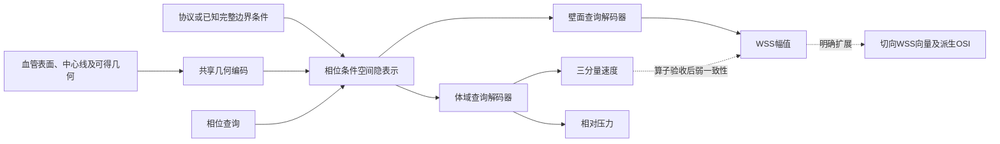

# 完整周期速度、压力与 WSS：问题重构与联合建模路线

> 2026-09-29 深入讨论补充。用户明确优先目标：**速度、压力和 WSS 的完整周期**。本页据此调整研究优先级；前稿的局部 patch 矩阵保留为壁面子课题，不再是完整流场路线的前置门。
>
> 本轮完成源码/既有结果复核、文献补证和研究设计。未启动训练、模型前向、新测试集评估或部署。以下模型、诊断、成功条件均为建议；没有把它们写成已取得的结果。
>
> 前稿：[文献证据与分层实验矩阵](全周期血流时序模型_文献证据与分层实验矩阵_2026-09-29.md)。补充证据：[深入复核归档](../../../../../outputs/researchwrite/temporal_hemodynamics_20260929/deepening/README.md)。

## 1. 研究对象应从“给 WSS 加时间模块”转为“学习整个周期的体域—壁面响应”

建议主线是：**用共享几何表示生成随相位变化的空间隐表示，再由体域和壁面专用解码器输出速度向量、相对压力和 WSS。** 先比较数据监督模型，再逐项验证守恒与近壁应力一致性。它是有依据的候选框架，尚未证明一定优于三个独立模型。

完整周期首先意味着同时得到 `u(x,t)∈R³`、`p′(x,t)∈R` 和 `|τw(s,t)|`。这里 `x` 在体内、`s` 在壁面。速度必须保留方向；当前压力标签是每帧去体域均值的相对压力，能研究空间压差，不能自动给出绝对血压波形。

**WSS 的范围要显式区分**：第一里程碑可沿用标量幅值，衔接现有强基线；若要恢复切向反转、严格应力一致性以及由周期直接计算 OSI，应扩展为 `τw(s,t)∈R³` 的切向向量。用户本轮没有单独明确解除此前“暂不做 WSS 向量”的阶段约束，因此向量扩展列为清楚的下一层，不将其暗中作为首批矩阵的必需项。向量速度与向量 WSS 是两件事。

第一阶段定位为**现有 CFD 协议下的全周期代理**。患者特异入口波形、心率、出口阻抗和参考血压是下一阶段的条件化任务；框架现在预留接口，准确性仍须由覆盖这些条件的数据证明。

## 2. 三项证据改变了路线判断

### 2.1 旧体场实验没有证明“时间已无收益”

旧速度模型 VF6 确实预测三个速度分量，不能说它只训练速率。但 `volume_time.py` 的主周期指标先取 `|u|`，评价的是速率模长；向量分量和方向余弦另存。

更关键的是 `experiments/volume_time_20260919/offline/a3_tnull.py:58–74`：

- A3 T-null 从留出病例的 **CFD 真值峰值场**出发，只能作 oracle 诊断；当前 WSS 路线的预测峰值 T-null 与它不是同一种基线。
- `peak_freeze` 冻结的是标准化峰值图，而非物理场：`ŷ(t)=μ(t)+σ(t)z_true_peak`。速度逐分量使用各自的 `μ(t),σ(t)`，方向也可能随相位变化。因此“完全不缩放、时间不建模也近乎一样好”的解释不成立。

以下仅重新汇总既有 JSON 的三折均值，未做新模型评估，且与 v5.2 WSS 折外合并 R² 不是同一统计合同：

| v5.1 既有方法 | 速率周期 R² | 向量分量合并周期 R² | 速率谷底 R² |
|---|---:|---:|---:|
| 真峰值 oracle T-null | 0.5569 | 0.6316 | 0.1178 |
| 真峰值 oracle `z_peak_freeze` | 0.5532 | 0.5319 | 0.1655 |
| VT0 best | 0.5589 | 0.5589 | 0.2804 |

前两行速率只差约 0.004，向量却差约 0.100。仅看速率，确实可能漏掉时间方向信息。VT0 的谷底速率也已有收益；它仍存在全周期向量问题，不能据此宣布成功。

**旧 No-Go 保留为当时峰值保护、单 seed 和指定模型/协议下的判定**，但不能扩张为完整周期研究不可行。新任务需要从推理时可得输入出发的基线，并重设向量、压差和壁面评价合同。

### 2.2 “速度准”与“WSS 准”之间存在已观察到的断层

历史 VELWSS2 实验中，VF6 速率幅值 R² 均值约 **0.7964**；预测速度进入冻结 Profile-Secant 校准算子后，当前 atlas 半径下 WSS R² 约 **0.5489**。CFD 真值速度进入同一算子则约 **0.9661**。

这不是本轮完整周期的成绩，也不是与最新 v5.2 壁面模型的公平对照。该算子曾用 WSS 标签校准，不能称纯物理推导。但它明确提醒：体域平均速度精度不足以保证近壁剪切精度。

物理上，WSS 依赖速度梯度：

`τw = (I−nnᵀ) [2 μ(γ̇) D(u)] n`，`D(u)=(∇u+∇uᵀ)/2`。

小的体域 L² 速度误差并不约束壁面导数误差。大体积核心区很准、薄近壁层很差，可以同时发生；差分还会放大局部误差。因此不建议首版采用“只预测 u/p，全部 WSS 由 u 求导”的唯一输出链。

更合理的起点是：**保留直接 WSS 监督；近壁速度、梯度和应力算子通过独立验证后，再用弱一致性连接两者。**

### 2.3 当前 scalar-WSS 的失败也未被定位为单一 patch 问题

当前时间头绕过 full-wall query patch 是事实，值得作低成本消融。但 support 局部分支、FP skip 和 query 原始几何仍在；不能把末层 32 点或 32D 特征推导成整个周期只能有 32 种模式。

对既有 CV5×3 seed 日志及留出误差矩的同尺度算术汇总，谷底训练/留出 z-MSE 约 **0.387/0.469**，峰值约 **0.113/0.141**。训练端谷底也难，不能只归因于过拟合。训练模式、采样和最终评估模式不同，这不是严格的偏差—方差分解；具体边界见归档审查。

所以 patch 的合理地位是**壁面解码器的一项可检验改进**。全流场主线应先回答是否需要更好的空间表示、共享监督及近壁处理，而不是以 patch 是否通过决定体场能否继续。

## 3. 最重要的机制判断：有动力学记忆，不代表必须采用递推网络

设全部几何/物理条件为 `G,B`，流体和出口电容等状态为 `s(t)`。真实动力学具有历史依赖；但若给定 `G,B` 后存在唯一、可重复且已经收敛的周期响应，就可以写成：

`s*(t)=S(G,B,φ)`，`φ=t/T mod 1`。

这时，模型可以直接查询整个稳定轨道。之前的惯性、黏性扩散、涡结构和出口状态的作用已包含在该响应中；网络不必逐步重复数值求解器的时间推进。

**因此先采用并行周期查询有物理和工程上的理由**：不需要部署时的真值初始流场，没有逐步反馈的误差累积，可缓存几何编码，也允许任意相位查询。当前 C-FiLM 已有“一次几何编码、多个相位输出”，这一点不能包装为新贡献。

RNN/TCN/状态空间模型的合理角色有两个：为有限容量表示提供更好的时间归纳偏置；或者在真实需要初始状态、非周期变化、新扰动时学习状态闭合。仅给固定公共波形增加更多历史采样，不会增加患者特异信息。

若相同 `G,B,φ` 对应不同未记录的初值、未收敛周期或非相位锁定状态，直接模型会受条件不充分限制。但一个只接收相同输入的 RNN 也不会凭空恢复这些状态。应先补输入/收敛证据；不能用模型名称代替可辨识性。

谷底重点也应从“低流量”转为“净通量小但局部惯性、分离、反向流动仍可能显著”。检查正向和反向通量、方向和空间位置，不能只看入口 Q 或全壁平均波形。标量 WSS 的非同步波形本身并不能证明回流。

## 4. 推荐框架：共享空间隐表示，保留体域与壁面的专业分工

### 4.1 让相位影响空间交互，而不仅影响最终读出

静态几何 token 为 `Z0=E(G)`；候选模型生成 `Zφ=A(Z0,e(B,φ))`。`A` 中让相位进入消息函数或注意力权重，再由连续坐标 query 读取隐表示。

例如 `αij(φ)=softmax_j a(zi,zj,Δxij,拓扑ij,eφ)`，相位在 softmax 或非线性消息之前进入，并与邻居特征发生非加性耦合。若只给所有邻居加同一个相位偏置，softmax 会将其完全消去；实现时须验收相位确实能改变相对消息/权重。相比逐点末层 FiLM，它显式提供“不同相位关注不同上下游/瘤腔关联”的归纳偏置。它并不等于已恢复真实流体状态，也不保证优于静态模型。

先用 **128–256 个几何 token** 作为工程起点，保留局部 point/query 分支；数量最终由训练侧精度与内存曲线确定，不能当已证实最优值。token 可以由表面、中心线及从几何生成的内部采样建立，部署无需先求 CFD 真值场。若改用 CFD 网格，必须计入网格获取成本。

先比较“每相位的空间交互”，不同时开启跨相位注意力。若残差表现出相位错位或难以恢复的相位关联，再加一种时间混合器，并与相同容量的逐相位版本对照。采用时空分离注意力时，主要 token 注意力约为 `O(T M²+M T²)`，还要另算几何处理、query 解码与输出；避免对全部 `N×80` 点做全局二次注意力。

### 4.2 共享的是流动组织，局部表示应适合各自空间域

体域头关注三分量速度和压力的空间分布；壁面头需要法向、壁距附近信息、局部曲率及表面邻域。已有壁面 27D 特征不能直接填给内部体点，应使用共同几何主干加域专用适配器。

壁面 patch 防止薄小局部结构被粗表示淹没；体域 token 支持跨瘤腔/分支的较大尺度关联。局部邻接应区分同一壁面与隔腔欧氏近邻，同时保留合法的全局路径。三任务不一定需要完全共享所有层；若发生负迁移，可只共享浅层或让体域/壁面各保留编码器后交换 token。

向量速度需统一旋转变换、坐标和单位。等变图网络值得作为后续底座对照，但首轮不同时更换等变编码、目标损失和时空交互，避免无法归因。

### 4.3 比“换更大底座”更有针对性的近壁分支

采样至少区分核心体域、近壁内部层、壁面、入口/出口及内部截面。单纯均匀抽取体点可能让高体积核心区主导误差；增加近壁采样时，要区分训练关注权重与全域积分权重，不能改变评价分母来获得表面提升。

若近壁数据分辨率足够，可进一步研究局部速度剖面参数化，例如用壁距 `d` 表示 `u_t(d)=d a(s,φ)+d² b(s,φ)+…`，以显式满足侧壁无滑移并突出一阶斜率。这只是候选局部近似：有效厚度、曲率、法向速度及与体域头的衔接都需验证，不能用低阶剖面覆盖整个瘤腔或替代原始标签。

这一分支的科学问题是：**宏观流动隐表示与近壁专用解码能否共同提高剪切，而不牺牲整体流动？** 它比逐个尝试 LSTM、Mamba、Transformer 更接近本项目当前证据所揭示的瓶颈。

## 5. 最小实验矩阵：先区分“共享”与“随相位发生的空间交互”

### 5.1 P0：共同数据合同与部署基线

v5.1 已有 170 个数据单元的 81 帧速度/压力审计记录。v5.2 当前未确认完整体场 sidecar 及全量标签覆盖，不能把 261 个 WSS 数据单元直接当作 261 个完整联合样本。先建立同患者、同几何、同坐标/旋转、同帧、同边界协议的共同样本表；各任务不能自行删除难例后直接比模型。

现有入口模板共同，但 AG 与 AAA/ILO 的部分 RCR 规则不同。首轮应将可提取的实际协议参数共同提供给所有结构条件，或明确分合同建模，避免只靠几何猜测隐藏的队列条件。新增协议输入后的结果与旧几何模型只是实用性桥接，不能当作纯架构消融；单一/少量协议组合也不能证明任意 BC 泛化。

实现上，现有 `velocity_pressure` 联合配置/loader 仅支持峰值条件（`config.py:1252`、`dataset.py:1378`）。完整 `u/p′/WSS` 多帧需要新增共同数据访问、query mask、损失和评价合同，不是修改输出维数就能启动。

80 个独立相位作为新主口径，第 81 帧仅作端点/周期质量检查；另外保留旧指标桥接表。现有压力为每帧去体域均值的 `p′`，壁面压力的最近内部单元代理须标记来源，壁面速度填零不能混入体域主成绩。

建立从**预测峰值场**出发、其时间缩放参数仅由训练患者估计的部署基线。真峰值、真历史和真值压缩重建另列 oracle，不能作为可部署输入，也不能将其分数称模型“天花板”。

### 5.2 第一批四个结构条件

所有条件先输出 `u,p′,|τ|`；体域/壁面 query 特征与头结构共同固定。

| ID | 结构 | 主要比较 | 可回答的问题 |
|---|---|---|---|
| I | 三个独立几何编码器，各自做并行相位解码 | 部署峰值缩放基线及既有单任务模型 | 三任务分别做到何种精度与总成本？ |
| J0 | 共享静态几何编码，域专用适配器、任务专用解码器 | I | 共享训练是否有收益、节省重复计算或造成负迁移？ |
| J1c | J0 加静态 token 空间交互；此模块用固定相位，query 头仍用真实相位 | J0 | 新增静态空间模块的整体收益有多大？ |
| J1 | 与 J1c 相同结构，真实相位进入 token 消息/邻居权重 | **J1c** | 随相位变化的空间交互是否有增量？ |

**J1c→J1 是主要机制对照**。J0→J1c 同时增加空间路径、容量和算量，不能把它单独命名为“容量效应”或“注意力效应”；若这一对显著且值得进一步解释，再补同参数点式残差控制。

建议先在训练侧固定患者分组开发划分上做 2 seeds；这只是筛选。四结构×2 seeds 是 8 个条件结果，但 I 每 seed 有三个独立模型，实际至少 **12 个模型训练**，不是 8 次训练；多折需另乘折数。旧控制桥接、数据预处理和评估另计，本页不是作业提交计划。

### 5.3 公平比较必须固定的内容

主机制实验从相同随机初始化分布开始。I 的共同几何主干初值克隆给三个模型，J0/J1 使用同一初值；同任务适配器和解码器初始张量相同。新增空间模块用零初始化残差，使 J1c/J1 起始函数与 J0 对齐。不能让 I 独享三个成熟热启动供体而共享臂从零训练；热启动可另作实用性对照。

每患者/相位的体域与壁面查询、采样流、归一化、每任务曝光、优化日程和停止规则固定。速度三分量先合为一个任务损失，不让它仅因维数获得三倍权重。三任务标准化后用透明固定权重；不把动态任务权重策略与架构一起改变。

共享臂每个病例批次同时计算三任务，并按冻结的归一权重形成一个总损失、更新一次；独立臂各模型对同批次各更新一次，不让某任务额外更新三倍。归一化、时间缩放、压缩基底、阈值、应力算子校准和供体预训练均仅使用对应训练分区，且按患者隔离。

同任务曝光、同参数量、同 GPU 小时很难同时严格成立。主比较固定曝光与日程，另报告总参数、GPU 小时、显存及端到端时间；必要时补等算力对照。I 的成本必须计三个模型总和。共享监督本身就是被研究的因素，不能把收益全部归功于注意力。

确认阶段对筛选胜者和同期控制执行患者分组多折、多 seed 配对评估；超参数、阈值与 checkpoint 规则只由训练/内层验证决定。已暴露 IND91 和既有 CV5 只能继续作为内部研究证据，不能重新称盲外部验证。

### 5.4 第二批按证据进入，避免一次把所有物理项打开

| 条件 | 前提 | 与胜出结构的单项比较 |
|---|---|---|
| P-Q | 截面方向、面积积分及入口/出口条件可用 | 加通量/质量一致性，另验侧壁无滑移；不把所有分支强行分到相同 Q |
| P-N | 近壁真实采样覆盖足够 | 只改变近壁分层采样或局部剖面解码中的一项，检查梯度与 WSS 收益 |
| P-τ | 真值速度经拟采用的近壁算子能复现 WSS | 保留直接 WSS 标签，加弱应力幅值一致性；向量头开放后再做向量一致性 |
| P-T | 空间路线后仍有稳定时间错位/关联残差 | 只加一种跨相位混合器，配平逐相位残差对照 |
| P-V | 明确纳入 WSS 方向/OSI 目标 | 直接切向向量头，派生 TAWSS/OSI，与标量及 M1 对照 |

P-Q 等是机制项，不承诺必然增益。完整动量残差和 RCR 耦合放到压力参考、非牛顿黏度、空间导数与积分离散都通过验证之后；同样只加一个机制再判断。

### 5.5 矩阵失败时也应产生决策

- J0 负迁移：保留独立模型，或改部分共享/双编码器交换表示；完整周期交付不要求必须由一个网络完成。
- J1c 有收益、J1 无收益：优先空间表示，不再扩大相位注意力。
- J1 有收益但通量仍错：学到了更好的条件响应，尚未证明物理自洽；进入独立 P-Q 对照。
- u/p 改善而 WSS 不改善：优先近壁覆盖、壁面解码和目标尺度，不直接加大所有网络。
- 物理残差下降、真实场误差上升：该权重/离散/约束组合不推广；不能凭“更物理”判赢。
- 三种场全部训练拟合差：先排除 loader、目标尺度与优化；不能直接归因于样本量或缺少时间记忆。

## 6. 在训练前后把三类误差分开

### 6.1 表示误差：真实周期是否能被当前隐表示重建？

在训练患者内部学习压缩/解码器，测速度向量、压力、WSS 和近壁量的重建曲线。若使用每例真值隐变量、真值对齐或真历史，只能叫 oracle 诊断。

### 6.2 条件映射误差：几何和可得条件是否容易预测这个表示？

如果 `y≈D(E(y))`，但 `D(F(G,B,φ))` 很差，继续增大压缩维度未必有效。需要检查几何编码、预测式联合训练或条件缺失，而非仅展示漂亮的重建图。

在解码器局部 Lipschitz 的条件下可写：

`‖y−D(ẑ)‖ ≤ ‖y−D(E(y))‖ + L_D ‖E(y)−ẑ‖`。

重建项小不代表条件预测项小；近壁导数对隐变量也可能更敏感。Nat Commun 的潜空间算子论文给出了重建好但算子学习差的直接经验反例，见 §9。

### 6.3 观测/状态误差：同一输入是否真的指定同一目标？

核对 BC 规则、周期收敛、矢量坐标和标签质量。53/261 的端点幅值差标记不等于已证明 53 个完整向量流场未收敛。只有单周期与重复端点也不足以证明多稳态或湍流。

现有 UDF 在周期重置处约有峰值流量 0.493% 的左右极限差，故不要未经验证施加 C¹/C² 周期光滑硬约束；它并未被证实是谷底误差来源。80 相位建模仍可成立，端点质量需单列。

补充的诊断可以小而明确：训练侧少病例拟合、固定/对齐坐标的压缩对比、误差的时间 lag/空间位移/幅值 oracle 分解、跨 seed 共同残差。它们用于决定下一模型，而不作为新的留出成绩优化工具。本轮未执行这些新诊断。

## 7. 物理约束的合同：共享隐表示本身不会自动守恒

质量约束采用有方向和积分权重的截面或控制体通量。刚性、不可压缩且无泄漏的条件下整体入出应平衡；分支之间各有不同通量。谷底净 Q 接近零时，不能仅用该瞬时净 Q 作相对误差分母，应另报绝对误差、周期尺度归一误差和正/反向通量。

P-Q 启用前，先把 CFD 真值放到拟采用的截面、法向和积分规则上验收离散闭合；内部控制体覆盖全部开放面。否则损失可能主要惩罚积分误差，无法说明模型物理错误。

无滑移适用于原协议的侧壁，不适用于开口截面。未来向量 WSS 可用 `I−nnᵀ` 投影到切平面；切向基底的符号/退化与法向误差仍需验证。

应力/动量必须使用原 CFD 的 Carreau 非牛顿黏度、物理坐标与实际时间单位，不能直接把归一化坐标梯度当物理梯度。已有 kNN/插值路径的自动微分结果也不天然是可靠空间导数。启用某个近壁应力算子之前，用 CFD 真值速度检验该算子的全周期、谷底与分区误差，而非只沿用历史峰值成绩。

P-τ 还应验收点密度、近壁层厚与小扰动下的稳定性，以及训练所用梯度是否可靠；若需要数据校准，参数只在训练患者拟合。标量应力一致性不约束 WSS 方向。

压力监督保持 `p′=p−〈p〉volume(t)`。随机 query 的简单平均不等于全体域体积均值，应采用明确的加权参考采样或一致的参考定义。动量中的空间梯度对时间相关的空间常数不敏感；RCR/绝对压力则需要额外参考和状态，不能直接将 p′ 当绝对出口压代入。

三任务监督损失和物理损失先量纲统一；报告各任务对共享参数的梯度冲突，必要时才研究梯度平衡。直接 WSS 与速度导出 WSS 两者一致也可能一起错，必须始终分别对真实标签验收。

## 8. 成功标准：三个场各自过关，加上完整流程时间

| 对象 | 主评价 | 必须避免的假象 |
|---|---|---|
| 速度 | 病例等权的体积加权向量误差，分相位方向、回流区、截面正/反向通量 | 速率 R² 高但方向反了；低速点余弦不稳定 |
| 压力 | p′场误差、预定义截面/分支压差与波形 | 空间平均参考不同造成假差异；宣称恢复绝对血压 |
| 标量 WSS | 面积加权幅值误差、谷底空间格局、低剪切区域及 TAWSS | 全壁平均波形相关近 1 掩盖局部错位 |
| 向量 WSS 扩展 | 切向向量误差、方向/反转、派生 OSI 与区域指标 | 幅值准确就声称 OSI 准确；近零分母产生不稳定 OSI |
| 物理一致性 | 通量、边界、梯度/应力及适用的动量残差 | 用残差下降代替对真值的准确性 |
| 成本 | 同硬件、同点数/80相位、全部场的完整推理与预处理时间、显存 | 只计单次神经网络前向；遗漏网格/稳态先验/后处理 |

角度评价使用训练侧预定的低速阈值并报告覆盖比例；低速区域仍保留绝对向量误差。WSS 近零方向/OSI 同样单列，不任意删去难点。

默认先看各任务的配对收益和 Pareto 关系，不用一个三任务平均分掩盖某个场的失败。非劣界和最小有意义改善需在首轮数据质控及下游使用要求明确后、看新留出结果之前冻结；不能凭空把某个 R² 宣布成临床合格线。

患者是独立统计单位：同患者多几何、多 BC、时间帧及三 seed 要成簇处理；bootstrap 保持方法和 seeds 配对。seed SD 描述训练随机性，不替代患者泛化不确定性。

临床路径应分两步验证：先证明标准化 CFD 替代的精度/速度；再引入临床可得流量、心率和压力条件，安排未见患者与未见条件的分离验证。相同几何可在不同生理条件下产生不同流场，纯几何网络不能区分这些反事实。未来增加 BC 数据应优先同几何多条件的成组设计，并将条件估计误差纳入评估，不能只给网络新增几个输入字段。

## 9. 文献证据如何改变实验设计

本轮为针对机制的精选核验，不是系统综述。核心沿用已核查的一区/高水平期刊论文；分区口径见[公开二手核查](../../../../../outputs/researchwrite/temporal_hemodynamics_20260929/sources/journal_quartiles.md)，不混称 JCR Q1 与中科院一区。领域补充论文与摘要级证据单列，不统一标为“已核一区”。

新增的 Nature Communications 文献所在刊，按 [LetPub 2025 年 3 月升级版公开表](https://www.letpub.com.cn/index.php?journalid=8411&page=journalapp&view=detail)为综合性期刊大类 1 区；这是二手公开来源，未调阅官方订阅数据库。原始网页及可见表格摘录已在补充归档保存。

| 来源 | 原文能支持的结论 | 对本项目的作用与边界 |
|---|---|---|
| Kontolati et al., **Nature Communications**, 2024, 15:5101. [DOI](https://doi.org/10.1038/s41467-024-49411-w)；出版社全文核验 | 潜空间算子可直接以时间查询；某些 AE 重建很好但算子学习明显更差 | 把重建与条件预测分开。不是血流临床验证，原固定空间解码不能直接适配任意血管点云 |
| Lannelongue et al., **npj Digital Medicine**, 2026. [DOI](https://doi.org/10.1038/s41746-026-02404-z)；出版社全文 | 非定常颅内动脉瘤图模型；入口条件、历史、物理项需要消融，真实几何 OOD 仍有差距 | 支持空间交互及条件/约束的分离验证；105 个半理想化几何不等于 AAA 临床效果 |
| Lu et al., **Nature Machine Intelligence**, 2021. [DOI](https://doi.org/10.1038/s42256-021-00302-5)；期刊元数据/摘要 | branch/trunk 学输入函数到查询输出的算子 | 支持几何/BC 条件化、坐标查询；逼近定理不提供本数据量下的精度承诺 |
| Wang, Wang & Perdikaris, **Science Advances**, 2021. [DOI](https://doi.org/10.1126/sciadv.abi8605)；PMC 全文 | 物理约束算子学习 | 支持独立物理损失对照；不等于非牛顿不规则血管已解决 |
| Suk et al., **Medical Image Analysis**, 2026. [DOI](https://doi.org/10.1016/j.media.2026.103974)；摘要及作者版本 | 等变表达和物理约束用于颈动脉流场，物理残差改善不保证预测误差改善 | 向量底座与约束权重的参考；MRI 不能充当可靠近壁梯度真值 |
| Suk et al., **CMPB**, 2025. [DOI](https://doi.org/10.1016/j.cmpb.2025.108958)；领域补充 | 从稳态先验估计脉动冠脉血流 | 可比较低保真/稳态辅助，但原稳态 CFD 约 5–30 min 应计入总耗时 |
| Reiss et al., **SIAM J Sci Comput**, 2018. [DOI](https://doi.org/10.1137/17M1140571)；作者全文 | 移动结构在固定坐标可能高秩，在适合的随动坐标可低秩 | 残差若主要是位移再试输运表示；真值对齐可压缩不等于几何能预测位移 |
| Wang, Ripamonti & Hesthaven, **JCP**, 2020. [DOI](https://doi.org/10.1016/j.jcp.2020.109402)；本轮仅书目/摘要 | 用 LSTM 近似截断降阶系统的记忆闭合 | 说明历史的一种机制角色；不引用未核全文实验数值，也不能推导所有周期代理都必须递推 |

## 10. 实际推进顺序

先验收共同的全周期三任务样本、向量坐标、压力参考和可部署峰值基线；同步用训练侧小规模诊断区分表示、条件映射与近壁梯度问题。然后实施 I/J0/J1c/J1 四结构矩阵，保留完整场分别过关的评价。

根据矩阵结果，沿胜出结构的一个主要缺口进入通量约束、近壁分支或时间混合；不要把所有模块同时放入一个“新模型”后只与旧底座比较。WSS 向量扩展由方向/OSI 目标决定，不以联合结构胜出为前提，也可在独立壁面模型上开展。若三个独立模型在精度—时间上更好，应接受它们作为完整周期方案。

本阶段最值得检验的研究假设是：**相位条件的空间表示，结合体域与壁面的分工和监督，能否改善减速/谷底的局部流动与剪切，同时保持完整周期推理效率。** 目前证据支持开展这项研究，还不足以承诺它一定成功或已经可以用于临床决策。
