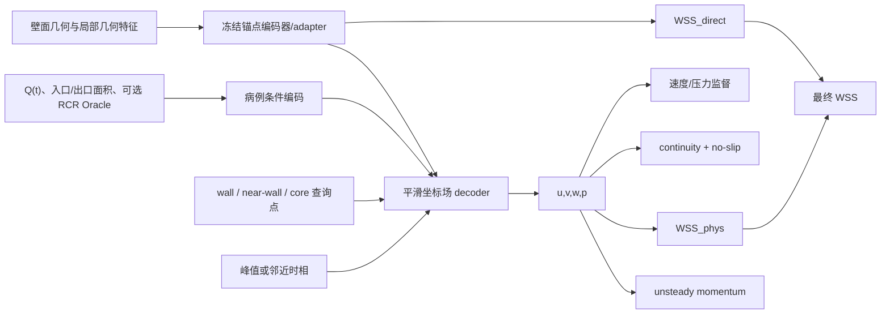

# WSS-PINN 独立路线总入口

> 建立日期：2026-07-30
>
> 当前阶段：**PINN 专用 train138/test35 与 173 例 sidecar 已冻结；full F0-UP completed / audited / No-Go；full F1 被配对科学 Gate 阻断且未提交；F2 blocked**
>
> 最终任务：给定患者几何和可部署边界条件，预测峰值时相壁面 WSS。
>
> 下一智能体执行入口：
> [实现并推进至 F1 的目标提示词](WSS_PINN_下一智能体目标提示词_推进至F1.md)

## 0. 2026-07-30 执行快照

| 阶段 | 状态 | 证据/约束 |
| --- | --- | --- |
| P0-A | completed / pass | 三病例峰值前中后 cell ID、行序、坐标稳定；逐例 JSON + 汇总 CSV |
| P0-B | completed / pass | quadratic-k64 velocity→WSS R² 为 `0.816/0.826/0.801`；仅为未来 F2 留证 |
| P0-C | completed / pass | continuity Oracle 相对 divergence p95 为 `0.069/0.129/0.088`；momentum 未接入 |
| P0-D | completed / partial capability | STL 法向可用；exact zone/connectivity 缺失，hard flux/RCR blocked |
| P1 pilot | completed | 三病例 5k/8k/8k 三槽 sidecar；manifest SHA256 `c5bdd7b7…77678f8` |
| F0-U v1 | completed / No-Go | Jobs `11037→11038`；速度 R² `0.654/0.586/0.567 < 0.95` |
| F0-U v2 | completed / No-Go | Jobs `11039→11040`；聚合指标接近但逐分量严格 Gate 未全过 |
| F0-U v2ext | completed / Go | Jobs `11041→11042`；严格 velocity Gate 最低 R² `0.9888` |
| F0-UP v2ext | completed / Go | Jobs `11043→11044`；velocity/pressure 严格 Gate best/last 均通过 |
| F1 v2ext `0.1/0.1` | completed / audited / No-Go | continuity 大降，但 no-slip 上升且 velocity R² 明显退化 |
| F1 内部八臂诊断 | completed / selected | Jobs `11049…11063→11064`；唯一双 checkpoint 通过臂为 `1e-4/10` |
| PINN 专用 split | frozen | `train138/test35`，只移除 `SHI_YUN_XI`；SHA256 `964d7021…9361f2b` |
| 全量 source audit | completed / pass | Job `11070`；173/173 pass |
| 全量 P1 sidecar | completed / pass | Jobs `11071→11072`；173/173 pass；manifest `81a32066…43b5e14` |
| full F0-UP | completed / audited / No-Go | Jobs `11073→11074` completed；全量 velocity/pressure 能力 Gate 失败 |
| full F1 | blocked / not submitted | config `c41cf992…11273` code-ready；配对 control Gate 为 false |

机器可读证据位于 `outputs/wss_pinn/audits/`、`data_wss_pinn/` 和
`outputs/wss_pinn/runs/`。baseline 的原 `train138/test36` split 保持
SHA256 `d16fc497…bdd8f1`，未修改；PINN 专用 `test35` 仍标记
`reused_development_screen`，不是独立确认集。

## 1. 为什么单独建立路线

这次工作不应继续堆在原有 WSS-only 目录里。原因不是旧代码不可用，而是两条路线的数据合同和训练对象已经不同：

| 路线 | 学习对象 | 点域 | 主要损失 |
| --- | --- | --- | --- |
| 现有 W0 | 壁面 WSS 标量 | 壁面 `random5000` | 直接 WSS 监督 |
| WSS-PINN | 最终 WSS + 辅助 \(u,v,w,p\) 连续场 | 壁面 + 近壁体域 + 核心体域 | 数据监督 + BC + PDE + WSS 梯度一致性 |

如果直接修改 `training_wss_min/`：

- 旧 checkpoint 的复现入口会被新字段和新依赖污染；
- 很难区分精度变化来自数据、网络、物理项还是采样变化；
- PINN 失败时不容易恢复到当前 W0 锚点；
- 体域 sidecar 和旧壁面 bundle 容易混用。

因此正式采用四层隔离：

```text
代码：    wss_pinn/
派生数据：data_wss_pinn/
运行结果：outputs/wss_pinn/
路线记录：docs/02-推进与变更/WSS_PINN/
```

旧的 `data_new/`、`data_wss_min/`、`pipeline_wss_min/`、
`training_wss_min/` 和现有 run 均只读。

## 2. 冻结卡

| 项目 | 冻结口径 |
| --- | --- |
| 最终输出 | 峰值壁面 WSS 标量分布 |
| 辅助输出 | 训练期体域 \(u,v,w,p\)；是否在部署时保留由后续消融决定 |
| 壁面 | 非滑移刚性壁面，\(\mathbf{u}|_{\Gamma_w}=0\) |
| 流体 | 不可压缩、\(\rho=1060\ \mathrm{kg/m^3}\) |
| 流变 | 与 UDF 一致的 Carreau–Yasuda 型广义牛顿非牛顿流变 |
| BC | 共享 \(Q(t)\)；入口/四出口面积作为可部署条件；真实 RCR 仅作 Oracle |
| 第一阶段时相 | 峰值；完整非定常 momentum 才增加峰值前后时相 |
| 壁面采样 | W0 保留 `random5000`，不得改写历史锚点 |
| 体域采样 | 独立 wall / near-wall / core 槽；pilot 为约 5k / 8k / 8k |
| 数据划分 | baseline 原 `test36` 只读；PINN 专用派生 split 为 `train138/test35`，仅排除体域速度全零的 `SHI_YUN_XI`，仍标记 `reused_development_screen` |
| Fluent 新导出 | 第一阶段不要求 |

这张冻结卡发生变化时，必须先在本文和[阶梯实验矩阵](WSS_PINN_阶梯实验矩阵与进度跟踪.md)登记，再改代码或配置。

## 3. 总体结构



最终任务始终是 WSS。速度和压力的意义是：

- 速度场提供连续性、非滑移和近壁梯度；
- 压力场为完整动量方程提供 \(\nabla p\)；
- \(u,v,w,p\) 可以只在训练时存在，不要求作为工程交付输出；
- 若最终模型仍由 `WSS_direct` 输出，推理时可以关闭辅助场的全体域查询。

## 4. 阶梯推进计划

### S0｜隔离与预注册

当前已完成：

- 建立 `wss_pinn/` 专用入口和 `AGENTS.md`；
- 冻结数据、结果、代码和文档边界；
- 建立阶梯矩阵、运行记录字段和状态词；
- 将 `data_wss_pinn/` 设为独立派生数据根。

当前结论：

- 原 F1 `0.1/0.1` Jobs `11045→11046` 的 No-Go 证据保留；
- F1 内部八臂诊断已全部完成，唯一稳健通过的联合权重为
  `continuity=1e-4`、`no-slip=10`：best/last 的 continuity ratio
  `0.0769/0.0715`、no-slip ratio `0.1232/0.1465`，最低 velocity R²
  `0.9689/0.9697`；
- 全量源数据深审计发现 `AAA/ruputer/SHI_YUN_XI` 的多个时相体域速度全零；
  用户确认后，仅在 PINN 专用 test 移除该例，冻结为 `train138/test35`；
- 其余 173 例 source/sidecar Gate 全通过。full F0-UP 已完成，但 best/last
  的全量 velocity 能力 Gate 均失败；配对 Gate 报告 SHA256
  `daccfd1d…75cfed`，full F1 未提交，F2 继续 blocked。

### P0｜No-Run 数据与算子闭环

P0 不训练模型，按顺序完成四项：

1. **P0-A 体点身份与单位**
   - 核对 `cellnumber`、坐标、顺序在时相间是否稳定；
   - 冻结 m/mm、m/s、Pa、s 和 UDF 流量单位；
   - 输出逐病例 JSON/CSV，不改原始数据。
2. **P0-B CFD velocity→WSS Oracle**
   - 使用 CFD 真值速度、壁面法向和 \(\mu(\dot\gamma)\) 重建 WSS；
   - 比较多壳层近壁拟合方案；
   - 如果 Oracle 不能显著优于 W0，则 F2 暂停，先修法向/采样/算子。
3. **P0-C CFD residual Oracle**
   - 本轮完成无量纲 continuity residual；momentum 属于 F3，未接入 F1；
   - CFD 真值在相同局部线性算子下有限且相对 residual 稳定。
4. **P0-D 几何与边界可得性**
   - 审核壁面法向、入口/出口候选、面积、UDF/BC 对齐；
   - 缺少可靠 zone 不阻塞 F0–F2，但阻塞 hard flux/RCR residual。

P0 pilot 已通过并建立三病例 sidecar；全量源数据审查 Job `11067` 得到
`173/174` 通过。审查器兼容历史 `nodenumber` 头和经冻结变换后的空间子集映射，
且确认 `AAA/ruputer/SHI_YUN_XI` 的体域速度全零。用户授权后已仅在 PINN
专用 test 排除该例；新 split、173 例 source/sidecar 及哈希绑定均已审计通过。

### P1｜独立 physics sidecar

目标目录：

```text
data_wss_pinn/<data_version>/<cohort>/<case>/
├── physics_manifest.json
├── sampling_manifest.json
├── physics_static.npz
└── fields/
    └── step_peak.npz
```

关键规则：

- 不改写 `data_wss_min/**/bundle.npz`；
- 保存父 bundle、原始 ASCII、采样 manifest 的路径与 SHA256；
- wall、near-wall、core 分槽，抽样索引可复现；
- F0–F3 对照必须复用同一 sampling manifest；
- 先做 AG/AAA/ILO 各 1 例，再扩 3–5 例，不直接全库生成。

当前 pilot 因 F0/F1 只使用峰值 data/continuity/no-slip，冻结为单一峰值时相；
峰值前后时相留到 F3 unsteady momentum 再增加。

### F0-U｜速度场 data-only

模型输出 `WSS_direct + u,v,w`，不加 PDE、不加压力、不加 \(WSS_{\mathrm{phys}}\)。

目的：

- 验证几何/BC 条件化的连续场 decoder 能否学到速度；
- 把“新增体域标签的收益”与“physics loss 的收益”分开；
- 在 3–5 例上做严格过拟合，不先追求跨病例泛化。

建议过拟合 Gate：

- 无 NaN/Inf，坐标导数和梯度有限；
- 每个速度分量及速度模长在训练病例上达到预注册的高拟合标准；
- 初始建议为 \(R^2\ge0.95\)，但必须在运行前结合 P0 的有效方差冻结；
- 失败则先修 decoder、尺度或数据合同，不进入 F1。

### F0-UP｜加入压力监督

在 F0-U 完全相同的数据、模型容量和训练协议上，只增加压力输出与监督。

目的：

- 验证 gauge pressure 表示和压力归一化；
- 为后续 momentum 准备 \(\nabla p\)；
- 判断压力辅助任务是否破坏速度/WSS 表征。

压力比较必须先去除病例/时相 gauge；压力标签存在并不意味着压力必须作为最终工程输出。

### F1｜continuity + no-slip

在 F0-UP 上只新增：

\[
\mathcal L_{\mathrm{cont}}=\|\nabla\cdot\mathbf u\|^2,
\qquad
\mathcal L_{\mathrm{noslip}}=\|\mathbf u|_{\Gamma_w}\|^2.
\]

Go 条件：

- continuity residual 相对 F0 明显下降；
- 壁面速度相对特征入口速度足够小；
- 速度、压力和 `WSS_direct` 不越过预注册退化护栏；
- `lambda_physics=0` 必须严格退化回 F0-UP。

F1 只能说明一阶可信物理项有效，不能写成完整 Navier–Stokes PINN。

2026-07-30 内部诊断已把旧 `0.1/0.1` 的 No-Go 定位为权重失衡：八臂矩阵中
只有 `continuity=1e-4`、`no-slip=10` 的联合臂在 best/last 两个 checkpoint
上都通过 Gate。机器可读结论见
`outputs/wss_pinn/matrices/f1_diagnostics_20260730/report.json`。该配置仅为
full-data F1 候选；在全量 sidecar、配对 full-data F0-UP control 和冻结 split
就绪前，不能写成全库 F1 已完成。

### F2｜WSS 梯度一致性

在 F1 上新增：

\[
\mathcal L_{\mathrm{wss\_phys}}
=
\left\|
WSS_{\mathrm{direct}}
-
WSS_{\mathrm{phys}}(\nabla\mathbf u,\mathbf n,\mu(\dot\gamma))
\right\|.
\]

只有 P0-B 通过后才能执行。

单 seed 开发 Gate 建议冻结为：

- `ΔR²_field_casebalanced ≥ +0.02`，或
  `Δhigh-WSS nRMSE ≤ -0.002` 至少满足一项；
- normalized/physical R² 退化不超过 `0.01`；
- physical MAE 增加不超过 `0.05 Pa`；
- top10 ratio/IoU 下降不超过 `0.05`；
- 负 R² 病例数不增加。

F2 是最可能直接改善峰值 WSS 的关键阶段，也是优先于完整 momentum 的主判断点。

### F3｜完整非定常 momentum

最后才加入：

\[
\rho\left(
\frac{\partial\mathbf u}{\partial t}
+(\mathbf u\cdot\nabla)\mathbf u
\right)
+\nabla p
-
\nabla\cdot\left[
\mu(\dot\gamma)
(\nabla\mathbf u+\nabla\mathbf u^T)
\right]
=0.
\]

要求：

- P0-C 已证明 CFD 真值在相同无量纲算子下 residual 可解释；
- 使用峰值前/中/后三帧，不能用单峰值帧伪造 \(\partial\mathbf u/\partial t\)；
- 二阶导数有限；
- 非牛顿黏度和无量纲化经过解析场单元测试；
- F3 只与 F2 配对，不能直接和 W0 比后宣称“PDE 带来提升”。

### C1/C2｜开发筛选与确认

- **C1**：沿用 `test36 (reused development screen)` 做单 seed 止损，只决定是否继续。
- **C2**：只有 F2/F3 过 Gate 后才做三 seed、duplicate-grouped repeated validation
  或新 holdout；C2 才能支撑确认性结论。

## 5. 执行优先级

P0 开始阶段只做：

1. P0-A；
2. P0-B；
3. P0-C；
4. P0-D；
5. 根据 P0 决定是否建立 P1。

不建议现在就搭完整训练器。P0-B 如果失败，最有价值的动作是修复近壁梯度恢复，而不是调 PINN loss 权重。

## 6. 记录体系

### 6.1 三层真源

| 层 | 真源 | 记录内容 |
| --- | --- | --- |
| 路线 | 本文 | 冻结口径、目录边界、阶段顺序 |
| 实验 | [阶梯实验矩阵](WSS_PINN_阶梯实验矩阵与进度跟踪.md) | hypothesis、control、唯一变量、状态、Gate、结论 |
| 运行 | `outputs/wss_pinn/<exp_id>/<run_id>/` | resolved config、provenance、日志、checkpoint、metrics、逐病例结果 |

项目级只在
[WSS 专用推进记录](../WSS最小化_代码修改与实验推进记录.md)
写摘要和入口，不复制所有指标。

### 6.2 一个 run 必须落盘

```text
outputs/wss_pinn/<exp_id>/<run_id>/
├── config.resolved.json
├── provenance.json
├── data_manifest.json
├── environment.txt
├── train.log
├── history.csv
├── checkpoints/
├── eval/
│   ├── metrics.json
│   └── per_case_metrics.csv
└── audits/
```

`provenance.json` 至少包括：

- `exp_id`、`run_id`、阶段、seed、状态；
- git commit 和 dirty flag；
- parent config/checkpoint 路径与 SHA256；
- data/sampling manifest 路径与 SHA256；
- split、时相、wall/near-wall/core 点数；
- 流变、单位、BC 版本；
- Slurm Job ID、主机、GPU、开始/结束时间；
- 唯一改动字段和 control run；
- Gate 结果与结论。

### 6.3 状态词

只允许：

`planned → preflight_passed → submitted → running → completed → audited → go/no-go/blocked`

`completed` 只表示程序结束；只有 metrics、逐病例结果、配置哈希和 Gate 全部复核后才是 `audited`。

## 7. 当前状态

| 阶段 | 状态 | 说明 |
| --- | --- | --- |
| S0 | 完成 | 独立目录、冻结卡、阶梯和记录合同已建立 |
| P0-A | completed / pass | 三病例 identity、坐标、单位及时相稳定性审计通过 |
| P0-B | completed / pass | 三病例 CFD velocity→WSS Oracle 已留证 |
| P0-C | completed / pass | continuity residual Oracle 已通过；momentum 未接入 |
| P0-D | completed / partial capability | 法向可用；exact zone/connectivity 缺失，hard flux/RCR blocked |
| P1 | completed | 三病例 5k/8k/8k sidecar 与采样合同已冻结 |
| F0-U | completed / Go | v1/v2 No-Go 后，v2ext 通过严格 velocity Gate |
| F0-UP pilot | completed / Go | 三病例 best/last 均通过 velocity + gauge-pressure Gate |
| F1 pilot | completed / selected | 八臂诊断选中 `continuity=1e-4`、`no-slip=10` |
| full F0-UP | completed / audited / No-Go | best/last 的 train/test velocity Gate 均失败；test WSS/pressure 泛化亦不足 |
| full F1 | blocked / not submitted | 配对 control Gate 未通过，不得把 code-ready 写成已训练 |
| F2–C2 | blocked | 尚无通过 Gate 的 full F1；WSS-physics/momentum 未开启 |

详细物理依据和数据审计见
[体域物理约束与 PINN 训练路线](../WSS最小化_体域物理约束与PINN训练路线_2026-07-29.md)。
