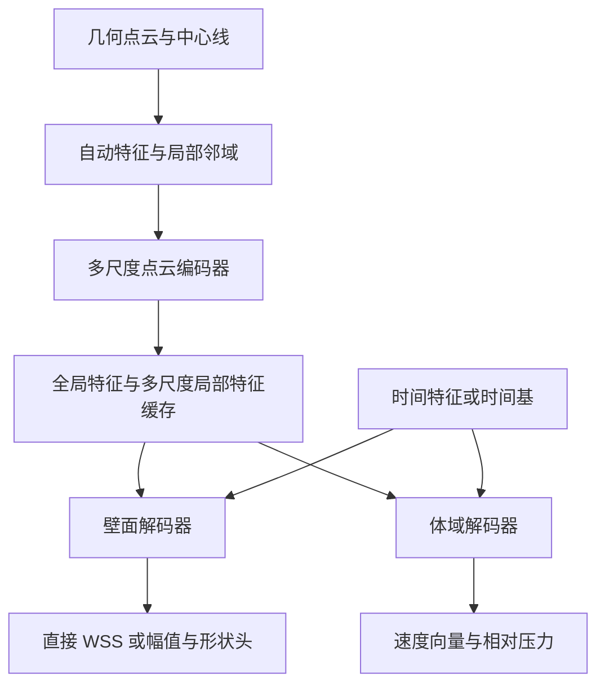

# WSS V5：几何点云与中心线驱动的 WSS 及流体场预测完整设计方案

> 版本：v0.3-review｜日期：2026-09-06｜状态：**按用户偏好收敛为 xyz + 几何特征输入**
>
> 用户目标：新病例仅提取几何点云和中心线特征，在 GPU 上快速预测 WSS 与流体场；WSS 幅值准确为优先目标，经过独立验证的空间高低分布为可接受后备能力。
>
> 本次交付：设计、实验与数据合同提案。**用户审阅后再决定 Phase C bundle 的构建方式；本文不启动重建、训练、评估或部署。**
>
> “交叉审阅”指本方案的独立复核；文中的患者级交叉验证（CV）是后续模型实验，两者不是同一步骤。
>
> V5 围绕预测准确性与部署成本选择方法，不以 PINN/非 PINN 比较为研究主线。历史 V4 的配置、科学合同和结果保留原义；本文的建议尚未成为已实现代码。
>
> 本版依据[交叉审阅意见](./_archive/WSS_V5_设计方案交叉审阅意见_2026-09-06.md)及后续用户意见修订；处理记录见§18。**默认患者输入为xyz与局部几何/中心线特征，去掉入口/出口面积等独立全局参数，不通过面积分流代理或参考场间接带入。**RCR不作为模型输入。审阅文件中的实验、重跑、冻结建议不等于本轮执行请求。

## 0. 阅读入口与方案摘要

建议先看 §18 的修订处理，再按 §1–§3 明确证据与任务，§4–§7 审查参考场、模型和时间表示，§8–§10 决定数据重建方式，§11–§14 审查实验和验收，最后填写 §16 决策表。

建议的主路线是：

```text
新病例几何点云 + 中心线
  → xyz + 局部几何/中心线特征 + 自动邻域/查询点
  → 一次多尺度点云编码，缓存全局与局部特征
  ├─ 壁面查询 → 直接 WSS；幅值×形状作独立对照
  └─ 体域查询 → 直接速度/相对压力；时间查询与低秩时间系数两种候选
```

数据采用“**不可变基础数据 + 多种派生实验视图 + 可重建训练缓存**”。同一次 raw 读取可以保存体域、壁面、中心线、接口与可选拓扑，从而支持直接 WSS、体场、联合预测、近壁剖面以及可选物理约束。保存 CFD 拓扑用于训练或验证，不等于要求新病例提供 CFD 网格。

| 决策层级 | 内容 | 当前状态 |
| --- | --- | --- |
| 用户已明确 | 几何点云与中心线输入；部署有 GPU；中心线单例预处理耗时可接受；减少额外专业软件建模流程 | V5 的设计约束 |
| 用户最新偏好 | 优先xyz+几何特征，去掉入口面积等独立参数输入 | 默认不拼接面积、全局摘要、分流或参考场；具体白名单见§3.1 |
| 用户已明确 | 准确预测 WSS 与流体场；WSS 幅值优先、趋势保底；方法服从效果 | V5 的任务约束 |
| 用户已明确 | 先完整设计并交叉审阅，再确定 bundle 重建；一次构建可包含多种数据 | 当前执行顺序 |
| 本版优先建议 | 直接WSS/局部体场、物理尺度与局部表示、低秩时间候选；物理参考保留离线诊断 | 默认不依赖预计算流场；无面积依赖的参考残差列后续可选对照 |
| 本版优先建议 | B-Full完整物理量母库、必要拓扑sidecar、协议/参考场/时基等多种视图；Zarr优先试建 | 数据内容方案已收敛，物理格式与实际构建仍待决定 |
| 尚未确定 | 最终骨干、损失权重、点数、存储格式、正式精度门槛与时延目标 | 不在本文中冒充已冻结或已达到 |

## 1. 数据现状与历史证据

### 1.1 按最新签收状态理解数据

- 源审计队列为 173 例；排除不可恢复的 `YANG_BAO_KUI` 后，formal 为 **172 例，train138/test34**。
- 2026-09-06 最终求解质量层为 A102/B35/C34/D1，均有 transcript。唯一 D 层为 test 的 `SUN_XU_XIA-1`，保留并报告含/不含两版敏感性结果。
- 172/172 的 WSS 幅值标签按既定对齐与有效性规则可用。“168/172 全项通过”与“172/172 幅值可用”是不同口径。
- `HAN_JIAN_FU` 首帧节点重排需要按身份对齐；三例少量缺失壁面节点使用有效性 mask。不能把缺失补成零剪切。
- 最新真实单位、anatomy-only、7 段唯一 atlas、端点/分叉特征处理与 raw 修复均按已签收资产接入。早期文档中的未决问题属于历史快照。
- 这说明基础数据专项核查已完成，不代表旧 staging builder 已实现新合同，也不代表新模型已验证。

四例增加内迭代后 WSS p50/p99/max 变化不到 1%，不支持“高 WSS 上尾都来自收敛不足”的解释。残差分层用于诊断和敏感性分析，不能替代网格/时间步独立性结论，也不作为默认逐例降权依据。

### 1.2 真正影响 V5 的历史证据

下表只作假设来源，不是新数据上的模型排名。

| 证据 | 读数 | 对 V5 的影响 |
| --- | --- | --- |
| 直接 WSS 的 RCR Oracle，几何 / true RCR / shuffled RCR | 全局病例等权物理 R² 为 0.27562 / 0.35614 / 0.27230 | 未观测的边界条件可能限制几何单输入预测；不能假定增加层数可消除信息缺口 |
| LSA2 H2 复跑 → 加 log-radius | 全局病例等权 R² 0.30697→0.35058；逐病例 R² 均值 0.26627→0.26423 | 物理尺度有用，但汇总 R² 上升不等于典型患者改善 |
| 同一 log-radius 模型 | 高值 top10 区平均幅值比 0.41652，top10 IoU 0.18871 | 幅值压缩和空间定位都需改善，不能直接把现有模型降级为“趋势已准确” |
| V2 同 D2，DATA→PINN | continuity 0.59457→0.00718；速度 MAE 0.17727→0.17643 m/s | 低物理残差不能替代预测精度 |
| 旧 V4 transient PN EMA | 速度拟合斜率接近 0，向量相对 L2 0.9649，continuity 0.000852 | 监控幅值、方差、流量和空间分布，识别低残差退化解 |
| 近壁采样核查 | 真实 1.5 mm 内 cell 占比中位 68.49% | 瓶颈不宜简单归因于近壁点数量不足；需最近壁层和有序法向信息 |

工作簿定位：非 PINN 表《RCR Oracle》行 5–7、11–17；《实验矩阵总览》行 193–194；PINN 表《实验矩阵汇总》行 11–12、30。两表的 `R²_cb` 定义并不统一，V5 使用 §12 的明确名称。旧比较还混有 split、时间、空间评价域、选模和壁面点数差异。

补充第五轮一手证据：AG61、53 train/8 val、PointNeXt-S/FPS2000的学习曲线在13/26/40/53训练例时，field R²均值为0.2581/0.2971/0.3115/0.3096，逐病例R²为0.0867/0.1583/0.1765/0.2079。该固定小验证集与模型协议下，最后13例没有显示稳定field收益；源报告明确不外推大样本上限。4例可过拟合到约0.98–0.99说明微型任务可拟合，不证明所有表示和跨患者任务的容量均充足。

V5主线尝试改变经验平台的因素为：真实尺度/修复标签、部署一致的xyz与几何特征、局部标架/query表示、采样鲁棒性与时间表示。分流代理/物理参考保留研究依据，但依赖面积的方案不进入当前默认模型。每项需单独验证，不能仅以“新版本”宣称突破。

旧CFD审计中约1.9%的差异来自一对同几何病例的WSS分位数；0.92–0.96的R²估算来自假设10%–15%噪声，而非1.9%的直接结论。它们不能构成面积加权点级场的噪声下界或几何信息上限。S3归一化消融显示子队列收益交换、缺少稳定总体增益，不能否定V5保留物理尺度的必要性。审阅提到的“B1全局出口面积+0.03”尚未追溯到匹配run/config，本版不列为已证实增益；逐点分流代理仍是待验证假设。

### 1.3 当前代码与提案之间的距离

`wss_pinn/v4/build_centerline_v2.py` 是旧 staging 实现：固定 15k 瞬态池、旧 volume-aware 坐标尺度、未完整落库的壁面 WSS；`v4/data.py` 从 CFD strict-volume 池抽 support/query，仍消费旧 BC 向量；`v4/models.py` 为历史全局 latent 模型。这些实现可以参考，不能通过换路径直接成为 V5。

### 1.4 协议结构：可利用事实与推断边界

本轮复核审阅探针CSV的172例/688出口。以下为包含test34的**探索性描述**，不作为fold拟合参数、性能确认或输入校准。协议设计意图、原始UDF系数与实测流量分别记录。

| 量 | 核实结果 | 可以怎样使用 |
| --- | --- | --- |
| 出口并联等效阻力 \(1/\sum_j1/(R_{1j}+R_{2j})\) | AG约4.368e5，AAA/ILO大多约3.761e5 Pa·s/kg；`GUO_AI_JUN`约4.409e5 | 协议元数据与例外诊断，不等于全三维域水力阻力 |
| 左侧DC电导份额 | AG/ILO几乎0.5；AAA大多0.5，最大约0.58605，需保留例外 | 0.5可作为理想分流参考，不是强制瞬时流量真值 |
| 各出口 \((R_1+R_2)C\) | 1.789872–1.790125 s，近似恒定 | 正确的代数近常量 |
| 各出口 \(R_2C\) | **1.074090–1.781765 s**，688出口中位1.576835 s | 实际RCR极点时间常数并不恒定；不能写成“动态阻抗相同” |
| \(R_1/(R_1+R_2)\) | 0.00462–0.39997 | 除DC分配外还存在动态阻抗差异 |
| 面积占比与髂外电导占比 | 分队列同样本线性拟合R² AG/AAA/ILO=0.783/0.360/0.278 | 几何代理有依据，但不是OOF性能或不可约误差 |

探针的R²是Pearson相关系数平方，即带截距单变量线性回归的同样本拟合R²；直接令预测份额等于面积份额时，对应R²约为0.720/0.345/0.201。左右侧同属一患者，不能作为独立样本。仅用一个面积特征的残差不证明完整几何无法解释剩余差异，也不能把残差标准差除均值当作新患者预测区间。

AG 58例monitor关联为历史全历程 `mean(abs(q))` 构造的份额，并非末周期有符号净分流；其中有9例test。0.734/0.909仅作探索性相关证据，需按同周期、净流量、部署目标和患者分组重新验证。RCR Oracle增益也不能唯一归因于髂内/外分配。

频域出口阻抗 \(Z_j(\omega)=R_{1j}+R_{2j}/(1+i\omega R_{2j}C_j)\) 还与三维几何阻抗及入口发展流耦合。上述结构支持参考场与按段评价，**不支持“上游局部WSS完全由几何决定”或“末端必有20%–45%不可约误差”**。

## 2. 任务定义：幅值、趋势与体场分别验收

### 2.1 部署场景的物理边界

实际映射为

\[
(\mathbf u,p,\boldsymbol\tau_w)=\mathcal F(\mathcal G,\mathrm{BC},\rho,\mu,t,\mathrm{history}).
\]

V5 部署输入只有几何 \(\mathcal G\) 与中心线。因此其第一版学习的是**训练 CFD 设置与条件分布下，新几何的预期响应**。当前病例的 RCR 与少数入口设置并非全部相同，不能把整个队列描述为完全统一的边界条件实验，也不能据此声称任意患者真实生理状态可由几何唯一恢复。

model card记录共享入口波形、物性及训练条件范围；首版直接模型不要求将Q、物性、入口/出口面积或分流率拼接为输入。瞬态的t/相位属于输出查询，公共波形及其导数只作可选时间编码对照，不增加新患者参数。cohort/protocol ID仅作元数据，不自动作为几何可得输入，更不以预设协议为名重新引入逐例RCR。

刚性单入口段的截面积分净流量由入口约束，但局部速度剖面、二次流、压力梯度及壁面剪切还依赖上下游条件。全队列平均压/MAP的简单Windkessel估算不能替代实际最后周期压力标签；压力漂移及延长段发展流应记录为协议敏感性。

充分发展稳态牛顿圆管的 \(\tau_w=4\mu Q/(\pi R^3)\) 仅用于解释尺度敏感性，不用于把复杂血管标签按流量或半径强行修正。同几何多 BC 仍可能改变空间分布，趋势也不是与 BC 无关的量。

### 2.2 输出能力

| 输出 | 首选目标 | 可接受的受限能力 | 不能混淆的含义 |
| --- | --- | --- | --- |
| WSS 标量 | 同时预测 Pa 幅值与空间分布 | 经验证的无量纲相对分布 | 病例内最高 10% 不等于超过固定生理阈值 |
| 速度 | 三分量向量场，m/s | 经验证的特定时相/区域输出 | 速度模长准确不能替代方向准确 |
| 压力 | 相对压力、空间压差 | 压差/空间趋势 | 无测量输入时不承诺患者绝对血压 |
| WSS 向量 | 可选时序方向任务 | 暂不输出 OSI | 标量时序不足以确定 OSI |

WSS 幅值不合格时，只能在趋势本身通过验收后提供趋势产品。速度或压力未达标时，应明确该输出未验证；不能以 WSS 趋势通过来代替“流体场准确”的整体声明。

### 2.3 三种不同的“趋势”

1. 相对排序：同一病例/时相哪些位置更高。
2. 空间区域：高值带、低剪切区的位置、范围、分支归属。
3. 时间变化：同一位置在周期中的峰值时刻和波形变化。

三者分别评价。任何正单调幅值校准都不改变空间排序与 top-k 区位置；测试标签拟合出的逐病例斜率/截距仅作误差诊断，不能包装成可部署校准。

### 2.4 按解剖段报告与分级

主结果同时列主动脉/瘤腔、左右髂总、左右髂内/外及分叉过渡区。atlas segment到解剖名称的映射固定，瘤腔mask与分叉模糊区按几何规则定义并保留覆盖率；不能通过丢掉难以分段的点改善指标。

上游/髂总作为优先争取Q-WSS的研究区域；末端分流不确定性需重点分析。但所有段均先报告幅值和趋势，再按§13证据分级，不能预先把末端锁定R-WSS、或自动给上游Q-WSS。段间比较保留同一全血管尺度的相对图，另列段内排序；否则每段独立归一会抹掉用户关心的跨段高低。

## 3. 几何输入与查询合同

### 3.1 输入白名单与诊断元数据

| 字段 | 部署来源 | 默认用途 |
| --- | --- | --- |
| xyz、相对坐标、壁面法向 | 新病例点云及自动几何处理 | 默认患者输入候选；壁面/体域使用对应有效字段 |
| 局部半径R、弧长s、切线、曲率、segment/parent ID | 已接受的中心线流程 | 默认几何特征候选及质量标记 |
| 壁距、局部坐标、到分叉的距离、query所属区域 | 同一几何处理程序 | 几何辅助候选，按消融逐组加入 |
| 入口/出口面积、面积比、独立全局面积/长度摘要 | 几何开口及病例统计 | 不拼入默认模型；按需保留离线审计元数据 |
| 面积分流代理、依赖面积的参考WSS/速度/压力 | 由面积或其等价汇总间接计算 | 不进入默认编码器、解码器或最终输出组合；仅离线诊断 |
| 面积/体积求积权、接口法向面积向量 | 几何积分与CFD审计 | 用于损失、评价、守恒/参考积分，不作为预测特征通道 |
| t/相位、可选公共波形编码 | 请求时相与模型内公共协议 | 时间query参数；固定快照或全周期系数输出无需额外患者参数 |
| RCR、UDF、`inlet_area_ratio`、求解质量 | 训练病例的求解设置 | 保存为元数据，不进入默认部署输入 |
| 真实速度、压力、WSS、标签均值/峰值 | CFD 标签 | 监督与评价，不能进入几何编码 |

建议最小对照为`xyz`与`xyz + R/s/曲率/切线/分支`，随后分别增加壁面法向或体域壁距、局部坐标、dR/ds和分叉距离，不一次堆满所有几何通道。最终字段按患者级验证精度与预处理稳定性选择。这里的“去掉面积参数”不要求把点云中的开口形状、局部半径或全局几何编码删除；网络仍可以从完整点云学习整体形态。

物理尺度必须保留：优先采用训练/部署共享的固定长度单位或固定参考长度来缩放xyz与R；每例独立缩成单位盒、再丢弃尺度会混淆大小不同的血管。几何刚性居中/旋转允许，变换记录用于回到患者坐标，不当作新增入口参数。

入口面积在完整、定尺度几何中原则上可由形状计算，作为独立特征主要改变表示与归纳偏置，并非新增独立观测。有限点数、噪声及小队列下显式提供它有时可能帮助学习，因此删除后精度升降需验证；当前优先检验更简洁的输入接口，不因此放弃幅值预测目标。

`inlet_area_ratio=A_mesh/A_udf` 中的分母是求解设置，不是纯几何。保留真实记录以解释训练差异；不能把所有旧标签当作 ratio=1 的标准条件解。几何单输入基线接受这部分未观测条件带来的限制；若未来需要真正统一工况，需要重新生成相应 CFD 数据，而非仅修改标签尺度。

此处`A_mesh`专指**远端速度入口BC面面积**；anatomical interface面积另命名为`A_in_anatomy`，不可混用。现存已知4例比值约0.888/0.911/0.934/1.009，均在train，分别为CHEN_SHU_LIN、LIU_YONG_LAN、ZHANG_YAN_SHAN、WANG_CHUN_MING。保留已签收标签及元数据，在参考场对照中单列；不按未经验证的 \(\tau\propto Q^\beta\) 改标签，也不因本次方案修订自动要求重跑。最终构建按最新源资产复算准确比值。

### 3.2 坐标、尺度和特征

- 基础几何保存 true mm，物理算子转换为 SI。保存原始坐标、刚性变换及其逆变换、归一化尺度与定义。
- 尺度和轴向规则必须能由几何/中心线独立复算，不能依赖CFD全体cell的极值。模型保留xyz、弧长和半径的物理尺度；面积元数据与求积权另存，避免单位盒归一化抹掉幅值信息。
- 速度、WSS 向量、法向随坐标同旋转；法向重新单位化；WSS 标量与压力不旋转。
- centerline atlas 保留 raw/smoothed 特征、分支身份、端点/分叉 mask、拟合质量。几何表面保留瘤腔真实形状，中心线特征是辅助表示。
- 当前四出口语义作为首版范围记录；点云本身可以变点数，不等于已验证不同出口数/拓扑。
- 若加入旋转增强，所有向量与中心线方向同步变化。随机几何缩放会改变固定流量下的物理问题，不能作为标签不变的数据增强。

新增几何特征候选：局部R、dR/ds、κR、到分叉的距离、入口到query的解剖弧长、分支身份。`R`取中心线局部内切球半径，不是由入口/出口面积反算的全局参数，也不自动等于等效水力半径。截面积及 \(R_A=\sqrt{A/\pi}\) 如有计算则仅进入离线参考/审计视图，不通过改名为半径重新拼入默认输入。

管道坐标使用 \((s,r/R,\sin\theta,\cos\theta)\) 加有效性mask，并保留笛卡尔局部坐标。优先试平行输运/Bishop类稳健标架；Frenet法向在κ近零、拐点及atlas端区持值处会退化。初始横向方向、分支衔接和回退规则明确；瘤腔/分叉的最近中心线映射歧义不能硬套圆管坐标。

局部速度分量预测后旋回是候选，不自动保证端到端旋转等变；标架、输入和编码器需共同满足相应变换性质。旧rotaug单seed结果是field轻微下降、病例均值上升的混合证据，不据此取消所有旋转验证。

入口距离区分解剖域内`s_in_anatomy`与远端入口到解剖切面的延长段长度。延长段长度/形状从离线源保存并检查是否固定；新病例不可得的逐例延长段字段只作元数据。稳态圆管入口长度估式不能直接断言本队列WSS服从 \(s^{-1/2}\) 衰减。

### 3.2a 面积分流代理：保留离线诊断，退出默认输入

以下保留物理研究定义，不作为主模型依赖。不仅删除面积数值通道，也移除`面积→分流→参考场→残差组合`进入默认预测的路径。首版让点云/中心线编码器直接学习分支与整体形态的关系，不要求新病例先生成分流先验。

首个无拟合代理为每侧 \(f_{ext}=A_{ext}/(A_{ext}+A_{int})\)，\(f_{int}=1-f_{ext}\)；总入口份额1、理想左右各0.5，末端为0.5乘各侧份额。\(Q_{ref,b}(t)=f_bQ_{nom}(t)\) 是**参考场假设**，不是CFD真值或监督硬约束。

离线基线可将代理沿分支映射，在junction保存歧义mask，并比较固定等分/面积分配。依赖面积的参考属于额外几何处理诊断，不能混称主模型组件；不把全172例RCR拟合系数带入训练。以后若研究分流辅助预测，可由同一xyz+几何编码产生中间量，但须独立验证，不能读取面积代理或RCR作为该中间量的输入。

### 3.3 Support、query 与积分参考集

- `support_geometry`：从几何表面和/或几何生成的内部点采样，只描述形状。具体 surface-only 或 surface+interior 是消融项。
- `wall_query`：壁面待预测位置。训练可使用 CFD 导出壁面标签位置；部署可使用新表面或点云位置。
- `volume_query`：管腔内待预测位置。训练可查询 CFD cell 坐标；部署无需这些坐标。
- `wall_reference`：固定的几何壁面积分集，用于 WSS 分解归一化。
- `volume_reference`：可选固定体积积分集，用于预测压力 gauge 的一致定义。

查询端默认每点独立读取缓存几何特征，不依赖同一 query batch 中的其他点。改变 chunk 大小或输出点数时，同一点的预测应保持一致。

### 3.4 内部查询点怎样生成

壁面点云与中心线并不天然提供精确的管腔内外判定。中心线半径扫掠可能在瘤腔、分叉处漏域或越界。

优先复用已有分割表面，自动处理开口后以广义winding number或等价占据算法生成内部query；无需Fluent体网格，人工封口面标为interface、不能变成WSS壁面。存在可靠表面时由其派生点云，无需为了“纯点云”丢弃已有连接关系。用户若只提供无连接点云，保留自动表面/占据路径并单列质量Gate；不把额外专业软件建模变成新必需输入。训练和部署使用同一个几何查询程序，候选算法仍需检测开口、法向、薄壁与近邻分支错误。

几何质量检查失败时返回明确的几何处理状态，不输出未经域检查的完整体场。该检查属于输入生成质量，不是额外 CFD 求解流程。

## 4. 候选架构与优先级

### 4.1 共享几何编码、分支解码



正式推理优先由壁面头直接输出 WSS。速度梯度推导 WSS 用作研究对照、辅助监督或离线一致性检查，不要求部署每次执行大量空间导数重建。

### 4.2 有限候选集

| 编号 | 候选 | 目的 | 优先级 |
| --- | --- | --- | --- |
| A0 | P2V 风格全局点云编码 + 独立 query | 轻量实现/欠拟合诊断锚点 | 小预算基线 |
| A1-W | PointNeXt-R + LocalGeoPE路线的独立壁面模型 | 复用直接WSS的较强历史表示依据，重新按新输入合同训练 | 首轮WSS锚点 |
| A1-V | D2层级点云编码 + global/local query | 保留各尺度局部信息以定位体域query | 首轮体场锚点 |
| A2 | A1上单独替换轻量局部注意力/邻域尺度 | 在精度—时延允许范围内增强表示 | 局部基线建立后 |
| A3 | 中心线树编码 + query局部交叉注意力 + 表面局部特征 | 研究分支长程交互 | 第二轮，需独立成本与收益对照 |
| A4 | 无面积参数依赖的简化参考 + 三维局部残差 | 研究尺度先验是否改善样本效率 | 后续可选臂，不是默认主线；先验证依赖白名单与参考误差 |

旧 D2 `c125-k128` 是架构起点，不代表其壁面任务中的 SAME sampler 或旧权重适用于 V5。旧 250k PN/PNPP 也不是 formal D2。新候选从随机初始化建立基线；未来迁移或蒸馏单列实验。

A1-W的历史LocalGeoPE、LSA2与log-radius来自不同消融条件，不拼成一个已验证组合。S1先迁移直接头锚点，再分别增加局部几何/atlas特征。A4改为后续可选输出参数化，仅允许白名单几何加公共常量生成参考；不能把依赖面积的参考换个名字重新带入。骨干、输入与输出头逐项对照。

### 4.3 局部表示的具体要求

- 保留各尺度局部特征到 query，不只广播单一 max-pool latent。
- 比较原始局部坐标与壁距/半径/切线等几何辅助，分支身份可作邻域筛选或权重信息。
- 欧氏近邻可能混合空间接近但不连通的分支。中心线/法向/分支规则需要实际核查，不能假定其完全恢复真实拓扑。
- 自动 kNN/半径邻域和中心线图允许在预处理或 GPU 内构建；不要求用户提供 Fluent 网格图。
- 先控制局部交互规模，不默认引入全点全局注意力。是否使用图运算由精度和总流程成本决定。

半径按局部R缩放的ball query与固定kNN作配对消融。ball query必须定义最少/最多邻居数、空邻域回退、采样密度变化和分叉权重；它本身不保证离散鲁棒性，也不是鲁棒性的必要条件。S1即加入等价表面两种密度、support重采样复评，S7再完整验收。

A3可沿中心线树做稀疏消息传递或分层注意力，再与query附近中心线及表面特征融合。实际节点数、全局/稀疏连接、分支编码和时延均需测量；一维中心线不意味着全局注意力成本为零。

### 4.4 多任务不是默认获益

保留独立 WSS、独立体场、共享编码三种结构对照。若共享损害 WSS 或速度，可以采用部分共享/独立 decoder，必要时部署两个轻量模型。压力作为辅助任务不得以损害两个主要输出为代价强制保留在共享干路；可以独立训练相对压力支路，并明确尚未通过的输出。

## 5. 输出头的数学合同

### 5.1 WSS 直接头

直接头以非负输出拟合 `wall-shear` 标量。固定尺度的 raw/log 混合监督作为基线，保留完整物理值；不按每病例最大值覆盖标签，不裁掉合法高值后再报告原尺度精度。

### 5.2 对照候选：幅值 × 空间分布

对每例固定几何积分集 \(Q_\Gamma=\{(x_j,w_j)\}\)，令

\[
q_\theta(x,t)=\operatorname{softplus}(h_\theta(x,t)),\quad
Z_\theta(t)=\frac{\sum_j w_jq_\theta(x_j,t)}{\sum_jw_j},
\]
\[
\hat S_\theta(x,t)=\frac{q_\theta(x,t)}{Z_\theta(t)},\qquad
\hat\tau_\theta(x,t)=\hat A_\theta(\mathcal G,t)\hat S_\theta(x,t),\quad \hat A_\theta>0.
\]

实现需有稳定的正值下界与极小量处理，并记录退化情况。有限积分集上 \(S\) 的面积均值为 1；它只是连续全壁面均值的数值近似。

关键规则：

1. `support`、\(Q_\Gamma\)、权重和模型版本固定后，每例/时相的 \(A,Z\) 只算一次，复用于全部 query chunk。
2. \(A\) 由几何和时间预测，不能取当前 query 的统计量或真值均值。
3. 训练默认对 \(Z\) 完整反传。detach 或过时缓存属于另行验证的近似。
4. query decoder 不使用依赖 query batch 的 BatchNorm 或 query 间自注意力。支持点之间的编码交互允许存在。
5. 幅值真值 \(A^Q\) 与形状标签 \(S^Q=\tau/A^Q\) 按同一积分集定义；标签映射到参考点的规则、有效性及误差明确记录。
6. 同时保存全有效壁面的面积均值 \(A^{full}\)，检查 \(A^Q\) 对 \(A^{full}\) 的积分收敛；不能把稀疏参考积分的均值冒充精确全壁面均值。
7. 推理参考集只来自几何。真实 \(A^Q\) 仅用于监督，不是新病例输入。

若幅值分解没有改善患者级验证，则保留直接头。可以由直接预测在固定参考集上计算相对分布，趋势产品不依赖一定采用分解架构。

### 5.3 可选 WSS 向量头

使用 \((I-nn^\top)v_\theta\) 生成切向向量候选，保存法向与应力方向约定。CFD 对标量和向量分别做节点插值，故节点 `wall-shear` 一般不等于导出向量模长。标量头与向量头不能硬绑定模长相等。

与速度梯度的一致性只在相同空间实体/插值算子、流变与方向约定下施加；低剪切下方向不稳定，方向损失需要明确的有效范围。V5 的默认标量输出不依赖向量头成功。

### 5.4 体域头

输出 \(u,v,w,p_{spatial}\)，速度保留 m/s，压力保留 Pa。空间压力可由独立 head 或 decoder 输出。局部点云几何特征和 query 坐标共同参与；对强形式求导的要求见 §7.4。

首轮使用直接速度头，可在笛卡尔/稳健局部标架下分别预测。后续无面积输入的参考臂可比较 \(\hat{\mathbf u}=\mathbf u_{ref}+B(x)\,\delta\mathbf u_\theta\)，其中B为§3.2的正交局部标架，退化处使用明确的笛卡尔回退。参考必须只依赖白名单几何与公共预设，例如局部R加固定等分波形，而非出口面积推断的Q；圆管剖面归一不等于真实非圆截面流量已准确。剩余分量可表示偏斜、二次流、回流，不限制为轴向或非负。参考守恒/no-slip也不保证残差后的预测仍满足它们。

### 5.5 无神经网络的物理参考基线

本节参考首先作为离线物理诊断，不是默认预测输入或输出基场。它不使用逐例RCR、真实分流或WSS；按是否依赖面积分流明确标记，两种参考的几何处理依赖不同。只有局部R等白名单特征加公共波形/预设分配生成的版本可进入后续A4对照；依赖入口/出口面积及其等价汇总的版本仍留在离线侧。所谓“零参数”指无神经网络训练参数，并非不需要物理参数、数值求解或预处理。

| 参考 | 计算方式 | 适用边界 |
| --- | --- | --- |
| Newtonian-Pipe | 稳态圆管Poiseuille，固定明确黏度；按瞬时Q代入时命名为准稳态 | 便宜的尺度诊断，不冒充当前非牛顿CFD解 |
| CY-Pipe | Carreau–Yasuda充分发展圆管一维数值解，对R和Q查表 | 首选稳态参考；管状区也仍受非圆截面、发展流影响 |
| Newtonian-Womersley | 常黏度圆管的谐波脉动解，逐谐波和相位一致重建 | 线性牛顿参考；不能直接套用非牛顿黏度并继续声称严格解析 |
| CY-Pulsatile-Pipe | 一维径向非牛顿脉动数值解，输入完整Q历史及初始/周期状态 | 时间模型候选；非线性流变不能一般地按谐波线性叠加 |

Carreau–Yasuda形式为

\[
\mu(\dot\gamma)=\mu_\infty+(\mu_0-\mu_\infty)
[1+(\lambda\dot\gamma)^a]^{(n-1)/a}.
\]

当前代码参数为 \(\mu_\infty=0.0035\)、\(\mu_0=0.16\) Pa·s，\(\lambda=8.2\) s，\(a=0.64,n=0.2128\)；正式recipe仍绑定已签收求解物性及实现版本。对 \(Q\ge0\) 的稳态圆管，设 \(G=-dp/ds\ge0\)，由

\[
\tau(r)=Gr/2=\mu(\dot\gamma)\dot\gamma,\qquad
Q=\pi\int_0^R\dot\gamma(r)r^2dr,\qquad
u(r)=\int_r^R\dot\gamma(s)ds,\quad \tau_w=GR/2
\]

反求G与剖面；负流量按一致方向处理。可对 \((R,|Q|)\) 建表，记录求根/求积误差、范围、插值和越界规则。只按半径查表但忽略分支Q是不完整的；共享波形时可将分流份额纳入表索引或生成逐分支缓存。不可将中心线内切半径不加辨别地当作所有截面的等效圆半径。

参考同时保存signed轴向剪切、标量模长、速度剖面及有效性。瘤腔、分叉、强发展流和近零/反向流单列；复杂血管上的参考不是“可精确算出的真实WSS”。全场基线必须覆盖同一评价域：无效处采用预先固定的无标签回退并报告其占比，另外报告适用子域，不能仅挑管状段与网络全域误差比较。参考场落到node/face后也不天然具有Fluent原生标量插值语义。

压力参考可研究中心线摩擦压降与加速度修正，但须从一致的一维动量式推导，明确截面修正/分叉损失，避免把Bernoulli与惯性项重复加入。它是相对压力候选，不用于恢复绝对压力。

不预设参考速度相对L2必达0.4–0.6、WSS相位统一领先45°或低剪切黏度普遍高一个数量级；这些均需实际几何/流量/时相验证。剪切变稀幂律管流可有 \(\tau_w\propto Q^n,n<1\)，故不采用统一 \(\beta\ge1\) 将流量差异传播为WSS误差下界。

### 5.6 后续可选：无面积依赖的正参考场 × 残差

先通过§3.1输入依赖核查，才与同骨干直接头配对比较；默认头不需要本节参考。候选形式为

\[
\tau_{ref,+}(x,t)=\max(|\tau_{ref,signed}(x,t)|,\tau_{floor}),\qquad
\hat\tau(x,t)=\tau_{ref,+}(x,t)\exp r_\theta(\mathcal G,x,t).
\]

\(\tau_{floor}\)为预先定义的物理数值下界，非逐病例真值统计；只作用于参考和变换，不覆盖raw标签。零剪切标签保留，在物理空间计算误差；参考无效处使用固定正尺度及mask。指数数值稳定策略须记录，不借稳定化裁去真实高值。r读取全局及局部几何，不必额外设置独立幅值标量。

若再试 \(r=a_\theta(\mathcal G,t)+r_{local}\)，须处理 \(a\to a+c,r_{local}\to r_{local}-c\) 的不唯一性。参考集上的残差零均值约束或弱惩罚仍需相应积分/采样成本；即使均值为零，\(e^a\)也不是面积算术均值 \(A\)，而是相对参考的几何平均倍率。幅值误差仍由预测场的 \(A^{full}\) 或固定参考积分计算。

这种头可省去§5.2的强制Z归一化，但chunk不变量仍依赖独立query解码与固定缓存。直接头、参考残差头、幅值×形状头均可产出相对分布，最终按患者级幅值与趋势实测结果选用。

## 6. 时间模式与压力 gauge

### 6.1 两条时间视图

- `peak_snapshot`：实际瞬态 CFD 的预定峰值帧，作为廉价基线。它不是重新求解的稳态数据。
- `transient_81`：最后周期 81 帧，保留实际 solver step、物理时间、周期内相位和采样间隔。模型直接按时间查询，不默认自回归滚动。

“入口流量峰值时刻”与“全壁面 WSS 最大时刻”分别标记。不能训练时逐病例从标签挑出 WSS 峰值、部署时却假定只凭几何知道该时刻。全周期模型可以从自身预测得到峰值，但需独立评估峰时误差。

先以覆盖加速、峰值、减速、舒张的分层相位做小预算筛选，最终时序模型使用完整时间范围。81 帧是同一患者的相关观测，不按独立患者统计。

### 6.2 时间编码与积分

默认时间输入为 \(t/T\)及可选有限谐波，保留显式相位以区分端点。增加 \(Q_{nom}(t)/Q_{peak}\)、\(T\dot Q_{nom}(t)/Q_{peak}\) 的物理时间编码作为独立可选对照，不是首版输入要求。Q与导数来自公共协议，不读取逐例实测流量；固定波形下它们没有增加患者条件信息，收益属于表示/优化假设。

当前 UDF 分段重置不能无条件视为光滑周期函数。不要仅用使 \(t=0,T\) 完全相同的 sin/cos 编码强制合并端点，也不默认增加硬周期损失。时间导数与重置点排除规则应遵循真实标签合同；在跳变处不把跨端点差分当成有限物理导数，使用单侧定义/有效mask。

81 帧对应 80 个时间间隔。TAWSS、周期损失积分等使用明确的时间积分权重，默认梯形规则；不重复以完整权重计入两端点。节点标量平均剪切与基于向量模长的时间指标需分别命名。

### 6.3 压力 gauge 候选

保留原始压力及精确参考量，生成以下视图：

| 视图 | 定义 | 用途 |
| --- | --- | --- |
| `p_case_cycle_centered` | \(p-\langle p\rangle_{\Omega,T}\)，完整记录空间/时间权重 | 保留 09-06 V4 已选口径，作为对照 |
| `p_spatial_centered` | \(p(x,t)-\bar p_\Omega(t)\)，默认体积权 | 逐帧相对压力基线 |
| `p_inlet_centered` | \(p(x,t)-\bar p_{\Gamma_{in}}(t)\)，解剖入口面面积权 | 优先比较的新增候选；便于入口到各段压差解释 |
| `p_raw` / `p_common` | 原始 Pa / 每帧空间均压 | 诊断与未来条件化任务 |

去除一个病例常数不消除未知压力脉动；逐帧去空间均值不改变压力梯度，但也不消除出口分流变化。压力共同分量不作为几何-only已解决的任务。

若`p_spatial_centered`采用显式零均值约束，使用固定几何体积参考集，从预测本身计算gauge，跨query chunk复用；训练与评价报告该积分近似误差。入口gauge改用后述入口参考集。不能按每个minibatch重新定零，也不能在部署时用真实均压恢复绝对压力。

有限 `volume_reference` 与完整 CFD 体积均值不完全相等。启用预测硬零均值时，监督按同一参考集 gauge 定义，或明确对齐二者并单列求积偏差；不把求积引入的常数差计为模型压差误差。原始全域参考仍保存用于复核。

入口gauge同样需要固定几何 `inlet_reference`、预测自身的入口参考积分、训练/部署一致的法向与面积规则。先检查**解剖入口**压力标签的覆盖与重建误差；远端monitor均压不能代替它。入口参考的误差会作为全域常数偏差传播，不天然优于体积gauge；在有效覆盖相同的病例上对照，缺来源时保留体积视图，不能伪造入口监督。

任何gauge都不补充未知BC信息。相对Pa和压差不能单独生成绝对血压或FFR式压力比，空间压差也仍可能受未观测条件影响。所查WANG_YONG_FAN、CHEN_SHI_MING第8周期入口均压较第7周期仍约增加1.2%–1.3%；仅说明这两例尚有周期漂移，不证明全队列已周期化或WSS影响可忽略。保留真实81帧与原始压力，不人为闭合端点。

### 6.4 低秩时间表示：先检验表示误差，再训练系数

时间查询保留为基线；新增“几何编码一次、每个query预测K个时间系数”的候选。先用fold-train的点时间曲线构造共同时间基：矩阵行是不同患者/位置的时序，列为81个真实时刻，并非不同几何间已有空间配准。病例、面积/体积、时间梯形权参与加权POD/SVD；均值函数、变换尺度、采样与基均只在fold-train拟合。

先核对各例的真实相位/时间戳是否一致，不能只因都有81帧就逐列对齐。若需映射公共时间网格，保存时间插值及误差，不跨UDF重置点混合标签；原始时间轴不覆盖。

\[
z(x,t)\approx m(t)+\sum_{k=1}^{K}c_k(x)\phi_k(t),\qquad
\hat c_k(x)=h_{\theta,k}(\mathcal G,x).
\]

WSS主线使用原生标量或固定尺度log1p标签的时间表示；log参考残差仅在通过无面积依赖审查的A4中可选。速度/向量剪切使用有符号分量（局部标架时先统一其规则），压力使用对应gauge。不同物理量不强制共用一个基。若log残差需要正则化零值，变换及其精确/近似逆必须显式给出，数值误差在物理空间验收。

自由POD系数可能使log1p重建值z小于0；该臂需显式采用如 \(\tau_{scale}\max(\operatorname{expm1}(z),0)\) 的非负重建或另行验证的正值参数化。截断比例、近零偏差及不可微点对物理导数的影响单列，表示诊断也使用同一实际逆变换，不能只看线性POD拟合误差。§5.6的指数参考残差本身保持正值，但仍需检查低剪切偏差。

S0-POD先试K=4/6/8，检查训练及留出患者上的加权重建误差、峰时、低剪切/分叉区和端点；不达标时增加K或保留时间查询。把留出真曲线投影到训练基得到的是**表示诊断/oracle重建**，不是网络预测，也不能拿其误差作为部署精度。候选“相对L2≤0.05”仅为起始表示预算，还需Pa误差与低能量区域保护；最终按整体误差预算选择K。

固定81帧基不自动定义光滑连续时间函数。若支持任意t或物理时间导数，须规定基函数的插值、单侧端点与导数算法并验证；不强制两个端点相等。按fold保存basis digest，验证/测试不重拟合；最终train138重训生成自己的基，与系数头一起版本化。

线性原生标量的时间均值可直接收缩系数；log域逆变换、速度/WSS模长、OSI分母和峰值位置通常仍需时间展开、求积或搜索。几何编码在时间查询基线中本已缓存，POD主要减少时间解码成本，81帧结果展开与写盘仍为O(NT)；不承诺81倍提速或指标普遍解析可得。

## 7. 监督、采样与物理约束

### 7.1 损失组成与默认推进方式

\[
L=\lambda_\tau L_{\tau,phys}+\lambda_A L_A+\lambda_S L_S+
\lambda_r L_{rank}+\lambda_u L_u+\lambda_p L_p+
\lambda_n L_{nearwall}+\lambda_b L_{boundary}+\lambda_c L_{conservation}.
\]

不是从第一轮同时启用全部项。直接 WSS/体场先建立基线，再逐项引入。所有量使用预先定义的物理参考尺度或训练折统计，分别记录未加权物理误差、标准化损失和加权项。

| 损失 | 建议定义/用途 | 防止的问题 |
| --- | --- | --- |
| WSS 物理项 | 面积加权 raw 误差 + 可选 `log1p(tau/tau_scale)` 误差；`tau_scale`是固定物理尺度，区别于空间参考场 | log-only 压缩高值；raw-only 被极少数点主导 |
| 幅值项 | 同一参考集预测/真值面积均值的log-ratio或相对误差；不是将§5.6的a当成A | 整体幅值压缩 |
| 形状项 | \(S^Q\) 的面积加权误差，启用时包含参考积分成本 | 幅值差异遮蔽空间学习 |
| 排序项 | 明显不同标签点对的 logistic/hinge 排序 | 热点与低值区相对关系错误 |
| 速度项 | 体积加权向量误差 + 独立近壁误差 | 只学速度模长或网格密度捷径 |
| 压力项 | 对应 gauge 的压力/压差误差 | 不可辨识共同分量干扰共享表示 |
| 近壁项 | 最近壁层或有效法线剖面的切向速度监督 | no-slip 满足但剪切梯度错误 |

排序点对按病例/时相抽样，兼顾局部和跨分支位置，不构造全点两两矩阵；真值差异接近标签数值不确定性的点对降低权重。采样依据标签的高值强化只用于监督池，不进入部署几何 support。具体权重与点数在内部验证选择，记录所有探索次数。

参考残差/POD系数监督可作辅助项，但最终按重建后的Pa、m/s与压差计算主误差；不以log残差或系数误差降低代替物理场改善。趋势路线可提高排序/形状项权重，仍保留物理输出诊断，不能假定放弃幅值就自然学好热点。

### 7.2 空间采样

support 负责全几何和分支覆盖；监督 query 负责不同区域的学习；物理点独立采样。比较以下可复现视图：

- 几何均匀覆盖 support + 体域/壁面独立 query；
- 固定毫米壁距带与 \(d/R\) 分带的 query 配额；
- 狭窄、分叉、瘤腔及高值监督的补充配额；
- 壁面锚点沿内法线 3–5 个有效深度的剖面候选。

法线深度由局部几何和有效原始分辨率决定，验证管腔内率、穿模、对侧壁/分支污染与插值质量。离开原 cell 的点没有天然 CFD 标签，须显式记录插值来源与误差。无法可靠构造的剖面使用 mask，不强填。

全域期望损失采用体积/面积和已知采样概率校正，或将区域强化作为单独损失项；不能隐式用采样分布重新定义官方指标。近壁评价除宽 1.5 mm 带外，保留最近壁层和局部尺度分带。无放回与容量不足规则显式定义。

### 7.3 物理约束逐项晋级

推进次序为：数据监督 → no-slip/有符号接口流量 → 局部质量守恒 → 可选动量/剪切一致性。首轮不加入完整动量；晋级依据验证预测质量，不以residual单独决定。

- no-slip 在 anatomy 壁面、避开 interface rim 冲突处施加。
- inlet 使用解剖切面面积积分流量。真实训练流量可以作为监督目标，但不因此成为部署输入；未观测条件不一致仍属于任务限制。
- 刚性、不透壁、不可压缩假设下，五个解剖切面的有符号通量满足 \(\sum_{k=1}^{5}\int_{\Gamma_k}\mathbf u\cdot\mathbf n\,dA=0\)。入口也包含在和式内；出口反流允许存在，不强制所有出口流量为正。局部守恒需同一实体和单位。
- distal RCR 不直接搬到 anatomy interface；V5 默认不使用该 point-loss。未来启用需要明确转移模型和条件可得性。
- 加入物理项前先学到合理速度幅值与流量，采用小权重或渐进训练。固定/梯度调节策略至多选少量候选；EMA 标量比值不保证梯度方向协调。
- 记录预测速度方差、拟合斜率、幅值比、流量偏差、梯度冲突及物理项趋势，识别退化解。

### 7.4 强形式与弱形式

强形式要求连续 query 函数的一阶/二阶导数正确，包括位置依赖的局部特征链式法则。离散 kNN 切换、冻结的最近中心线特征或 query batch 依赖不能被忽略；必要时使用平滑插值或改用离散/弱形式约束。

弱形式/有限体积候选利用训练侧 cell/face 拓扑计算通量平衡，降低对二阶 autograd 的依赖。需记录离散算子、面值重建、局部截断域、时间差分和边界项；不能把神经网络离散残差与 Fluent solver residual 直接比较。完整非牛顿应力应使用与标签一致的流变，不能无说明替换为常黏度拉普拉斯项。

弱式**动量**仍有非线性对流和流变项，积分形式不消除条件平均的闭合问题。局部质量通量平衡与动量通量平衡分开编号、验收；不是把强式换成弱式就自动满足统计预测的物理假设。

瞬态峰值标签不默认满足准稳态动量方程；首版 peak 可仅监督训练。完整动量候选优先在时间模型中保留局部加速度。

还需区分未观测 BC 下的条件平均与单一工况的物理解：一般有 \(E[\mathbf u\cdot\nabla\mathbf u\mid\mathcal G]\ne E[\mathbf u\mid\mathcal G]\cdot\nabla E[\mathbf u\mid\mathcal G]\)。几何-only的最佳统计预测不一定满足单一确定工况的完整非线性动量方程；线性连续性约束与完整动量应分别处理。完整动量是可退出的候选，不是所有精度模型必须达到的硬残差门槛。

### 7.5 速度→WSS 诊断

在训练侧预定小样本上，固定重建器与采样，比较“真实 CFD 速度→WSS”和“预测速度→WSS”。这区分场学习与重建算子的误差。历史 Profile-Secant 结果可作参考，新数据、实体和流变口径需重新核对；该误差是参考基准，不是理论不可突破的上限。

## 8. 一次构建、多种数据：基础 bundle 设计

### 8.1 三层组织

```text
raw 与已签收几何/审计资产
  → anatomy 基础数据：原生物理量、静态几何、身份、积分权、provenance
  → 实验视图：峰值/时序、WSS/体场、压力gauge、物理参考/残差、时间基、近壁剖面
  → 训练缓存：support/query索引、邻域、点数、fold统计
```

基础数据以模型中立为原则，不把 D2、PINN、15k 或某个 WSS loss 写成不可改变的母库条件。视图与缓存引用母库 digest，可独立重建。数据来自同一次求解并不意味着所有派生标签具有相同离散语义。

### 8.2 模块与字段提案

字段名为 schema 草案；最终名称在 Phase C 决策后实现。`N_v`、`N_w`、`N_g` 分别为体域实体、壁面标签实体、几何点数，`T=81`。

下表体域shape按B-Full书写。B-Compact需显式区分完整静态池 `N_v_full` 与时序标签池 `N_v_label`，保存 `temporal_entity_ids → volume_static` 映射；不能让一个N_v字段同时指代两个总体。

| 模块 | 主要字段 / shape / 单位 | 建议状态 | 角色 |
| --- | --- | --- | --- |
| M0 manifest | case/patient_group/cohort/split；schema/code/source digest；模块存在性、实体类型、dtype、shape、单位、hash | 必选 | 来源与身份 |
| M1 geometry | 原始物理几何、部署表面/点云；中心线树；坐标变换与尺度；几何开口语义；atlas版本 | 必选 | 部署可得输入 |
| M2 volume_static | `canonical_id[N_v]`、source ID映射、`xyz[N_v,3]` mm、`volume[N_v]` m³、壁距、区域/mask | 必选 | 监督实体与积分 |
| M3 volume_temporal | `velocity[T,N_v,3]` m/s、`pressure[T,N_v]` Pa、time/step、有效mask | 必选，建议完整 anatomy 池 | 体场原生标签 |
| M4 wall_static | node/face实体类型、canonical/source ID、`xyz[N_w,3]`、法向、对应面积权 m²、rim/mask | 必选 | 壁面对应与积分 |
| M5 wall_temporal | `wss_scalar[T,N_w]` Pa、`wss_vector[T,N_w,3]` Pa、逐帧有效mask与对齐映射 | 标量必选；向量建议同次保存 | 幅值、趋势、方向标签 |
| M6 interfaces | 五解剖切面坐标、语义、法向/面积向量、相邻cell；流量/压力标签及来源mask | 几何/面积/语义必选；时序标签按来源可选 | 积分验证和可选BC监督 |
| M7 conditions_quality | 物性、UDF/RCR/Q/monitor及mask、协议/延长段描述、solver tier、个例接受规则、原生压力gauge | 必选元数据；不默认输入 | 诊断与未来扩展 |
| M8 surface/fv_topology | 面节点、cell-face incidence、面心/面积向量、wall-volume对应 | 建议同次保留必要离线sidecar | 面积权/有限体积/一致性候选；不存冗余全邻接 |
| M9 query_geometry | 几何占据/SDF或自动内部采样recipe；壁面映射；参考积分集及权重 | 必选可复现recipe，缓存可选 | 部署查询与规范化 |
| M10 profiles/views | 法向剖面、cycle summary、幅值形状、压力视图、参考场/LUT、fold时间基/系数、采样索引与统计 | 派生模块，可后建且分别版本化 | 多种实验；不复制成第二份原生真值 |

稳定身份至少区分 `raw_export_id`、`canonical_entity_id` 和源拓扑 entity index。ASCII `cellnumber/nodenumber` 不等于 `.cas` 索引；先按已验收身份映射，再建立跨帧对应。node、face、cell 不共用一列含义不明的 ID。

接口时序标签注明原生导出或由体域重建及其算子；远端monitor不能直接冒充解剖interface标签。

M7细分字段建议：所用UDF/编译源与已签收求解来源hash，公共/实际入口波形标识，`A_inlet_bc_face_m2`、`A_inlet_udf_m2`、`inlet_area_ratio`、五个`A_interface_anatomy_m2`，入口及各出口延长段长度/形状来源、各出口 \(R_j=R_{1j}+R_{2j}\)、\(R_{1j}/R_j\)、\(R_{2j}C_j\)、\(R_jC_j\)、并联DC阻力、左右/内外电导份额，周期流量/压力漂移及有效性。R/C单位沿实际UDF的质量流量形式记录，不无说明当成体积流量阻抗。

该形式的R为Pa·s/kg、C为kg/Pa、RC为s、份额无量纲。若另存体积流量形式，使用 \(R_Q=\rho R_m\)、\(C_Q=C_m/\rho\)，分别为Pa·s/m³与m³/Pa；独立字段、记录密度与转换，不覆盖原系数。

不要用含义不清的单个`tau_rc`掩盖两种乘积，也不以病例内中位数代表四出口动态相同。探针选择的源码是审计线索，正式M7绑定已验收求解版本，不能只按文件名优先级猜实际来源。`GUO_AI_JUN`保留协议例外；`WANG_YONG_FAN`已核实的libudf来源不重列为阻塞问题。协议元数据与§3输入白名单分开导出，逐例RCR及其变换不进入模型。

M10参考recipe保存R/截面积定义、几何分流、公共波形/物性版本、局部标架、有效mask、查表网格与数值误差；不要求raw重建时先决定哪种先验获胜。POD基、系数标签及其统计必须绑定fold-train身份与变换，不能生成全172共享基再用于CV。可复算的派生场按缓存保存，权威raw物理数组保持唯一。

v0.3增加字段用途与依赖清单：区分`model_feature`、`quadrature_only`、`audit_only`、`offline_reference_only`。保存面积/条件/参考视图不授予loader将它们拼接为特征的权限；默认预测包不携带面积分流或依赖面积的参考缓存。M6接口、M4面积权、M2体积权、M7来源元数据仍保留，不因输入简化而削弱Phase C的多视图能力。

### 8.3 原生标签、插值标签与几何资产

- 原生壁面标量/向量分别保存；node/face 差异由 schema 显式表达。几何表面与标签表面的映射保存距离、实体、权重和质量。
- 节点面积权可以由相邻 anatomy faces 的一致分摊规则生成；定义和总面积需审计。缺失标签区域保存覆盖面积，不以零填补，不将少量缺失面重新命名为完整壁面真值。
- 原生体域若仍存在不同导出实体类型，由最新审计决定对应规则。非 cell 标签不能直接附上并不属于该实体的 cell 体积；转换为统一查询语义时另建有记录的插值视图。
- 三例已从 CFD 解剖壁面恢复的权威几何可作为离线训练来源，保留已签收表面快照；部署程序读取几何资产，不要求重新读取 `.cas`。
- WSS vector、velocity、normal 的方向与原生应力定义记录在 manifest。对比流体对壁面/壁面对流体应力时先统一符号。
- 标签导数、teacher预测和残差是实验产物，不成为母库原生真值。

### 8.4 压力、尺度和统计保持可逆

优先保存 `pressure_source_pa` 及原生 gauge。至少保存足以精确重建源值的参考量；全周期/逐帧中心化各自命名，不能相互覆盖。

从完整 anatomy 池计算每帧点等权与体积加权均值，分别记录；当前兼容合同采用哪一种必须明确，不凭字段中的 `volume` 字样推断其已体积加权。全周期均值的时间积分权也单独记录。15k 子集均值不能冒充全域参考。

保存未变换几何与物理标签；`log1p`、z-score、病例形状归一化等作为 recipe。最终 train138 全量重训使用 train138 统计；内部 CV 的每一折重新只用 fold-train 拟合统计。母库不强制绑定某个最终训练统计。

### 8.5 可同时支持的视图

| 视图 | 依赖模块 | 与其他视图共享的内容 |
| --- | --- | --- |
| `peak_wss` | M1/M4/M5/M7 | 固定输入峰时标签索引，几何不复制 |
| `peak_field` | M1/M2/M3/M7 | 同一峰时索引，保留snapshot名称 |
| `transient_wss` / `transient_field` | 对应完整时序模块 | T维索引，静态字段复用 |
| `joint_wss_field` | M1–M7 | 同病例/时相，壁面与体域可用不同query数 |
| `amplitude_shape` | M4/M5/M9 | 固定参考集上的 A/S 及完整壁面参考统计 |
| `pressure_cycle` / `pressure_frame` / `pressure_inlet` | M2/M3/M7；入口视图另需有效M6 | 原始压力和可逆参考量、来源与求积误差 |
| `pipe_reference` / `reference_residual` | M1/M7/M9及对应标签；面积诊断另声明M6依赖 | 非默认离线视图；记录面积依赖，无面积版本才可进入后续A4；监督残差为可逆派生值 |
| `temporal_basis` / `temporal_coefficients` | M3或M5、time、fold manifest | fold-train时间基、变换和拟合权；原81帧完整保留 |
| `cycle_summary` | M4/M5及time | TAWSS、峰时、可选OSI，不复制原时序 |
| `nearwall_profile` | M1–M5/M9 | 锚点、邻域、深度、插值recipe和mask |
| `physics_integral` / `physics_fv` | M2/M3/M6，FV另需M8 | 边界积分和局部拓扑，部署不读取CFD侧图 |
| `sample_cache` | 相应母数组与view recipe | 索引、采样概率、邻域；点数可改 |

`point_neighbors` 随 support hash、采样seed和邻域参数变化而失效；不是需要每次重读 raw 的资产。一次 bundle 中存在多种数据，不意味着每个训练任务加载所有模块。

## 9. 存储、读取与完整池取舍

### 9.1 当前可核实的数据量级

2026-09-06 只读汇总当前 topology audit 的 formal 172 例，排除 `YANG_BAO_KUI`：

| 项 | 数量/估算 |
| --- | ---: |
| anatomy cell 总数 | 72,380,412 |
| 单例 anatomy cell min/median/max | 260,668 / 405,384 / 704,311 |
| 壁面 native export 行总数 | 6,658,115 |
| 81帧 float32 `u,v,w,p` | 约 87.36 GiB |
| 81帧 float32 WSS 标量+三分量 | 约 8.04 GiB |
| 两组时序物理值合计 | 约 95.40 GiB |

估算公式为实体数×81×通道数×4字节，源目录见 §17。数值不含静态几何、拓扑、mask、额外标签、缓存、临时文件和格式开销，不是完整 bundle 容量承诺。最终以正式 manifest 实际保留实体数为准。

全队列每例 15k 的 `uvwp` 约 3.11 GiB，按上述总数仅覆盖约 3.56% 的 anatomy cells。鉴于未来需要重采样和近壁实验，本文优先建议完整物理量母库，再以索引构建小缓存。

### 9.2 两个可审阅构建包

| 包 | 内容 | 代价与限制 |
| --- | --- | --- |
| B-Full（主建议） | 完整体域81帧 + 完整有效壁面标量/向量81帧 + 静态几何/积分信息 + 必要拓扑sidecar | 初次读取与存储较大；后续实验不受固定15k限制 |
| B-Compact（容量/吞吐确实不足时的应急备选） | 完整壁面时序 + 覆盖/近壁体域池 + 完整身份/来源索引 | 省存储，但新增体域位置的标签仍可能需要重读raw；不能声称具有完整池能力 |

交叉审阅后内容范围优先按B-Full设计，pilot重点验证其资源预算与读取方式；本文仍不代替用户对正式构建的决定。即使因实际资源改用B-Compact，也需预先定义覆盖、近壁、分支和时相完整性，保留全域统计及取样概率。不能先存固定随机15k，再把所有后续实验限定在其中。

manifest声明 `has_full_volume_temporal`、`n_volume_full`、`n_volume_labeled` 和标签覆盖mask。要求完整体域真值的view/evaluation在Compact下应拒绝运行，或显式触发可追溯raw回读；不能静默在子池上报告“全场精度”。完整静态几何和全池统计并不能代替缺失的时序标签。

### 9.3 格式与读取策略

优先试建每例一组的Zarr，`.npy/memmap`作为简单对照；已有环境更适合HDF5时可纳入比较。Zarr版本/codec需固定，按真实访问模式决定格式，不预先宣称某一格式一定更快。

逐时相query可先试`1帧×约64k实体×全通道`加低级别zstd；POD拟合/系数标签则需要同一位置完整时序，应同时试`全T×较小空间块×全通道`或离线顺序转置缓存。随机点可按chunk聚合读取再恢复原索引，避免一批数据触发大量无关块解压。分别记录一次性视图构建与每轮训练I/O，不让优化POD的块形状拖慢常规query。

容量先按不压缩物理值加静态/缓存/临时量预算；浮点场压缩比由pilot实测，不采用“最多1.5倍”的通用上界。多种存储实验副本不得混为多个权威数据源。

- 避免单个巨大压缩 NPZ 在每批训练中反复解压。
- 静态几何只存一次；多个视图尽量存索引与recipe，少复制时序标签。
- 身份匹配/变换/积分累计使用足够精度；float32母标签由pilot核查误差，float16不作为默认存储。
- 构建逐例原子落盘，可恢复的续建必须校验该例所有源hash；源改变时该例派生模块失效。
- 内容哈希、模块级digest与aggregate digest明确。路径/size/mtime可以辅助定位，不能替代源内容校验。
- I/O试验记录冷/热缓存、并发worker数、随机读取/分块读取、峰值RAM和临时磁盘量；当前可用磁盘不等于长期quota。

### 9.4 建议目录结构（占位，不在本轮创建）

```text
data_wss_v5/<dataset_snapshot>/
  manifest.json
  splits/                         # case与patient_group映射；fold可后生成
  cases/<canonical_case_id>/
    manifest.json
    geometry/
    volume_static/
    volume_temporal/
    wall_static/
    wall_temporal/
    interfaces/
    conditions_quality/
    optional_topology/
  views/<view_recipe_hash>/
  caches/<geometry_view_sampling_hash>/
  audits/
```

数据 snapshot 名不带 backbone/loss。历史 V4 可以通过明确的兼容 adapter 读取需要的视图，不能将不同实体/归一化口径伪装成原 schema。V5 的模型、配置和输出使用独立命名空间，具体根目录在审阅后冻结。

## 10. Phase C 的分阶段验收

### 10.1 审阅后再确定的四项数据决定

1. 确认B-Full主建议及M8必要拓扑范围；实际资源不足才启用Compact备选。
2. 部署几何/support/query生成方式与几何尺度定义。
3. wall标签实体、映射/积分规则和压力兼容视图的精确语义。
4. 存储格式、chunk/cache策略和正式schema版本。

WSS分解、参考场优胜方案、时间基K、某个kNN数、网络层宽和loss权重不要求在raw重建前冻结；母库保留依赖后可延后试验。原81帧、原生压力、向量、面积/体积、接口与身份信息则应同次保留，避免为了新候选再次读取raw。

### 10.2 少例 pilot

从训练侧选正常、宽大瘤腔、狭窄/分叉、ILO及已知节点对齐/缺标签情形，必要时覆盖不同原始网格族。test病例只用于既有输入合同/身份检查时标明用途，不用其预测结果选设计。少例试建复用已签收审计，不重新展开全队列CFD验证。

交付每例模块清单、体积/面积、身份映射、内外查询覆盖、标签回读对比、体积/入口压力视图可逆性及覆盖、存储和I/O报告。新增协议字段引用既有验收来源，分开记录“派生字段尚待提取”和“原数据质量失败”；不把本轮提案变成未经必要性判断的CFD重跑。pilot不等于训练精度已验证。

### 10.3 全量数据 Gate

| Gate | 验收内容 |
| --- | --- |
| source/domain | 最新raw/atlas/表面、真实m→mm、blood-only、5解剖interface和修复后hash进入正式输出 |
| identity | 172例身份与split准确；raw/canonical/topology映射正确；81帧对应无静默行序假设 |
| geometry | 正逆变换、物理尺度、法向/向量同步、分支语义、几何-only输入生成可复现 |
| labels | 体域与壁面同解；scalar/vector/node/face语义正确；缺失mask与有效面积明确 |
| integration | 体积/面积为正且总量对齐审计；压力视图可逆；时间积分使用真实间隔 |
| sampling | 任意合法索引子集能回读；改变15k/5k缓存不改变母库；监督概率与label-aware采样可追溯 |
| leakage/input | 几何程序无需CFD/monitor/RCR即可生成support/query；特征与最终输出组合不消费入口/出口面积、分流代理或其参考缓存；求积权按独立用途保留；fold统计只来自fold-train |
| provenance | case/module/aggregate digest、schema/code/recipe版本和raw内容绑定，源漂移时拒绝沿用缓存 |
| I/O | 全量读写、峰值内存、临时空间、恢复和分块读取符合实际环境预算 |

数据准备通过与模型训练准备通过分开记录。本文只建议未来的 `dataset_ready/model_preflight_passed` 等独立状态，不在旧 manifest 上修改 `training_ready`，也不把数据签收直接解释为已可提交旧V4训练配置。

## 11. 实验顺序与训练协议

### 11.1 患者级划分与选模

沿用 formal train138/test34 的病例清单作为提案基础。首先核对 patient_group：同患者的不同标识、术前术后、全部时间帧、未来同几何 BC 变体必须同组。若发现既有 split 跨组，不静默洗牌，应记录并在开始 V5 精度实验前修订；本文不宣称该项已完成。

历史F0已确认`HOU_SHEN_QIAN`与`KANG_XI_MING`同几何，生成V5 fold时明确整组处理，并核对其formal身份映射；不能仅凭不同病例名当成独立样本。其他疑似别名/重复几何按资产证据确认，BC相同本身不证明患者或几何相同。

建议在 train138 内建立 3-fold 分组、队列分层 CV，作为小队列下成本可控的默认选择；fold数可在审阅时调整。几何/标签统计、校准、采样阈值及任何学到的特征处理只在当前 fold-train 拟合。标签自身的病例尺度属于监督构造，可以在验证时用于评价，但不成为预测输入。

同一内部 fold 上反复筛选后的 OOF 结果仍有模型选择偏差；它用于开发，不包装成最终无偏确认。若数据允许，可用嵌套 CV 做敏感性研究；临床/新病例推广仍需要新增未参与设计的独立病例或外部队列。

test34 是 development-exposed screen。配置、停止规则、校准和输出模式先冻结，再统一做历史对照；不按它修改模型。重新随机划分同一批已反复查看的病例不会产生新的未触碰测试集。

### 11.2 分阶段矩阵

所有编号是计划 ID，不表示作业已经存在。阶段之间以问题是否解决决定推进，不预先展开笛卡尔积。

| 阶段 / ID | 最小实验 | 固定项与唯一主要变化 | 晋级依据 |
| --- | --- | --- | --- |
| S0-PRIOR | 训练侧少例管流物理诊断，可与直接模型开发并行 | 固定等分/面积分配的依赖分别标记，面积版本仅离线；压力仅在有一致推导时加入 | 同域误差、覆盖和成本；诊断不成为默认输入或首模型的硬依赖 |
| S0-RETRIEVE | fold-train几何/atlas检索，管道坐标映射参考病例场 | 预定几何距离、向量旋转、分叉回退；验证不使用自身/同几何参考 | 检验神经网络是否优于可部署的病例迁移；报告映射覆盖与失败 |
| S0-BC-SENS | 按段分析误差与协议/入口比值/延长段；必要时提出同几何多BC增量实验 | 现有分析为关联诊断；新增CFD是独立后续数据投资 | 识别待检验敏感性，不把单特征残差变成不可约下界 |
| S0-POD | fold-train拟合K=4/6/8基，留出曲线投影与物理空间重建检查 | 无神经网络；均值/变换/基均不见验证标签 | 表示误差、峰时、端点、低剪切区域预算；决定是否训练系数 |
| S0-FIT | 1、8、32训练病例拟合；在同患者未见query评估 | 固定部署输入与简单模型；该项包含训练 | 分开表示/优化不足与跨患者泛化；无明显幅值坍缩 |
| S0-REF | 训练侧少例真实速度→WSS参考；几何query与积分收敛 | 固定算子/实体/采样 | 得到局部重建与离散误差参考 |
| S1-W / S1-V | A1-W独立直接WSS、A1-V独立体场；A0小预算锚点 | xyz基线→xyz+基础中心线特征；同骨干/损失/采样，入围checkpoint加两密度support复评 | 默认无面积/分流/参考输入的新数据基线，幅值/趋势/分段同时报告 |
| S1-GEO | 法向/壁距、atlas局部坐标、dR/ds/分叉距离、半径ball query分别加入 | 每次只改一个特征组或邻域规则，不加入面积分流 | 明确哪些几何特征改善泛化，优先保留少而稳定的通道 |
| S2-LOCAL | 局部插值/注意力、中心线树A3分别增强 | 相同任务、损失、采样和预算 | 患者级误差改善，分支/近壁收益可解释；登记额外延迟 |
| S2-SAMPLE | 最佳局部模型＋近壁分层；剖面另加一臂 | 不同时改变骨干和loss | 最近壁层/高值区改善，核心区不过度退化 |
| S3-SCALE | 直接头与幅值×形状对照；最佳头再加rank | 相同xyz+几何输入，求积权仅供积分，不拼成条件特征 | 幅值、趋势分别比较，含固定参考积分成本 |
| S3-RES（可选） | 直接头→无面积依赖的参考残差，速度另作配对 | 先审查参考来源；局部R+公共预设方案，不读取面积派生分流；同预算 | 实测有收益再保留，不是主线必做项 |
| S3-JOINT | 独立模型→共享编码WSS/速度；压力再单独加入 | 区分共享收益与新增监督量 | WSS、速度均满足保护条件；记录总推理成本 |
| S4-TIME | 时间query+Q/导数，与通过S0-POD的系数头比较；准稳态/脉动参考独立对照 | 同完整时序监督与评价；peak在同一预定帧比较 | 预测而非投影误差、峰时、全周期成本；可只选已验证时相 |
| S4-P | inlet/volume逐帧gauge配对，保留cycle兼容视图 | 对齐接口来源、积分和共同病例覆盖 | 压差Pa误差与参考敏感性，不能以换gauge掩盖场误差 |
| S5-PHYS | 最强监督模型＋no-slip/净通量，再加局部质量守恒 | 每次一组约束，共同初始化/采样可配对 | 预测与工程量收益，非仅residual下降；完整动量作为后续可退出储备 |
| S6-CONFIRM | 少数入选方案3 seeds×完整内部fold | 冻结探索范围与主要比较 | 配对患者分布、稳定性、GPU成本 |
| S7-DEPLOY | 扩展S1的表面离散/support重采样，chunk、相位批量、精度模式、时间基展开 | 冻结checkpoint与预测结果口径 | 部署不变量、延迟、显存与输出模式通过 |

预算控制建议：S0/S1 和局部筛选先用单 seed/固定内部开发折；最多保留少数候选进入全fold，再对最终两类候选补3 seeds。具体GPU小时与epoch由pilot测量后登记。不能把每个小改动都扩成完整多seed矩阵，也不能将单seed差异写成稳健结论。

前期非神经网络诊断与模型训练分开排期，不把含S0-FIT/S1的清单称为“不含训练”。检索距离、插值超参及其统计仅在fold-train/内部开发中选择；S0-POD的留出投影用于表示诊断后，该留出已参与开发，仍需遵循§11.1的选择偏差说明。

### 11.3 训练细节

- 建议从 AdamW 类优化器、验证侧选模和固定学习率计划起步。学习率、batch、正则系数通过小范围 train-side 搜索确定，完整搜索清单落盘。
- batch按患者/时相组织，控制大网格病例的总权重。混合区域或时间采样保存分母与概率。
- 内部验证使用固定support/参考集和固定评价域；训练可以重采样support。S1起对入围checkpoint增加固定两密度表面/support复评，S7扩大密度、离散和随机种子范围。几何均匀volume query的真值须有明确插值算子/误差，与原cell评价分别报告。
- 尽量使用相同采样seed、初始化策略、训练步数或GPU预算进行可解释配对；两种预算口径分开报告，参数量不强行伪配平。
- FP32建立数值基线；BF16/FP16、编译、融合等作为性能配置，通过输出误差Gate后启用。强导数物理分支单独验证混合精度兼容性。
- 标签保留合法长尾。A/B同等对待，C/D默认保留；按质量层记录loss和指标。去C∪D仅作单独敏感性臂，联合报告队列分布以避免AG混杂。
- 多任务监控每项误差和梯度，逐步加入压力/物理项。对监督模型选出的最优checkpoint进行物理微调时，记录为两阶段训练；对照需要同等继续训练预算。
- 早停依据内部验证中预定的目标和保护条件，不能仅凭加权训练总loss平台。最终train138重训使用内部CV得到的固定训练规则/预算，test34不参与停止。

几何自监督预训练作为独立储备臂，先做有效资产/患者去重清单，不采用未经核实的“约250例”。每折排除其验证患者、test34及所有同几何/别名资产；没有CFD标签不等于没有泄漏。被排除病例的几何是否有效另行确认，不能自动回收。掩码几何学习与从已输入特征回归同一特征需区别，后者可能只是平凡复制；必须和同预算从头训练比较。

### 11.4 选模与统计

建议幅值模式以病例等权 WSS 面积相对L2为主要误差，速度向量误差为共同保护条件，趋势/热点为关键次指标；趋势模式以空间秩相关和区域重叠为主要指标。两种输出模式的选择规则在正式评价前登记。

建议选模的主要聚合量固定为 `mean_case(E_tau)`，速度保护量为 `mean_case(E_u)`；§13的median/p90是附加能力门槛。瞬态主误差先在单病例内按空间×梯形时间权计算pooled相对L2，再病例等权平均；逐帧相对L2的时间平均另列，避免混淆低流量时相权重。趋势则先逐帧计算相关性/IoU，再按时间权汇总；TAWSS图上的趋势作为不同指标。

先淘汰明显违反保护条件的候选，再看精度—GPU成本Pareto前沿；不把多个指标任意加权成一个隐藏trade-off的总分。若共享模型不满足两任务，保留独立模型组合，并比较其总推理时间。

候选对照采用同患者配对，报告差值分布、病例胜负和95% bootstrap区间。重采样单位为patient_group，全部时相一起进入；seed作为算法重复先按患者汇总并另报seed波动，不把seed×帧×点当作独立样本。多项正式假设若使用显著性检验，预先限定主要比较并做Holm等校正；开发筛选不依赖单个p值。

## 12. 评价公式与报告口径

### 12.1 统一权重与名称

病例先独立计算指标，再病例等权汇总；同患者多个病例时另报患者等权敏感性。病例内体场用体积权、壁面用面积权；历史点等权读数单列兼容列，不能混在同一名称下。

V5显式使用 `r2_case_mean`、`r2_case_balanced_global`、`r2_pooled_point` 等名称，不再用没有公式的 `R²_cb`。每项报告mean/median、适合误差的p90、适合相关性的p10、各队列和病例明细。

对标量标签 \(y_{ci}\)，令每例有效权重 \(\sum_i w_{ci}=1\)，\(\mu_c=\sum_iw_{ci}y_{ci}\)，\(SSE_c=\sum_iw_{ci}(\hat y_{ci}-y_{ci})^2\)，则：

\[
R^2_c=1-\frac{SSE_c}{\sum_iw_{ci}(y_{ci}-\mu_c)^2},\qquad
\mathrm{r2\_case\_mean}=\operatorname{mean}_{c\in C_{valid}}R^2_c.
\]
\[
\mu_{cb}=\frac1C\sum_c\mu_c,\qquad
\mathrm{r2\_case\_balanced\_global}
=1-\frac{\sum_c SSE_c}{\sum_c\sum_iw_{ci}(y_{ci}-\mu_{cb})^2}.
\]

`r2_pooled_point` 将所有有效点按等点权合并，用全点均值作SST分母，网格较密/点数较多病例权重更大，仅作历史辅助口径。真值方差为零或小于预先定义的数值容差时，相应R²置为NaN并报告有效覆盖，不能填0或1；全局R²是否可定义按自身分母判断，不沿用逐病例有效列表静默过滤病例。

峰值指标加`_peak`；瞬态单病例空间×时间权的指标加`_spacetime`；逐帧指标的时间平均加`_frame_time_mean`；TAWSS图指标加`_tawss_map`。瞬态权重由面积/体积与真实时间梯形权组合并在病例内归一。

### 12.2 WSS 幅值

对于有效壁面标签 \(\tau_i\)、面积权 \(a_i\)：

\[
\mathrm{MAE}_{\Gamma}=\frac{\sum_i a_i|\hat\tau_i-\tau_i|}{\sum_i a_i},\qquad
E_{\tau}=\sqrt{\frac{\sum_i a_i(\hat\tau_i-\tau_i)^2}{\sum_i a_i\tau_i^2}}.
\]

同时报告RMSE(Pa)、\(A^{full}\)预测偏差、p90/p95/p99分位误差、高值真区幅值比、raw R²与峰值位置。极小真值分母按预定有效阈值处理并报告绝对误差，不能用任意大epsilon掩盖低剪切失败。

对同一病例、同一有效点与同一权重，令 \(CV=\sigma/\mu\)，有

\[
E_\tau^2=(1-R_c^2)\frac{CV^2}{1+CV^2}.
\]

例如CV=1/1.5时，E=0.25对应R²约0.875/0.910。此恒等式不能把历史逐病例R²均值与假设CV换算成新数据的面积相对L2中位数；更不能用旧退化V4的0.9649代表所有体场基线。相对L2降低与平方误差能量降低分别命名，不混用“几倍提升”。

`fit R²`、逐病例仿射校准和按真实极差归一化的NMAE只作辅助诊断。原生高值保留，不按test极值设置训练clip。全周期聚合明确空间×时间权重，同时单列峰值帧、舒张、减速等阶段。

### 12.3 空间趋势与区域

- 秩相关：每例/时相报告标准Spearman，并以固定面积均匀重采样计算面积代表性的版本；若直接用加权秩实现，则冻结加权经验CDF/并列值规则。常量预测不能获得有意义的相关性，单列失败。
- 高/低区域：默认研究口径为病例内面积分位top10/bottom10，另外报告多个预定分位的敏感性。真值和预测分别按各自分布划分，不能用真值区域生成预测mask。
- 面积IoU为 \(\sum_i a_i1(H_i^{pred}\cap H_i^{true})/\sum_i a_i1(H_i^{pred}\cup H_i^{true})\)，同时报precision/recall、区域面积与分支定位。
- 固定Pa阈值区域只能用于幅值已验证模式，阈值需明确血管部位、物理定义和用途；本文不预设通用临床阈值。
- 固定百分位总会产生某个高/低区，不能据此断言该例存在病理热点。图示采用一致定义的无量纲色条，保留原始几何位置。

### 12.4 流体场

速度向量相对L2：

\[
E_u=\sqrt{\frac{\sum_i V_i\|\hat{\mathbf u}_i-\mathbf u_i\|^2}{\sum_i V_i\|\mathbf u_i\|^2}}.
\]

同时报告分量/模长MAE(m/s)、有效速度区的方向误差、最近壁层和核心区误差。近零速度方向不稳定，应使用固定阈值与覆盖率，不能将其剔除后不说明。

压力报告对应gauge的MAE(Pa)、固定解剖切面/区域之间的压差误差；压力梯度若来自离散估计，要报告算子和参考敏感性。没有准确空间导数的模型不输出虚假的梯度精度结论。

五接口通量均报告符号、分支流量和相对入口峰值的质量不平衡。低流量相位不以瞬时接近零入口作分母；预测分流与真实分流分别列出。

接口几何完整而参考流量标签缺失时，仍可计算预测自身的质量不平衡，但该例的“相对真实分流误差”记为不可用并报告覆盖率；监督臂只能消费来源明确的有效标签。

### 12.5 周期指标

原生标量时间平均记为 `TAWSS_scalar_native`；向量模长平均记为 `TAWSS_vector_norm`。两者因节点插值可能不同。

\[
\mathrm{OSI}=\frac12\left(1-\frac{\|\int_0^T\boldsymbol\tau(t)dt\|}{\int_0^T\|\boldsymbol\tau(t)\|dt}\right).
\]

OSI分子、分母使用同一向量时序与时间权重；不能直接把原生标量作为分母替代向量模长而声称同口径。极小分母位置记录mask与覆盖率。没有通过向量/时间验证的模型不发布OSI。

POD输出按相同81帧/时间求积规则重建后再计算这些指标，同时分开报告“真曲线投影→指标”与“网络系数→指标”的误差。峰时由重建曲线搜索，时间分辨率之外的精度需额外插值验证，不能把一个平滑基的峰时当作更高分辨率真值。

### 12.6 误差拆解

固定报告四张病例级结果表：幅值、空间趋势、体场、运行成本；另将§2.4的**解剖分段表列为主结果**，同时报告全域与各段，不能只藏在附录。每表列强学习基线与入选模型，已完成的检索/物理参考另列，保持相同有效域/权重并标记额外几何处理依赖；参考不适用处的覆盖与回退单列，不阻塞首个直接模型建立。

对任何输出头都从预测场计算可比较的面积均值A与归一形状S，区分整体缩放失败和空间位置失败，不直接把log头内部a当幅值。按队列、solver tier、几何尺寸、狭窄/瘤腔、branch、壁距与协议例外分层，避免只展示最好病例。跨段高低与段内排序各有一列，不以段内归一化掩盖跨段错误。

## 13. 工程晋级目标与输出降级

### 13.1 Gate-1：基线校准的相对晋级

以下均为**待交叉审阅的研发判据**，不是已达到的性能或临床标准：

- 主候选相对同新数据强基线，主要误差建议至少降低10%；患者配对区间、seed一致性和最差组同时报告。
- 强学习基线是主比较；物理参考与检索在有效覆盖/映射质量通过后作为补充对照，不要求默认预测调用它们。审阅提出的“较物理参考降低25%、较检索降低15%”仅为可选挑战值，不取代主比较或阻塞纯几何直接模型。
- 共享/新增模块对另一主要任务的误差，建议相对退化不超过5%；最差病例p90也单列检查。分母极小时使用绝对差补充。
- 趋势模式建议同时改善排序与区域定位，不能以一项上升覆盖另一项明显下降。
- 计算成本进入Pareto选择；时延/显存硬预算由目标GPU和S7 benchmark后登记，本文不编造毫秒级承诺。

主要比较在完整内部fold确认时报告患者配对95%区间；需要稳健收益声明时，改善区间应支持正向收益，并结合最差组与seed一致性。单seed开发阶段先筛选，不将区间未过零等同已确认。上述门槛帮助筛掉微小、昂贵或不稳定的改动，不能证明模型本身已足够准确。

### 13.2 Gate-2：按用途与解剖段冻结绝对能力标准

v0.1的WSS相对L2≤0.25、速度≤0.20保留为**远期研发目标**，不直接作为首版发布条件；审阅提出的较宽松值同样没有应用容差验证。采用两阶段流程：S0/S1获得真实新合同基线与分段误差分布，在训练侧开发结束、S6确认前，按预定用途登记并冻结每个能力/解剖段/时相的绝对阈值、尾部保护和区间要求，再评估。若阈值未定义或未通过，就保持“研究输出/未验证”状态。

| 能力 | 冻结前可讨论的起始值或目标 | 必须同时登记 |
| --- | --- | --- |
| WSS幅值 | 审阅起始值：分段Eτ median≤0.40、平均幅值绝对相对偏差median≤0.15；远期全场median≤0.25 | Pa误差、高低值定位、p90/最差组、有效覆盖；不能只靠中位数宣布定量可用 |
| WSS趋势 | 审阅起始值：Spearman median≥0.75、top10和bottom10面积IoU median各≥0.35；远期0.80/0.40 | p10、跨段高低、分叉/瘤腔定位、失败比例、空间尺度与面积权 |
| 速度 | 先对物理/检索/强学习基线完成Gate-1；远期向量相对L2 median≤0.20 | 首版绝对容差按m/s、方向、最近壁层、流量、时间行为及p90冻结，不能沿用旧退化臂换算 |
| 相对压力 | 先比较压差误差与基线，Pa绝对容差按用途确定 | 正确gauge、参考误差、区域/时相、接口标签覆盖和最差组 |

段表不预写“主动脉已能Q、末端只能R”，所有段接受相同的证据流程；不同段容差如需不同，写明用途与理由，不由单面积回归残差决定。上表数值都是待审阅的研发提案，不是文献给出的普遍临床标准，也未宣称当前达到。模型质量报告区间；小样本尾部分位不确定性和各段有效患者数必须可见。

冻结表至少包含metric/单位/空间时间权重、适用段与时相、病例聚合量及尾部指标、阈值、来源理由、失败规则、版本与日期。禁止看test34后放宽标准；开发数据参与阈值选择须披露，独立新增病例用于后续推广确认。不能将幅值失败改成归一化fit口径后称为定量通过。

### 13.3 输出能力分级

| 级别 | 条件 | 对外输出 |
| --- | --- | --- |
| Q-WSS | 幅值和空间能力均通过冻结标准 | Pa WSS与误差适用范围；体场另行标注状态 |
| R-WSS | 幅值不足，空间排序和定位通过 | 无量纲相对分布；不提供伪精确Pa或固定生理阈值判断 |
| F-UV | 速度通过验证 | m/s向量场及已验证时相/区域 |
| F-P | 相对压力/压差通过 | 相对Pa或压差，不自动恢复患者绝对压力 |
| U | 相应能力未通过或输入超出已验证范围 | 明确未验证状态，不以热图外观替代精度 |

分级首先绑定**模型版本×解剖段×时相×验证域**，不是模型天然知道每个新患者的真实误差。同一患者可在已验证区域提供不同能力，但需统一标记且保留跨段可比较的相对分布。若要逐病例自动选择Q/R，必须另建只依赖部署可得信息的校准/不确定性规则并独立验证。没有这一步时，不根据未知真值自动降级；同一版本遵循预先声明的模式。

几何扰动、中心线失败、拓扑不支持和远离训练分布的情形应有可解释的输入质量标记。三seed集成可作为候选，但部署多模型需要多次推理/额外显存，成本不为零；其差异主要反映部分模型不确定性，不能保证覆盖共同遗漏的BC影响。

逐例/逐段分流规则须在训练侧校准并在未参与该校准的患者上验证风险—覆盖率、误接纳率和需要时的预测区间覆盖，明确是病例/区域还是逐点区间；只证明离散度与误差相关不足以验收。蒸馏或单模型不确定性另作精度/成本对照，不能自动继承集成的校准性能。

## 14. GPU 推理与交付接口

### 14.1 缓存流程

1. 输入几何和中心线，生成白名单内xyz/几何特征、support、query及必要参考积分集；默认不生成面积分流或管流参考缓存。
2. GPU几何编码一次，缓存多尺度局部特征、邻域与全局latent。
3. 时间query模型按请求相位计算特征；系数模型每个query生成K系数，再按所需时间重建。按所选头计算必要的A/Z或压力gauge，跨chunk复用。
4. 壁面/体域分别按显存分块查询；时间也可批量或分块。
5. 向量与位置逆变换回原始患者坐标，输出数据、单位、时相、模型版本和能力等级。

缓存key至少绑定几何/中心线hash、预处理版本、support/参考集、模型权重和精度模式；使用参考场/时间基时另绑定波形/物性、LUT/有效规则、basis/变换与系数头版本。参考集归一化与全局统计跨chunk复用；不能在每个chunk重新计算局部均值。

缓存分为几何编码与query映射两层。query邻域/插值缓存另绑定wall或volume query的坐标/ID/hash、邻域参数和算法版本；传入新query时重建该层，不错误复用旧邻域。固定参考集上的A/Z与压力参考独立于普通输出query，保持不变。

### 14.2 Benchmark 清单

以同一组代表几何，记录GPU型号、驱动、框架版本、精度模式、support数、壁面/体域query数、时相数、chunk和同步方式。

建议首个可比负载为 support约5k，wall query 50k、volume query 100k，分别T=1与T=81；这些是**测试负载提案**，不是固定生产点数。另测实际完整壁面和不同输出密度。每次报告冷启动与热缓存、p50/p95延迟、峰值显存、输出写盘时间；CUDA计时包含正确同步。

几何/中心线预处理独立计时，同时给出端到端总耗时。比较单任务与联合输出，确认共享编码的真实收益。AMP/编译等优化先与FP32比较物理误差、热点位置和chunk不变性，不只测吞吐。

T=81负载在时间query与POD候选中保持同一输出数量和精度口径；分别计编码、系数/时间解码、参考场、gauge积分、时间展开与写盘，不能用“只一次系数前向”代替完整返回结果的延迟。若启用ensemble，另外报告单模型与多模型总成本。

### 14.3 必须验证的部署不变量

- 同一几何、固定support/参考集：改变query顺序、chunk大小或增加无关query，同一点预测不变至预定数值容差。
- 增加参考积分点：幅值/空间归一化与压力gauge收敛，报告成本与误差。
- 同一几何重新采样support、改变点数、使用等价表面离散：预测稳定；真正的几何扰动另作鲁棒性研究。
- 单时相与批量时相结果一致；时间编码和端点处理一致。
- 纯几何新病例路径不读CFD、RCR、monitor或标签；模型包仅携带训练统计、预处理规则和权重等合法部署资产。
- 输入用途核查：默认模型不消费独立入口/出口面积、全局面积/长度摘要、面积分流或面积参考场；面积/体积权仅在声明的求积、gauge和评价算子使用。冻结点云/局部几何后，修改或移除这些禁用摘要不得改变预测；实际改变几何形状则允许预测变化。

### 14.4 接口草案

```text
prepare_geometry(point_cloud, centerline, geometry_metadata)
    -> GeometryCache

predict(cache, times, wall_queries=None, volume_queries=None,
        output_mode="validated_default", chunk_config=...)
    -> {wss_scalar_or_relative, velocity, pressure_relative,
        valid_masks, units, times, transforms, model_card}
```

`output_mode`不能越过该checkpoint已验证的能力；训练标签不在接口中。自动体域query生成允许在prepare阶段完成，需通过§3.4的域检查。

## 15. 实施路径与创新储备

### 15.1 当前到首次模型确认的顺序

| 步骤 | 交付物 | 完成含义 |
| --- | --- | --- |
| D0 交叉审阅本文 | v0.3输入收敛、§18意见处理、§16待决定表 | 用户偏好已进入默认输入合同，构建方式与模型仍待确定 |
| D1 冻结逻辑数据合同 | 模块范围、逻辑schema、部署几何规则、候选存储格式 | 可以据此实现Phase C pilot |
| D2 少例试建并冻结物理格式 | 标签/身份/积分/部署输入/I/O报告，最终格式/chunk/cache | 确认构建方式具体可行，再进入全量 |
| D3 formal全量重建 | 不可变母库、必要视图、全量Gate与digest | 数据准备完成 |
| D4 V5模型与loader实现 | 几何-only入口、输出头、核心回归检查、GPU smoke | 可启动受控实验 |
| D5 S0–S5开发 | xyz/几何直接模型与参考/检索/POD诊断分开推进，再受控消融 | 明确主要瓶颈与候选收益；S1含部署重采样，物理参考不是首模型前置硬依赖 |
| D6 S6–S7确认 | 多seed、患者结果、运行成本、冻结模型卡 | 当前验证域内的能力可复核 |
| D7 新病例/外部确认 | 真实部署输入与独立标签评价 | 支撑推广范围；不由历史test34替代 |

建议实现放在独立 `wss_v5/` 或等价新模块，按geometry/data/models/losses/evaluate/inference拆分；路径在D1/D4确定，本文不创建空代码目录。复用raw parser、atlas、身份匹配等稳定模块，但引用其版本，不复制失去来源的数组。

里程碑按依赖推进，不给尚未测量的任务强排“首两周”。无神经网络的参考场/时间基诊断可在有合格少例数据后先做，完整模型确认仍依赖正式数据与部署路径；所有实现和作业均属于后续工作，本次只交付修订方案。

### 15.2 具体创新方向及验证条件

| 方向 | 假设 | 需要的对照/限制 |
| --- | --- | --- |
| 幅值—形状与可选参考残差 | 单独监督帮助拆解误差，无面积参考可能降低学习负担 | 直接头→A/S→rank逐项比较；A4另作后续臂，不能读面积分流/真实幅值 |
| 中心线全局输运＋三维局部修正 | 树编码帮助长程结构，局部网络学习射流/回流/剪切 | 树注意力进入第二轮；物理参考后续可选，瘤腔不强套圆管真解 |
| 训练折时间基＋局部系数头 | 用共享时间结构减少完整周期解码成本 | 先表示诊断、再预测系数；比较时间query、峰时与真实端到端时延 |
| 点云部署、网格监督 | 训练侧FV拓扑提供守恒信息，推理仍纯几何点云 | 相同点云模型无FV对照；训练离散优势不冒充部署新信息 |
| 同几何多条件增量CFD | 识别几何单输入误差范围并支持未来条件化版本 | 先选8–12代表几何×3–5有依据条件；全部同患者变体同fold |
| 强模型教师→轻量点云学生 | 将昂贵训练/推理结构的可学信息压缩到快速学生 | 与同预算直接学生比；教师若用额外BC，不声称蒸馏消除缺信息 |

这些是待验证研究方向，不宣称已有方法学首创或已获性能收益。参考残差与时间基不要求先扩增CFD；同几何多条件方案是后续数据投资，不阻断当前几何-only基线。

## 16. 交叉审阅决策表与失败处置

### 16.1 待决定项

| ID | 审阅问题 | 本文建议默认 | 可替代选择 | 当前决定 |
| --- | --- | --- | --- | --- |
| D-01 | 母库保留范围 | B-Full体域+完整壁面81帧 | 实际资源不足才用B-Compact并明确重读限制 | 本版主建议，待用户确定 |
| D-02 | FV/表面拓扑 | 同次保留incidence/面积向量/wall-volume等必要sidecar | 不存冗余全邻接；源/映射可追溯 | 本版建议范围，待确定 |
| D-03 | 存储格式 | Zarr优先pilot；逐帧与全时序块分别测量 | memmap对照，按环境纳入HDF5 | 待pilot实测后冻结 |
| D-04 | 部署几何与内部query | 复用已有表面，自动占据/内部采样；点云与中心线输入约束不变 | 无连接点云自动处理，单独域质量Gate | 不增加专业CFD建模要求；算法待pilot |
| D-05 | 第一骨干 | WSS用PointNeXt-R/LocalGeoPE锚点；体场用D2局部query；P2V小基线 | 中心线树/局部注意力第二轮 | 候选顺序修订，待实验 |
| D-06 | WSS输出头 | xyz+几何直接头优先，A/S独立对照 | 无面积参考残差后续可选 | 按用户偏好调整主线；待配对实验 |
| D-07 | 压力目标 | 入口/体积逐帧gauge对照，保留cycle与raw | 缺有效入口标签则保留体积视图；可独立支路 | 待来源覆盖与实验 |
| D-08 | 时间产品 | peak锚点；先POD可行性，再与时间query对照 | 增加K或保留query，先交付已验证时相 | 待表示/预测/成本验证 |
| D-09 | CV与确认 | train138内患者分组3-fold，入选3seeds | 5-fold/嵌套CV，预算另算 | 待审阅 |
| D-10 | 研发目标 | 相对基线晋级＋分段/时相绝对标准；远期目标单列 | 用明确应用容差冻结具体阈值 | S6前训练侧登记；无预定按段Q/R |
| D-11 | GPU时延负载/预算 | §14负载pilot，登记硬件后确定 | 按实际使用点数和时相定义 | 待benchmark |
| D-12 | V5与旧V4关系 | 共用可审计基础数据，独立视图/配置/结果 | 仅V5新路线，旧V4保持历史 | 待审阅 |
| D-13 | 默认患者输入 | xyz+局部几何/中心线，保留物理尺度 | 具体几何通道按消融选择；公共时间编码可选 | 用户偏好已采纳；面积等独立参数及其代理不进入默认预测 |

### 16.2 常见失败的下一步

| 观察 | 优先解释/检查 | 后续动作 |
| --- | --- | --- |
| 少例都拟合不好 | 输入/对应、输出尺度、优化、局部表示 | 先修S0，不直接增加全队列epoch |
| 训练很好、新患者差 | 条件缺信息、几何覆盖、过拟合/选择偏差 | 内部CV、分层误差与新增几何优先 |
| 幅值低但位置较好 | 物理尺度/参考场/未知条件；A/S头时另查A | 从预测场分开幅值与形状，检验可部署校准；趋势独立验收 |
| 参考残差不如直接头 | 圆管/分流假设偏差、退化区回退、指数优化 | 分段查参考误差，改先验或退出，不把偏差归咎于标签 |
| POD投影好、预测系数差 | 系数条件映射/监督权重、局部表示 | 看物理重建误差，简化头/调预算，与时间query继续比较 |
| POD投影本身差或丢峰值 | 时间秩不足、变换/端点/低能量权重 | 增K、分物理量/相位表示或回退时间query |
| 全局相关高但热点错 | 平滑全局趋势掩盖局部失败 | 区域指标、局部几何与近壁监督 |
| residual下降、场接近常数 | 约束/优化退化或任务模型不一致 | 检查流量/方差，减弱或退出物理项 |
| 共享后WSS或速度下降 | 任务梯度竞争、压力目标不合适 | 部分共享或独立模型，不强推联合 |
| 换chunk结果变 | query batch依赖或归一化重算 | 固定参考集/缓存，修部署不变量 |
| 换采样/表面离散结果变 | CFD点密度捷径、局部邻域不稳 | 几何-only训练输入与离散鲁棒性 |
| 整体延迟高 | 编码重复、邻域重复、输出I/O、参考积分过密 | 分解计时、缓存/批量/轻量化，保持精度回归 |

## 17. 证据与引用

### 17.1 仓库依据

1. [V4 原重构设计](./_archive/WSS_PINN_V4大重构设计方案_2026-08-08.md)：历史任务、瞬态/PDE、test34开发暴露、CV边界。旧设计中的WSS禁用等是旧路线合同，V5按本次用户目标提出新的任务，不追溯改写历史结果。
2. [173例初审与修复计划](./_archive/WSS_PINN_V4_173例训练数据数值与刚性配准审阅及修复计划_2026-08-30.md)：历史数据问题及旧结果定位。
3. [anatomy-only核查](./_archive/WSS_PINN_V4_anatomy-only预处理准备与173例数据核查_2026-09-03.md)：以§23–§27的最新结论为准；WSS标量/向量、特殊mask、压力/条件与最终质量分层。
4. [正式重建与验收计划](./_archive/WSS_PINN_V4正式重建前剩余整改问题与验收计划_2026-09-03.md)：已签收合同接入与Phase C顺序。V5多模块存储是新增提案，尚未自动替代其中的旧15k要求。
5. [Centerline V2记录](../_archive/Centerline_V2全队列修复与切换记录_2026-08-28.md)：权威表面、中心线版本和来源。
6. [近壁采样核查](../../03-汇报材料/V4汇报/V4_近壁采样核查_2026-09-04/README.md)：1.5mm点占比、旧uniform采样与剖面证据。
7. [非PINN实验工作簿](../../03-汇报材料/WSS_PointNet实验矩阵与结果汇总last.xlsx)：§1.2所列sheet/行；指标定义与单seed/复用test边界。
8. [PINN实验工作簿](../../03-汇报材料/WSS_PINN_V1_V2_V3_field-v4实验矩阵与指标汇总_2026-08-06.xlsx)：§1.2配对读数和旧矩阵口径。
9. [旧staging builder](../../../wss_pinn/v4/build_centerline_v2.py)、[旧loader](../../../wss_pinn/v4/data.py)、[拓扑解析](../../../wss_pinn/v4/fluent_topology.py)：可复用能力与当前实现差距，不表示V5已实现。
10. [topology审计病例目录](../../../outputs/wss_pinn/volume_uvwp_bc_rcr_v4_anatomy_prep_20260903/audits/topology/cases/)：§9只读实体数汇总来源；排除YANG后计算，正式构建再次以最新snapshot核对。
11. [本次交叉审阅意见](./_archive/WSS_V5_设计方案交叉审阅意见_2026-09-06.md)、[逐例协议探针CSV](./_archive/V5审阅_BC协议结构探针_2026-09-06/rcr_protocol_per_case.csv)、[探针脚本](./_archive/V5审阅_BC协议结构探针_2026-09-06/rcr_protocol_probe.py)：原审阅保留用于追溯，科学结论以本版核验和§18处理为准；探针包含test描述，不能直接作为训练拟合参数。
12. [F0结案](../../../training_wss_min/runs/_round5/final_report/round5_final_report.md)、[学习曲线](../../../training_wss_min/runs/_round5/learning_curve/learning_curve_report.md)、[CFD重复性审计](../../../training_wss_min/runs/_round5/cfd_audit/cfd_audit_report.md)：§1.2平台/噪声解释的一手来源。
13. [现有流变实现](../../../wss_pinn/physics/rheology.py)、[V4物性配置](../../../wss_pinn/v4/config.py)：§5.5公式和参数的代码依据；参考场recipe仍需绑定实际求解物性版本。
14. [WANG_YONG_FAN压力monitor](../../../data_new/AG/fast/WANG_YONG_FAN/Global_conditions/p-in-rfile.out)、[CHEN_SHI_MING压力monitor](../../../data_new/AG/fast/CHEN_SHI_MING/Global_conditions/p-in-rfile.out)：§6.3两例周期漂移依据；第7周期4.8–5.6 s、第8周期5.6–6.4 s按梯形时间均值比较，不使用全历程均值替代。

### 17.2 方法参考

- Wang, Teng, Perdikaris, [Understanding and mitigating gradient pathologies in physics-informed neural networks](https://arxiv.org/abs/2001.04536)：多项物理损失的梯度失衡；不提供本数据的精度保证。
- Krishnapriyan et al., [Characterizing possible failure modes in physics-informed neural networks](https://arxiv.org/abs/2109.01050)：PDE软约束的优化困难与渐进策略。
- Pfaff et al., [Learning Mesh-Based Simulation with Graph Networks](https://arxiv.org/abs/2010.03409)：连接关系与物理模拟学习的结构参考；V5不以CFD网格为部署必需输入。
- Li et al., [Geometry-Informed Neural Operator for Large-Scale 3D PDEs](https://arxiv.org/abs/2309.00583)：变化几何、点云与不规则离散的算子建模参考；其空气动力学收益不能直接外推到本队列。

上述方法文献提供结构与优化依据，不为本队列的参考场精度、时间秩、临床容差或提速倍数背书。本文没有V5训练结果。

## 18. 审阅与用户补充意见处理记录

### 18.1 v0.2 交叉审阅处理（历史）

原审阅文件与探针保留。下表记录v0.2当时的取舍；其中面积分流/参考残差的优先级已由§18.2的用户补充意见更新。当前执行依据为v0.3正文与§16，历史建议不覆盖用户最新偏好。

| 审阅主题/来源 | 处理 | 本版落点与理由 |
| --- | --- | --- |
| §2协议结构与面积代理 | 修正后采纳 | §1.4/§3.2a/§8：近常量是(R1+R2)C，R2C和R1占比存在差异；几何面积代理可试，不读RCR |
| §2左右50/50、上游完全可辨识 | 不采纳确定性结论 | DC电导份额不是瞬时流量；固定总通量不固定局部速度/WSS，已保留协议例外和动态阻抗说明 |
| §2面积残差→20%–45%不可约误差 | 不采纳下界/区间解释 | 单特征同样本回归残差不是完整几何的条件方差；§11改S0-BC-SENS，不预定末端永久R-WSS |
| §1 F0学习曲线与噪声上限 | 补证据、收紧外推 | §1.2给出固定AG61协议的真实曲线；1.9%分位差异不是0.92–0.96场R²上限，B1出口面积+0.03尚无匹配run支持 |
| §3.1局部坐标与ball query | 修正后采纳 | §3/§4用稳健标架、角度sin/cos、有效mask及邻域回退；不宣称天然等变或必然离散鲁棒 |
| §3.2零网络参考场与残差 | 提升为首轮候选 | §5/§11提供CY圆管公式、R/Q查表与全域回退；同骨干直接头保留，复杂血管参考不称精确真解 |
| §3.2非牛顿脉动与幅值敏感性 | 修正后采纳 | 区分牛顿Womersley与非牛顿数值脉动；不采用普遍β≥1、统一相位领先或预期E_u当作结果 |
| §3.2 log全局/局部加性头替换A/S | 部分采纳 | 首试单残差头；全局a+局部r需规范约束，积分非免费、a非面积均值；A/S降为独立对照 |
| §3.3不同任务骨干与树注意力 | 采纳候选顺序 | §4/§11区分PointNeXt-R/LocalGeoPE壁面锚点与D2体场；树交互第二轮且实测成本，不一次叠加全部改变 |
| §3.3无标签预训练“无泄漏” | 修正后保留储备 | §11.3按fold排除验证/test及同几何资产；几何数量/有效性先核实，与同预算随机初始化对照 |
| §3.4时间基与Q/导数 | 采纳为高优先候选 | §6.4先K=4/6/8表示诊断，fold-only拟合、非负WSS重建、真实端点与物理指标验收 |
| §3.4/§4.5解析周期指标与81倍加速 | 不采纳承诺 | log逆变换/模长/OSI/峰时通常需展开求积；§14按相同N×T输出计完整成本 |
| §3.6入口压力gauge优于体积/类FFR | 作为对照、纠正解释 | §6.3/§11新增入口视图及来源覆盖；gauge不补条件信息，相对压差不能恢复绝对压力比 |
| §3.7首轮线性约束/近壁耦合 | 采纳顺序、保留其他可能 | §7首轮不做完整动量，质量/动量弱式区分；近壁剖面有依据，但不称唯一可靠耦合或oracle理论上限 |
| §4.1/§6 B-Full、Zarr与拓扑 | 收敛主建议，未代用户冻结 | §8–§10保留完整时序及必要sidecar；Zarr优先pilot，POD/逐帧读法都测；容量/压缩不作无依据保证 |
| §4.2四例入口面积差异及重跑 | 采纳元数据，不执行重跑/缩放 | 区分远端BC面与解剖interface；保留签收标签、比例与敏感性，不用β经验式预测局部WSS偏差 |
| §4.3特殊来源与周期化 | 保留例外、修正因果结论 | M7绑定签收源码；WANG来源已核实。两例压力漂移有证据，WSS影响尚未量化，不据此新增重跑 |
| §5.1检索基线/§5.4提前部署测试 | 采纳 | §11新增fold-train检索；S1开始几何表面重采样，S7完整验收；映射误差与原cell指标分开 |
| §5.2绝对目标与按段验收 | 修正后采纳 | §12给出L2–R²恒等式适用条件；§13采用两级门槛、远期目标分离、按段证据分级，放宽数字仍是提案 |
| §5.5三seed逐例不确定性“零成本” | 修正后保留候选 | §13/§14要求独立校准、风险—覆盖率和误接纳验证，并计多模型推理成本；相关性不足以自动Q/R |
| §7两周行动清单/立即冻结或运行 | 转为依赖里程碑 | §15/§16列后续交付与未决定项；S0-FIT/S1明确包含训练。本轮仅修订文档，没有重建、训练、重跑或部署 |

### 18.2 v0.3：优先xyz + 几何特征，去掉面积等独立输入

2026-09-06用户提出“去掉入口面积等参数作为输入，优先xyz+几何特征”。本版据此调整：

- 默认患者输入为xyz、局部半径/弧长/曲率/切线/分支等，法向、壁距和局部坐标按任务逐项消融，保留真实物理尺度。
- 入口/出口面积、面积比、独立全局摘要不拼模型特征；面积分流及依赖它的参考场同时退出默认编码、解码和输出组合。网络从点云学习整体几何仍然允许。
- 直接WSS与体场头恢复主线；面积参考仅离线诊断，无面积依赖的参考残差改为后续可选。时间query的t/相位与全周期系数表示继续保留。
- 面积/体积积分权、接口与协议审计元数据仍保存在母库，用于监督、gauge、评价和可追溯性；减少输入通道不等于删减科学数据。

本次只修改设计及文档入口。未实现/训练任何新模型，未重建bundle；性能仍由后续患者级验证决定，不预先宣称删参数必然提升精度或只能输出趋势。
