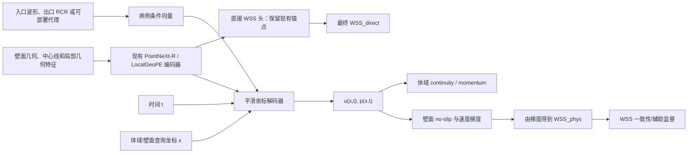

# WSS 最小化：体域物理约束与 PINN 训练路线讨论稿

> **历史状态（2026-08-01）**：本文描述的“直接 WSS 目标 + 体域辅助分支 +
> F0/F1/F2 阶梯”已冻结，不再是活动实现口径。当前路线改为峰值体域四通道
> `u,v,w,p`，只比较 PointNet / PointNet++ 的 data-only 与非热启动 PINN；请以
> [WSS_PINN 当前入口](WSS_PINN/README.md)和
> [`wss_pinn/README.md`](../../wss_pinn/README.md)为准。本文仅保留第一性原理与
> 历史决策依据。

> 日期：2026-07-29
>
> 状态：**第一性原理方案留档 / 边界条件与非牛顿流变已于 2026-07-29 确认 / No-Run**
>
> 目的：在不破坏现有 WSS-only 开发锚点的前提下，评估如何利用 `data_new/` 的体内速度、压力和壁面数据，引入真正落在体域内的物理约束，提高未见病例的峰值 WSS 预测精度。
>
> 当前结论：**不建议把 Navier–Stokes loss 直接接到现有壁面 WSS 单头；建议新增“几何与边界条件驱动的体域神经场辅助分支”，先做 CFD 闭环审计，再按 data-only → continuity/no-slip → WSS 梯度一致性 → unsteady momentum 的顺序逐级验证。**

## 0. 给讨论会的结论摘要

### 0.1 一句话判断

当前困难不是“完全没有体点”，而是：

1. 现行 `training_wss_min/` 只从壁面几何直接预测 WSS，模型没有定义体域内的 u(\mathbf{x},t) 和 p(\mathbf{x},t)，因此不能直接计算 Navier–Stokes 残差；
2. `data_new/` 和现有 `data_wss_min/**/bundle.npz` 已经保留了可利用的体点坐标，但当前 WSS bundle 默认没有保存体内速度/压力时间序列；
3. 旧 V1 PINN 的 physics 子采样在壁面点多于 2048 时会选出 **2048/2048 壁面点、0 个体点**，且已提交的作业均未形成完整、可判读的对照，所以不能把旧结果解释成“PINN 对本课题无效”；
4. 即使正确加入 PDE，**边界条件缺失仍会导致同一几何对应多种可能流场**。现有 RCR Oracle 的明显增益已经表明，WSS 的误差不全是网络结构问题，部分来自输入信息不足；
5. 小病例数条件下，正确目标不是“给每个病例单独求解一个 PINN”，而是训练一个可跨病例泛化的、由几何和可用边界条件共同条件化的 **physics-informed surrogate / neural field**。

### 0.2 推荐路线

推荐保留当前最优壁面模型作为独立锚点，并新增辅助分支：



第一阶段不把最终输出强制替换为 WSS_{\text{phys}}。先验证体域分支是否能学对速度/压力、能否从 CFD 速度重建 CFD WSS、以及物理项能否在同等数据监督下带来额外 WSS 增益。只有这些条件成立，才考虑更强的融合。

### 0.3 现在最应该做的不是长训

下一步应先完成 **P0 数据闭环与数值闭环审计**，不提交正式训练：

1. 全队列检查体点 `cellnumber`、坐标、顺序在 81 个时间步是否稳定；
2. 用 CFD 真值近壁速度，通过拟采用的法向梯度算子重建壁面 WSS；
3. 用 CFD 真值速度/压力，通过拟采用的微分或局部拟合算子计算连续性和动量残差；
4. 确认壁面法向、入口/出口区域、物性与边界条件的可得性。

如果“真值输入 → 真值 WSS/PDE 残差”的闭环本身不成立，就不能进入 PINN 训练。

### 0.4 2026-07-29 边界确认后的路线收敛

用户已确认：

- 所有 CFD 使用刚性壁面，密度等主要设置一致；
- 使用 UDF 中的剪切率相关非牛顿流变模型；
- 工程上采用近似相同的入口/出口建模方法，病例差异主要来自几何和各分支截面积；
- 第一阶段只预测峰值 WSS；
- 暂不重新从 Fluent 导出 zone、法向、面积或 connectivity；
- 第一阶段继续使用现有 `test36` 做筛选。

对 `data_new/AAA/ruputer/DING_JUN_FENG/udf-inlet4.c`、对应 `.cas.gz` 和全库顶层 UDF 的只读核对补充了三个重要事实；其中非牛顿流变已经用户确认，不再作为待定项：

1. **实际 CFD 不是常黏度牛顿流体。** DING 病例的 `.cas.gz` 明确把材料 viscosity 挂接到 `cell_viscosity::libudf`；该 UDF 使用剪切率相关黏度。找到的 188 份 AAA/ILO 顶层 `udf-inlet4.c` 都定义了同一组流变参数。
2. **入口流量波形是共享的，入口速度按面积变化。** 188 份 UDF 的 T、傅里叶系数和流变参数一致，但入口公式的面积除数有 180 个不同值，范围约 1.22\times10^{-4}–9.97\times10^{-4}\ \mathrm{m^2}。
3. **四出口 RCR 是病例相关的。** UDF 对四个出口分别保存 R_1,R_2,C；其变化是否完全由出口面积规则决定仍需审计，不能在尚未验证前直接从面积推导。

因此第一阶段冻结为：

> 共享入口流量波形 Q(t) + 病例入口/出口面积条件 + 剪切率相关黏度 + 峰值 WSS 目标；不依赖新增 Fluent 导出，不做全周期指标，不在第一轮硬施加精确出口面 RCR residual。

---

## 1. 问题从第一性原理如何表述

### 1.1 我们真正要解决的任务

研究目标不是对一个已知病例重新做 CFD，而是：

> 给定一个未见患者的血管几何，以及部署时真实可获得的血流边界条件，预测其壁面峰值 WSS 分布。

这与经典“在单一固定区域内用 PINN 拟合一个 PDE 解”不同。这里同时存在：

- 跨患者变化的几何域 \Omega_g；
- 病例相关入口/出口边界条件 b；
- 时间 t；
- 小病例数但每例有大量空间点和 81 个时间步；
- 最终关心的是壁面上的速度梯度，而不是体内速度本身。

因此更准确的学习对象是：


\mathcal{F}_\theta:
\left(g,b,\mathbf{x},t\right)
\longmapsto
\left(\mathbf{u}(\mathbf{x},t),p(\mathbf{x},t)\right),


再由速度梯度推导壁面切应力。它是“几何/边界条件条件化的物理信息代理模型”，不只是一个病例内 PINN。

### 1.2 控制方程与 WSS 的关系

在刚性壁面、不可压缩、广义牛顿流体假设下：


\nabla\cdot\mathbf{u}=0,


\rho\left(
\frac{\partial\mathbf{u}}{\partial t}
+(\mathbf{u}\cdot\nabla)\mathbf{u}
\right)
=-\nabla p
+\nabla\cdot
\left[
\mu(\dot{\gamma})
\left(\nabla\mathbf{u}+\nabla\mathbf{u}^{T}\right)
\right].


刚性壁面 no-slip：


\mathbf{u}|_{\Gamma_w}=0.


壁面应力张量和切向 WSS 可写为：


\boldsymbol{\sigma}=-p\mathbf{I}
+\mu(\dot{\gamma})
\left(\nabla\mathbf{u}+\nabla\mathbf{u}^{T}\right),


# 
\boldsymbol{\tau}_w

\left(\mathbf{I}-\mathbf{n}\mathbf{n}^{T}\right)
\boldsymbol{\sigma}\mathbf{n},
\qquad
WSS=\boldsymbol{\tau}_w_2.


压力项在切向投影后消失，所以 WSS 的核心是**壁面附近速度的空间梯度**。这带来两个直接结论：

- 只有 WSS 标量标签、没有连续速度场输出的模型，不能从自身构造 Navier–Stokes 残差；
- 体内速度预测“看起来不错”不等于 WSS 会准，因为求导会放大近壁误差，必须单独验证速度梯度到 WSS 的闭环。

本数据的 UDF 使用：

# 
\mu(\dot{\gamma})

\mu_\infty
+(\mu_0-\mu_\infty)
\left[
1+(\lambda\dot{\gamma})^a
\right]^{(n-1)/a},


其中：


\mu_\infty=0.0035,\quad
\mu_0=0.16,\quad
\lambda=8.2,\quad
a=0.64,\quad
n=0.2128.


例如该公式在剪切率 0.1,1,10,100,1000\ \mathrm{s^{-1}} 时的黏度约为
0.0755,0.0260,0.00804,0.00428,0.00363\ \mathrm{Pa\cdot s}。因此把
\mu=0.0035 当作全场常数会显著改变低剪切区的动量项；常黏度只能作为明确标注的简化消融，不能冒充生成 CFD 标签的真实方程。

### 1.3 物理约束不能补出缺失的边界条件

Navier–Stokes 方程不是只给几何就有唯一解。入口速度/流量波形、出口压力或阻抗模型、流体物性、初始状态都会改变流场和 WSS。

本项目已有证据：

- S3 父模型 O0 geometry-only：R^2_{\mathrm{cb}}=0.2756；
- 加入真实四出口 RCR 的 O1a：R^2_{\mathrm{cb}}=0.3561，相对 O0 为 +0.0805；
- 打乱 RCR 的 O2：R^2_{\mathrm{cb}}=0.2723。

这不是对最终可部署方案的证明，因为它仍是单 seed、复用开发集的 Oracle；但它强烈提示：**边界条件包含几何无法替代的信息**。因此必须把研究路线拆成：

- **信息上限路线**：训练时和推理时都给真实入口波形、出口 RCR；
- **可部署路线**：只给临床可测量信息，或由几何/临床变量估计的 BC 代理；
- **geometry-only 下限**：不假设 PINN 能凭空恢复未知 BC。

---

## 2. 当前仓库事实审计

### 2.1 现有 WSS-only 锚点

现行模型见 `training_wss_min/`：

- 输入：壁面点坐标与几何特征；
- 输出：峰值时相的壁面 WSS 标量；
- 训练可采样，评估在完整壁面点云；
- 当前单 seed 开发锚点是 `REG-P10-LSA2 SAME-H2 + log(local_radius)`；
- 物理空间 R^2_{\mathrm{cb}}=0.3506，MAE =2.5238 Pa，高 WSS nRMSE =0.06611；
- 相对同 seed 并发 H2 control：\Delta R^2_{\mathrm{cb}}=+0.0436、\Delta MAE=-0.0342 Pa、\Deltahigh-WSS nRMSE =-0.00295；
- 病例级全场 R^2 差的 bootstrap CI 仍跨零，不能写成多 seed 稳健结论。

这个模型应冻结为后续物理路线的 **W0 anchor**，不能在没有对照的情况下被整体替换。

### 2.2 `data_new/` 实际已经有什么

原始数据大体包含两类 ASCII：


| 数据             | 典型字段                                                 | 作用                |
| -------------- | ---------------------------------------------------- | ----------------- |
| 壁面 `ascii/`    | `nodenumber,x,y,z,pressure,wall-shear,...`           | WSS/壁面压力监督、壁面节点对齐 |
| 体内 `ascii_in/` | `cellnumber,x,y,z,pressure,velocity-magnitude,u,v,w` | 体域速度/压力监督、PDE 配点  |


代表病例 `AG/fast/RAN_QING_BO` 的现有报告显示：

- 壁面点 17,682；
- 体点 990,613；
- 81 个时相，峰值时相 1162；
- 当前标记的近壁点上限为 40,000。

不同队列规模差异很大，例如：


| 代表病例                       | 壁面点    | 体点      | 时相  | 当前近壁标记     |
| -------------------------- | ------: | -------: | ---: | ----------: |
| AG `RAN_QING_BO`           | 17,682 | 990,613 | 81  | 40,000，已封顶 |
| AAA `ZHOU_XI_SHENG`        | 13,634 | 765,506 | 81  | 40,000，已封顶 |
| ILO `GAO_SHU_CAI-0/before` | 76,062 | 706,610 | 81  | 40,000，已封顶 |


因此不能把所有时相、所有体点的 u,v,w,p 直接复制进一个大 bundle；需要可复现的分层索引或独立 sidecar。

### 2.3 `data_wss_min` 已经是比旧 `data_new` 图文件更好的几何母版

现有 v4 `bundle.npz` 已保存：

- `wall_coords_raw/norm`、`wall_nodenumber`；
- 全 81 时相的 `wall_wss`、`wall_pressure`、默认开启的 `wall_wss_vec`；
- 全体点 `int_coords_norm`；
- `int_dist_to_wall`、`int_type` 和中心线几何特征；
- 已审核的 `stl_landmarks_v4` 坐标变换、病例白名单和队列信息。

但默认：

- `store_near_wall_timeseries=False`；
- 不保存深部体域全时相速度/压力；
- `read_interior_fields()` 返回速度和压力，但当前没有返回 `cellnumber`；
- 体点只保存 normalized 坐标，没有在 bundle 内保存原始/对齐后的 mm 坐标；
- `coord_scale_on="wall"`，所以体点的 normalized 坐标可能超出 [-1,1]。

还有一个容易忽视的细节：近壁点超过 40,000 后，仅保留距离最近的 40,000 个为 `NEAR_WALL`；其余即使满足 1.5 mm 阈值，也会落回 `INTERIOR` 标签。因此物理采样必须以 `int_dist_to_wall` 的连续数值为准，**不能只依赖 `int_type`**。

### 2.4 推荐的数据策略

不重写、也不原地扩充已经验收的 v4 `bundle.npz`。新增独立产物，例如：

```text
data_wss_pinn/
└── <cohort>/<case>/
    ├── physics_manifest.json
    ├── physics_static.npz
    └── fields/
        ├── step_1120.npz
        ├── step_1162.npz
        └── ...
```

`physics_manifest.json` 至少记录：

- 父 `bundle.npz` 的相对路径和 SHA256；
- 原始 ASCII 文件清单和 SHA256；
- `cellnumber`、坐标、顺序稳定性结论；
- v4 旋转、平移、单位变换、特征尺度；
- 流体密度、动力黏度及其来源；
- 入口/出口边界标签和 BC 来源；
- 采样策略、随机种子、每层抽样数和抽样权重；
- 可用时相、峰值时相、时间间隔与心动周期。

`physics_static.npz` 建议保存：

- `cellnumber`；
- 对齐后的体点物理坐标（m 或 mm，但 manifest 必须明确）；
- `dist_to_wall_mm`、`local_radius_mm`、中心线/分支特征；
- 壁面坐标、节点 ID、单位法向；
- 入口/出口/壁面 zone mask；
- 分层采样索引与 inverse-probability weight。

每个时相文件只保存选中体点的：

- `u,v,w,p`；
- 时相/物理时间；
- 对应 `cellnumber` 和静态索引；
- 有限值、单位和范围 QA。

这样既复用 v4 已审核的几何框架，也不会因 physics 试验失败而污染当前 WSS-only 数据真源。

### 2.5 旧 `pipeline/` 的 15k 合并图为什么不够

旧配置当前为：

- 总点数 15,000；
- 壁面上限 13,000；
- 体点预算通常约 2,000；
- 体点只取距离壁面小于 2 mm 的近壁点；
- 核心点比例为 0，且不允许 core fallback。

这套数据可以做历史速度/压力场学习，但不足以支撑完整体域 PDE：

- 核心区域缺失；
- 近壁层的厚度和点数随病例尺度变化；
- 对二阶空间导数而言，2,000 个近壁体点通常过稀；
- 壁面占比过高，训练/残差容易被壁面项主导。

### 2.6 旧 V1 PINN 不能作为当前路线的 No-Go 证据

`training/core/losses.py::_subsample_physics_batch()` 当前逻辑是“优先保留壁面”：

```text
if n_wall >= max_nodes:
    只从 wall_idx 中抽 max_nodes
```

旧图通常有约 13,000 个壁面点，而 `max_physics_nodes=2048`，所以 physics 分支会得到：

```text
wall = 2048
interior = 0
```

这意味着连续性和动量残差并没有在体域内被评估。同时，抽点后只保留子图内部边，固定图邻域与坐标求导也不是理想的连续神经场表示。

旧作业状态同样没有形成结论：


| Jobs      | 状态                | 能否判 PINN 有效 |
| --------- | ----------------- | ----------- |
| 5536–5538 | ep21 OOM          | 不能          |
| 5540      | ep21 代码错误         | 不能          |
| 5600      | 75/200 后超时，无 test | 不能          |


Job 5600 后期 `physics_omega` 达到约 10^8–10^{11}，提示 SI 残差尺度和动态权重存在严重失衡。它说明当前实现需要无量纲化和更稳定的损失设计，不说明体域物理约束本身无效。

---

## 3. 推荐模型：壁面直接头 + 平滑体域神经场

### 3.1 为什么不是在现有 PointNeXt 输出上直接求导

现有 PointNeXt 的输入是离散壁面点及其邻域，输出也是壁面点 WSS。对输入点坐标做 autograd，并不自动等价于获得物理意义上的连续速度场导数，尤其是：

- KNN/ball-query 邻居集合随坐标变化是离散切换的；
- ReLU 型分段线性网络的二阶导数几乎处处为零；
- 子图构建和采样会改变邻域；
- 模型没有在体域任意坐标上定义输出。

因此 PDE 导数路径需要一个显式的平滑坐标解码器。

### 3.2 建议的结构

#### A. 几何编码器

复用当前有效结构：

- 壁面 PointNeXt-R；
- LocalGeoPE；
- `log(local_radius)`；
- 输出病例全局 latent 和多个局部几何 anchor latent。

当前 WSS 直接头保持不变，保证有可对照的 `WSS_direct`。

#### B. 边界条件编码器

按实验层级输入：

- 共享入口流量波形 Q(t)；
- 病例入口面积 A_{\mathrm{in}}，由 Q(t)/A_{\mathrm{in}} 恢复 UDF 中的入口速度尺度；
- 四个有身份的出口面积、面积比和等效半径；
- Oracle 对照才输入四出口真实 R_1,R_2,C；
- 若部署时不可得，则输入临床测量或 1D/Murray 型代理；
- 统一密度 \rho=1060\ \mathrm{kg/m^3} 和固定的流变模型参数。

真实 RCR 只能用于 Oracle 上限时，配置名必须写明 `oracle`，不能冒充 deployable。

DING 病例 UDF 的入口设置不是“所有病例相同入口速度”，而是相同的 Q(t) 除以病例入口面积。四出口 RCR 递推又直接把 Fluent `F_FLUX` 保存为 `Qn`；DING 日志中四出口该量之和约为 0.015736，约等于
1060\times1.48424\times10^{-5}。因此它实际对应质量流量量级。后续若实现 RCR residual，必须先冻结质量流量/体积流量换算和 RCR 参数单位；第一阶段只把 RCR 当作条件特征，不硬写入边界 residual。

#### C. 平滑坐标解码器

定义：


f_\theta(
\mathbf{x}^*,t^*,z_{\text{case}},z_{\text{local}}(\mathbf{x}),b
)
\rightarrow
(\mathbf{u}^*,p^*).


建议：

- 导数路径使用 `tanh`、`SiLU`、`Softplus` 或 SIREN 类平滑激活，不用纯 ReLU；
- 局部 latent 对查询坐标的插值使用平滑 RBF/soft attention；
- 避免把离散 KNN 切换直接放进需要二阶导数的路径；
- 压力只监督相对压力或去均值压力，处理 gauge 自由度。

#### D. WSS 物理头

在壁面查询点，用 STL/CFD 对齐后的法向 \mathbf{n} 和 decoder 的速度梯度计算：

# 
WSS_{\text{phys}}

\left
\left(\mathbf{I}-\mathbf{n}\mathbf{n}^{T}\right)
\mu(\dot{\gamma})
\left(\nabla\mathbf{u}+\nabla\mathbf{u}^{T}\right)\mathbf{n}
\right_2.


首轮只把它作为：

- 对 CFD WSS 的辅助监督；
- 与 `WSS_direct` 的一致性约束；
- 模型是否学到正确近壁梯度的诊断。

只有当 `WSS_phys` 的真值闭环和预测精度都过门，才考虑让它参与最终融合。

### 3.3 推理时是否还需要体点

不一定需要。

训练时需要 `data_new/` 体点作为：

- u,p 监督点；
- PDE collocation 点；
- 数值闭环审计点。

推理时若神经场由壁面几何编码、边界条件和查询坐标条件化，可以只在壁面坐标上调用 decoder，并通过 autograd 得到壁面速度梯度。也就是说：

> 体点主要是训练约束，不必成为新患者推理时的输入前提。

但部署时仍必须明确边界条件从哪里来。

---

## 4. 无量纲化与损失定义

### 4.1 为什么必须无量纲化

直接把 SI 单位下的连续性、压力梯度、对流项、黏性项平方后相加，量级差异可能跨很多数量级，旧 `omega` 爆到 10^8–10^{11} 就是风险信号。

逐病例定义特征尺度：


\mathbf{x}^*=\frac{\mathbf{x}}{L},
\quad
\mathbf{u}^*=\frac{\mathbf{u}}{U},
\quad
t^*=\frac{tU}{L},
\quad
p^*=\frac{p-p_{\mathrm{ref}}}{\rho U^2},


Re_{\mathrm{ref}}=\frac{\rho UL}{\mu_{\mathrm{ref}}}.


对本数据应取参考黏度 \mu_{\mathrm{ref}} 定义 Re_{\mathrm{ref}}，并保留
\mu^*(\dot{\gamma}^*)=\mu/\mu_{\mathrm{ref}}。无量纲动量方程为：


\frac{\partial\mathbf{u}^*}{\partial t^*}
+(\mathbf{u}^*\cdot\nabla^*)\mathbf{u}^*
=-\nabla^*p^*
+\frac{1}{Re_{\mathrm{ref}}}
\nabla^*\cdot
\left[
\mu^*(\dot{\gamma}^*)
\left(\nabla^*\mathbf{u}^*+\nabla^*\mathbf{u}^{*T}\right)
\right].


L 可优先取入口等效直径或稳定的局部尺度，U 优先由共享入口波形的 Q_{\mathrm{peak}}/A_{\mathrm{in}} 得到。具体选择必须在 train-only 规则和部署信息约束下冻结。

### 4.2 分阶段总损失

# 
\mathcal{L}

\lambda_{\mathrm{wss}}\mathcal{L}*{\mathrm{wss-direct}}
+\lambda*{\mathrm{field}}\mathcal{L}*{u,p}
+\lambda*{\mathrm{div}}\mathcal{L}*{\nabla\cdot u}
+\lambda*{\mathrm{noslip}}\mathcal{L}*{u|*{\Gamma_w}}
+\lambda_{\mathrm{grad}}\mathcal{L}*{WSS*{\mathrm{phys}}}
+\lambda_{\mathrm{cons}}\mathcal{L}*{WSS*{\mathrm{direct}}\leftrightarrow WSS_{\mathrm{phys}}}
+\lambda_{\mathrm{mom}}\mathcal{L}_{\mathrm{NS}}.


注意：

- `field data-only` 必须作为物理模型的直接对照；
- 每增加一个物理项，只改变一个变量；
- 先固定常数权重或经过审计的尺度，再考虑自适应权重；
- 自适应权重必须有上下界、日志和失控门禁；
- “PDE residual 下降”不是成功，最终必须带来未见病例 WSS 指标改善。

### 4.3 峰值 WSS 目标下为什么仍不能默认使用稳态动量

当前目标是峰值入口波形附近的 WSS，但“入口流量峰值”不等于所有空间位置的 \partial\mathbf{u}/\partial t=0。脉动流下，局部非定常项可能仍然显著。

因此推荐：

1. 第一阶段先做 continuity + no-slip + 近壁梯度/WSS；
2. WSS 的训练目标和最终评价只使用峰值时相；
3. 若要在峰值处加入 momentum，辅助 u,p decoder 至少读取峰值前、峰值、峰值后三个时相，以估计峰值处 \partial u/\partial t；
4. 暂不扩展 TAWSS、OSI 或完整周期 WSS 输出；
5. 稳态 momentum 只能作为明确标注的近似消融，不能默认写成真实物理约束。

现有 UDF 令 `T=0.8 s`、求解时间步为 `0.005 s`，1280 步对应 8 个周期；峰值 step 1162 位于最后一周期约 0.21 s。另需注意 UDF 中 `w=6.491` 并不等于 2\pi/T，且 `tt` 每 0.8 s 重置；训练时应复现实际 `vf-in-rfile.out`，不能自行换成理想连续周期波形。第一阶段峰值不在周期接缝附近，因此不构成立即阻塞。

---

## 5. P0：训练前必须通过的四个闭环

### P0-A｜体点身份和时间对齐

目的：确认每个 `cellnumber` 在全部时相中对应同一空间位置。

检查：

- 每时相 `cellnumber` 集合、顺序、唯一性；
- 坐标最大绝对差；
- 缺失/新增 cell；
- u,v,w,p 有限值和单位范围；
- AG/AAA/ILO 分队列统计；
- 入口/出口延伸段是否在所有时相一致。

代表病例的三个时相坐标看起来稳定不等于全库稳定，必须全病例审核后才能按索引堆叠。

**Gate**：任何顺序变化都必须按 `cellnumber` 显式重排；不能依赖行号。

### P0-B｜CFD 速度 → CFD WSS Oracle

目的：验证现有空间分辨率、法向和拟采用的梯度方法能否从 CFD 速度恢复 Fluent WSS。

建议至少比较：

- 沿壁面法向的局部多项式拟合；
- weighted least squares / moving least squares；
- RBF 局部拟合；
- 平滑神经场对 3–5 个病例的强监督过拟合。

使用真实壁面 no-slip 点和多个近壁壳层，不只用最近一个 cell center。

指标：

- 全壁面 R^2、MAE、nRMSE；
- high-WSS nRMSE、top10 IoU；
- 按距壁距离、局部半径、分叉/狭窄区域分层；
- 法向翻转敏感性和法向平滑敏感性。

**No-Go**：若用 CFD 真值速度仍无法稳定恢复 CFD WSS，则当前点采样/法向/梯度方案不足，不能把梯度误差归咎于神经网络。

### P0-C｜CFD 真值 PDE residual Oracle

目的：估计 CFD 离散解在我们所用微分算子下的“数值噪声底”。

检查：

- \nabla\cdot u；
- 各动量项的量级；
- 近壁、核心、入口、出口分区残差；
- 不同时相；
- 使用完整/抽样邻域时的残差变化。

**No-Go**：若 CFD 真值在该算子下本身有很大残差，直接最小化此残差会惩罚正确解。需先换算子、采样或只保留可信物理项。

### P0-D｜几何、法向与边界分区

第一阶段不新增 Fluent 导出，数据来源冻结为：

- 现有 wall/interior ASCII；
- 原始 STL 与 v4 配准；
- `udf-inlet4.c`；
- `Global_conditions/*-rfile.out`；
- 已有 `.cas.gz` 只读元信息。

检查：

- STL 法向与 CFD 壁面点映射；
- 法向单位长度、局部连续性；
- outward/inward 方向；
- 从现有 UDF/日志提取入口面积、四出口面积、RCR 与入口波形；
- 四出口的解剖身份和面积顺序是否跨病例一致；
- UDF 面积条件和 STL/中心线几何推导面积能否对应。

WSS 标量对整体法向翻转不敏感，但 WSS 矢量、通量、压力边界和局部坐标方向敏感，所以不能省略法向方向 QA。

当前限制：

- 不做依赖精确 inlet/outlet face mesh 的 hard BC loss；
- 不做 connectivity-based CFD 离散 residual；
- continuity/momentum 仅通过平滑坐标 decoder 对体点坐标 autograd；
- no-slip 使用已对齐壁面点；
- WSS 梯度使用 STL 法向映射；
- 出口面积/RCR 先作为病例条件，不作为精确边界面约束。

这不阻塞 F0、F1 和 F2，但会阻塞“严格出口通量守恒 + RCR hard residual”版本。若后续 F2 已显示价值，再讨论只读 `.cas.gz` 的轻量 mesh/zone 提取；不需要重新跑 CFD。

---

## 6. 建议的体域采样

### 6.1 不再让壁面占满 physics batch

每个 physics batch 显式分槽，任何一槽都不能挤占其他槽：


| 槽位    | 初始建议    | 用途                         |
| ----- | -------: | -------------------------- |
| 壁面点   | 4k–8k   | no-slip、WSS 梯度、直接 WSS      |
| 近壁体点  | 8k      | 梯度与边界层                     |
| 核心体点  | 8k      | continuity / momentum 全域覆盖 |
| 入口/出口 | 各 1k–2k | BC 与通量；有 zone 后启用          |


数值只是 pilot 起点，最终根据显存、覆盖率和 P0 residual 稳定性调整。

### 6.2 近壁点应按多壳层抽样

不能只保留离壁最近的点。建议按相对距离 d/R_{\mathrm{local}} 分层，并保留 mm 口径回退：

- 极近壁；
- 近壁中层；
- 边界层外缘；
- 核心。

每层记录抽样概率和权重，避免小病例、高密度病例或近壁区在总体 loss 中被过度代表。

### 6.3 时间采样

阶段性选择：

1. P0 和 3–5 例过拟合：峰值附近至少前/中/后三个时相；
2. F0/F1：9 个代表相位；
3. F3 unsteady momentum：随机连续抽时相对，确保 \partial u/\partial t 可辨识；
4. 只有 9 相位稳定后，再评估 81 相位的成本收益。

---

## 7. 因果可解释的实验阶梯

所有比较必须保持：

- 相同患者级 split；
- 相同 seed；
- 相同体点/壁面点采样 manifest；
- 相同 WSS anchor、训练轮数和选模规则；
- 一次只新增一个信息源或物理项。

### 7.1 第一层：区分“信息增益”和“物理增益”


| ID   | 模型                        | 新增内容                                    | 回答的问题         |
| ---- | ------------------------- | --------------------------------------- | ------------- |
| W0   | 当前冻结锚点                    | geometry-only direct WSS                | 当前下限          |
| B1-A | W0 + deployable BC        | 共享 Q_{\mathrm{peak}} + 入口/四出口面积，无体域/PDE | 显式面积条件贡献多少    |
| B1-R | W0 + RCR Oracle           | 四出口真实 R_1,R_2,C，无体域/PDE                 | 病例 BC 信息上限    |
| F0   | W0 + smooth field decoder | 监督 u,p，无 PDE                            | 多任务/额外标签贡献多少  |
| F1   | F0 + continuity + no-slip | 可信的一阶物理项                                | 物理约束是否有额外贡献   |
| F2   | F1 + WSS_{\text{phys}}    | 近壁梯度与 WSS 一致性                           | 是否改善高 WSS     |
| F3   | F2 + unsteady momentum    | 多时相 N-S 残差                              | 完整 PDE 是否继续增益 |


关键比较：

- `B1-A - W0`：可部署的面积条件增益；
- `B1-R - W0`：真实 RCR 信息上限；
- `B1-R - B1-A`：面积代理尚未解释的 BC 信息；
- `F0 - B1-A/W0`：体域标签与多任务增益；
- `F1 - F0`：continuity/no-slip 的净物理增益；
- `F2 - F1`：WSS 梯度关系的净增益；
- `F3 - F2`：非定常动量的净增益。

如果只比较 F3 与 W0，就无法知道提升来自更多标签、更多输入、更多参数还是 PDE。

### 7.2 执行阶段

#### Stage P0｜No-Run 数据审计

先在 AG/AAA/ILO 各 1 例验证脚本，再扩全库。产物必须是 JSON/CSV 报告和可视化，不产生模型结论。

#### Stage P1｜3–5 例过拟合

顺序：

1. F0 能否把 u,p 拟合到很低误差；
2. 加 continuity/no-slip 后是否仍能拟合且 residual 下降；
3. WSS_{\text{phys}} 能否接近 CFD WSS；
4. 梯度和 loss 是否有限、稳定。

连训练病例都拟合不了时，不进入泛化实验。

#### Stage P2｜单 seed 开发筛选

按用户决定继续沿用现有配置和目录中的 `test36`。方法学角色记为
`test36 (reused development screen)`：第一阶段不新建 split，但它只能用于工程排序，不能继续作为最终无偏 test。

#### Stage P3｜稳健性确认

只有通过单 seed Gate 的处理臂才做：

- 至少 3 seeds；
- AG/AAA/ILO 分域；
- 新患者级 holdout 或 grouped OOF；
- 同一患者的 before/after、重复扫描或派生样本必须在同一 fold；
- 最终 test 不能参与权重、时相、采样和 loss 选择。

---

## 8. 评价指标与 Go/No-Go

### 8.1 WSS 主指标

沿用当前统一口径：

- physical case-balanced R^2；
- MAE；
- high-WSS nRMSE；
- top10 IoU；
- AG/AAA/ILO 分域保护线；
- 完整壁面同点评估。

### 8.2 场与物理诊断指标

- u,v,w,\mathbf{u} 的 nRMSE / R^2；
- 去 gauge 压力的 nRMSE / R^2；
- divergence residual；
- momentum 各项和总 residual；
- no-slip residual；
- 入口流量守恒、出口流量和 BC residual；
- `WSS_phys` 对 CFD WSS 的全场与高值指标。

### 8.3 物理路线的成功条件

物理项只有同时满足以下条件才算有价值：

1. 与相同结构、相同数据监督的 F0 相比，未见病例 WSS 改善；
2. 不只是训练集 residual 下降；
3. 不牺牲高 WSS 和某一队列；
4. 多 seed 或新 holdout 上方向一致；
5. 增益大于新增数据处理和推理成本。

### 8.4 明确止损条件

出现任一情况即暂停升级：

- P0-B 的 CFD 速度无法恢复 CFD WSS；
- P0-C 表明拟采用的 PDE residual 对 CFD 真值也不成立；
- F0 无法学好 u,p，或进入 F1/F2 后 WSS 仍不能至少匹配当前锚点；
- F1/F2 只降低 residual，却不改善 WSS；
- 物理项收益只出现在一个 seed 或一个队列；
- 必需 BC 在真实部署时不可获得，且代理 BC 没有可接受精度；
- momentum 不稳定时，不允许跳过 continuity/no-slip 继续堆完整 PDE。

---

## 9. 推荐的工程拆分

此处只冻结边界，不在本次文档阶段改代码。

### 9.1 数据侧

建议新增而不是改写现有真源：

```text
pipeline_wss_pinn/
├── audit_interior_identity.py
├── build_physics_sidecar.py
├── audit_wall_normals_zones.py
├── oracle_velocity_to_wss.py
├── oracle_cfd_pde_residual.py
└── configs/

data_wss_pinn/
└── ...
```

第一处必要修正是让 interior reader 返回 `cellnumber` 和坐标，并按 ID 对齐所有时相。

### 9.2 训练侧

建议独立目录，避免污染已稳定的 `training_wss_min/`：

```text
training_wss_pinn/
├── geometry_encoder.py
├── coordinate_decoder.py
├── physics_losses.py
├── wss_from_velocity.py
├── dataset.py
├── train.py
├── evaluate.py
├── configs/
└── tests/
```

可以复用当前 encoder/checkpoint，但新 decoder、数据合同、物理 loss 和评估必须独立。

### 9.3 最小测试集

代码落地前预注册：

- ID 重排与错位拒绝测试；
- 坐标变换/速度矢量旋转一致性；
- 无量纲化与反变换；
- 已知解析速度场的 divergence、Laplacian 和 WSS；
- 刚性壁面 no-slip；
- 压力 gauge 不变性；
- physics batch 各槽点数下限；
- 二阶导数有限值；
- `lambda_physics=0` 时退化为 F0；
- 固定 seed 的采样可复现。

---

## 10. 已冻结的边界与物理口径

### 10.1 决策表


| 原问题        | 2026-07-29 决策                                                 | 对方案的影响                                     |
| ---------- | ------------------------------------------------------------- | ------------------------------------------ |
| 壁面和物性      | 刚性壁面、不可压缩、\rho=1060\ \mathrm{kg/m^3}、统一 Carreau–Yasuda 型非牛顿流变 | 共用一个广义牛顿物理方程族                              |
| 工程可用 BC    | 使用近似相同的入口/出口建模方法；病例差异主要是分支面积                                  | 共享 Q(t)，显式输入入口/四出口面积                       |
| 第一阶段目标     | 只做峰值 WSS                                                      | 不评价 TAWSS/OSI；momentum 最多使用峰值邻近三帧          |
| Fluent 新导出 | 暂不重新导出 zone、法向、面积、connectivity                                | 不做 face-mesh hard BC；使用现有 ASCII/STL/UDF/日志 |
| 数据划分       | 第一阶段接受继续使用 `test36`                                           | 沿用文件名，但标注为 reused development screen       |


### 10.2 非牛顿流变已正式确认

早期讨论曾暂按统一牛顿流体理解，但 DING 病例的实际计算设置提供了不同的直接证据：

- `udf-inlet4.c` 定义剪切率相关 `cell_viscosity`；
- 对应 `.cas.gz` 的材料 viscosity 为
`user-defined "cell_viscosity::libudf"`；
- 密度为 1060\ \mathrm{kg/m^3}；
- 入口、四出口 RCR 和 variable viscosity UDF 都已挂接；
- 找到的 188 份 AAA/ILO 顶层 UDF 全部含同一流变函数和参数。

2026-07-29 用户已确认使用非牛顿流体。因此本文正式冻结为：

> 刚性壁面、不可压缩、统一广义牛顿 Carreau–Yasuda 型流变。

后续主物理约束和 WSS_{\mathrm{phys}} 必须使用 UDF 中的
\mu(\dot{\gamma})；\mu=0.0035\ \mathrm{Pa\cdot s} 仅是高剪切极限，不能作为全场常数。constant-\mu 若保留，只能作为明确标注的简化消融。

### 10.3 BC 的可部署定义

第一阶段不要求新患者提供额外临床波形：

- Q(t) 使用数据中共同的 UDF 波形；
- A_{\mathrm{in}} 决定入口速度尺度 Q/A_{\mathrm{in}}；
- 四出口面积/面积比作为可部署条件；
- 真实四出口 RCR 仅作为已有数据上的 Oracle；
- 新患者的 RCR 只有在确认“面积 → RCR”生成规则后，才能转成可部署条件。

需要新增一个零训练审计：

> 对全库解析入口面积、四出口面积和四组 RCR，检验 RCR 是否能由面积及分支身份确定；若不能，`B1-R` 继续只作为 Oracle。

### 10.4 `test36` 的使用边界

本阶段不重划数据，继续使用现有 `test36` 做模型筛选和方案止损；配置名、目录名无需改动。

但由于该集合已被多轮使用：

- 文档中写作 `test36 (reused development screen)`；
- 可以回答“是否值得继续投入”；
- 不能单独支撑“对未见患者无偏泛化”的最终论文结论；
- 只有路线过门且进入最终确认时，才再讨论 grouped OOF 或新 holdout。

---

## 11. 建议的下一次共同决策

按风险和信息价值排序：

1. 只读解析全库 UDF/Global_conditions，形成 Q(t)、入口/出口面积、RCR、流变参数和单位审计；
2. 只实现 `audit_interior_identity.py`，全库确认 `cellnumber/coords`；
3. 实现 P0-B `velocity_to_wss_oracle`，使用 variable \mu(\dot{\gamma})，先跑 AG/AAA/ILO 各 1 例；
4. 对比 `B1-A` 面积条件和既有 `B1-R` RCR Oracle；
5. 再决定要不要建立完整 physics sidecar；
6. sidecar 通过后只做 F0 的 3–5 例峰值/邻近三帧过拟合；
7. F0 成立后才加入 continuity/no-slip；
8. WSS 梯度 Oracle 与 F1 都过门后才提交 F2；
9. 最后才考虑峰值处的非定常 momentum。

当前不建议：

- 直接在现有 WSS loss 上叠加“NS loss”；
- 直接把旧 15k 图当作完整体域；
- 一次性打开 continuity、momentum、no-slip、WSS consistency 和动态权重；
- 因病例少就默认 PINN 一定改善泛化；
- 在没有部署 BC 的情况下，把 RCR Oracle 提升写成可部署结论。
- 把 \mu_\infty=0.0035 误当成全场恒定黏度；
- 在未审计 `F_FLUX` 单位前硬编码 RCR residual。

---

## 12. 与当前文档的关系

- 当前 WSS 锚点与实验事实：[WSS 最小化训练实验跟踪](WSS最小化_训练实验跟踪.md)
- PointNet/PointNeXt 矩阵：[WSS 最小化 PointNet baseline 实验矩阵](WSS最小化_PointNet_baseline实验矩阵与进度跟踪.md)
- 高 WSS 误差与优化空间：[WSS 高值区域预测优化方案](WSS高值区域预测优化方案.md)
- WSS 专用推进记录：[WSS 最小化代码修改与实验推进记录](WSS最小化_代码修改与实验推进记录.md)
- 历史 V1 PINN 状态：[任务 A V1 实验清单](../01-任务/任务A/01-V1路线/任务A_V1实验清单.md)

本文是后续 physics-informed WSS 路线的讨论真源；没有实验结果时不在训练实验跟踪中新增结果条目。

---

## 13. 方法出处与外部参照

以下文献用于约束方法边界，不替代本项目自己的 P0 闭环和配对实验：

1. Raissi, Perdikaris, Karniadakis, 2019，PINN 基本框架：[Physics-informed neural networks: A deep learning framework for solving forward and inverse problems involving nonlinear partial differential equations](https://www.sciencedirect.com/science/article/abs/pii/S0021999118307125)
2. Krishnapriyan et al., 2021，PINN 训练失败模式与 curriculum：[Characterizing possible failure modes in physics-informed neural networks](https://proceedings.neurips.cc/paper_files/paper/2021/hash/df438e5206f31600e6ae4af72f2725f1-Abstract.html)
3. Wang, Teng, Perdikaris，PINN 梯度病态与损失平衡：[Understanding and mitigating gradient pathologies in physics-informed neural networks](https://epubs.siam.org/doi/10.1137/20M1318043)
4. Li et al., 2021，物理信息神经算子思路：[Physics-Informed Neural Operator for Learning Partial Differential Equations](https://arxiv.org/abs/2111.03794)
5. Liao et al., 2025，小样本血流点云 PINN 参照；其任务是速度/压力场，不能直接当作 WSS 已验证方案：[A point cloud-based physics-informed neural network for blood flow modeling](https://www.sciencedirect.com/science/article/pii/S0952197625020421)
6. 血管 CFD 中 WSS 的应力/切向投影定义参照：[Wall shear stress in the human abdominal aorta](https://pmc.ncbi.nlm.nih.gov/articles/PMC3106350/)

---

## 13.5 P0-B 执行结果（2026-07-30 追加）

> 状态：**P0-B 通过（Go）** — CFD 速度可以稳定恢复 CFD WSS，§8.4 的 P0-B No-Go 条件不成立。

### 13.5.1 结论

用 CFD 真值近壁速度重建壁面 WSS，在 AG/AAA/ILO 三队列 36 例（35 例可用）上：

| 指标 | mean | p05 | p50 | min |
| --- | --- | --- | --- | --- |
| **raw R²**（纯物理，无自由参数） | **0.871** | 0.821 | 0.871 | 0.652 |
| scaled R²（允许 1 个全局标量） | 0.940 | 0.902 | 0.955 | 0.695 |
| Spearman | 0.982 | 0.968 | 0.984 | 0.948 |
| 方向余弦 | 0.994 | 0.995 | 0.998 | 0.882 |
| 有效点覆盖 | 1.000 | 1.000 | 1.000 | 1.000 |

队列间无系统差异：AG 0.862 / AAA 0.873 / ILO 0.880。

这与 §0.3 第 2 步「用 CFD 真值近壁速度，通过拟采用的法向梯度算子重建壁面 WSS」
所要求的闭环一致，闭环**成立**。

### 13.5.2 相对已有 oracle 的两处关键修正

已有实现（`wss_pinn/tools/velocity_to_wss_oracle.py`、
`training/scripts/run_v3p_profile_wss_oracle.py`）的历史 raw R² 是
**-4253 ~ -202772** 量级（见 `outputs/field/f0_decision/v3p_profile_wss_oracle_20260704.json`），
只能靠 `calibrated_r2`（0.57）判读。定位到两个根因，均已量化：

1. **粘度模型未对齐 UDF**（贡献 0.763 → 0.893）
   `run_v3p_profile_wss_oracle.py:51` 用 `MU_BLOOD = 3.5e-3` 常数，而 CFD 的
   `udf-inlet.c` 是 Carreau-Yasuda 非牛顿（μ ∈ [0.0035, 0.16] Pa·s，56 倍跨度）。
   常数 μ 只等于高剪切极限，低剪切区系统性低估。
   §10.2 已确认非牛顿流变，但该 oracle 未落实。

2. **法向定向用「指向几何质心」，对弯曲主动脉不成立**（有效点 61% → 100%）
   `wss_pinn/physics/wall_shear.py` 的定向方式导致 **39% 壁面点被判错向**，
   近壁点全落在法向负侧被丢弃。改为「指向最近 32 个内部单元的质心」后
   翻转率 0%。法向本身是干净的：真值 WSS 矢量与 STL 法向 |cos| 中位数 = 0.037。

### 13.5.3 算子配置（已扫参确定）

`K=64 近邻 + 2 次多项式剖面 v_t(η)=a1·η+a2·η² + Carreau-Yasuda μ`

- deg=2 必需（1 次拟合不出近壁曲率，3 次拟合网格噪声）
- K=64 优于按物理距离截断（试过 0.5–3.0 mm）；K 自适应匹配局部网格密度
- 近壁高斯加权反而略降精度
- 无滑移隐含在基函数里（无常数项），不需额外开关

### 13.5.4 残留偏差 α ≈ 1.24

幅值系统性低估约 20%，空间分布几乎完美。按剪切率分箱，`真值/预测` 比值从
低剪切区 1.07 缓增到高剪切区 1.19；反解隐含 μ 与 Carreau-Yasuda 预测值比值仅 1.14
⇒ **不是粘度模型错，是有限样本多项式拟合对壁面斜率的固有低估**
（Fluent 自身用单元形函数梯度，与外部点云拟合不等价）。

α 稳定性足以用单个全局常数吸收：mean 1.240、std 0.074、**CV 5.9%**；
全局 α 相对逐例最优的偏差 p50 3.5% / p95 10.8%。
**下游若需绝对值，必须用训练集拟合该常数，不可逐病例校准（会泄漏真值）。**

### 13.5.5 附带发现：ILO 队列存在损坏导出

批量验证时发现 `ILO/DONG_JIA_JU-1/before` raw R² = -53.8。诊断为**导出损坏**，非算子问题：
壁面点 169 万（正常 1–1.4 万）、**反而多于**内部单元 64 万、94% 的 `wall-shear` 恰为 0。
同病例 `after` 正常（raw R² 0.915）。

扩大扫描后在 ILO 队列确认同类问题至少 7 例
（`DONG_JIA_JU-1/before`、`LIU_CHUN_YANG-1/after`、`LI_BO_JUN-1/before`、
`SUN_DONG_XIN-0/after`、`SUN_XU_XIA-1/after`、`WANG_LI_MIN-0/after`、
`XIONG_DONG_SUO-0/before`），另有 `LI_FA_XIANG-1/before`（`ascii_in/` 为空）、
`WEI_QING_FENG-1/after`（解析报错）。

这类病例**必须与「算子失效」严格区分** —— 单个坏例会把队列 raw R² 均值从
0.880 拉到 -3.679。已固化为自动检测：
- `check_truth_quality()` 在单例结果里给出 `truth_usable` / `data_warnings`
- `batch_validate_cfd.py` 自动剔除并单独列出
- `audit_export_quality.py` 可全库快速体检（只读首个时间步）

建议并入 `docs/02-推进与变更/新队列数据可用性审计_AAA_ILO_2026-07-10.md` 的入库门槛。

### 13.5.6 交付物

新增（未改动原仓库文件，也未动 `wss_pinn/` 与训练代码）：

| 文件 | 作用 |
| --- | --- |
| `wss_mri_calculator/src/data_loader_cfd.py` | Fluent ASCII 读取（含逗号/空白分隔符自适应、ILO 命名变体） |
| `wss_mri_calculator/src/calculate_wss_cfd.py` | 单例算 WSS + 对比真值 + `--sweep` 扫参 |
| `wss_mri_calculator/src/batch_validate_cfd.py` | 跨队列批量验证 |
| `wss_mri_calculator/src/audit_export_quality.py` | 全库导出质量审计 |
| `wss_mri_calculator/README_CFD_ADAPTATION.md` | 适配说明与全部实测数据 |

结果 JSON：`outputs/wss_from_velocity_batch36_v2.json`、`outputs/wss_export_audit_full.json`
依赖：仅 numpy + scipy（已去掉体素网格环节，不需要 pyvista）

### 13.5.7 下一步建议

1. 把两处修正回灌 `wss_pinn`：`wall_shear.py` 的定向改局部、profile oracle 的 μ 换 Carreau-Yasuda；
2. 按 §P0-B 原计划补做分层诊断（分叉/狭窄区、按距壁距离、法向平滑敏感性）与 top10 IoU；
3. 用本算子作为 §3 DifferentiableWSSHead 的数值参考实现；
4. 全库跑一遍导出审计，把损坏清单并入入库门槛。

## 14. 本次留档边界

> 注：以下边界描述 2026-07-29 的**初次留档**。2026-07-30 的 P0-B 执行（§13.5）
> 新增了 `wss_mri_calculator/src/` 下 4 个独立脚本，仍未改动训练/预处理代码、
> `wss_pinn/`、`data_new/`，也未提交 GPU 作业。

- 本次只读检查现有数据、代码、报告和实验记录；
- 未修改训练/预处理代码；
- 未改写 `data_new/`、`data_wss_min/` 或任何 run 产物；
- 未提交 GPU/Slurm 作业；
- 文中采样数量和结构是 pilot 起点，不是已经验证的最优参数；
- 五项边界与非牛顿流变均已确认；下一步是否进入训练实现，只由 UDF/单位审计和 P0 结果共同决定。
