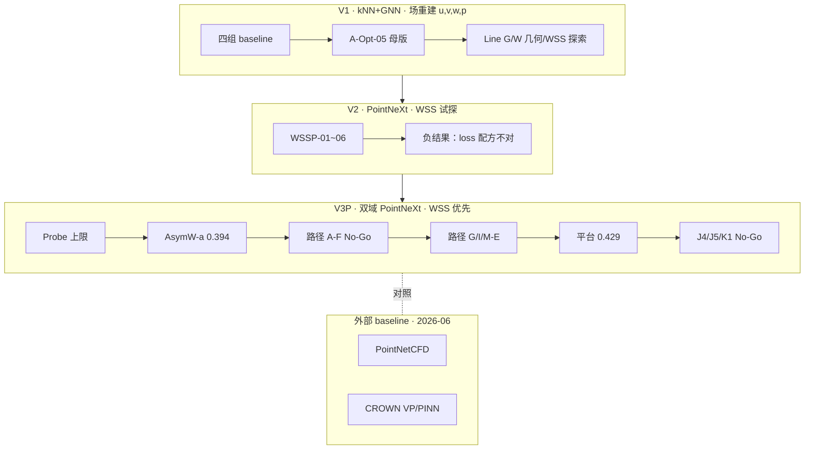

# 任务 A 实验全历程梳理（导师汇报版）

> **日期**：2026-07-04  
> **用途**：用**一份文档**看清从项目启动到当前的**时间发展、路线演化、关键结果与判读**；做组会/PPT 时优先读本文，细节再按需跳转索引。  
> **数据截止**：推进记录 / 实验跟踪日志 / `实验记录表.xlsx`（160 行，与 `experiment_index.csv` 169 条 field run 零缺口）  
> **关联**：[任务A文档总入口](../01-任务/任务A/README.md) · [V3 README](../01-任务/任务A/03-V3路线/README.md) · [WSS 前沿方向 v2](../01-任务/任务A/03-V3路线/00-当前主线/WSS精度突破的前沿方向与见解_2026-07-04.md)

---

## 0. 三句话版（开场可直接念）

1. **问题**：在 AG 私有脉动 CFD 数据上，用深度学习重建**壁面 WSS**与**压力场**；工程目标 WSS R² ≈ **0.85**，当前主指标 test **`wss_r2_wss`（best_wss 口径）**。
2. **历程**：V1 证明 **geometry+BC 必要** → V2 证明 **WSS loss 配方关键** → **V3P PointNeXt 双域 + AsymW** 把压力做到 **R² ~0.93–0.96**，但 **WSS 在 ~0.43 平台期封顶**；同期复现 **CROWN / PointNetCFD**，验证简单点云 baseline **不能替代**主路线。
3. **判断**：不是「调参不够」，而是 **表示 + 信息 + 数据** 三重瓶颈；30+ 条子方向大多 **No-Go** 已封口；下一步需 **换范式**（可微 WSS 物理层、长程注意力、预训练/主动学习等，见 §11）。

---

## 1. 指标与口径（汇报必讲，防混表）

| 项 | 说明 |
| --- | --- |
| **主指标（V3P）** | test `wss_r2_wss`，优先 **best_wss** checkpoint 口径 |
| **副指标** | test `r2_p`（压力）；病例级 Pa p95 Spearman（G5 叙事） |
| **数据** | AG 域 · post-denylist · **81 活跃例**（57 train / 8 val / 16 test） |
| **V3P split** | `split_AG_v1`（AG-only） |
| **V3D split** | `split_data_new_v3`（三域 AAA+AG+ILO）→ **禁止与 V3P 同表** |
| **外部 baseline** | CROWN / PointNetCFD → **独立分表**；输入仅 xyz vs V3P 几何+BC |
| **M-N vs M-E** | **M-N**：论文/方法叙事（压力可用、病例排序）；**M-E**：工程替代 CFD（WSS 逐点精度，**未达标**） |

**模型一句话**：V3P = `FieldPointNeXt` + kNN 局部池化 + **双域采样**（壁面 13000 + 近壁 2000）+ **direct WSS head** + 非对称 WSS 损失（AsymW-a）。

---

## 2. 总时间线（一图看清演化）

```text
2026-03 ── V1 启动：四组 baseline + A-Opt 优化阶梯
    │         结论：geometry 是主增益；A-Opt-05 定为母版；场重建 r2_p ~0.92+
    │
2026-04 ── V2 修正路线：PointNeXt + WSSP 系列
    │         结论：WSS 多任务全线 No-Go → 必须「直接监督 WSS + 控 loss 权重」
    │
2026-05 ── V3P 立项：Diag → 单/双目标 Probe → Main/PW → AsymW-a 母版（0.394±0.005）
    │         路径 A/B（表示、近壁几何）No-Go
    │         路径 F（loss 发散探针）多数 No-Go
    │
2026-06 ── 路径 G（G1/G2/G3/G4/E-J/G5）+ 路径 I（I6-diag）+ M-E 探针
    │         平台带宽 I6-diag 0.429；I6-a 最高 0.446
    │         外部 baseline：PointNetCFD 四组 + CROWN 非 PINN/PINN 结案
    │
2026-07 ── 平台期收口：J4/J5 数据扩池 No-Go；K1 branch GPU No-Go
              G5 叙事定稿；后平台期 → 换范式（前沿方向 v2）
```



---

## 3. 阶段一：V1 路线（2026-03 ~ 04）

**路线名**：`Route-KNN-GNN-V1`  
**目标**：u, v, w, p **场重建**（尚未以 WSS 为主指标）  
**split**：`split_AG_v1`

### 3.1 做了什么

| 批次 | 内容 | 规模 |
| --- | --- | --- |
| **第一批 baseline** | MLP / GraphSAGE / Transformer / Transformer+geometry | 4 组 × 3 seed |
| **第二批消融** | A-Abl-02 几何分量（NormRadius 最关键） | 4 组 × 3 seed |
| **第三批优化** | A-Opt-01 ~ 07：速度权重、Pre-Norm、warmup、加宽加深 | 多组 × 3 seed |
| **Line G** | 分叉拓扑 G01、曲率/扭率 G02–G05 | G01 三 seed；G02/G03 结案 |
| **Line W** | Transformer + WSS 多任务权重扫描 | 与 V2 问题同源 |
| **PINN 阶梯（06 月）** | continuity / no-slip / 全量 PINN | 5540 ep21 崩溃；5537/5538 OOM |

### 3.2 关键结果

| 锚点 | 主指标 | 结论 |
| --- | --- | --- |
| A-Base-01 MLP | RMSE_\|v\| ≈ 1.60 | 无图结构下限 |
| A-Base-02 GraphSAGE | RMSE_\|v\| ≈ 1.36 | **图结构必要** |
| A-Base-03 Transformer | ≈ GraphSAGE | **换 backbone 不够** |
| **A-Main-01 / A-Opt-05** | r2_p ≈ **0.92+**；interior 速度优 | **geometry 是主增益**；**A-Opt-05 定为战略母版** |
| A-Opt-07 内部点加权 | 相对 05 **负结果** | 母版仍为 A-Opt-05 |
| A-Abl-02 去 NormRadius | interior RMSE **+0.227** | NormRadius 最关键几何分量 |

### 3.3 阶段结论（为何进入 V2/V3）

> **场重建精度（尤其压力）≠ WSS 梯度质量。** V1 把 u,v,w,p 做到可用，但 WSS 仍弱 → 后续路线改为 **PointNeXt + 直接监督 WSS**。

---

## 4. 阶段二：V2 路线（2026-04）

**路线名**：`Route-PhysicsAware-V2`（PointCloud 修正）  
**目标**：验证 PointNeXt 上 **p + WSS** 能否成立

### 4.1 关键实验

| Exp ID | 配方要点 | test wss_r2_wss | test r2_p | 判读 |
| --- | --- | ---: | ---: | --- |
| V2P-Main-01 | +geometry | — | vel R²≈0.61 | geometry 在点云上有效 |
| V2P-WSSP-01 | 纯 p+WSS，λ_wss=1 | 弱 | ~0.9+ | 配方基线 |
| V2P-WSSP-02 | 全场 + WSS，λ_wss=**0.5** | **−0.018** | **0.004** | **崩溃**：WSS loss 劫持梯度 |
| V2P-WSSP-03/04 | 降 WSS 权重 / 调 target_weights | ≈0 或负 | ≈0 | 未改善 |
| V2P-WSSP-05/06 | MSE vs Huber WSS | **−0.02 ~ −0.03** | 方差大 | 三 seed 仍 No-Go |

### 4.2 阶段结论

1. PointNeXt **架构可行**，但 V2 的 **loss 权重与早停策略**不对。  
2. 需要：**wall-rich 采样 + 纯 P+WSS 或受控 AsymW + 以 WSS 为主指标**。→ 催生 **V3P**。

---

## 5. 阶段三：V3P 主线（2026-05 ~ 07）— 当前核心

**路线名**：`Route-DualDomain-PointNeXt-V3` · **V3P**  
**split**：`split_AG_v1`  
**实验规模**：索引中 **~90+** 条 V3P/V3D field run；推进记录 **9500+** 行；跟踪日志持续更新。

### 5.1 立项与探针（2026-05 上旬）

| 阶段 | 实验 | wss_r2_wss | r2_p | 判读 |
| --- | --- | ---: | ---: | --- |
| Diag-00 | 尺度/loss 诊断 | — | — | 校准 λ、关 rotation |
| Probe-WSS-01 | **仅 WSS** | **0.397** | — | WSS 可学上限 |
| Probe-P-01 | **仅 p** | — | **0.962** | 压力单目标很高 |
| Probe-PWSS-01 | p+WSS | 0.366 | 0.929 | 可共存 |
| Probe-VWSS-01 | 速度+WSS | **0.343** | vel↓ | **负结果**：速度监督有害 |
| Main-01-PW | 几何 PointNeXt P+WSS | ~0.365 | ~0.936 | V3 核心主线 |
| **AsymW-a 4957/4999/5000** | 非对称 WSS 权重 | **0.394±0.005** | ~0.93–0.96 | **升 PW 母版** |

**探针结论**：主线 = **几何 + P+WSS + AsymW**；**不含速度监督**。

### 5.2 路径 A / B — 表示与近壁几何（2026-05 中下旬 · 已封口）

| 路径 | 代表实验 | best_wss wss | 判读 |
| --- | --- | ---: | --- |
| **A** local / magnitude / MagCons | Probe-Local, MagOnly, MagCons-a/b | 0.38–0.41 | **No-Go** |
| **B** 近壁几何 | GeomB1, VelGradB1, MultiK1 | 0.37–0.40 | **No-Go**；VelGrad **强 No-Go** |

### 5.3 路径 F — 发散 loss / 结构探针（2026-05 底 ~ 06 上旬 · 基本封口）

| 实验 | wss | 判读 |
| --- | ---: | --- |
| F-42 Rank1 | 0.378 | No-Go |
| F-30a VelSup / 30b VelConsist / 33 Slope | 0.32–0.38 | No-Go |
| F-PC-PGrad | 0.395 | No-Go |
| **F-PC-PGradFeat**（3 seed） | **0.399±0.010** | 未升母版；病例 p95 Spearman 有信号 |
| F-30c vel_diff / v2 | 异常 / 中断 | **禁止** tang_normal 全量长训 |
| F-PCv2-BLContext | 0.399 | 弱 No-Go |

**F0 oracle（5265 CPU）**：GT 近壁差分、\|∇p\| 与 WSS **有相关性** → 推动路径 G / M-E，但 **接进网络多不迁移**。

### 5.4 路径 G — 下一代架构（2026-06 · 已封口）

| 子路径 | 关键 Job / 实验 | wss（best_wss） | 判读 |
| --- | --- | ---: | --- |
| G0/S0 | oracle + QA 5409 | — | 标签 QA 通过 |
| **G1** VNHeadPlain 5441 / G54a 5425 | 向量归一化 head | 0.427 | **No-Go** |
| **G2-b** PGradKernelAttn 5410/5437/5438 | 壁面 ∇p attention | 0.392–0.420 | **No-Go** |
| **G3** SSL Pretrain + Finetune 5474/5475 | 点云自监督 | **0.435–0.440** | G 线最高，仍 **No-Go** |
| **G4-a/b** 2D 换轨 5539/5542 | STL 参数域 | gap 大 | **No-Go** |
| **G4-c** Phase1 5870/5871 | 单 case patch | GUO **0.633** / CHEN **0.406** | patch 可拟合 ≠ merged 可用 |
| **G5 eval** 5459/5460 | 区域 surrogate | Pa p95 Spearman **0.559** | **M-N 主叙事信号** |
| post5463 基线 band | 5466/5468/5478 | **0.409–0.437** | 新 graphs 带宽 ~**0.425±0.012** |

### 5.5 路径 I + M-E — 诊断与工程化精度（2026-06）

| 实验 | wss | r2_p | 判读 |
| --- | ---: | ---: | --- |
| **I6-diag**（200ep 诊断） | **0.429** | 0.930 | **平台期带宽参考** |
| **I6-a**（两阶段冻结 5810） | **0.446** | 0.941 | **M-E 短训 Go**（+0.017）；未扩 seed |
| I2-PC Intrinsic 5741 | 0.417 | 0.932 | local frame 4D **No-Go** |
| M-E WSS-only 5811 | 0.411 | **−0.41** | 去压力无帮助 |
| M-E PWeak 5812 | 0.411 | 0.946 | **No-Go** |
| M-E E-J PGradBridge 5854 | 0.401 | 0.935 | GT oracle 强但 **网络 No-Go** |

**I6-diag 意义**：同等 AsymW-a 配方下，长训动力学诊断给出 **0.429 band** — 后续所有 probe 对照 **I6-diag**，Go 线常用 **≥0.459（+0.03）**。

### 5.6 平台期：数据扩池 + 后平台期探针（2026-06 底 ~ 07 初）

| 实验 | 做了什么 | wss | Δ vs I6-diag | 判读 |
| --- | --- | ---: | ---: | --- |
| **J4** V3D-lite +1 ZHAO（5872） | train +1 病例 | 0.423 | **−0.006** | **No-Go** |
| Phase1 v3 | AG split 外仅 1 例 QA 通过 | — | — | **AG 扩池封顶** |
| **J5** +6 AAA ActiveData（5881–5883） | 主动选数 Batch-1 | **0.433** | **+0.004** | **弱 No-Go**（Go 0.459 未过） |
| Phase1 v5 | +12 外域 QA 通过 | explained 0.437 | — | 数据门禁过；**不开 J6 GPU** |
| **K1 CPU** branch error | 病例 holdout | explained **68.3%** | — | **Go** |
| **K1 GPU** BranchFeat（5886） | branch_id + dist_to_bifurcation | **0.400** | **−0.029** | **No-Go** |
| K3 mode-scale / K5 temporal | CPU 探针 | — | — | **No-Go** |

**平台期结论（2026-07-04）**：

- **点级 WSS** 在 **0.42–0.45** 带内封顶（I6-diag **0.429**；历史最高单点 I6-a **0.446**）。
- **数据侧**：盲目扩池 / +6 AAA / V3D-lite +1 **均无法破 band**。
- **结构侧**：K1 CPU 有信号但 GPU 短训 **未过线** → 手工 branch 特征 alone 不够。
- **V3D 三域**：5275/5331 等 **No-Go** → **不** full V3D 长训。

---

## 6. 阶段四：外部 Baseline（2026-06）

> 规范：**与 V3P 分表** · 指标口径不同不得混排排名  
> 详报：[CROWN 合并汇报](../../external_baselines/crown_beihang/experiments/CROWN_非PINN与PINN复现汇报_合并.md) · [PointNetCFD 梳理](../paper_reproduction/papers/pointnetcfd/梳理记录.md)

### 6.1 PointNetCFD（Job 5610–5613 · split_AG_v1 seed1）

| 实验族 | 输入 | test RMSE | p R² | 结论 |
| --- | --- | ---: | ---: | --- |
| original_vp | x,y,z+t+BC | 0.848 | 0.897 | 速度 **不可用** |
| wall_vp | +is_wall | 0.739 | 0.891 | wall 改善速度 |
| **geom_vp** | +几何+wall | **0.690** | **0.903** | **VP 四组最优** · 可作论文 sanity baseline |
| geom_pwss | 同 geom · 直预测 WSS | 0.752 | WSS≈0 | **No-Go** · 不能替 V3P WSS |

### 6.2 CROWN/Beihang（Liao 2025 · paper-original · volume 体素 0.05mm）

| 分支 | Job | 压力 NMAE | p R²（体点云） | 结论 |
| --- | ---: | ---: | ---: | --- |
| 非 PINN | 5751→**5774** | **16.0%**（≈原文消融 15.16%） | **−2.07** | 实现复现 ✅ · AG **不可用** ❌ |
| PINN | 5757→**5806** | **13.2%**（↓18%） | **−0.63** | 方向对但未达原文 6.63% |
| **V3P I6-diag 对照** | — | — | **0.930** / wss **0.429** | 同 split 下主路线压力/WSS 远优 |

**CROWN 工程时间线**：5626 作废（旧路径）→ 5739 OOM → **5751 lazy 训练** → 5774 paper_full evaluate → 5757 PINN → 5806 evaluate → **结案 No-Go**。

**可视化对照**：1146 帧 GUO/ZHANG/CHEN · V3P vs CROWN 三联图 → `outputs/field/postview/V3P_vs_CROWN_*`

---

## 7. 关键指标总表（汇报粘贴用）

### 7.1 路线演进锚点

| 阶段 | 代表锚点 | WSS R²（best_wss） | 压力 r2_p | 状态 |
| --- | --- | ---: | ---: | --- |
| V1 | A-Opt-05（场重建） | WSS 非主指标 | ~0.92+ | ✅ 历史母版 |
| V2 | WSSP-05 三 seed | −0.02 ~ −0.03 | 方差大 | ❌ No-Go |
| V3P | **AsymW-a 4957**（3 seed） | **0.394±0.005** | ~0.93–0.96 | ✅ **PW 母版** |
| V3P | **I6-diag** | **0.429** | 0.930 | ✅ 平台带宽 |
| V3P | **I6-a** | **0.446** | 0.941 | ⚠️ 单点 Go |
| V3P | G58 SSL-Finetune | 0.435–0.440 | ~0.92 | ❌ G3 No-Go |
| V3P | J5 ActiveData | 0.433 | 0.951 | ❌ 弱 No-Go |
| V3P | K1 BranchFeat | 0.400 | ~0.92 | ❌ No-Go |
| 外部 | CROWN PINN | 无 WSS | NMAE 13.2% / p R² −0.63 | ❌ 结案 |
| 外部 | PointNetCFD geom_vp | 无 WSS | p R² 0.903 | ⚠️ VP baseline |

### 7.2 V3P 平台期探针一览

| exp_id | wss | r2_p | Δ vs I6-diag | 判读 |
| --- | ---: | ---: | ---: | --- |
| I6-diag-AsymW-a-post5463 | **0.429** | 0.930 | — | 参考 band |
| I6-a-AsymW-a-post5463 | **0.446** | 0.941 | +0.017 | 短训 Go |
| G58-SSL-Finetune s1/s2 | 0.440 / 0.435 | ~0.92 | +0.006~+0.011 | No-Go |
| J5-ActiveData | 0.433 | 0.951 | +0.004 | 弱 No-Go |
| J4-V3Dlite | 0.423 | ~0.94 | −0.006 | No-Go |
| K1-BranchFeat | 0.400 | ~0.92 | −0.029 | No-Go |
| M-E E-J | 0.401 | 0.935 | −0.028 | No-Go |
| M-E WSS-only | 0.411 | −0.41 | −0.018 | No-Go |

### 7.3 已封口方向清单（勿再写成「下一步还要试」）

AsymW/lr/dropout 微调 · WSS-only/PWeak · local/magnitude WSS · GeomB1/VelGrad/MultiK · vel_diff/tang_normal 长训 · 纯 SSL 点云预训练 · G4-c 全量 · G57 kernel attn · 盲目 V3D 混训 · AG 图内 naive 扩池 · 手工 branch concat（K1 GPU 已证不足）

---

## 8. 瓶颈判断：我们学到了什么

实验反复印证 **三条硬约束**（详见 [前沿方向 v2 §1](../01-任务/任务A/03-V3路线/00-当前主线/WSS精度突破的前沿方向与见解_2026-07-04.md)）：

1. **压力可学、横向 WSS 不可学**：`r2_p≈0.93` 但 `wss_x/y` 长期 ≈0 → 决定横向剪切的信息 **未进入表示**。
2. **GT-oracle 高 ≠ 网络可用**：E-J、POD、G4 patch 多次出现 oracle 强、GPU 崩 → 必须证明 **推理期可得中间量** 有信号。
3. **patch 内可拟合、merged 3D 不稳**：G4-c GUO 0.633 vs CHEN 0.406 → **长程一致性**缺失。

**三重瓶颈归纳**：

| 瓶颈 | 表现 | 代表 No-Go |
| --- | --- | --- |
| **表示** | 直接回归 WSS，未显式近壁微分算子 | VelGrad、vel_diff |
| **信息** | 局部 kNN 缺长程/分支/上游 | CHEN/fast、G57、K1 GPU |
| **数据** | ~60–179 高保真 case 不足 | J4/J5 扩池、G3 SSL |

---

## 9. M-N 与 M-E：两套叙事（汇报必须分开）

| 维度 | M-N（论文 / 方法） | M-E（工程 / 临床替代 CFD） |
| --- | --- | --- |
| **能否对外说「可用」** | 压力 surrogate、病例级排序 | **不能** — WSS 逐点未达标 |
| **核心数字** | r2_p **0.93**；Pa p95 Spearman **0.559** | wss **0.43** vs 目标 **0.85**（差 **~0.42**） |
| **主叙事** | G5 区域 surrogate + 诚实报告平台 | 需 **换范式**，非继续 AsymW 微调 |
| **文档** | [G5_主叙事与平台期结论](../01-任务/任务A/03-V3路线/01-执行与待办/平台期-G5与主动选数/G5_主叙事与平台期结论.md) | [工程化精度方案](../01-任务/任务A/03-V3路线/01-执行与待办/V3P_工程化精度优化方案_2026-06-25.md) |

**M-N 可对外段落（≤150 字）**：

> 在 AG 双域 PointNeXt + AsymW 架构下，点级 WSS R² 稳定在 0.42–0.45，压力 R² 约 0.93。路径 A–G 与 M-E 结构探针表明：瓶颈主要在表示与长程信息，而非单一 loss 权重。模型在病例级压力峰值排序（Pa p95 Spearman 0.559）上仍具 surrogate 价值，但尚不能替代 CFD 提供逐点 WSS 工程精度。

---

## 10. 当前状态与下一步（2026-07-04）

### 10.1 当前状态

| 项 | 状态 |
| --- | --- |
| V3P 平台期 | **G5 叙事收口 ✅** · band **0.429** 不变 |
| V3D | **不** full 长训 |
| 数据扩池 J5/J6 | J5 弱 No-Go · **J6 封口** |
| K1-lite 5886 | **完训 No-Go**（0.400） |
| 实验入账 | xlsx **160 行** · index **169 run** · 零缺口 |
| PINN V1 阶梯 | 代码已修 · **待集群重验证** |

### 10.2 下一步（规划层 · 未跑实验）

按 ROI 排序（详 [前沿方向 v2 §8](../01-任务/任务A/03-V3路线/00-当前主线/WSS精度突破的前沿方向与见解_2026-07-04.md)）：

| 优先级 | 方向 | 动作 | 成本 |
| --- | --- | --- | --- |
| **P0** | 可微 WSS head | GT 近壁剖面基 oracle → 换 head 短训 | CPU → 低 GPU |
| **P0** | UQ 校准 | ensemble/生成方差 vs error → 主动选数 | CPU/轻 GPU |
| **P1** | Transolver processor | 局部 pooling → physics-attention | 中 GPU |
| **P2** | GINO baseline / 合成多保真预训练 | 换模型族 / 数据工程 | 中高 |
| **P3** | 条件扩散补 hotspot | 确定性 + 生成残差 | 高 |

**纪律**：每条 GPU 线先过 **Gate-0 oracle**；除 pooled wss 外必须报 **横向分量 / hotspot / L3 子集**。

---

## 11. 建议汇报结构（15–20 分钟）

| 顺序 | 页主题 | 要点 |
| ---: | --- | --- |
| 1 | 标题 | 任务 A · AG WSS 场重建 |
| 2 | 问题与指标 | WSS / 压力 / split / M-N vs M-E |
| 3 | 时间线 | §2 一图 |
| 4 | V1→V2→V3 为何这样走 | 场重建 → WSS 配方 → 双域 AsymW |
| 5 | V3P 架构简图 | PointNeXt 双域 + AsymW |
| 6 | 母版与探针 | AsymW 0.394 · Probe 负结果 |
| 7 | 系统性探索地图 | 路径 A–G 一表 · 「已穷尽」 |
| 8 | 平台期关键数 | §7.2 表 |
| 9 | 外部 baseline | CROWN + PointNetCFD · 分表 |
| 10 | 瓶颈三重 | §8 |
| 11 | M-N 叙事 vs M-E 差距 | §9 |
| 12 | 下一步换范式 | §10.2 |
| 13 | 总结三句话 | §0 |
| 备份 | 实验规模 / 可视化路径 | 169 run · postview 1146 |

---

## 12. 深度阅读索引（本文不够时再打开）

| 需求 | 文档 |
| --- | --- |
| V3 当前状态一句 | [03-V3路线/README.md](../01-任务/任务A/03-V3路线/README.md) |
| 每次实验 Job/指标 | [V3_实验执行跟踪日志.md](../01-任务/任务A/03-V3路线/01-执行与待办/V3_实验执行跟踪日志.md)（读顶部） |
| V1/V2/V3 状态表 | [任务A实验状态表.md](../01-任务/任务A/03-共享执行与状态/任务A实验状态表.md) |
| 结构化指标 Excel | [实验记录表.xlsx](../00-规范与记录/实验记录表.xlsx) |
| run 级 CSV | `outputs/field/experiment_index.csv` |
| 推进总账 | [代码修改与实验推进记录.md](../02-推进与变更/代码修改与实验推进记录.md)（读文首） |
| G5 叙事全文 | [G5_主叙事与平台期结论.md](../01-任务/任务A/03-V3路线/01-执行与待办/平台期-G5与主动选数/G5_主叙事与平台期结论.md) |
| 后平台期门禁 | [V3P_后平台期结构与训练优化路线_2026-07-01.md](../01-任务/任务A/03-V3路线/01-执行与待办/V3P_后平台期结构与训练优化路线_2026-07-01.md) |
| 前沿/下一步 | [WSS精度突破的前沿方向与见解_2026-07-04.md](../01-任务/任务A/03-V3路线/00-当前主线/WSS精度突破的前沿方向与见解_2026-07-04.md) |
| CROWN 详报 | [CROWN_非PINN与PINN复现汇报_合并.md](../../external_baselines/crown_beihang/experiments/CROWN_非PINN与PINN复现汇报_合并.md) |
| PointNetCFD | [梳理记录.md](../paper_reproduction/papers/pointnetcfd/梳理记录.md) |
| 早期 V1 baseline 汇报 | [任务A基线成果与创新点汇报思路.md](任务A基线成果与创新点汇报思路.md) |

---

## 13. 预期 Q&A（备用）

**Q：为什么不用 PINN 做主路线？**  
A：V1 PINN 阶梯 ep21 崩溃/OOM；CROWN PINN 在 AG 上 p R² 仍负。物理约束有价值，但当前 **BC/几何未进网络** 的 paper-original 路线已证不可用；V3P 走 data-driven + AsymW 更匹配数据。

**Q：0.43 的 WSS 能发论文吗？**  
A：**M-N 可以**：诚实报告平台 + 病例级 surrogate（G5）+ 系统性 negative results + 外部 baseline 对照。**M-E 不行**：距 0.85 工程目标差太远。

**Q：加数据为什么无效？**  
A：J5 +6 AAA 仅 +0.004；Phase1 表明 **盲目扩池 ≠ 主动选数**；瓶颈不完全是样本数，而是 **表示与标签/info 上限**。

**Q：和 CROWN 比怎么样？**  
A：同 split 下 V3P 压力 R² **0.93** vs CROWN **深负**；CROWN 仅 xyz+max-pool，**无 BC/几何**；NMAE 粗可比但 **不能混表 R²**。

---

*本文档由 2026-07-04 实验梳理任务生成；指标以 `summary.json` / 推进记录为准。若与新 run 冲突，以 [V3 实验跟踪日志](../01-任务/任务A/03-V3路线/01-执行与待办/V3_实验执行跟踪日志.md) 顶部为准。*
