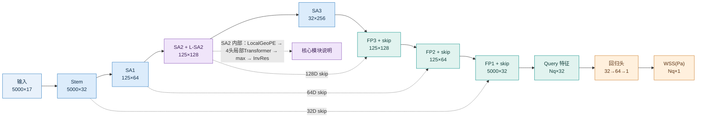
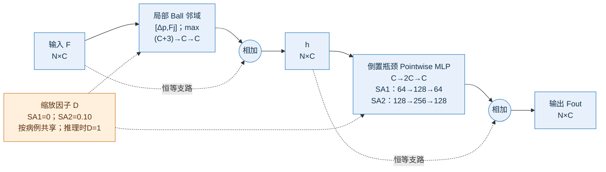

# V5·R4 模型结构：Mermaid 精简版

突出主路径通道变化：`17 → 32 → 64 → 128 → 256 → 128 → 64 → 32 → 64 → 1`。

## 01_整体网络结构.mmd



## 02_SA与Transformer展开.mmd

```mermaid
flowchart LR
    A["SA2 邻域输入<br/>每中心 K≤16 个 token×128"] --> B["LocalGeoPE<br/>[Δp/r, 距离/r, Δa]：7D<br/>MLP 7→128→128"]
    A --> C["特征边 MLP<br/>67→128→128"]
    B --> X(("相加")); C --> X
    X --> T["Pre-LN + 4头 MHA<br/>4×32D；邻域内注意力"] --> R1(("残差"))
    X -. "恒等支路" .-> R1
    R1 --> F["Pre-LN + FFN<br/>128→256→128；GELU"] --> R2(("残差"))
    R1 -. "恒等支路" .-> R2
    R2 --> P["Masked max pooling<br/>每中心输出128D"] --> V["SA2 输出<br/>125×128"]
    V --> N["PointNeXt-R InvRes<br/>局部聚合 + 128→256→128<br/>DropPath=0.10"]
    classDef a fill:#E8F1FB,stroke:#2878BD,color:#12304A;
    classDef g fill:#E1F3EF,stroke:#0B8F88,color:#123F3B;
    classDef t fill:#F0E5FA,stroke:#8650B5,color:#3C2055;
    class A,C,a; class B,g; class X,T,R1,F,R2,P,V,N t;
```

## 03_PointNeXt残差块展开.mmd



输入特征与逐层通道表见 [Excel](V5_R4_输入特征与通道表.xlsx)。
