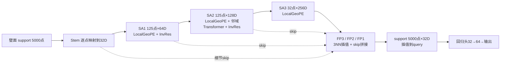
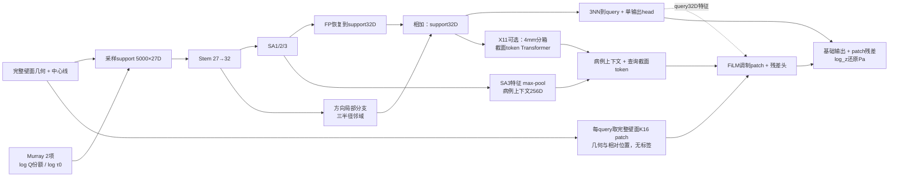
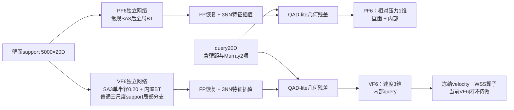

# WSS 启发式汇报提纲 v2（2026-09-13）

> **09-15 图件与播放更新**：已完成 [Nature 风格优化版：22 页 PPT/PDF 与 4 页网络模块](启发式Nature风格优化_20260915/README.md)，X11 单独成页，补齐配对增益与取舍、全部病例分布、三目标病例矩阵和 10 项 raw loss。最新播放顺序及待补材料见该包 README；下文 P1–P18 保留为原 v2 论证详解，其页码不等于新 PPT 页码。已有 [9 例后处理包](启发式v2_代表病例后处理_20260914/README.md) 已补齐壁面 Gaussian、体内点云与 selfmax 字段；新空间图固定使用 **Best / Median / Worst**，不把 Median 改称 Most。

> **09-14 按老师手绘框架补充**：三条路线统一采用 **模型/模块 → 训练过程与整体指标 → 病例 R² 分布 → 代表病例云图 → 问题与验证**。已从现有评估 JSON 生成 [12 组横向 R² 散点＋直方图](启发式v2_R2分布_20260914/README.md)，并提供[补充 PPT](启发式v2_R2分布_20260914/启发式v2_病例R2分布补充_20260914.pptx)和[代表病例 CSV](启发式v2_R2分布_20260914/representative_cases.csv)。该分布批次保存 Best/Most/Worst 选例；后来交付的 9 例后处理与 09-15 空间图使用 Best/Median/Worst，两者须区分。

> 本次补强：在原 v2 主线中新增 P4–P6 三页“网络怎么做预测”，原 P4–P15 顺延为 P7–P18；详图与证据分开讲。结构依据实际配置和 `encode_support/decode_query`，不是把 R4 结构图改名为 X5。只更新汇报材料，文中的候选实验不表示已执行。

> 取代同目录 `启发式汇报提纲_2026-09-13.md`（v1 保留作对照）。v2 按老师 09-13 口头意见重排：**先给"三条路线放一起"的一页总览，再每条路线只回答"什么有用、为什么有用、什么没被捕捉到、哪一步可能设错"**，最后是问题清单和请老师裁定的事项。所有数字来自 `training_wss_min/experiments/wss_local_wave{1,1b,2,3}_*/results.json` 与 `v5_velocity_to_wss_20260909/metrics.json`，旧 PDF《实验进展》里的表格一律进附录。

## 0. 老师意见 → 这版提纲的对应改动

| 老师原话（09-13） | v1 提纲的问题 | v2 的做法 |
|---|---|---|
| 看完知道试了几个大方向、统一了哪些条件 | 路线图在第 2 页、条件在第 3 页，但没有"一眼"的总表 | 第 1 页就是一张 3 行总表：路线 × 最好三 seed 结果 × **WSS 是直接预测还是由 v 算** × 状态 × 主要缺口 |
| 什么模块有用、为什么有用 | 消融按"容量→邻域→注意力"分组，只有 Δ 没有机制 | P4 讲主干；P5 讲 X5/X5X11 接入位置；P6 讲 PF6/VF6 解码差别；P7–P8 再用配对实验检验模块作用 |
| 只放了一个方向最好的一个可视图；差的呢；平均只有 0.65 是什么没捕捉到 | 只展示一张云图无法说明整体分布 | 每个模型/目标先放病例 R² 横向散点＋直方图，再从分布选 Best/Most/Worst；三目标共用病例另留在 P17，不替代各目标选例 |
| 09-14 手绘：每个方向都有 Models、Performance、Visualization | 三路线材料深浅不同，Most 与中位混用 | 三路线共用展示顺序；Most 固定为最高频 R² 区间代表，选例规则见 §1.1；已补 12 组真实分布图 |
| 速度 0.75 为什么 WSS 不好；是不是整体对、近壁小特征没捕捉 | 第 10 页只有 oracle/pred 三个数 | P12加旧R5V轴向/二次流分解与VF6高速区结果；VF6分量/近壁壳层和二次流矢量图仍待做 |
| 另两个方向究竟是本来不好，还是某步设置不对 | 第 13 页只写"历史机制证据" | P14分版本列出data-only与物理臂；P16给设置问题和下一步。历史data-only拟合较弱，V5尚无同底座PINN对照，不能据此否定物理约束 |
| 把每一个 loss term 画出来 | 第 14 页有要求，但没指向现成图 | 11 张独立 loss 图 09-13 已生成（`V4汇报/V4_稳态梯度与损失_2026-09-12/individual_losses/`），直接用 |
| 不是罗列结果，是用结果证明想法 | 每页结论仍偏"指标陈述" | 每页遵循“现象→图→机制假设→区分验证”；结构页按连线讲信息流，结果页按配对证据讲收益，不强制挤成四栏 |

## 1. 先锁定的比较合同（放第 2 页，只此一张表）

| 项目 | 统一写法 |
|---|---|
| 数据 | V5 正式母库 172 例（pc-v3）；train138 / test34；峰值帧 step 1162 |
| 三条路线 | A 壁面点云 → 直接 WSS；B 壁面点云 → 体场 u,v,w / p（数据驱动）→ 冻结 WSS 算子；C 体场 + BC/PDE 物理约束 → WSS |
| 输入 | 当前 A/B 的 support 都是 5000 壁面点；A 的 query 是壁面，PF6 的 query 是壁面+内部，VF6 的 query 是内部。X5/X5X11 27D，PF6/VF6 20D；只使用部署可得几何和先验。历史 C 含 RCR 等不同输入，不套用当前合同；未来 C 输入待单独冻结。 |
| 评价 | 主报 `R²_cb`（病例等权场指标）；同时给病例 R² 算术均值 / 中位 / P10 / 负 R² 例数和 NMAE 定义。分布图统一物理量 R²；`R²_cb` 不等于病例 R² 算术均值。 |
| 选模 | 各 run 自己冻结的 best（训练损失）；不按 test 挑 checkpoint |
| 噪声带 | 单 seed 参考抖动约 ±0.034 Pa-R² / ±0.009 归一化，只作探索性尺度；模块作用优先看同 seed 配对、三 seed 方向是否一致，不把带宽当显著性检验。 |
| 不可比项（灰） | V2/V3/V4 PINN 使用历史数据/协议；V3 有验证选模，不能统称“无验证”。各版本的 cb 聚合定义也须核对；R5V→WSS 审计保留旧半径映射问题。这些用于机制诊断，不与 V5 排冠军。 |
| 证据边界 | test34 参与过开发筛选，不是独立泛化集 |

### 1.1 分布和选例固定口径（09-14 新增）

1. 横轴是逐病例预测 R²，越右越好：`1−Σ(Pred−CFD)²/Σ(CFD−该病例 CFD 均值)²`，不是拟合直线 R² 或相关系数平方；负值保留。
2. X5/X5X11/PF6/VF6 固定 seed 1234/7/2025，一个点是一例三个 R² 的算术均值，横须为 seed 间样本 SD（ddof=1），不是置信区间或集成预测。旧 R5 单 seed 34 例，V4 单 seed 35 例，分别标识。
3. Best/Worst 取该模型、该目标的最高/最低病例。Most 采用 0 锚定、宽 0.10 的直方图最高频区间；并列时取最接近中位数的箱，再取箱内最接近中心的实际病例。Most 与中位病例分开，0.05/0.20 敏感性保存在 `summary.json`。
4. 云图若只画 s1234，必须标 s1234 病例 R²，并注明“按三 seed 均值选例”；不能把三 seed 均值或五 seed 集成总分贴到单 seed 云图。`representative_cases.csv` 是本次 36 条角色选例记录。
5. 每例同时保留 MAE/NMAE 及分母；小真值方差会放大 R² 敏感性，不能只凭负 R² 判断物理错误。

### 1.2 按老师框架的播放顺序

| 顺序 | 模型/模块 | Performance：训练与整体指标 | 病例分布 | Visualization 与待回答问题 |
|---|---|---|---|---|
| A 直接 WSS | P5：X5/X5X11 信息通路 | P7–P8：配对增益、训练曲线、NMAE/R² | X5、X5X11 各一张分布图 | Best/Most/Worst 云图 → 截面内与热点误差 |
| B 数据驱动体场 | P6：PF6/VF6 两套网络 | P11：压力/速度训练曲线与整体指标 | PF6、VF6 各一张；旧 R5 链单列 | 各目标选例 → 近壁、二次流 → 速度派生 WSS |
| C 加物理约束 | P3 历史联合网络；P6 虚线框为未来设计 | P14–P15：同底座与各 loss term | V4 速度、压力、WSS 三张 | 三目标 Best/Most/Worst → 设置问题与验证 |

制作时按路线连讲；补充包的 12 张分布图是素材库，正文可拆页。训练曲线横轴为 epoch，标 split、目标、raw/weighted 与 checkpoint，不能把最终 test 指标连成“训练曲线”。

## 2. 正文：18 页（约 25 分钟；20 分钟时合并 P4/P5，P15 独立 loss 放附录）

### P1 一页总览：三条路线放在一起（老师要的那张表）

| 路线 | 最好模型（三 seed） | 主指标 R²_cb | WSS 来源 | 状态 | 主要缺口 |
|---|---|---|---|---|---|
| A 直接 WSS | X5 = C1 + Murray 分支流量先验 | **WSS 0.717 ± 0.004**（Pa）；X5+X11 0.726；三 seed 集成 0.733，五 seed 部署集成 0.7354 | 直接预测 | 波 4 已完成，X5A 未取代 X5；本次分布固定原三个 seed | 截面内局部型态占残差 69%；高值区 R² 0.42、p99 比 0.69 |
| B 体场数据驱动 | PF6 / VF6 = P02 / V07 + 同一先验 | **压力 0.789 ± 0.005；速度 \|u\| 0.796 ± 0.004** | PF6 是独立压力模型，VF6 是独立三分量速度模型；WSS 由速度经冻结算子计算，**VF6 三 seed → WSS 0.547 ± 0.003（VELWSS2，2026-09-16 补齐）**，旧底座 R5V 0.491；CFD 速度进同一算子 0.965 | 三 seed 底座已定；VF6 → WSS 闭环已做（训练跟踪 §27） | 旧 R5V 径向 0.23、周向 0.00；VF6 分量分解待做，其高速区 R² 为 0.29–0.32 |
| C 体场 + 物理约束 | 历史 V4（旧数据、旧协议） | 速度 −0.1 ～ −0.5；WSS ≈ 0 | 未来应是联合可微的 u,v,w,p 模型再接 WSS 算子；当前没有 V5 PINN 结果 | V5 上尚无任何 PINN run | 物理项只在 data-only 已失败的底座上测过；6 个设置问题已定位（P16） |

页脚一句话：A/B 的当前底座都加入同一类部署可得分支流量份额先验，收益同向（WSS +0.069 / 压力 +0.045 / 速度 +0.027，三 seed 配对同号）；这支持“流量分配信息重要”，不等于已经证明三条路线共享同一网络或同一误差机制。

### P2 统一条件与不可比项

上表 §1 原样放，灰底标不可比项。用一句话解释旧表为什么看着乱：同一个代号在不同数据版本、不同 split、不同 seed 下出现过多次。

### P3 三条路线的误差链（一张图）

三行流程，每个箭头标"模型直接输出什么 / 哪一步是后处理 / 哪一步放大误差"：

- A：壁面 support/query + 中心线特征 → 单输出 log_z → 逆归一化得到 WSS（不从速度求导）。
- B：壁面 support + 内部 query → VF6 三分量速度 → 冻结梯度/流变/校准流程 → WSS；旁列 PF6 独立压力输出，不把压力画成该 WSS 算子的直接输入。近壁采样、求导及流变会传递误差，是否放大须具体测量。
- C：历史联合 u,v,w,p 模型，训练时加 no-slip / inlet / continuity / momentum；未来迁入 V5 要先冻结联合输出和可微接口，不是把现有 VF6 直接加一项 loss 就完成 PINN。

右侧标本轮代表 run：X5 / X5X11、PF6 / VF6、V4-SP-PN-BC-PDE-{F,EMA}。

### P4 网络基础：从 PointNet 到 PointNeXt-R，究竟增加了什么能力

**本页问题**：网络从哪里获得“局部形状”和“整条血管”的信息？先用功能说明结构，再在 P7 看消融证据。

上排三块：PointNet（逐点 MLP + 全局池化）→ PointNet++（SA 分层邻域聚合 + FP 恢复）→ 当前残差扩展（InvRes + LocalGeoPE + SA2 局部 Transformer）。这是结构演变示意，不把三代不同数据结果串成同条件增益。

下排画可复用的 R4 主干；X5/体场的输入宽度与新增分支在 P5/P6 展开：

| 模块 | 接在哪里 / 输入输出 | 设计用途（不等于已证实收益） | 用什么证据检验 |
|---|---|---|---|
| Stem | 每点 D→32；xyz 同时供搜索用 | 把几何通道转换成可学习特征 | 基础部件，不单独宣称提升多少 |
| SA 邻域聚合 | 5000→125→125→32 点；64/128/256 通道 | 汇集邻居形状；SA2 提升通道但不减少点数 | 同协议 PN/PN++、邻域消融 |
| LocalGeoPE | 每级边特征：相对位置/距离 + 弧长、半径、曲率差 | 给邻居关系补充显式几何差异；零初始化加性修正 | 需独立开关对照；不可拿“17D特征增益”当它的净贡献 |
| PointNeXt-R / InvRes | SA1/SA2 聚合后，局部更新 + C→2C→C 残差 | 保留原特征并学习增量 | 结构消融；DropPath 是正则设置，不是物理模块 |
| SA2 Local Transformer | 邻域 token MLP+GeoPE 后、max 前；4头 | 在同一个中心的邻域内交换信息 | 与无该模块的同配置对照；不等于 SA3 全局 BT |
| FP + skip + query 插值 | 恢复125→125→5000点，再到 query | 结合粗层上下文和细层特征 | SAME/independent query 区别；插值不能保证恢复丢失热点 |

**讲稿一句**：“主干负责多尺度几何编码，局部注意力负责邻居交互；下一页要看，为什么仍然需要一条保留完整壁面细节的通路。”

### P5 A 路线结构：X5 / X5X11 在主干之外增加哪三条信息通路

**本页问题**：方向邻域、完整壁面 patch、Murray 和截面 token 分别接在哪里？

输入宽度固定写 **27D = R4 17D + 壁面微分几何 8D + Murray 2D**；训练 5000 support 与5000独立 query，评估全壁面 query。F6 是输入特征，X11 是网络模块，两者分开标色。

图示注：query 原始27D特征也进入 patch 分支；截面 token 从 FP+局部分支后的 support32D 和原输入按 `(segment_id, s_local/4mm)` 聚合生成。X5 关闭 token 通路，但保留方向分支和 FiLM；X5X11 在此基础上开启 token。

| 模块 | 实际接入与尺度 | 作用假设 | 当前证据与边界 |
|---|---|---|---|
| 三尺度方向局部分支 | Stem特征在support分辨率聚合；r=0.015/0.03/0.06，FP完成后相加 | 区分局部轴向/周向邻域，保留细节 | E2/C1探索支持；半径是归一化坐标，不能直接写毫米 |
| 完整壁面 K16 patch | 从完整壁面找邻居，含query自身；不局限于5000 support | 缓解随机采样和粗层插值的细节缺失 | E3/C1探索支持；不是读真值WSS，实际 frame=atlas、pool=mean |
| FiLM 调制与输出残差 | query32D + 粗层256D上下文调制patch特征；残差加到预测值 | 让同样局部几何在不同血管上下文中有不同响应 | 与patch作为组合被检验；缺独立FiLM消融时不单独报净增益 |
| Murray F6 | 2D输入加入support/query/patch；不是PDE loss | 提供分支流量尺度与剪切尺度先验 | X5−X0三seed Δ≈+0.069；机制需结合拆分和病例证据 |
| 截面 token X11 | 4mm箱、每段最多64箱、2层4头Transformer；投影256D后加到粗层上下文 | 利用沿程分段信息指导局部修正 | X5X11−X5 Δ≈+0.009；高值R²/p99改善，但MAE和IoU略差，属于取舍 |

**讲稿一句**：“X5同时看到粗层血管上下文和完整壁面局部patch；X11只增强patch的上下文，并未换掉主干或增加一个WSS输出头。”

### P6 B/C 路线结构：壁面编码器如何回答体内 query，物理约束加在哪里

**本页问题**：体场如何得到内部位置的信息；为什么现有 PF6/VF6 不能画成一个联合PINN？

图中 PF6/VF6 的箭头分别表示两套独立权重，不能合并为四输出head。**20D = R4 17D + 壁距1D + Murray2D**；训练压力query约壁面/内部各半，速度query全内部。

| 机制 | PF6 | VF6 | 该怎样解释 |
|---|---|---|---|
| 共同主干 | LocalGeoPE + SA2局部Transformer + FP | 同类主干 | 局部attention与全局BT是不同层次 |
| 全局上下文 | 常规SA3后1层8头BT | SA3单半径0.20路径中的BT | VF6顶层不是三半径；三半径在下方support局部分支 |
| support局部分支 | 关闭 | 已开启普通ball邻域，r=0.015/0.03/0.06 | VF6不是X5的方向分支；仍只有壁面邻域，不是体内query邻域 |
| QAD-lite | 开启、1维残差 | 开启、3维残差 | query输入−插值support输入(20D) + Δxyz(3D) +距离(1D)→MLP24→32→32；由query32D门控后加到输出 |
| 完整壁面patch / FiLM / X11 | 均关闭 | 均关闭 | 不能把X5的全分辨率patch直接画到体场模型里 |

QAD-lite 利用 query 自身的几何差异做零初始化残差修正，使内部点不只接受壁面特征插值；它不保证二次流或近壁导数准确。**作用是设计意图，净收益仍要看独立消融。**

本页右下角另画虚线框 **“C：尚待设计”**：联合可微 `u,v,w,p` 网络 → 数据监督；`∂u/∂x、∂p/∂x、时间导数/二阶导数` → 连续性/动量；边界query → no-slip/inlet。所有loss回传同一个联合网络。物理损失是训练支路，不能放在预测之后当作后处理修正器。

**讲稿一句**：“VF6已经有壁面局部分支和query几何修正；真正还没充分验证的是体内细节与导数，而不是简单地再加一个局部模块。”

### P7 A 路线：结构改动对应哪些收益，哪些还不能归因

画“演进路线 + 独立配对增益”两部分：历史演进用断开的节点，数据切换处留空隙；同协议对照用连接点/配对Δ图。三seed展示3个点，不把多次运行均值画成一个代表模型。模块编号与P4/P5一致；不把跨代分数相减当单模块贡献，也不把Δ/噪声带当显著性。

| 级 | 改动 | R²_cb | Δ | 机制一句话 | 证据强度 |
|---|---|---|---|---|---|
| 0 | R1 旧数据 → V5 数据（真实 mm、atlas 坐标、标签重跑） | 0.35 → 0.46 | 历史变化约+0.11 | 数据链整体改善，不能拆成某一层的净收益 | 数据/评估合同切换，保留共同病例审计 |
| 1 | + V5 十维几何（ρ/θ、dR/ds、到分叉/端点距离、PCA 法向） | 0.556（三 seed）/ 0.572（s1234，R4） | +0.10 | 消融里去 PCA 法向掉最多（−0.07）：法向编码壁面空间朝向，不代表真实流向 | 三 seed |
| 2 | + 多尺度局部分支 + 壁面微分几何（A5/M2） | 0.62–0.63 | +0.05 | 残差集中在 2–10 mm，需要一条与主干并行的局部通路；只调 SA1 半径不行（A1b +0.006） | 单seed探索；0.05/0.034≈1.47，不能写5倍带 |
| 3 | + 方向邻域 + 完整壁面 patch/FiLM（C1） | C1配置四次运行均值约0.65 | 本批E0→C1约+0.055 | 方向邻域 + 完整壁面patch共同改善 | C1 s1234=0.6575；同期E0=0.6023，历史M2不作同期父臂 |
| 4 | + Murray 分支流量先验（X5） | **0.717** | **+0.069（三 seed 配对，sd 0.031）** | 见 P8 | 三 seed，最强 |
| 5 | + 截面 token（X5X11） | 0.726 | 同seed约+0.009 | high-WSS 0.42→0.48、p99比0.69→0.73；MAE1.723→1.743 Pa、IoU0.515→0.500 | 三seed R²同向但存在指标取舍 |
| — | 全局Bottleneck Transformer | 归一化增益约+0.005–0.009 | 分别按相应多seed父臂配对 | 长程上下文可能有用，不能替代局部细节 | 多seed小正效应；显著性另查原始统计 |
| — | NLL输出及回变换 | 0.558→0.599（历史诊断） | 改用exp(μ+σ²/2)的输出变化 | 对数域回变换可能造成幅值偏差；属于统计输出选择 | 需核查分布假设，不当作新增网络层收益 |

页脚：单seed小幅变化写“尚未证实稳定收益”，放附录；三seed同号也不自动意味着统计显著。NLL回变换是输出/统计选择，Murray是输入先验，BT是网络模块，不能都画成“新增网络层”。

### P8 A 路线：Murray 先验为什么有用，以及波 4 为什么没有替代它

四个证据并排：

1. **修的是逐支尺度**：分支均值残差的跨支 sd 0.143 → 0.096（log_z）；校准斜率 0.70 → 0.80；high-WSS R² 0.22 → 0.42；只给 log Q 份额（X5q）≈ 全 X5，只给 log τ0 少 0.017 → 模型缺的是"这一支分到多少流量"这一个数。
2. **分流估错的病例就是最差病例**：逐例 R² 与该例 Murray 分流误差相关 **−0.74**（AG −0.55 / AAA −0.75 / ILO −0.92）；分支均值残差与 log(真实分流 / Murray 分流) 相关 +0.64。
3. **几何能估得更准**：对峰值帧 log(Q外/Q内)，Murray R³ 只有 test R² 0.63，切口盖面半径² 0.81，出口面积 0.85；分流误差 sd 0.47 → 0.23。
4. **同一个输入在压力/速度上同样有效**（三 seed 配对 +0.045 / +0.027），且 F6 变体（指数 2.33、虚拟盖半径、残差目标）都不更好。

**波 4 已闭环**：X5A 相对同 seed X5 的五组物理 R² 差为 −0.015/−0.006/−0.019/−0.010/+0.007，均值 −0.009；归一化 R² 五对均为正，但物理指标未改善，X5 仍为底座。X5 五 seed 集成为 0.7354，X5A 五 seed 为 0.7255。分流估计更准不等于最终 WSS 更准，需继续检查队列差异、射流病例和极值恢复。

### P9 A 路线：先看 R² 分布，再看 Best / Most / Worst

先放 [X5 横向散点＋直方图](启发式v2_R2分布_20260914/A_X5_distribution.png)：34 例，病例 R² 均值 0.7339、中位 0.7504、P10=0.6045，负 R² 为 0；最高频区间 [0.70,0.80) 有 13/34 例。X5X11 的对应图为 [A_X5X11_distribution.png](启发式v2_R2分布_20260914/A_X5X11_distribution.png)：P10 提高到 0.6369，但最差值从 0.5177 降至 0.4666，不能说所有差例都改善。

Best / Most / Worst 云图应对应散点图的绿/橙/红三个点；Most 是最高频区间代表，不是中位病例。每例使用 CFD / Pred / signed error（Pred−CFD）三联图，同视角、同色标和 Pa 单位，并叠加 top10% 热点。

三行 × 三列（CFD / Pred / signed error = Pred − CFD），共用视角、单位（Pa）、色标（0 到该例 CFD p99），另加 top10% 热点叠加：

| 角色 | 病例 | X5 三 seed R² | 备注 |
|---|---|---|---|
| 综合排名靠前 | AG/fast/ZHANG_LIANG | 0.893 ± 0.009 | PF6/VF6也靠前，不是每个目标单独的绝对第一（P17） |
| 中位 | AAA/ruputer/YU_TIAN_HAI | 0.747 ± 0.013 | 三目标综合排名居中 |
| 综合排名靠后 | AAA/unruputer/SUN_SHU_MING | 0.527 ± 0.017 | 多目标共同难例；低流速大瘤腔（真值 \|u\| p99 0.71 m/s、压差极差 633 Pa） |
| WSS更差/射流对照 | ILO/ZHANG_JIN_CHUN-1/before | 0.518 ± 0.020 | X5分数低于上一例，不能标X5“次差”；高射流（\|u\| p99 2.04 m/s、压差 5403 Pa） |

右侧放34例逐病例R²条形（按队列上色，三seed病例均值的P10=0.605、中位0.750）。图注说明0.717是三seed的病例等权场R²均值，不等于34个病例R²的算术平均；共同病例按WSS/压力/速度三目标综合排名选，PINN不在该排名内。

图旁三选一标注每例失分类型：**幅值**（分支整体高/低估）、**热点位置**（top10 IoU 低）、**局部结构**（分叉嵴 / 端区 / 狭窄射流条纹）。旧 R4 包里 SUN_ZHI_YU 的失分就是第三类（射流条纹被抹平、p99 位置错 0.22 倍包围盒）。

### P10 A 路线：剩余误差在哪、还没学到什么

- 残差方差分解（X5 集成，4 mm 截面）：**截面均值31%、截面内69%；另报分支均值8%**（分支项与前两项不是三组互斥份额，不能三者相加）（C1 时 37 / 63 / 11）→ 剩余残差更集中在截面内；沿程部分仍占31%，不能说已全部解决。
- 真值十分位平均残差：最低十分位 +0.24、最高 −0.15（log_z）→ 逐例内向均值收缩：低值高估、高值低估；p99 比 0.69、top10 幅值比 0.70。
- 逐例 oracle 仿射只还有 +0.02，全局仿射无效 → 校准头不是杠杆。
- 三 seed 集成免费 +0.02，但压极值（p99 比 0.69 → 0.67）。

要验证：(1) 截面内型态图——在 P9 的最差例取 3 个截面，画周向 WSS 剖面 CFD vs Pred；(2) 热点级联 / 尾部目标是否能抬 p99 而不伤整体；(3) 分流输入换成盖面面积后，截面内份额是否进一步变化。请老师判断：先补尾部/局部还是先做跨 seed 部署形态（集成 3–5 个）。

### P11 B 路线：压力 / 速度的整体结果

PF6、VF6 各一组：R²_cb 三 seed、逐病例分布（中位 / P10 / 负 R² 例）、分域 AG / AAA / ILO、高值区 R²。并列同 seed 对照 P02 / V07。说明：压力逐例 R² 对小压差病例病态（KANG_YONG 真值 sd 78 Pa），改看 MAE；速度只报 |u| 与向量 RMSE。

| | R²_cb（三 seed） | 逐例中位 / P10 | 高值区 R² | AG / AAA / ILO |
|---|---|---|---|---|
| PF6 压力 | 0.789 ± 0.005 | 0.850 / 0.601 | 0.55–0.61 | 0.86–0.88 / 0.86–0.87 / 0.68–0.72 |
| VF6 速度 | 0.796 ± 0.004 | 0.804 / 0.639 | 0.29–0.32（V07 0.17） | 0.83 / 0.77–0.79 / 0.71–0.73 |

### P12 B 路线：速度学到了什么、没学到什么（回答"整体对、局部没捕捉"）

已有证据（R5V 单 seed，VF6 待复算）：

| 分量（局部血流坐标） | R²_cb | 真值 sd (m/s) | 结论 |
|---|---|---|---|
| 轴向（主流） | **0.740** | 0.342 | 学到了 |
| 径向（二次流） | 0.233 | 0.070 | 拟合较弱 |
| 周向（二次流） | **0.002** | 0.102（轴向的 30%） | 此口径下接近均值预测，不能称完全没有信息 |
| 幅值 \|u\|（汇报口径） | 0.748 | | 整体受轴向主流影响较大，R²不可直接作贡献分解 |

再加高速区（top10% 真值）R²：R5V 0.03 → VF6 0.29–0.32；p99 比 0.80 → 0.86–0.89：射流峰值仍欠估。

要补的两张图（都不用重新训练）：

1. **近壁壳层 R²**：把 VF6 保存的 test34 预测按 `dist_to_wall_mm` 分 0–0.5 / 0.5–1 / 1–2 / 2–4 / >4 mm 五层，各层报轴向速度 R² 与向量 RMSE——直接回答"是不是近壁层掉的"。
2. **截面二次流矢量图**（ParaView）：最好 / 最差例各取瘤颈、髂分叉下游、髂支三个截面，底色轴向速度、箭头面内速度，CFD 与 Pred 并排。

机制假设（联系P6）：VF6已用5000壁面support、20D几何query、QAD-lite和普通三尺度support局部分支；这些仍不等于直接编码体内速度邻域。先诊断近壁误差及二次流，再考虑：(a)近壁采样/损失；(b)在既有分支上单独检验方向邻域或体内query局部编码；(c)联合速度/压力/WSS辅助头。不能把已有分支重新列为新模块，也不能将旧R5V分量缺陷直接归因于VF6。

### P13 B 路线：速度 → WSS 的误差链

| 输入速度 | WSS R²_cb（Pa） | high-WSS R² | top10 IoU | p99 比 |
|---|---|---|---|---|
| CFD 真值速度 → 冻结算子 | 0.965 | 0.94 | 0.82 | 1.01 |
| R5V 预测速度 → 冻结算子（带校准） | **0.491** | −0.02 | 0.31 | 0.53 |
| R5V 预测速度 → 未校准物理核 | 0.468 | −0.11 | 0.31 | 0.46 |
| VF6 预测速度 → 冻结算子（带校准，三 seed 均值；VELWSS2 2026-09-16） | **0.547 ± 0.003** | 0.17 | 0.36 | 0.69 |
| VF6 预测速度 → 未校准物理核（三 seed 均值） | 0.539 | 0.07 | 0.36 | 0.59 |
| 直接预测（后续X5，三seed参考） | 0.717 | 0.42 | 0.51 | 0.69 |

逐病例：R5V派生WSS与速度R²相关（Spearman约0.78）；即使速度R²约0.87–0.89，派生WSS仍约0.65–0.75。相同流程换CFD真值速度后明显改善，支持优先检查预测速度和算子接口；不能推出“算子本身没问题”或“全由近壁误差造成”。旧半径映射尺度问题仍在，冻结校准器用过train138 WSS监督；梯度/采样/黏度/校准分布的贡献尚未拆分。

已补（2026-09-16，VELWSS2，训练跟踪 §27）：VF6 三 seed 在同一冻结流程下重做三列，0.547 ± 0.003（+0.056 于 R5V，−0.170 于 X5 直接）。"映射修复"另列版本已做但结论反转：旧半径映射的 38.6 mm 残差是旧 bundle 半径本身错尺度与最近邻错位的相互抵消，按 1000/unit_factor 精确对应反而 −0.003，直接用 V5 bundle 半径 +0.002；三种半径来源都在 ±0.003 内，半径不是瓶颈。速度 R² 与派生 WSS R² 逐例 Spearman 0.48，误差仍在预测速度的近壁梯度。

### P14 C 路线：物理约束到底测在了什么底座上（先回答"本来不好还是设错"）

各历史版本分面展示data-only与物理臂的配对结果，旁列V5现状；注明各自数据/选模/聚合定义，不画跨版本同指标连续阶梯：

| 代 | data-only 速度 R² | 加物理后 | 数据 / 协议 |
|---|---|---|---|
| V2（2026-08） | 0.21（E7） | 0.24（E8） | 旧数据、SAME5K、7500 epoch |
| V3 | 0.23（E4） | 0.23 / 0.18（BC / BC+PDE） | 旧数据、2500 epoch、有验证 |
| V4 | **−0.10**（DATA） | −0.28 / −0.42 / −0.51 | 旧数据、10000 epoch 无验证 |
| V5 数据驱动 | **0.748（R5V）→ 0.796（VF6）** | 未做 | 新数据、400 epoch |

结论一句：三代 PINN 的对照臂本身都没拟合上数据（R² ≤ 0.24），物理项的作用是在一个已经失败的底座上测的，**"加物理变差"不能推出"物理无用"**。V5 上到目前没有任何一条 PINN run。

### P15 C 路线：loss terms 与梯度诊断（老师要求的核心页）

直接用已生成的图（历史 V4 稳态 8 臂，图注写"历史 V4、旧数据"）：

- `fig2_training_losses_steady`：上排共同数据误差，下排各自训练目标。数字：数据损失 DATA 0.192 → +BC 0.489 → +PDE 固定 0.723 → +PDE EMA 0.830（PointNet；PN++ 同趋势）。
- `individual_losses/01–11`：u/v/w/p、no-slip、inlet、continuity、momentum x/y/z 及 group，每张 raw / weighted 两排。关闭的项不画成 0。
- `fig1_gradient_conflict_steady`：cos(∇L_data, ∇L_no-slip) 末 500 轮中位 −0.876 / −0.968 / −0.969（BC / PDE-F / PDE-EMA），99–100% 的诊断步为负；momentum −0.22 / −0.29；continuity ≈ 0。
- `fig3_physics_dynamics_steady`：EMA λ 在第24轮到9.99，99.76% 的轮次贴上限 10；PDE 残差降到固定权重的 6%，同时数据误差再升。

每张图旁只写一句"这说明什么 / 不说明什么"：冲突说明当前网络 + 采样 + 损失配置同时满足不了两者，不说明 CFD 与无滑移物理矛盾；EMA 未进入工作区，所以老师的方法没被检验。

### P16 C 路线：已定位的 6 个设置问题（每条：证据 / 影响 / 修法 / 成本）

| # | 问题 | 证据 | 影响 | 修法 | 成本 |
|---|---|---|---|---|---|
| 1 | 无验证集训满 10000 轮 | DATA 臂 epoch 1000 时 E=0.80 全矩阵最好，之后单调退化到 1.12 | 所有臂在过拟合区比较 | 400 轮 + best 规则（V5 已是） | 0 |
| 2 | 旧数据几何尺度错 | 单位因子逐例 0.81–1.09 而非 1.000；曲率 18% 点 \|κ\|>1 | 无量纲 PDE 的 Re、黏性项逐例错尺度 | V5 真实 mm（已修） | 0 |
| 3 | λ 量程设错 + 护栏 bug | 目标比值 600–8e4，λ_max=10；撞限比例代码最多只能算到 0.02 | EMA ≡ λ=10 固定臂 | 放开上限或改残差尺度；Gate：lambda_bound_fraction < 20% | 小 |
| 4 | no-slip 与数据梯度反向 | cos −0.9～−0.97 | 幅值整体压缩（wall RMS 0.36→0.13、方差比 0.39→0.04） | 硬约束 u = d_wall·g，或近壁标签一致性核查 | 中 |
| 5 | 准稳态方程与峰值标签不一致 | 标签 ρ∂u/∂t ≈ 1.1–1.6 kPa/m，与压力梯度同量级，残差却当零 | PDE 靠压平压力、压小速度廉价满足（p R² 0.44→0.11） | 残差加 ∂u/∂t（用相邻帧），或换瞬态目标 | 中 |
| 6 | 瞬态 RCR 强形式在标签上不成立 | 四出口归一化残差 RMS 0.79–0.85，只有 2/169 例 <0.3；周期均值关系成立（0.983） | 瞬态 BC 臂在逼近标签不满足的关系 | 只用周期均值 / 弱形式 | 中 |

提议的最小配对实验（讨论方案；不由本次文档修改触发训练）：

0. **零训练前置**：用支持离散CFD场的重构/差分方法核查方程残差、坐标单位和时间项，再以解析场检查训练用导数算子。离散CFD数组不能直接交给网络自动微分函数。先判断离散误差与算子误差，不能只看一个残差RMS。
1. **结构前置**：VF6仅输出三分量速度；动量PDE还需要可微压力场。拟采用联合u,p结构时，先建立相同结构的data-only对照，确认压力/速度数据拟合；不能把独立PF6/VF6高分直接继承为联合模型成绩。
2. 联合data-only → 同结构+no-slip → 同结构+no-slip+PDE（固定权重与有效量程控制器分别检验）。每臂同seed配对，记录P15诊断；导数方法须覆盖query几何依赖，不能默认点云邻域查询后的自动微分就是完整物理导数。
3. 同结构改用硬约束 u=d_wall·g 作为另一候选；保持监督/采样/训练预算可比，单独比较近壁速度与WSS，检查壁距函数及其导数。

候选判据：同协议速度R²与向量误差、近壁误差、派生WSS、边界/PDE残差同时看。λ撞限率只检验控制器是否工作；硬约束还需核查壁距可微性、单位以及梯度/WSS恢复，不承诺仅换约束即可改善。

### P17 横向：哪些病例是三个目标共同的难例

WSS/速度/压力三个目标的逐病例 R²（三seed均值）相关：X5 vs VF6 Spearman **0.89**，X5 vs PF6 0.71，PF6 vs VF6 0.76。共同最好：ZHANG_LIANG、LOU_YANG、LI_ZHEN_HUA、LIU_KANG_WEN、GUO_XI_JIANG；共同最差：SUN_SHU_MING、ZHANG_JIN_CHUN-1、WANG_MAN_TIAN。

画一张 34例×3目标的排名热图（不含PINN），右侧标每例的 Murray 分流误差。我认为的原因：难例的共同点是**分流 / 流态处在几何解释不了的两端**（大瘤腔低流速 vs 狭窄高射流），这正是 P8 的分流误差和 P12 的射流欠估。请老师看：这两类是否需要不同的处理（低流速例改看 MAE、射流例补局部）。

另一句提醒：旧汇报里的"最差例" KANG_YONG（R5P 压力 R² −1.67）在 X5X11 上是前 5 好（0.852），小真值标准差约78 Pa会放大R²对误差的敏感性，但原预测也有幅值偏差，不能仅归因于分母。**单 seed 单目标挑出来的最差例不稳定**，所以本次用三目标综合排名选共用代表病例，各目标最差另行保留。

### P18 问题与请老师帮助

1. 直接 WSS：截面内局部型态占残差 69%，先补局部 / 尾部（热点级联、周向剖面监督），还是先把部署形态（分流估计器 + 3–5 seed 集成）定下来？
2. 速度 → WSS：近壁壳层 R² 若确认是近壁掉分，优先做近壁加权采样，还是在VF6既有局部分支上改方向邻域/query解码，或加WSS辅助头？二次流（周向 R² 0.00）要不要单独立目标？
3. PINN：是否同意先做P16的离散残差/解析算子核验、联合u,p data-only对照，再作物理项配对，把"λ 控制器在工作（撞限 < 20%）"和"近壁壳层不劣"作为 Gate，而不是拿旧 V4 的低分当路线 No-Go？
4. 数据：分流输入依赖髂动脉切口层面与 CFD 一致；部署点云的切口规范是否要写进采集协议？

## 3. 需要准备的材料

### 3.1 已有、可直接用（不用重做）

| 用在 | 材料 | 位置 |
|---|---|---|
| P1 / P7 / P8 / P10 / P17 数字 | 波 1 / 1b / 2 / 3 结果 + X5 残差分析 | `training_wss_min/experiments/wss_local_wave{1,1b,2,3}_*/results.{md,json}`；`wss_local_wave1b_20260912/x5_residual_analysis.txt` |
| P7 阶梯 | R4 消融、V6 A5、BT、NLL | `WSS_V5_训练实验跟踪.md` §4 / §11.6 / §12.6；工作簿只做索引 |
| P11 | PF6 / VF6 三 seed 表 | `wss_local_wave3_20260913/results.md` |
| P12 分解 | R5V 轴向 / 径向 / 周向 | `experiments/v5_rerun_20260906/velocity_component_breakdown.json` |
| P13 | VELWSS1 三列 + 逐例 CSV + 三张图 | `experiments/v5_velocity_to_wss_20260909/{README.md,per_case_comparison.csv,velocity_wss_*.png}` |
| P14 | V2 / V3 / V4 矩阵 | `WSS_PINN_V1_V2_V3_field-v4实验矩阵与指标汇总_2026-08-06.xlsx`「实验矩阵汇总」 |
| P15 | 梯度冲突 / 损失 / 物理项动态 + 11 张独立 loss 图 | `V4汇报/V4_稳态梯度与损失_2026-09-12/`（fig1–3 与 `individual_losses/`，含合订 PDF） |
| P16 | 六个问题的证据 | `WSS_PINN_V4实验分析与汇报提纲_2026-09-02.md` §3.1–3.7 |
| 旧图参考（只作风格） | R4 最好 / 最差 WSS 包、R5 体场包 | `docs/03-汇报材料/figures/WSS_V5_R4_最好最差病例_postview_20260907/`、`WSS_V5_体场_最好最差与横向R2_20260909/` |

### 3.2 需要你在后处理软件里做的图（ParaView）

统一规则：三个目标使用同一组代表病例 **ZHANG_LIANG（最好）/ YU_TIAN_HAI（中位）/ SUN_SHU_MING（最差）**，可加 ZHANG_JIN_CHUN-1（次差、ILO 射流）。CFD 与 Pred 同几何、同视角、同色标；误差恒为 Pred − CFD 对称色标；正式数字只读 CSV，不在面片上算。

| # | 图 | 病例 | 字段 / 设置 | 数据从哪来 | 用在 |
|---|---|---|---|---|---|
| V1 | WSS 三联（CFD / Pred / 误差）+ top10 热点叠加 | 3（+1）例 | `wss_cfd`、`wss_pred`、`err_wss`；色标 0–该例 CFD p99；蓝白红 | 导出入口 `export_wss_postview.py`；s1234 run为 `runs/wss_local_wave1_20260912/X5_s1234`，seed7/2025在wave1b。实际CLI先检查`--help`与缓存，不将此材料计划视作已执行导出 | P9 |
| V2 | 最差例 3 个截面的周向 WSS 剖面（CFD vs Pred 折线） | SUN_SHU_MING、ZHANG_JIN_CHUN-1 | 在瘤颈 / 分叉下游 / 髂支各切一环，按周向角排序 | 同上 VTP + 中心线；可用 Plot Over Line 或导出 CSV 后 matplotlib | P10 |
| V3 | 压力三联 + 速度幅值三联 | 同 3 例 | 压力：壁面网格 + 内部薄层；速度：3 mm 薄层或 XZ 深度平均；写明"点云 / 薄层，不是连续截面" | `export_v5_volume_postview.py` 目前写死 R5P / R5V 路径，需改成 `runs/wss_local_wave2_20260912/{PF6,VF6}_s1234`（预测已保存在 `eval/ckpt_best/predictions/`） | P11 |
| V4 | **截面二次流矢量图** | ZHANG_LIANG、SUN_SHU_MING | 每例 3 个横截面：底色轴向速度，Glyph 画面内分量（去掉轴向），CFD 与 Pred 并排、同箭头比例 | 同 V3 的速度 VTP（含三分量向量） | P12 |
| V5 | 近壁法向剖面 | 同上两例，各 3 条壁面法线 | 沿法线 0–3 mm 采样切向速度，CFD vs Pred 折线，标出 WSS 算子用的深度 | Plot Over Line；或从 volume.npz + 预测直接算 | P12 / P13 |
| V6 | 物理残差空间图（可选，若 P16 前置做了） | 1 例 | continuity / momentum 残差绝对值上色 | 前置脚本输出 | P16 |

每张图的图注必须有：run、checkpoint、seed、病例、split、step 1162、变量、单位、色标范围。每批图旁保存 manifest（源文件、映射覆盖率、导出脚本、时间）。

### 3.3 需要跑的计算（不用重训，按成本排序）

| # | 任务 | 方式 | 成本 | 用在 |
|---|---|---|---|---|
| C1 | 34 例 × 3 目标逐病例 R² 热图 + 三 seed 阶梯图 + 逐例条形图 | 从 results.json 直接画（本提纲 §3.4 的数字已算出） | 1 小时 | P7 / P9 / P17 |
| C2 | VF6 近壁壳层 R²（五层） | 读 `VF6_s{1234,7,2025}/eval/ckpt_best/predictions/` + volume.npz 的 `dist_to_wall_mm`，仿 `velocity_component_breakdown.py` 写一个 100 行脚本 | 半天，CPU | P12 |
| C3 | VF6 轴向 / 径向 / 周向分解（三 seed） | `velocity_component_breakdown.py` 有 `--run` 参数，但 run 根目录写死在 `runs/v5_rerun_20260906/outputs`，需改指 `runs/wss_local_wave{2,3}_*/VF6_s<seed>` | 1 小时 | P12 |
| C4 | VF6 → WSS 闭环三列 | `export_r5v_for_wss.py` 的 `RUN` 常量写死为 R5V，改指 VF6 checkpoint 后 → `evaluate_velocity_to_wss.py prepare / worker / assemble`（上次 169 分片 Slurm，约 2 小时）；三 seed 各跑一次或只跑 s1234 并注明 | 半天，GPU + Slurm | P13 |
| C5 | CFD真值的离散方程审计 + 训练算子解析场核验 | 先明确离散梯度重构与网络自动微分的区别，再适配历史physics接口；直接读NPZ不能自动得到场导数 | 需先审查接口，成本待定 | P16 |
| C6 | 波 4 结果回填 | 已完成；X5A 未取代 X5，五 seed 集成与配对结果已回填 | 已完成 | P8 |

建议顺序：C1 → C6（等）→ C2 / C3 → V1 / V3 / V4 → C4 → V2 / V5 → C5 / V6。C1–C3 加 V1 / V3 一天可完成，是这次汇报的底线；C4 / C5 若来不及，页面标"待补"，不用旧数字顶替。

### 3.4 逐病例选例依据（三 seed 均值，best checkpoint，test34）

| 病例 | X5 WSS | X5X11 WSS | PF6 压力 | VF6 速度 | 三目标平均排名（0 最差） |
|---|---|---|---|---|---|
| AG/fast/ZHANG_LIANG | 0.893 | 0.878 | 0.944 | 0.917 | 32.0（最好） |
| AG/fast/LOU_YANG | 0.883 | 0.835 | 0.934 | 0.914 | 29.7 |
| AAA/ruputer/LI_ZHEN_HUA | 0.876 | — | 0.962 | 0.916 | 前 5 |
| AAA/ruputer/YU_TIAN_HAI | 0.747 | 0.722 | 0.830 | 0.819 | 16.3（中位） |
| AG/slow/MA_TIAN_YI | — | 0.743 | 0.822 | 0.792 | 14.0（中位备选） |
| AAA/unruputer/WANG_MAN_TIAN | 0.576 | 0.637 | 0.731 | 0.643 | 5.0 |
| ILO/ZHANG_JIN_CHUN-1/before | 0.518 | 0.535 | 0.566 | 0.498 | 1.3 |
| AAA/unruputer/SUN_SHU_MING | 0.527 | 0.467 | 0.376 | 0.481 | 0.0（最差） |

逐例统计：X5 中位 0.750 / P10 0.605；X5X11 0.746 / 0.637；PF6 0.850 / 0.601；VF6 0.804 / 0.639。三线逐例相关：X5–VF6 Spearman 0.89、X5–PF6 0.71、PF6–VF6 0.76；R5V 速度 R² 与其派生 WSS R² 逐例 Spearman 0.78。

### 3.5 新增网络模块图与引用清单（P4–P6）

交付目录：`启发式v2_网络模块_20260913/`。提供三页原生可编辑PPT、PDF和PNG：共用主干、X5/X5X11接入图、PF6/VF6对照图。三页可直接插入汇报；其余P7–P18仍按本提纲准备。原12页参考PPT保留，不把其历史图自动改成最新模型。

| 图/依据 | 用途 | 核查入口 |
|---|---|---|
| 共用主干详图 | P4及结构附录；R4为17D且没有X5新增分支 | `WSS_V5_R4_模型结构_20260909/README.md`、01/02/03 PNG/SVG |
| X5配置 | 27D、方向局部分支、完整壁面patch/FiLM，无section context | `training_wss_min/configs/wss_local_wave1_20260912/X5_s1234.json` |
| X5X11配置 | 在X5上启用4mm section tokens | `training_wss_min/configs/wss_local_wave2_20260912/X5X11_s7.json` |
| PF6/VF6配置 | 20D；BT位置、局部分支与输出目标不同 | `training_wss_min/configs/wss_local_wave3_20260913/{PF6,VF6}_s2025.json` |
| 主干、FP、QAD和残差注入位置 | support局部分支加到FP后特征；QAD/patch加到输出 | `training_wss_min/baseline_models.py` 的 `encode_support` / `decode_query` |
| 完整壁面patch与section token | 16点patch、FiLM调制、support按段/4mm分箱、token查找 | `training_wss_min/dataset.py`、`local_refinement.py` |

统一视觉约定：实线=已启用前向路径；虚线框=可选/拟议模块；⊕=特征或预测残差相加（分别标明）；蓝=主干、绿=局部几何、橙=输入先验、紫=上下文、灰=尚待验证。原生箭头应带箭头端点，不只画线段。

演讲正文只说功能名与证据：例如“完整壁面16点patch补充采样遗漏的信息”，括号再写K16/FiLM。通道宽度、层数与半径留在结构小字或附录，不逐个念超参数。

## 4. 明确移出正文的内容

仿真设置表、数据预处理字段表、PointNet/PointNet++采样与dropout微调全表、V2/V3/V4全矩阵、BT全部臂、M2优化20项、波1全部臂进附录。正文保留“模块功能—配对证据—局限”；跨split/采样/目标或单seed筛选只写探索性结论。历史实验不应因为没进正文而删除。

## 5. 汇报当天的自检（每页过一遍）

- 这页回答了哪一个问题？（写在标题里）
- 图里 CFD 和 Pred 是不是同几何、同色标、同视角？误差是不是 Pred − CFD？
- 数字是三seed还是单seed？是否同seed、同协议配对？R²_cb与病例R²均值是否区分？
- 图中模块的开关、接入位置与当前run一致吗？是输入先验、网络层、loss还是后处理？
- 写的是模块设计用途，还是已经有独立消融支持的净收益？不要把合理机制解释写成已证实因果。
- 结尾那句是"我认为的原因 + 要做的验证"，还是只是又一个数字？
