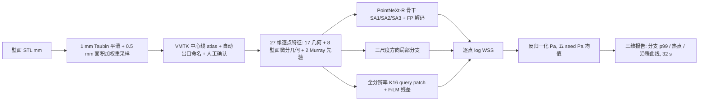

# 导师汇报提纲：最终算法与精度、最差病例、可解释的算法故事（2026-09-21）

> 用途：先出文档，之后由本人转 PPT。每节 = 一页（P0–P16），每页给"一句结论 → 证据表 → 讲稿一句 → 图建议"。老师原话要求：**最后的算法和技术 + 精度整理清楚，把效果最不好的病例拉出来**。
> 数字口径（本文统一）：**主数字 = cv3 患者分组三折折外（136 例，v5.1，Pa R²_cb）0.710**；test34 五 seed 集成 0.775 并列给出并注明"开发期反复用过"；34 例 STL 全链路只作部署证据。所有数字来源：[V5 训练跟踪](../02-推进与变更/00-V5设计与历史跟踪/WSS_V5_训练实验跟踪_历史卷_2026-09-06至09-20.md)（§ 号见附录）、冻结发布包 `outputs/wss_deploy_release/X5D_v51_5seed_20260916/release.json`、本目录取证表 `导师汇报_最差病例取证_2026-09-21/`（脚本 `scripts/worst_cases_x5d_v51.py`，只读，不训练不推理）。
> 队列定义（本人 2026-09-21 口头确认）：**AAA = 破裂队列**（ruputer = 发生破裂 / unruputer = 未破裂）；**AG = 动脉瘤生长队列**（fast = 生长快 / slow = 生长慢）；**ILO = 髂支闭塞队列**（病例名后缀 -1 = 发生髂支闭塞 / -0 = 未发生；before = 事件前影像，待确认）。文档以前没有展开过这三个缩写，论文里必须写成这一句。

---

## P0 一页总览：三句话 + 一张表

**三句话**

1. 最终算法 = **生理锚定的几何学习**：壁面点云 + VMTK 中心线 → 27 维几何/生理特征（含 Poiseuille–Murray 零阶剪切先验）→ PointNeXt-R 骨干 + 三条局部通路 → 峰值 WSS，五 seed Pa 均值集成；629,416 参数/模型，STL 到三维报告中位 32 s。
2. 精度：170 例真实主-髂动脉三队列，**患者分组折外 R²_cb 0.710（三 seed 0.713 ± 0.006），逐例 R² 0.72 ± 0.10，相对 L2 0.39，NMAE_max 2.3%**；test34 五 seed 0.775；STL 全链路逐例 0.80。按文献口径处于真实 AAA 队列这一档的领先/持平位置（最接近的 Rygiel 2025 相对 L2 0.51–0.57）。
3. 最差病例不是随机的：折外 136 例中 R² 低于 0.6 的 15 例落在**三个有生理含义的失效族**——髂动脉小口径射流低估（吃掉六成平方误差）、瘤腔低剪切低方差（R² 塌但绝对误差最小）、整支分流偏移（Murray 先验与个体分流不合）。三族对应三种不同对策，且前两族的最差两例 CFD 侧本身有疑点。

| 口径 | 病例 | R²_cb | 逐例 R² 均值 / 中位 / P10 / 最差 | MAE | 分队列 AG / AAA / ILO |
|---|---:|---:|---|---:|---|
| **cv3 折外（主）** | 136 | **0.710** | 0.720 / 0.737 / 0.600 / 0.310 | 1.50 Pa | 0.756 / 0.742 / **0.624** |
| test34 五 seed（开发暴露） | 34 | 0.775 | 0.791 / 0.801 / 0.680 / 0.622 | 1.36 Pa | 0.818 / 0.739 / 0.747 |
| STL 全链路（同 34 例，部署证据） | 34 | 0.772（pooled） | 0.798 / 0.806 / 0.656 / 0.638 | 0.83 Pa | 0.836 / 0.790 / 0.742 |

**讲稿一句**："模型已冻结，数字有三个口径，我先给最干净的折外 0.71；最差病例能归成三类，每类都能用生理解释，也各有对策。"

---

## P1 背景与故事定位（为高被引准备的框架）

**临床背景（三句，投稿背景段的骨架）**

- 壁面剪切应力（WSS）是腹主动脉瘤全病程的共同力学变量：**低/振荡 WSS** 与瘤壁退变、附壁血栓和**生长**相关；瘤壁局部力学状态与**破裂**相关；髂动脉段**高剪切射流与狭窄流态**与**髂支闭塞**相关。我们的三个队列恰好就是这三个临床终点（生长快/慢、破裂/未破裂、髂支闭塞/未闭塞），这在文献里没有先例——现有真实 AAA 队列最大的是 Rygiel 2025 的 100 + 29 例，且只有一种终点。
- 获得 WSS 的金标准是患者特异 CFD：一例小时级、需要体网格与专家设置，无法进入随访流程。几何 → WSS 的深度 surrogate 是替代方案，但文献里绝大多数在合成/理想化几何上训练，合成到真实的迁移是公认失败模式（NMAE 0.5% → 87%、相对 L2 0.30 → 0.56）。
- **科学问题**：在真实患者解剖上，几何驱动的 WSS surrogate 精度由什么决定（输入信息、模型容量、还是数据量）？能否从影像分割面直接部署？失效边界在哪？

**故事名（建议）**：**生理锚定的几何学习（physiology-anchored geometric learning）**——先给每个壁面点一个"按 Poiseuille 与 Murray 定律它该有多大剪切"的零阶估计，再让网络在多尺度局部几何上学习动脉瘤与髂动脉解剖造成的偏离；三条主线合一：零阶生理先验（P7）、血管解剖分层的多尺度表征（P4–P5）、从分割面直接部署的合同（P11、P15）。

**高被引的四个抓手**（每个都已有证据，见对应页）

| 抓手 | 一句话 | 页 |
|---|---|---|
| 真实队列 + 三临床终点 + 学习曲线 | 170 例真实三队列；数据每翻倍 +0.03、136 例未饱和；文献无真实数据学习曲线 | P2、P11 |
| 精度来源可归因 | 信息 +0.20 / 局部结构 +0.09 / 容量 0 / 集成 +0.02；全局注意力（含老师方案）无收益 | P5、P8 |
| 可部署合同 + 鲁棒性扫描 | 0.5 mm 重采样 + 1 mm 平滑 + 切口 ±5 mm；密度增广把粗采样损失压 2/3；32 s | P11、P15 |
| 失效族有生理解释 | 射流 / 瘤腔 / 分流三族，各占误差份额与对策明确 | P13 |

**候选题目**：Physiology-anchored geometric learning of peak wall shear stress across the abdominal aortic aneurysm disease course: a 170-patient CFD cohort with deployment from segmented surfaces（不用 patient-specific、real-time、digital twin 三个词，理由见 P16）。

**图建议**：一张三栏图——左：三队列解剖示例（AG/AAA/ILO 各一例 CFD 云图）；中：从 STL 到 WSS 的 32 s 链路；右：三条主线示意。

---

## P2 队列与数据

| 项目 | 现状 |
|---|---|
| 病例 | **170 例**真实主-髂动脉（v5.1）：AAA 54、AG 75、ILO 41；train136 / test34；cv3 三折患者分组（AG/AAA/ILO 分层、重复几何同折），留出 46 / 46 / 44 |
| 亚组（折外 136 例） | AAA 破裂 21 / 未破裂 23；AG 快 17 / 慢 43；ILO 闭塞 10 / 未闭塞 22（test34：AG 15、AAA 10、ILO 9） |
| CFD 协议 | Fluent 瞬态，统一入口波形，四出口 RCR；**出口分流规则本身就是 Murray（出口面半径 r³ 分配）**，左右髂总 50/50 为协议常量；峰值帧 step 1162 = 0.21 s（周期 0.8 s） |
| 标签 | 峰值帧壁面 WSS 幅值（Pa），逐点；重尾：test34 真值 p50 1.9 Pa、p99 42 Pa、最大 131 Pa |
| 输入（部署可得） | 壁面 STL（mm）+ VMTK 中心线 atlas；**不需要体网格、网格连通性、CFD 先验、测得流量、RCR** |
| 数据审计（P9 展开） | 23 例 39 个出口 RCR 面积录错 → 26 例重算；剔除 2 例重复病例；8 例出口命名与几何互换按几何重对应；10 例壁面标签重解 |
| 已回收待入库 | 回收名单 A 层 73 例 CFD 就绪（RCR 审计已过），建议冻结为**未触碰确认集**（P16） |

**讲稿一句**："三个队列就是三个临床终点，这是我们和所有合成数据工作的根本区别；数据本身经过一轮取证式清洗。"

**图建议**：队列构成条形图（三队列 × 亚组），旁边一张 CFD 协议示意（入口波形 + 四出口 RCR + Murray 分流公式）。

---

## P3 最终算法一图流

| 环节 | 冻结设定 |
|---|---|
| 模型 | X5D_v51，五 seed（1234/7/2025/11/2026），ckpt_best 按训练损失选，400 epoch，629,416 参数/模型 |
| 骨干 | PointNeXt-R：3 级 SA（5000 → 125 → 125 → 32 点，32/64/128/256 通道），倒残差块 + DropPath 0.1，LocalGeoPE 边特征（Δxyz、Δ弧长、Δ半径、Δ曲率，零初始化），SA2 邻域内 4 头 Transformer，3 级 FP 3-NN 插值 |
| 局部通路 | 方向邻域局部分支（半径 0.015/0.03/0.06 归一化坐标，各 16 邻居，法向作方向）；完整壁面 K16 query patch + 粗层 256 维上下文 FiLM 调制残差 |
| 目标与损失 | ln WSS 的 train136 z 标准化（log_z）；**MSE + 0.2 × pinball(q90)**；单输出头（NLL/Jensen 变体未进底座，见 P6） |
| 增广 | 密度增广：每例每轮以 p = 0.6 换成 70/50/35/25% 体素抽稀视图（法向/曲率在抽稀云上重算） |
| 集成 | 五 seed 各自反归一化到 Pa 后算术平均 |
| 发布包 | `outputs/wss_deploy_release/X5D_v51_5seed_20260916/`（MANIFEST.sha256、config、feature_stats、分流规则） |

**讲稿一句**："整条链只吃分割面和中心线；网络里所有新增的部件都是'局部'的，没有一个是全局的。"

---

## P4 输入 27 维 = 三层生理信息（可解释故事的第一层）

把 27 维按"它在血流生理里对应什么"分三层，比按代码分组更好讲。

| 层 | 通道（维） | 生理含义 | 证据 |
|---|---|---|---|
| **血管级（管道坐标）** | 弧长 s、局部半径 R、ln R、曲率、dR/ds、管道坐标 ρ / sinθ / cosθ、到分叉距离、到端点距离、端区标志、xyz（14） | 弯曲内外侧壁（Dean 二次流使外侧壁剪切偏高）；**dR/ds 为正 = 瘤颈扩张 → 流动分离、低剪切**；到分叉距离 = 分叉嵴高剪切带；端区 = 出口协议影响范围 | 留一：到分叉/端点距离 −0.030（作用在 Pa 尾部）、dR/ds −0.025（中段）、管道坐标 −0.005（可省） |
| **壁面朝向** | 对齐 PCA 法向 nx/ny/nz（3） | 壁面相对主流方向的朝向，决定近壁速度梯度方向 | **留一最大单项 −0.072**；与 Rygiel 2025"法向一列把误差减半"一致 |
| **瘤囊级（壁面微分几何）** | 两尺度主曲率 k1/k2、高斯曲率、curvedness（fine k = 32 ≈ 3 mm；coarse k = 128 ≈ 6 mm）、t·n（8） | 3 mm 尺度 = 壁面褶皱/附壁血栓表面；6 mm 尺度 = 瘤囊鼓包；t·n = 中心线切向与法向夹角，直管为 0、鼓包和分叉处偏离 | A4 +0.032（单 seed，3.5 倍噪声带）；残差集中在 2–10 mm 尺度 |
| **零阶生理先验** | log Q 分支份额（Murray）、log τ0 = log Q − 3 ln R（Poiseuille 尺度）（2） | "这一支分到多少血、按管径它该有多大剪切"；τ ≈ 4μQ/(πr³) | **三 seed 配对 +0.069，唯一 ≥ 0.05 的单项**；压力 +0.045、速度 +0.027 同向 |

**讲稿一句**："27 维不是特征堆砌，是血管、壁面朝向、瘤囊、零阶生理四层；每层都有留一或配对证据，最大的两项是法向和 Murray。"

**图建议**：一张病例的四联云图——ln R、dR/ds、coarse k1、log τ0，与 CFD WSS 并排，肉眼能看到 log τ0 已经画出了 WSS 的大轮廓。

---

## P5 网络：局部表征的四个部件，以及为什么不用全局注意力

**一句结论**：WSS 是近壁梯度量，决定它的是 2–10 mm 的局部壁面形态；所以收益全部来自"局部"部件，容量与感受野类部件（含老师提出的瓶颈 Transformer）在噪声带内。

| 部件 | 接在哪 | 生理/机制解释 | 配对效应（test34 Pa R²_cb） |
|---|---|---|---|
| LocalGeoPE | SA 各级邻域边特征 | 邻居之间用弧长/半径/曲率差描述相对位置，而非只用 Δxyz | 随 S3 引入，未单独拆分 |
| 三尺度方向局部分支（A1 + E2） | Stem 后与 FP 并行相加 | 沿法向区分轴向/周向邻域，保留 2–10 mm 细节 | A1 +0.035（单 seed）|
| 全分辨率 K16 query patch + FiLM（E3） | 每个 query 从完整壁面取 16 邻居，粗层上下文调制 | 补随机采样与粗层插值丢掉的近壁细节；上下文让同一局部形态在不同血管段有不同响应 | C1（E2 + E3）+0.055（单 seed，重跑抖动 ±0.04）|
| SA2 邻域内 Transformer | SA2 max 之前 | 邻域 token 交互 | **0**（R2 vs R3 三 seed）|
| **瓶颈 Transformer（老师方案）** | SA3 最粗层 32 token 全局自注意力 + 17 维几何 token 条件 | 长程上下文 | **归一化 +0.005 ~ +0.009（p ≈ 0.04），物理 +0.016 单臂**；落在预登记上限（+0.009 ~ +0.056）下端 |
| 多半径集合 / MoE 头 / 注意力池化 / 20 臂调参 / 扇区 token / 沿程 32 通道 | 各处 | 容量或更多标量 | 全部在噪声带 ±0.034 内 |

**为什么全局注意力买不到精度（三条证据，如实讲，老师方案是其中最有说服力的一条）**

1. R4 残差只有 6.7–11.6% 位于 20 mm 以上尺度（预登记时量出的上限，实测 BT 吻合）。
2. 残差方差分解：**约 70% 在"分支 × 4 mm 区间"内部**（test34 69.7%、折外 70.1%），沿程均值轨迹已解释到 R² 0.93+，去均值后的区间内型态只有 0.52–0.61。
3. 逐点看，模型缺的是局部型态而非上下文：沿程标量对底座残差的线性解释上限只有 R² 0.005。

**讲稿一句**："老师的瓶颈 Transformer 我们做了，方向为正但在预登记上限内，这反过来证明了残差是局部的；这一页不是否定方案，是定位问题。"

**图建议**：左：网络结构图（现有 `WSS_V5_R4_模型结构_20260909/` + X5 信息流 SVG）；右：残差尺度分解饼图（区间内 70% / 区间均值 30% / 其中分支均值 8%）。

---

## P6 训练与集成配方（哪些是统计选择，不是网络层）

| 选择 | 设定 | 为什么 | 证据 |
|---|---|---|---|
| 目标变换 | ln WSS 后 z 标准化 | WSS 重尾（p99/p50 ≈ 20 倍），对数域让瘤腔 0.3 Pa 与射流 100 Pa 同等可学 | logR/H2 谱系 +0.056（vs 纯 MSE）|
| 损失 | MSE + 0.2 × pinball(q90) | 给高分位一个不对称拉力，减轻高值低估 | 调 q95 / λ0.5 无额外收益 → 尾部差距是形态误差不是损失设置 |
| NLL 头 + 逐点 Jensen 反变换 | **未进底座** | 在 R4 上 0.549 → 0.600（零训练成本），但叠加到 A5 后不再赚（0.603 对 0.623） | §12.6；作为可选口径保留 |
| 病例级幅值头 | 未进底座 | 学出的因子塌成常数 1.033（= exp(σ²/2）），逐例尺度一无所获 | §12.6 |
| 密度增广 | 70/50/35/25% 抽稀，p = 0.6 | 训练库密度按队列差 2.5 倍（AG 1.17 / AAA 0.47 / ILO 0.46 mm），部署点云密度不可控 | 1.2 mm 粗采样损失 −0.147 → −0.047；全密度 +0.003 |
| 集成 | 五 seed Pa 均值 | 单 seed 抖动 ±0.034 | +0.02；但压极值（p99 比略降）|
| 选模 | ckpt_best 按训练损失 | 不用 test 选 checkpoint | 全线一致 |

**讲稿一句**："对数目标 + 分位损失 + 密度增广 + 五 seed，这四项是统计和部署选择，我把它们和网络部件分开讲，免得混成'加了很多层'。"

---

## P7 可解释故事的核心：零阶生理先验 → 学习偏离

**先验怎么算（部署只用中心线半径）**

- 树自上而下：主干份额 1.0；第一级分叉（左右髂总）各 0.5（协议常量）；更深层按 **Murray r³**：份额 = 父份额 × R_distal³ / Σ R_distal³，R_distal = 该段末端 10 mm 内 atlas 半径中位数。
- 逐点 **log τ0 = log Q份额 − 3 ln R_local**（Poiseuille：τ ≈ 4μQ/(πr³)，μ 省略）。log Q 逐段阶梯、log τ0 逐点连续。
- 与标签生成协议对齐：CFD 出口 RCR 的分流规则恰好是按出口面半径 r³ 分配，所以先验是"把协议的规则喂回模型"，不是新物理；这既是收益来源也是审稿风险（P16）。

**四条证据（讲这一页够了）**

| 证据 | 数字 |
|---|---|
| 修的是逐支尺度 | 分支均值残差跨支 sd 0.143 → 0.096（log_z）；校准斜率 0.70 → 0.80；high-WSS R² 0.22 → 0.42；IoU 0.446 → 0.507 |
| 分流估错的病例就是最差病例 | 逐例 R² 与该例 Murray 分流误差相关 **−0.74**（AG −0.55 / AAA −0.75 / ILO −0.92）；分支均值残差与 ln(真实分流/Murray 分流) 相关 +0.64 |
| 缺的就是"这一支分到多少血"这一个数 | 只给 log Q（X5q）≈ 全 X5；只给 log τ0 少 0.017；显式狭窄指数 log(R/R_distal) 零效应（已线性含于 log τ0）|
| 跨目标同向 | 压力 PF6 +0.045、速度 VF6 +0.027（三 seed 配对）|

**与动脉瘤生理的对应（讲稿用）**

- **瘤腔**：R 变大 → log τ0 急降（r³），先验直接给出"瘤腔低剪切"的零阶图；网络学的是瘤颈分离区、附壁血栓表面的二阶偏离。
- **髂动脉狭窄段 / 小口径出口**：R 变小 → τ0 爆涨；先验给出射流位置，但幅值取决于个体分流（闭塞侧供血减少），这正是失效族 A（P13）。
- **分叉嵴**：到分叉距离 + 法向 + 曲率共同表达嵴上高剪切带；Murray 先验决定两支的相对水平。

**讲稿一句**："Poiseuille–Murray 给了每个点一个零阶剪切，网络只学偏离；唯一一次 +0.10 量级的效应就来自这里，之后每一轮加输入都在噪声里。"

**图建议**：一例 AAA 的三联图——log τ0 先验（只用几何）、模型预测、CFD 真值；再加一张 34 例散点：逐例 R² vs Murray 分流误差（相关 −0.74）。

---

## P8 精度从哪来：谱系瀑布与归因拆分

| 步 | 改动 | test34 Pa R²_cb | Δ |
|---|---|---:|---:|
| 0 | V4 旧数据（错尺度、旧坐标系） | 0.351 | — |
| 1 | V5 点云母库（真实 mm、atlas 坐标、标签重跑）只换数据 | 0.457 | +0.106（数据工程）|
| 2 | + 17 维几何（R4） | 0.556（三 seed） | +0.099 |
| 3 | + 多尺度局部分支 + 8 维壁面曲率（A5） | 0.623 | +0.067 |
| 4 | + 方向邻域 + K16 patch/FiLM（C1） | 0.658 | +0.035 |
| 5 | + Murray 先验（X5） | 0.717（三 seed） | **+0.069**（配对，seed sd 0.027 → 0.004）|
| 6 | + 密度增广，五 seed Pa 均值（X5D） | 0.747 | +0.030（含集成 +0.02）|
| 7 | v5.1 标签修正（只换标签重评） | 0.765 | +0.019（数据取证）|
| 8 | v5.1 重训五 seed（X5D_v51） | **0.775** | +0.010 |
| 9 | 患者分组折外（同模型） | **0.710** | 泛化口径 |

**拆分（0.457 → 0.747，v5.0 同数据）**：几何信息 ≈ +0.20（17 维 +0.099、曲率 +0.032、Murray +0.069）；局部结构 ≈ +0.09（A1 +0.035、C1 +0.055）；模型容量 / 全局注意力 / 调参 ≈ 0；集成 +0.02。数据工程另计 +0.106 + 0.019。

**讲稿一句**："信息 > 局部结构 > 容量。这个排序和三篇独立工作一致（Nannini 2025：带好特征的 MLP 接近 Transformer；Rygiel 2025：法向一列减半误差；Suk 2024：GEM-GCN 过拟合连通性、PointNet++ 更稳），我们的版本更完整，因为有逐项留一和配对 seed。"

**图建议**：瀑布图，四色标注信息/结构/容量/集成；旁边小表列被否决的容量类改动（P15 否定结果总表的子集）。

---

## P9 针对本队列做的处理（数据侧 + 算法侧）

**数据侧：模型残差反过来审计 CFD 设置**

| 处理 | 发现 | 影响 |
|---|---|---|
| 单位与坐标合同 | STL = mm、Fluent = m 精确 1000；旧 bundle 半径错尺度被最近邻错位"恰好补偿" | V5 母库重建后 0.351 → 0.457 |
| 壁面标签重解 | 10 例标签来自旧解；节点导出须用 wall-shear 标量列 | 已重跑 |
| 出口命名互换 | 8 例 atlas 出口名与网格接口语义互换 | V5 按几何重对应 |
| **RCR 出口面积录入错误** | 由"逐例 R² 与分流误差相关 −0.74"追到 UDF：688 个出口中 39 个录错、涉及 23 例（小数点错位 9、同侧内外互换/复制 5、面积不符 9）；×10 型把 16–41% 总流量推进半径 1.5–2.8 mm 的出口，造成 85–123 Pa 的假射流 | 26 例重算；只换标签 0.7465 → 0.7652，重训 0.7749；**三分之二的涨幅来自标签修正** |
| 重复病例 | LIU_WEN_QI 的 CFD 逐位等于 ZHU_ZI_HAI；HOU_SHEN_QIAN 与 KANG_XI_MING 同解剖两次求解 | 剔除 2 例 → 170 |
| 求解质量分层 | 收敛标志是设置产物；残差口径 A/B/C/D 分层；D 层重跑后 WSS 变化小于 1% | 上尾是真实狭窄，不是数值噪声 |

**算法侧：为主-髂动脉三队列做的四项适配**

| 适配 | 针对什么 | 结果 |
|---|---|---|
| Murray 分支流量先验 | 主-髂动脉是 1 → 2 → 4 的分叉树，分流决定每支剪切水平 | +0.069 |
| 对数目标 + q90 pinball | 瘤腔 0.3 Pa 与髂动脉射流 100 Pa 共存的重尾分布 | +0.056 |
| 密度增广 | 三队列训练点云密度差 2.5 倍，部署点云密度不可控 | 1.2 mm 损失 −0.147 → −0.047 |
| 切口与命名合同 | 髂动脉切口位置影响 R_distal 与分流；出口命名决定先验 | 切口 ±5 mm 损失 −0.006（分流误差中位 4%）；自动命名 325/340，人机确认兜底 |

**讲稿一句**："模型不只是被数据训练，它也把数据里的 23 例设置错误揪了出来；这一段建议进论文 Methods/SI 作可信度证据。"

---

## P10 精度总表（accu）

**主表：三口径七指标**

| 指标 | cv3 折外 136 例（主） | test34 五 seed | STL 全链路 34 例 |
|---|---:|---:|---:|
| Pa R²_cb（病例等权） | **0.710**（三 seed 0.713 ± 0.006） | 0.775（单 seed 0.746–0.766） | 0.772（pooled）|
| 归一化 log_z R²_cb | 0.854 | 0.883 | — |
| 逐例 R² 均值 ± sd（中位 / P10 / 最差） | 0.72 ± 0.10（0.737 / 0.600 / 0.310） | 0.79 ± 0.08（0.801 / 0.680 / 0.622） | 0.80（0.806 / 0.656 / 0.638）|
| 逐例空间 Pearson r | 0.867 ± 0.048 | 0.898 ± 0.044 | — |
| MAE | 1.50 Pa | 1.36 Pa | 0.83 Pa |
| 相对 L2 逐例（pooled） | 0.39（0.48） | 0.34（0.44） | — |
| NMAE_max 逐例（MAE / 该例最大值） | 2.3% ± 0.9 | 2.1% ± 0.9 | — |
| 热点 top10 IoU（病例均值） | 0.51 | 0.56 | — |
| top10 幅值比 / p99 比 / 最大值比 | 0.74 / 0.76 / 0.58 | 0.75 / 0.75 / 0.48 | 0.86 / — / — |
| 校准斜率（pred 对 true） | 0.63 | 0.65 | — |
| high-WSS R²（每例 P90 后 pool） | 0.40 | 0.53 | — |

**分队列与临床亚组（折外，逐例 R² 均值 / 中位 / 最差 / 低于 0.6 例数）**

| 亚组 | n | 均值 | 中位 | 最差 | 低于 0.6 |
|---|---:|---:|---:|---:|---:|
| AG 生长慢 | 43 | 0.750 | 0.769 | 0.582 | 4 |
| AG 生长快 | 17 | 0.728 | 0.732 | 0.600 | 1 |
| AAA 未破裂 | 23 | 0.732 | 0.738 | 0.430 | 2 |
| AAA 破裂 | 21 | 0.697 | 0.724 | 0.310 | 3 |
| ILO 发生闭塞 | 10 | 0.708 | 0.719 | 0.577 | 1 |
| ILO 未闭塞 | 22 | 0.672 | 0.708 | 0.375 | 4 |

队列 R²_cb：AG 0.756 / AAA 0.742 / ILO 0.624（折外）。ILO 低不是整体差：两例极端射流占 ILO 平方误差 52%、占全部折外 22%（P13）。

**文献口径对照（真实队列这一档）**

| 工作 | 数据 | 指标 | 数值 |
|---|---|---|---|
| Rygiel 2025（LaB-GATr，AAA 100 + 外部 29 人） | 真实 AAA 含髂动脉 | 瞬态向量 WSS 相对 L2 / TAWSS / OSI | 0.51–0.57 / 0.33–0.39 / 0.30–0.38 |
| Griffo 2026（GEM-GCN，748 人冠脉） | 真实冠脉 | TAWSS 血管均值误差 / 高 WSS Dice | 23.6% / 0.88 |
| Bafghi 2026（中心线 Transformer） | 合成 + ImageCAS 派生 | 患者不相交划分相对 L2 | 0.56 |
| Suk / LaB-GATr 系列 | 合成冠脉 | NMAE / 相对 L2 | 0.4–1.6% / 5–12%（与真实不可比）|
| **本工作** | 170 例真实三队列 | 峰值标量 WSS 折外相对 L2 / NMAE_max / 热点 IoU | **0.39 / 2.3% / 0.51** |

**讲稿一句**："折外 0.71 换算成文献口径是相对 L2 0.39，好于最接近的真实 AAA 工作；短板不在精度，在于还没有同协议外部基线和外部中心验证。"

**图建议**：逐例 R² 分布图（折外 136 例，按队列上色；现成 `启发式v2_R2分布_20260914/` 风格）+ 分队列箱线图。

---

## P11 数据够不够、部署稳不稳、噪声有多大

**学习曲线（cv3 三折 × 25/50/75/100% × 三 seed，折外 Pa R²_cb）**

| 训练例（折均） | 22.7 | 44.7 | 68.0 | 90.7 |
|---|---:|---:|---:|---:|
| 整体 | 0.647 ± 0.010 | 0.681 ± 0.011 | 0.698 ± 0.006 | **0.713 ± 0.006** |
| 射流例（真值 p99 大于 40 Pa，25 例）/ 非射流 | 0.584 / 0.696 | 0.617 / 0.736 | 0.640 / 0.747 | 0.655 / 0.762 |
| AG / AAA / ILO | 0.685 / 0.685 / 0.562 | 0.724 / 0.723 / 0.589 | 0.742 / 0.728 / 0.617 | 0.756 / 0.749 / 0.626 |

每翻倍 +0.035 / +0.028 / +0.035，三段不收窄 → **数据量仍是瓶颈**；外推 170 → 250 例折外约 +0.026。合成数据文献在 1000 例饱和（Suk 2024），真实数据没人报过学习曲线。

**部署鲁棒性（X5D_v51 五 seed，test34，ΔR²_cb）**

| 扰动 | Δ |
|---|---:|
| STL 重采样 0.5 / 0.8 / 1.2 mm | −0.021 / −0.032 / −0.049（无密度增广的 X5 在 1.2 mm 为 −0.147）|
| 相关边界噪声 0.2 / 0.4 mm | −0.066 / −0.138（先平滑救不回，是失效边界）|
| 1.5 mm Taubin 平滑 | −0.003（几乎免费，亚毫米粗糙靠 1 mm 平滑收回约七成）|
| 髂动脉切口 ±5 mm / 10 mm | −0.006 / −0.024 |

**噪声带**：单 seed 同配置抖动 ±0.034 Pa-R²；三 seed sd 0.016（物理）/ 0.004（归一化）；单 seed 对单 seed 的比较不作结论。

**讲稿一句**："再加病例还有 +0.03 一个翻倍的空间；部署合同是 0.5 mm 重采样 + 1 mm 平滑 + 切口 ±5 mm，0.2 mm 以上的分割噪声是边界。"

**图建议**：学习曲线（整体 + 射流/非射流两条）；密度曲线 X5 vs X5D（现成 `启发式v3_部署与新数据_20260917/figures/02`）。

---

## P12 效果最差的病例（老师点名要的表）

取证表：`导师汇报_最差病例取证_2026-09-21/cv3_percase_X5D_v51.csv`（136 例）、`test34_percase_X5D_v51_5seed.csv`（34 例）、`cv3_worst_best_geometry.csv`（几何与真值特征）。族别定义见 P13。

**表 A：折外 136 例中最差 15 例（逐例 Pa R² 升序）**

| # | 病例 | R² | MAE Pa | 真值 p50 / p99 / 最大 Pa | top10 幅值比 | 热点 IoU | 平方误差份额 | 族 | 已知线索 |
|---|---|---:|---:|---|---:|---:|---:|---|---|
| 1 | AAA 破裂 LI_BING_JIANG | 0.310 | 1.33 | 0.7 / 19 / 39 | 0.75 | 0.36 | 0.9% | B + C | 瘤腔半径 25.8 mm，剪切极低；分支均值残差份额 0.59（整支偏移）|
| 2 | ILO 未闭塞 WANG_JIN_MING-0 | 0.375 | 6.39 | 2.6 / 107 / 295 | **0.30** | 0.33 | **20.4%** | A | 最小出口半径 1.6 mm 射流；CFD 侧 RCR 时序疑点（§32），未定论 |
| 3 | AAA 未破裂 GUO_BAO_CHUN | 0.430 | **0.41** | 0.4 / 5 / 33 | 0.92 | 0.46 | 0.0% | B + C | 全场几乎无剪切，R² 分母极小；修正前出口通量份额曾为负；沿程覆盖低 |
| 4 | ILO 未闭塞 LIU_LIAN_YOU-0 | 0.446 | 1.64 | 1.5 / 24 / 121 | 0.86 | 0.45 | 1.6% | A（弱） | RCR 补改重跑名单之一 |
| 5 | ILO 未闭塞 ZHAO_CHANG_SHAN-0 | 0.450 | 5.34 | 4.5 / 75 / 197 | 0.43 | 0.38 | **8.5%** | A | 每步内迭代上限 20、峰值步 continuity 3.8e-3（收敛风险）+ RCR 时序疑点 |
| 6 | AAA 破裂 MENG_GUANG_QIN | 0.477 | 2.50 | 1.1 / 41 / 87 | 0.48 | 0.40 | 0.6% | A + C | 瘤腔半径 34.9 mm（直径约 70 mm）+ 髂动脉射流；分支均值份额 0.53 |
| 7 | AAA 破裂 FENG_LI_XIN | 0.556 | 0.91 | 1.0 / 10 / 22 | 1.17 | 0.46 | 0.1% | B | 瘤腔半径 45.7 mm（直径约 90 mm，全库最大）；Pearson r 0.90 但 R² 低 = 幅值偏移 |
| 8 | ILO 闭塞 LIN_CHUN_YANG-1 | 0.577 | 2.10 | 2.5 / 34 / 111 | 0.61 | 0.49 | 1.8% | A | — |
| 9 | AG 慢 ZHANG_JING_SHUN | 0.582 | 1.15 | 2.2 / 17 / 45 | 0.67 | 0.36 | 0.1% | B | 沿程覆盖低 |
| 10 | AG 慢 WANG_KE | 0.584 | 3.85 | 8.4 / 39 / 100 | 0.59 | 0.38 | 0.6% | A | 全场高剪切（p50 8.4 Pa）|
| 11 | AAA 未破裂 CHEN_SHU_LIN | 0.588 | 1.25 | 1.1 / 18 / 44 | 0.86 | 0.46 | 0.1% | B | — |
| 12 | AG 慢 SUN_ZONG_GE | 0.590 | 3.73 | 3.0 / 50 / 149 | 0.51 | 0.35 | 0.7% | A | — |
| 13 | AG 慢 YIN_YU_RONG | 0.591 | 1.32 | 4.4 / 17 / 45 | 0.81 | 0.49 | 0.1% | B | — |
| 14 | ILO 未闭塞 YAO_GUO_CHEN-0 | 0.600 | 1.90 | 2.3 / 34 / 151 | 0.64 | 0.42 | 1.5% | A | 最小出口半径 1.1 mm |
| 15 | AG 快 LIU_JUN_FENG | 0.600 | 0.58 | 1.7 / 8 / 91 | 0.91 | 0.48 | 0.0% | B | — |

对照最好 4 例：ZHU_ZI_HAI 0.889、LIU_XING_GUO 0.879、LIU_YI_BING 0.878、GONG_HUI_XIA 0.873——共同点是真值 p99 只有 9–19 Pa 且 top10 幅值比 0.78–0.97，即**没有射流、幅值不偏**。

**表 B：test34 五 seed 集成最差 8 例**

| # | 病例 | R² | 真值 p99 Pa | top10 幅值比 | IoU | 分支均值份额 | 族 | 已知线索 |
|---|---|---:|---:|---:|---:|---:|---|---|
| 1 | ILO 未闭塞 ZHANG_YONG_SHENG-0 | 0.622 | 12 | 0.68 | 0.41 | **0.54** | C | 左侧髂内/外出口标签互换修正后分流改变，Murray 先验与新分流不合（0.847 → 0.623）|
| 2 | AAA 未破裂 WANG_MAN_TIAN | 0.647 | 44 | 0.58 | 0.56 | 0.20 | A | 分流估错病例（capfit 可升 +0.05～+0.07）|
| 3 | AAA 未破裂 MA_JIN_HE | 0.659 | 32 | 0.78 | 0.59 | 0.07 | A（弱） | 最大值 291 Pa 单点极值 |
| 4 | AAA 破裂 WANG_FU_SHUN | 0.678 | 41 | 0.74 | 0.51 | 0.12 | A | 分流估错病例 |
| 5 | ILO 闭塞 ZHANG_JIN_CHUN-1 | 0.684 | 53 | 0.61 | 0.51 | 0.16 | A | 原 RCR 面积 ×10 错误已修（1.6 mm 假射流消失），修后仍是真实射流 |
| 6 | ILO 闭塞 SUN_XU_XIA-1 | 0.693 | 84 | 0.59 | 0.48 | 0.03 | A | 同上，真值峰 253 Pa |
| 7 | AG 慢 MA_YU | 0.704 | 18 | 0.69 | 0.52 | **0.57** | C | 整支偏移 |
| 8 | AAA 未破裂 ZHANG_YONG_ZHI | 0.706 | 54 | 0.70 | 0.52 | 0.07 | A | 历史上即为主要负贡献病例 |

**讲稿一句**："最差病例分两张表，折外的更能说明问题：前两名一个是瘤腔无剪切，一个是 1.6 mm 出口射流；一个误差几乎为零，一个吃掉五分之一的总误差。"

**图建议（本人在 ParaView 做）**：每族取一例 Best / Median / Worst 三联图（CFD / Pred / 误差，同视角同色标，叠 top10% 热点）：族 A 用 WANG_JIN_MING-0（或 CFD 复核后换 ZHAO_CHANG_SHAN-0），族 B 用 GUO_BAO_CHUN 或 FENG_LI_XIN，族 C 用 ZHANG_YONG_SHENG-0；再补 3 个截面的周向 WSS 剖面（CFD vs Pred）。

---

## P13 三个失效族：生理解释与对策

按折外 136 例用两条可复现的规则分族（`subgroup_and_family_summary.json`）：

| 族 | 规则 | n | 逐例 R² 均值 | 平方误差份额 | 生理解释 | 对策 |
|---|---|---:|---:|---:|---|---|
| **A 髂动脉小口径射流低估** | 真值 p99 大于 35 Pa 且 top10 幅值比小于 0.7 | 21 | 0.649 | **59.8%** | τ ∝ Q/r³：出口半径 1–2 mm 时剪切随半径三次方爆涨，幅值取决于个体分流（闭塞侧供血）；训练集里这样的极端例少，模型向均值收缩（十分位残差最高档 −0.15 log_z） | 数据：补射流例覆盖（学习曲线射流例 0.58 → 0.66 随数据线性升）；口径：分支级 p99 与热点位置分开报；CFD：族 A 前两例先做求解复核（§32 疑点），不先怪模型 |
| **B 瘤腔低剪切、低方差** | 真值 p99 小于 20 Pa 且 MAE 小于 1.5 Pa | 61 | 0.722 | 7.5% | 瘤腔扩张（半径 22–46 mm）→ 流动分离、滞留，全场剪切 0.3–1 Pa；R² 的分母是病例内方差，方差小则 R² 对 0.4 Pa 的误差也敏感；**临床上恰是低 WSS/血栓风险区** | 指标：对这一族用 MAE、低剪切阈值（如小于 0.4 Pa）区域 Dice、滞留区 IoU（TAWSS/OSI 线已有 +0.10）替代 R²；不改模型 |
| **C 整支分流偏移** | 分支均值残差份额大于 0.35（全库中位 0.08） | 5 | 0.44 | 小 | Murray 是群体规则，个体分流偏离（出口标签互换、单侧狭窄、既往干预）时整支上/下偏；这就是逐例 R² 与分流误差相关 −0.74 的那一端 | 输入：若临床可得，分流/流量作可选输入（Rygiel 做法）；否则做 BC 变化 CFD 界定协议内有效范围（P16）|
| 其余 | — | 54 | 0.747 | 32.7% | 截面内局部型态（约 70% 残差）| 尚无有效杠杆；不再堆沿程标量 |

R² 低于 0.6 的 15 例：5 例属 A、7 例属 B、3 例混合（含 C）。**A 族决定物理 R² 的符号，B 族决定逐例 R² 的下尾，两者不能用同一个指标同时改善。**

**讲稿一句**："同样叫'最差'，射流例是真误差、瘤腔例是分母效应、分流例是信息缺口——所以下一步是三件不同的事：补数据与复核 CFD、换指标、界定边界条件。"

**图建议**：136 例散点，x = 真值 p99（对数），y = 逐例 R²，点大小 = 平方误差份额，按族上色；一眼看出 A 族在右下、B 族在左下但点极小。

---

## P14 扩展结果：体场与周期量（同一套先验跨目标有效）

| 目标 | 模型 | 评估 | R²_cb | 逐例 R² | 绝对误差 | 说明 |
|---|---|---|---:|---|---|---|
| 相对压力（减病例体均值，壁面 + 体内） | PF6 三 seed | test34 | 0.799 | 0.84 ± 0.13 | 97 Pa ≈ 0.73 mmHg | Murray 先验 +0.045；分队列 AG 0.87 / AAA 0.87 / ILO 0.68 |
| 速度幅值（体内） | VF6 三 seed | test34 | 0.810 | 0.80 ± 0.11 | 0.080 m/s | Murray +0.027；轴向 0.74 / 径向 0.23 / 周向 0.00 → 二次流未学到 |
| 速度 → WSS 物理链 | VF6 预测速度经冻结算子 | test34 | 0.547 ± 0.003 | — | — | 直接回归 0.717；CFD 真值速度进同一算子 0.965 → 瓶颈在最内 0.5 mm 速度层，**支持直接壁面监督** |
| TAWSS（周期均值） | A1 直接头 | cv3 折外 | 0.710（归一化 0.858） | 0.73 ± 0.11 | 0.39 Pa | CCC 0.907、分段均值误差 10%；相对 L2 0.35 持平 Rygiel 0.33–0.39；对"峰值 × 协议波形"基线只 +0.02 |
| OSI | O1 | cv3 折外 | 0.487 | 0.46 ± 0.13 | 0.062 | OSI 大于 0.1 区域 IoU 0.67；滞留区 IoU 0.52 对 0.41（+0.10）；相对 L2 0.48 落后 Rygiel，**只报不主张** |
| 全周期 WSS | 时间基头 TB / 相位查询 T0 | cv3 | TB 峰值 −0.10 | — | — | No-Go；谷底相关性本身掉到 Spearman 0.61 |

**讲稿一句**："同一个 Murray 先验在压力、速度上同向有效；直接回归比速度→WSS 物理链高 0.17；周期量里 TAWSS 可用、OSI 不够。"

---

## P15 部署工具、34 例验收、否定结果总表

**部署工具（`wss_deploy/` v0.8，服务 :8765）**

| 项 | 数字 |
|---|---|
| 链路 | STL → vessel_geom 中心线 → 自动出口命名（人机确认）→ 1 mm Taubin → 0.5 mm 重采样 → 27 维 → 五 seed → 三维报告（分支 p99、热点、沿程曲线、可信度门控）|
| 34 例验收 | 34/34 成功；自动命名 130/136；逐例 R² 0.80（中位 0.81、最差 0.64）、pooled 0.77、MAE 0.83 Pa；耗时中位 31.7 s（GPU，p90 75 s），CPU 约 100 s |
| 自动命名累计 | 325/340；命名错误对预测影响 ±0.02 |
| 工程 | 262 测试 + 黄金回归 5/5；权重冻结 + MANIFEST；不做 CFD 对照展示、不展示离散度（用户裁定）|

**否定结果总表（"试过什么、为什么不进底座"）**

| 方向 | 读数 | 结论 |
|---|---|---|
| PINN V1–V4（体场 + BC/PDE 约束） | V4 速度 R² −0.1 ~ −0.5、WSS ≈ 0；6 个设置问题已定位 | 旧数据旧协议；V5 上无同底座 PINN 对照，不作路线 No-Go，但不投入 |
| 速度 → WSS 物理链（VELWSS1/2） | 0.491 / 0.547 | 低于直接回归 0.717 |
| 瓶颈 Transformer（老师方案） | 归一化 +0.005 ~ +0.009（p ≈ 0.04） | 在预登记上限内，默认关闭可选项 |
| SA2 邻域 Transformer / 多半径 / MoE / 注意力池化 / 20 臂调参 | ≈ 0 | 容量类无收益 |
| T3n 残差级联 | test34 −0.008（3/3 负）、折外 −0.020（3/3 负） | 结案 |
| 显式狭窄指数 | +0.001 | 已线性含于 log τ0 |
| capfit 分流替换 Murray（X5A） | 物理 −0.009（4/5 负）、ILO −0.042 | Murray 保留；协议版 capfit（X5Dcap）+0.003 作候选 |
| F6 变体（指数 2.33、盖半径、残差目标） | −0.018 / −0.033 / −0.003 | 保留原形式 |
| 截面 token X11 | 单 seed +0.05，六折 +0.005 带内、IoU 全降 | 可选口径不进主线 |
| 沿程几何 32 通道 | +0.005（sd 0.014），IoU 3/3 升 | 有效维数 7/16，候选不进底座 |
| 扇区 token B2 | +0.016 单 seed | 机制列未算，不宣布 |
| 双尺度 patch / 噪声增广 | 部署口径下净收益归零 | 备选（点云粗于 1.5 mm 时）|
| NLL + Jensen / 病例幅值头 / pinball 调参 | +0.043 不叠加 / 塌成常数 / 噪声内 | 见 P6 |
| 全帧预训练、TTA、时间维 T1/T4 | +0.026 / +0.004 / −0.11 | 不做 |

**讲稿一句**："大方向试了六个（直接回归、体场、物理链、PINN、周期量、时间维），网络内部试了二十多个部件，能进底座的就是 P3 那一套。"

---

## P16 高被引背景、期刊路径与请老师裁定的事

**期刊路径（按最终证据选，不提前锁定；分区投稿前须核）**

| 路径 | 类型 | 期刊 | 触发条件 |
|---|---|---|---|
| A | 研究 + 可部署方法："什么决定精度、要多少数据、能否从分割面部署" | Nature Communications、npj Digital Medicine、Science Advances | 四块外部证据齐，确认集与折外差小于 0.05 |
| B | 医学影像方法论文 | Medical Image Analysis、IEEE TMI | 外部基线 + 真实分割面完成 |
| C | 计算血流方法论文 | Computers in Biology and Medicine、CMPB | 外部基线 + 确认集 |

**离高分论文差的四块外部证据（全部基于现有线，不换模型）**

| # | 补什么 | 为什么 | 成本 / 需要老师拍板的 |
|---|---|---|---|
| 1 | **73 例未触碰确认集**：回收名单 A 层 73 例（RCR 审计已过）入库并冻结，开发期任何人不看预测 | 回答"有没有从未见过的病例"；test34 已开发暴露 | 母库刷新工具已有；**需要纪律：确认集只在定稿前跑一次** |
| 2 | **同协议外部基线矩阵**：PointNet++ 原版、LaB-GATr 或 GEM-GCN、带 27 维特征的 MLP、解析基线（Murray + Poiseuille 直接当预测）；同 split、三 seed | 当前最大短板；"信息 > 容量"的归因要跨模型成立 | GPU 时间（每臂 20–35 min × 3 seed × 5 臂）；LaB-GATr 代码适配 1–2 周 |
| 3 | **边界条件变化 CFD**：约 10 例代表几何 × 入口流量 ±30% / 分流 ±20% ≈ 40 次 CFD | 界定 Murray 先验的"协议内有效"边界，回应"是不是在拟合协议" | **Fluent 排队最长，需要老师同意占用**；可缩到 6 例 |
| 4 | **真实分割面 10–20 例**：从 CT 重新分割走部署链路 | 现在的 STL 是 CFD 导出面，不能叫"从分割面部署" | **需要人工分割（谁来做、多久）** |

低成本加分项：折外 90% 区间覆盖率 / conformal（零训练）；向量 WSS 方向头（可选）。

**一个新提议（零训练、用现有预测即可，需老师判断标签可用性）**：三个队列自带临床终点（生长快/慢、破裂/未破裂、髂支闭塞/未闭塞）。可以做一次"**结局判别等效性**"分析——用 surrogate 得到的分支级描述量（瘤腔低剪切面积份额、髂动脉 p99、热点质心）与 CFD 得到的同一描述量，分别比较各终点两组的差异（效应量、AUC），看 surrogate 是否复现 CFD 的组间结论。若复现，论文就从"精度论文"升级为"可替代 CFD 做临床血流标志物研究"，这是高被引的关键一步。前提：亚组标签的临床定义可靠（AG 快/慢是否有直径增长率数值、ILO 事件时间与影像时间关系）。

**投稿写法的硬约束（避免被审稿人打）**

- 标题不写 patient-specific（生理协议固定）、robust（除非扰动范围写清）、real-time、digital twin、PINN。
- 摘要用折外三 seed，不用 0.775；NMAE 必须标分母；高值低估（top10 比 0.74）与 ILO 0.62 放正文。
- 明写 surrogate-of-CFD，不作临床主张；AG 定义、两对重复病例、23 例 RCR 修复、test34 暴露、单中心单协议全部进 Methods/Limitations。

**请老师裁定**

1. 四块外部证据的优先级与资源（CFD 排队、人工分割、确认集纪律）。
2. 是否同意把"结局判别等效性"作为第二条主线，并确认三队列终点标签的临床定义。
3. 老师方案（瓶颈 Transformer）按 P5 的写法如实作为"局部量"证据，是否同意。
4. 路径 A/B/C 的取向：先按 A 的证据标准准备，阶段 2 结束时落到 A/B/C。

---

## 附录

**A. 口径定义**

- R²_cb：病例等权、Pa 空间，1 − mean_c(MSE_c) / mean_c(Var_c)；本项目主指标，文献几乎不报。
- 逐例 R²：每例自身方差，1 − Σ(pred − CFD)² / Σ(CFD − 病例均值)²；负值保留。
- 相对 L2：‖pred − true‖₂ / ‖true‖₂ 逐例后取均值（Suk 的 approximation error、Rygiel 的 disparity）。
- NMAE_max：逐例 MAE / 该例真值最大值；Twente 组分母是全测试集最大值，对应我们 pooled 0.5%。
- high-WSS R² 有两个口径（离线 pooled P90 0.387 / 正式每例 P90 后 pool 0.527），本文只用正式口径。
- 集成一律 Pa 空间算术平均（log 均值口径 0.7718 不用）。
- 单 seed 抖动 ±0.034；n = 3 不做显著性检验。

**B. 来源**

- 跟踪文档章节：架构 §8；17 维留一 §5.1；A5/NLL §12；C1 §18；Murray §20；密度与部署 §22；RCR 取证 §23；重复病例 §24；v5.1 重训与折外 §28；沿程 32 通道 §29；B2 §30；时间线 §30–31；CFD 来源审计 §32；学习曲线 §33；TAWSS/OSI §34。
- 逐病例：`training_wss_min/runs/wss_v51_wave2a_20260916/X5D_v51_f{0,1,2}_s1234/eval/ckpt_best/metrics.json`（折外）；`training_wss_min/experiments/wss_v51_wave1_20260916/analysis_20260917/current_residuals.json`（test34 五 seed + 折外残差分解）；`analysis_pearson_20260921/per_case_pearson.csv`。
- 部署验收：`training_wss_min/experiments/wss_deploy_timing_20260917/acceptance_test34/acceptance.json`。
- 文献对照：本目录[论文定位](论文定位_创新点与文献竞争力分析_2026-09-21.md)§2、[创新性辨析](创新性辨析_网络结构与特征处理_写法与补实验_2026-09-21.md)§2；期刊路径与四块补实验：[顶刊路线图](顶刊路线图_基于现有实验的整体思路_2026-09-21.md)。
- 现成图件：`03-汇报材料/启发式实验汇报_2026-09-13/`（R4 结构图、X5 信息流、R² 分布、代表病例后处理包、v3 部署与新数据 17 张图）。

**C. PPT 页映射建议（22 页）**

P0 总览 1 页｜P1 背景 2 页（临床背景 + 故事/抓手）｜P2 队列 1 页｜P3 算法一图流 1 页｜P4 输入 27 维 1 页｜P5 网络与全局注意力 2 页｜P6 训练配方 1 页｜P7 Murray 故事 2 页｜P8 谱系瀑布 1 页｜P9 队列处理 1 页｜P10 精度 2 页｜P11 学习曲线与部署鲁棒性 1 页｜P12 最差病例 2 页｜P13 三族 1 页｜P14 扩展 1 页｜P15 部署与否定结果 1 页｜P16 路径与请示 1 页。
