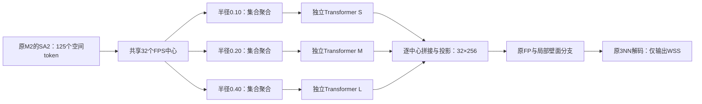

# V6 多半径集合与分支 Bottleneck Transformer：实验矩阵与执行记录

日期：2026-09-09。状态：**用户已授权首批MS1–MS6执行；配置已生成，模型与运行前检查已通过，正式Slurm13781及12次评估全部完成，结果/工作簿/图表已回填并核验**。

用户提出：在当前效果最好的模型基础配置上，尝试老师建议的“不同半径 set 聚类 → 分别用 Bottleneck Transformer 提取全局特征 → 融合”。G、M6 等新几何相关实验继续等用户审核，不并入本轮。

## 1. 基线与问题定义

主基线选 **M2：V6-A5 + independent query + 固定3NN解码**。它是上轮按物理 R²_cb 排名最好的方案；M4 在 MAE、log_z R²_cb 和热点位置上更好，作为后续组合基线，不在主矩阵里同时更换解码器。

| 已有方案，seed1234 / best | 物理 R²_cb ↑ | log_z R²_cb ↑ | MAE Pa ↓ | top10 IoU ↑ |
| --- | ---: | ---: | ---: | ---: |
| 原 A5，历史参照 | 0.62299 | 0.81963 | 2.00562 | 0.41632 |
| M2，本轮主基线 MS0 | 0.62841 | 0.82370 | 1.98823 | 0.42747 |
| M4，组合阶段参照 | 0.61791 | 0.83225 | 1.93500 | 0.45030 |

基线配置：[M2 JSON](../../configs/v6_followup_20260909/M2_a5_independent_k3_s1234.json)。已有结果：[上一轮记录](../v6_followup_20260909/README.md)。历史单路 BT 见[跟踪文档 §11.6](../../../docs/02-推进与变更/WSS_PINN/WSS_V5_训练实验跟踪.md)。旧 BT 在 R4 上有小幅正向结果，但未回答多尺度独立全局编码在 M2 上是否有效；旧种子波动和效应量不能直接用作新模型的置信区间。

本轮把“不同 Transformer”先解释为**结构相同、参数独立**，分别学习不同半径集合的上下文。层数、宽度、头数首轮统一，避免将尺度差异、网络深度和参数量同时变化。若老师特指不同深度或宽度，后续再单列架构分配实验。

多半径 set 是围绕同一批空间中心构造允许重叠的球邻域，不是按新测量的血管直径把病例分成几类。它提供多尺度上下文，但尚不能声称已按真实局部管径自适应选好了尺度。

## 2. 主方案：在 SA3 瓶颈入口并行分组

当前 M2 编码器：5000壁面 support → SA1 125×64 → SA2 125×128 → SA3 32×256 → FP回5000点 → 原多尺度局部壁面分支 → independent query / 3NN → 单通道WSS。

新方案共享原 SA1、SA2，保留原 SA3 的32个FPS中心；从相同的125个SA2源token构造三套邻域。每个尺度聚合成32×256，再分别做全病例范围的自注意力，按同一中心对齐融合成32×256，交回原FP。

| 项目 | 首轮建议值与边界 |
| --- | --- |
| 分组层 | SA3入口；源为SA2的125个token，三支共用32个FPS中心及行序 |
| 半径 | 归一化坐标下0.10 / 0.20 / 0.40；中尺度对应原SA3的0.20 |
| 邻居上限 | 每中心每尺度32；同一距离排序中取半径内最近32个（训练前按§7由16统一调整），保持中心自身，显式处理padding及mask |
| 集合编码 | 各支结构一致、参数独立；继承原SA3输入特征和GeoPE语义，输出256维 |
| 中心条件 | 新路线各臂均保留相同的现有25D中心输入条件MLP，末层零初始化；不引入新几何字段 |
| 全局Transformer | 每支32个token；1层、256通道、8头、FFN倍率2、dropout0、原相对坐标bias、残差γ初值0.001 |
| 主融合 | 按同一中心拼接三支256维输出，再线性投影768→256；初始化选择中尺度，投影块为[0,I,0]、bias=0 |
| 全局信息如何回壁面 | 保留32个token及其位置，经原FP传播回壁面；不先压成单个病例向量 |
| 近壁分支 | 保留原5000点分辨率、半径0.015/0.03/0.06的局部壁面分支，及其法向差分输入 |

这里的半径乘病例原有 `coord_scale` 才是实际毫米半径；它们不是M6的固定毫米邻域，也没有使用新截面积、分支/CIA重标注或Q/A特征。不同病例归一化尺度不同，因此“三尺度”并不自动等价于三种统一的物理血管口径。

现有SA1采用 `knn_cover`，单改其 `sa_radius[0]` 不会建立不同的邻域成员集合；radius仍会影响GeoPE尺度和残差邻域，不能说它完全不影响模型。因此本轮明确在SA3新增多套球邻域。

该方案检验“多尺度全局上下文能否帮助已有的壁面细节通路”。32个粗token本身不会增加近壁空间分辨率，也没有观测法向速度剖面。原多尺度壁面分支继续承担细节表征。

## 3. 实验矩阵：首批6组，后续条件项3组

MS0复用历史M2；MS1–MS6已获执行授权，MS7–MS9仍为后续条件项。首批包含老师的完整主方案MS4及必要对照。

| ID | 基础配置 | 新SA3分组半径 | 新增全局模块 | 融合 | 主要比较与问题 | 阶段 |
| --- | --- | --- | --- | --- | --- | --- |
| MS0 | 历史M2 | 原单半径0.20及原ball实现 | 无 | 原路径 | 当前物理精度基线，复用已有结果 | 已有 |
| MS1 | M2 | 0.20，新统一分组 | 无；保留中心条件MLP | 单支直接返回 | 对比MS0，量化新SA3接入及中心条件的整体影响；为新路线提供桥接对照 | 首批 |
| MS2 | MS1 | 0.20 | 单支BT | 单支直接返回 | 对比MS1，单路全局BT在当前底座是否有效 | 首批 |
| MS3 | MS1 | 0.10/0.20/0.40 | 无；各支均保留中心条件MLP | concat+投影 | 对比MS1，多尺度分组及融合本身的收益 | 首批 |
| **MS4** | MS3 | **0.10/0.20/0.40** | **每尺度独立BT，同结构不同权重** | **concat+投影** | **老师的完整主方案；对比MS0/2/3，并结合MS5/6解释来源** | **首批主候选** |
| MS5 | MS4 | 0.20/0.20/0.20 | 三个独立BT | 同MS4 | 对比MS4；分支数、参数量和token数相同，检验不同半径是否有用 | 首批 |
| MS6 | MS4 | 0.10/0.20/0.40 | 各支用近等参数逐token FFN替代新增BT；无新增跨中心信息交换 | 同MS4 | 对比MS4，检验收益是否主要来自跨中心混合；对比MS3，检验新增逐点容量 | 首批 |
| MS7 | MS4 | 同MS4 | 三支共享同一BT参数，各尺度仍独立前向 | 同MS4 | 对比MS4，独立尺度编码是否值得增加参数；报告共享后的容量差 | 条件项 |
| MS8 | MS4 | 同MS4 | 同MS4 | 学习逐中心的三尺度门控融合 | 对比MS4，自适应融合整套方案是否比固定线性融合更好 | 条件项 |
| MS9 | 历史M4 + 已选MS*模块 | 与MS*完全相同 | 与MS*完全相同 | 与MS*完全相同 | 对比历史M4、MS*及历史M2，检查新模块能否叠加局部query解码器 | 条件项 |

建议先做MS1–MS6共6次新训练。若MS4相对M2有实际价值，再做MS7/MS8；从有证据保留的多尺度方案中选MS*，仅做一次MS9。完整推荐上限为**9次新训练**，全部一个seed；条件不满足则不自动展开。

首批中MS4是预先指定的主候选，不等其他臂指标出来后再选为“主检验”。各训练可以并行，结果全部齐备后按预设比较判读。这里的“预先指定”不使单seed结果具备显著性证据。

### 3.1 对照口径必须保持一致

- **MS1不是纯几何条件消融。** 旧SA3的 `radius(...max_num_neighbors=16)` 不保证半径内最近16个；新路线采用一致的距离排序和统一cap32，MS1相对MS0同时包含邻居选择、邻居上限与中心特征条件MLP的变化。新增BT与尺度效应首先在MS1/2/3/4内部比较，实际价值始终还要超过MS0。若要进一步拆开MS1的变化，再单列对照，不从该臂推断单项因果。
- MS1/MS2/MS3/MS4形成单/多尺度×有/无新增全局BT的2×2设计；交互描述为 `(MS4−MS3)−(MS2−MS1)`，必须使用同一指标、同一checkpoint。多尺度同时改变容量与融合，所以结合MS5、MS6才能更好判断机制。
- MS4/MS5拥有相同编码器数、BT数、宽度、融合层、源点及中心数。MS5的三支必须拿到相同邻居集合；不能三次独立随机抽邻居制造额外差异。
- MS6保留三支分组、中心条件、位置、融合及其初始化。FFN只在每个token的通道维计算，建议从隐藏宽度1024起匹配BT参数量，实现时以实测模块参数量为准，目标误差≤1%，同时报告全模型差异；它保留原SA2局部Transformer，不能简称“模型无注意力”。MS4/MS6比较的是整套跨tokenBT与逐token近容量模块，仍不是对单条attention边的纯因果检验。
- MS6替换模块的归一化采用逐token LayerNorm，不直接套默认含BatchNorm的MLP，避免在新增替换模块中通过统计量混合不同token。原模型已有的归一化保持一致，不把此对照解释为整网绝无统计耦合。
- MS7保留各尺度独立集合编码，只共享BT参数。计算依然有三次注意力，参数共享不等于注意力计算减为三分之一；收益差不能完全排除容量影响。
- MS8建议使用 `F=3×Σ_s α_s P_s Z_s+b`，α来自同中心三支特征的softmax，起始为1/3；P_s与MS4拼接投影的对应块相同，因此初始融合函数可配对。新增gate隐藏宽度建议32。其比较包含门控新增容量，不单凭α大小声称找到了真实血管口径或物理机制。
- MS9只改变是否使用MS*的同一套模块；相应四格为M2、历史M4、M2+MS*、M4+MS*。它检验模块与局部解码器能否叠加，不重新调损失或更换数据预处理。

## 4. 共同训练与评估协议

- 只预测峰值单帧标量WSS，`out_dim=1`；无速度头、速度监督或速度梯度一致性。
- 沿用原25D输入及原V6-A5/M2数据视图，train138/test34与训练集统计固定。各臂从相同训练协议重新训练，继承的是基础配置，不是加载best权重后做不同长度的微调。
- seed1234、400epoch、batch8、每epoch随机5000support与独立5000query；FP与最终固定query插值均保持3NN，MS9除外，其query解码明确继承M4。
- 原损失保持不变：log_z MSE + λ0.2、q0.9的pinball；不加本轮已退化的Pa-Huber，不混入新的损失扫描。
- AdamW学习率0.001、weight_decay0.0001、warmup10、min_lr1e-5，其他继承M2。不同模型若显存不够，统一等效batch并登记，不能悄悄只减某臂batch或support。
- best沿用原训练总损失选模，同时保存last(epoch399)；test34全壁面、固定support种子、原 `legacy_vertex` 评估。评估配置列出的多个support稳定性seed不等于要求训练多个seed；本提案没有新增多seed训练。
- 主指标物理R²_cb；同步报告MAE、病例R²均值、log_z R²_cb、Spearman、top10 IoU、高WSS R²、top10与p99幅值比。比值以接近1为准。best/last都报告相对MS0和直接父臂的差值。
- 报告参数量、峰值显存、每epoch时间、全壁面推理时间；同token数的多支与单支比较中参数/计算差须单独说明。历史32与125token的BT改变了注意力计算规模，固定通道和层数下并不改变BT参数量。
- 配对病例查看回归最明显的壁面区域；至少跟踪MA_TIAN_YI、ZHANG_JIN_CHUN-1/before、SUN_XU_XIA-1/before。新增注意力也可在几何上可视化，但不拿测试标签选择半径或修改邻域mask。

## 5. 实现前的几何预检与之后的判读

先只用train138现有几何检查候选分组；不计算新中心线、截面或分支标签。每个尺度记录非self邻居数的p10/中位/p90、仅self比例、cap饱和率，尺度间邻居集合相同率与Jaccard、实际最远邻居距离/名义半径；按病例等权并按原coord_scale分层汇总。

0.10/0.20/0.40是可审阅的首轮候选值。若小尺度大量仅含自身，或0.20与0.40在cap16下大面积选中同一批点，这套设置没有充分实现多尺度信息，应在训练前据train几何调整统一半径或cap、更新并冻结整张矩阵。不能训练后根据test高低再调整，并把调整前后不同半径混算为同一个对照。

全局注意力只在单病例内运算；三支共享FPS中心身份与行序；中心25D特征沿既有SA索引对齐；padding不参与注意力或池化。实现时验证关闭新增模块仍保持历史模型行为，以及MS5三支相同分组、MS6确无新增跨中心交换。

融合初始化[0,I,0]会让外侧两支在第一步没有从融合层回传的分支内部梯度，投影更新后才逐渐参与。配合BT残差γ0.001，需记录各尺度投影范数、分支梯度及学到的γ；分支未被有效启用时，不把阴性结果直接解释为多尺度信息无用。注意力熵按有效query和head共同平均，结合注意力加权空间距离检查实际信息交换范围。

结果解释：

1. MS4超过MS3和MS6，支持新增全局上下文有价值；若只超过MS3而不超过MS6，优先考虑新增容量的解释。
2. MS4超过同容量的MS5，支持不同半径提供了有效差异；仍需确认实际邻居集合与注意力诊断，不能只看配置写了三个半径。
3. MS4超过MS2，才支持完整多尺度分支比单路BT有额外实用价值；同时比较开销。
4. MS4未超过历史M2时，不能因为超过了一个退化的MS1就替换主模型。若只改善热点而Pa误差变差，明确作为空间拟合候选保留。
5. 单seed与已暴露test34只支持探索性比较。best/last一致、逐例改善及机制诊断能增加可信度，但不能替代重复种子或新的验证集。

## 6. 等待用户审核的路线

G1–G7、M6、必要时的B1以及涉及新几何的C组合，仍按上一轮几何验收流程等待用户确认。本提案不批准候选几何，也不把固定毫米半径、自适应截面半径或新CIA归属混入MS实验。

MS9属于当前已确认输入上的“新模型模块×已有M4解码器”组合，不使用G数据。MS1–MS6已获执行授权；后续状态与Slurm记录见§7，MS7–MS9不在首批队列中。

## 7. 执行记录与分组冻结（2026-09-09）

用户已授权推进目前能跑的实验并回填文档、工作簿；首批范围固定MS1–MS6，G/M6及新几何保持待审核。新增能力默认关闭，旧模型、数据和结果不覆盖。

训练前仅用train138原壁面坐标和coord_scale，按三个support采样epoch(0/199/399)检查414个病例/epoch组合。FPS使用独立固定诊断随机种子，不冒充完整训练随机流重放。初次CPU预检13775因脚本调用缺少stream参数失败；修正后13776完成cap16，13777完成cap32，没有消耗正式训练。

| 新SA3分组上限 | 小/中/大半径非self邻居中位数 | 中/大半径邻居集合相同比例 | 决定 |
| --- | --- | --- | --- |
| 初始建议cap16 | 4 / 15 / 15 | 55.52% | 多尺度差异受到明显截断 |
| **冻结cap32** | **4 / 16 / 31** | **4.88%** | **六臂统一使用，SA1/SA2保持不变** |

归一化半径仍为0.10/0.20/0.40；小尺度仅self约6.87%，中/大尺度为0。最终sa_nsample=[64,16,32]；MS1作为接入桥接同时承接cap与邻居选择变化。冻结只用训练集几何、未看MS测试结果，见[grouping_freeze.json](grouping_freeze.json)、[cap32全队列诊断](geometry_preflight_cap32.json)。原cap16诊断保留，不冒充最终训练设置。

模型兼容性、容量、真实batch8前后向检查、独立2epoch冒烟及正式400epoch/best/last均已完成；最终核验、回填与判读见§8。

正式提交：冒烟13780六臂各2epoch通过，正式13781采用3张Slurm分配GPU、每卡最多2并发，train→best→last逐槽完成。模型、配置、38项测试与真实batch8/5000点前后向13779通过；[training_gate.json](training_gate.json)绑定全部源码/配置/预检SHA。MS1桥接包括新SA3初始化子流，历史公共模块初始化保持一致。工作簿已登记总览283–288行，正式结果已完成评估并回填，见§8。

正式作业之后的依赖任务：13782负责best/last报告、工作簿及比较图；13783在8个固定训练病例上检查best模型的分支激活和注意力范围，只读几何特征与checkpoint，不改变训练或选模。独立[数值与工作簿验收](verify_delivery.py)及[逐病例/机制对照分析](independent_analysis.py)最终模式已执行并通过，报告见§8。

实际模型参数：MS1 657,063；MS2 1,184,281；MS3 1,337,767；MS4/MS5 2,919,421；MS6 2,919,088。MS6 FFN隐藏宽度1026，每支527,107参数，对应BT527,218（−0.0211%）；新无BT臂也保留相同中心条件。

配对壁面图作业13787依赖13781完成，在预先指定MA_TIAN_YI、ZHANG_JIN_CHUN-1/before、SUN_XU_XIA-1/before上复现MS0=M2与MS4的best预测。全部逐例Pa/log_z指标核验通过后才输出统一色标的WSS、误差和热点双视角图；只读历史数据与checkpoint，不增加训练或几何字段。

## 8. 首批完成与判读（2026-09-09）

**MS1–MS6各seed1234、400轮及12次best/last评估全部完成。当前保留原M2作为物理精度主基线；这组结果不足以把多半径独立BT替换为主模型。** 原M4仍是已有MAE/空间拟合参照。MS7–MS9不自动展开；G/M6及新几何组合继续等待用户可视化验收。

正式Slurm13781 **COMPLETED 0:0，43分51秒**；报告/工作簿/比较图13782、分支诊断13783、三例配对壁面图13787均COMPLETED 0:0。400轮、同一test34、18个train/best/last阶段和训练源码/配置起止SHA全部通过。独立数值验收 **40,353项、0差异**；工作簿保留原22,638个非空值及1,360个公式，新ⅩⅤ节6臂best均已回填。

| 方案 | best物理R²_cb | last物理R²_cb | best log_z R²_cb | best MAE Pa | best top10 IoU | best p99比 |
| --- | ---: | ---: | ---: | ---: | ---: | ---: |
| MS0 历史M2 | 0.62841 | 0.62429 | 0.82370 | 1.9882 | 0.42747 | 0.6099 |
| MS1 单半径接入 | 0.61035 | 0.61017 | 0.81921 | 2.0001 | 0.43332 | 0.5899 |
| MS2 单半径+BT | 0.62101 | 0.61822 | 0.82337 | 1.9945 | 0.44551 | 0.5896 |
| MS3 多半径，无新增BT | 0.61405 | 0.61728 | 0.82992 | 1.9692 | 0.45154 | 0.5720 |
| MS4 多半径+独立BT | 0.61634 | 0.61735 | 0.83091 | 1.9417 | 0.44151 | 0.5634 |
| MS5 相同半径三支BT | 0.61858 | 0.61830 | 0.83119 | 1.9653 | 0.44283 | 0.5748 |
| MS6 多半径+近容量FFN | 0.62354 | 0.62557 | 0.82632 | 1.9897 | 0.43880 | 0.5952 |

完整表：[best](matrix_tables_best.md)、[last](matrix_tables_last.md)。以上best和last各自对比历史M2的相同checkpoint；历史M2的last是0.62429，不能拿它替代best 0.62841作best对照。p99比以接近1为好。

| 对照：MS4减参照 | Δ物理R² best / last | ΔIoU best / last | 解读 |
| --- | ---: | ---: | --- |
| MS0 | -0.01207 / -0.00695 | +0.01404 / +0.01249 | 未超过原M2的物理主指标；MAE与热点有取舍 |
| MS2 | -0.00467 / -0.00088 | -0.00400 / -0.00565 | 完整多尺度BT未超过单路BT的物理指标 |
| MS3 | +0.00229 / +0.00007 | -0.01003 / -0.01059 | BT的物理增益很小，热点IoU反而下降 |
| MS5 | -0.00224 / -0.00095 | -0.00132 / -0.00090 | 同容量下不同半径未取得物理或热点优势 |
| MS6 | -0.00719 / -0.00822 | +0.00271 / +0.00090 | 近等容量逐token FFN的物理指标更好 |

1. **完整方案改善平均绝对误差，但高值幅度仍受损。** MS4相对M2的MAE best/last下降0.04649/0.04775Pa，log_z R²提高0.00722/0.00631，IoU提高0.01404/0.01249；物理R²下降0.01207/0.00695。best高WSS R²从0.2195降至0.1675，top10幅值比0.6156→0.5852，p99比0.6099→0.5634。只能描述不同指标之间的取舍。
2. **本轮未支持独立全局BT是物理精度的增益来源。** MS4对MS3的物理改善best仅0.00229、last仅0.00007，IoU均下降约0.010；对同容量MS5、近等容量MS6的物理指标均较低。2×2物理交互 `(MS4−MS3)−(MS2−MS1)` 为−0.00838/−0.00799，是单种子描述，不作显著性判断，也不否定整个Transformer方法族。
3. **MS1的桥接代价不能忽略。** MS1对M2物理R²下降0.01807/0.01413；单路BT能收回其中一部分，但MS2仍未超过M2。该变化同时包含新邻居选择、cap32、中心条件与SA3初始化，不能单独归因为某一项。
4. **MS3、MS6保留为探索性参照。** MS3的best IoU=0.45154是本批最高，但原M4已有0.45030，且原M4 MAE=1.935、物理R²=0.61791；尚未体现足够的整体替换价值。MS6本批best物理R²最高0.62354，仍低于M2；其last=0.62557仅比M2 last高0.00127，best/last方向不一致，不以单个较好checkpoint宣布胜出。MS4也没有超过原M4的best MAE、物理R²或IoU。
5. **下一步优先明确瓶颈，再增加结构。** 当前证据支持继续保留原局部壁面分支，先完成已交付几何候选的人工验收，再按独立消融评估半径/截面积/Q/A等输入。它们尚未被本轮验证为有效，也不能据此宣布“只有几何值得优化”。G/M6/新几何没有执行；MS7共享BT、MS8门控、MS9叠加M4继续为未执行条件项。

### 8.1 逐病例与壁面区域

MS4相对M2的best逐例R²改善17/34、IoU改善21/34、MAE下降19/34。物理R²_cb的病例贡献按同一共享方差精确分解，不能由逐例R²差简单相加。best主要负贡献为ZHANG_YONG_ZHI −0.00612、SUN_XU_XIA-1/before −0.00474、MA_TIAN_YI −0.00340；正向病例抵消了部分代价。前两例与MA_TIAN_YI值得继续定位高值幅度误差。

| 预先指定病例；MS4−M2 best | Δ逐例R² | ΔMAE Pa | Δtop10 IoU | Δ高WSS MAE Pa | 双视角图 |
| --- | ---: | ---: | ---: | ---: | --- |
| AG/slow/MA_TIAN_YI | -0.02979 | +0.3372 | +0.10514 | +0.6784 | [WSS/误差](paired_wall_fields_best/AG__slow__MA_TIAN_YI__wss_errors.png) · [热点](paired_wall_fields_best/AG__slow__MA_TIAN_YI__hotspots.png) |
| ILO/ZHANG_JIN_CHUN-1/before | +0.01898 | -0.3404 | +0.06923 | +0.0950 | [WSS/误差](paired_wall_fields_best/ILO__ZHANG_JIN_CHUN-1__before__wss_errors.png) · [热点](paired_wall_fields_best/ILO__ZHANG_JIN_CHUN-1__before__hotspots.png) |
| ILO/SUN_XU_XIA-1/before | -0.02577 | +0.1960 | +0.01684 | +0.3481 | [WSS/误差](paired_wall_fields_best/ILO__SUN_XU_XIA-1__before__wss_errors.png) · [热点](paired_wall_fields_best/ILO__SUN_XU_XIA-1__before__hotspots.png) |

[三例壁面总览](paired_wall_fields_best/paired_wall_overview.png)及每图同名PDF均已生成。三个病例的热点与高误差主要可见于分叉以下的分支壁面；MA_TIAN_YI和SUN_XU_XIA的IoU改善，但高值幅度及整体Pa误差没有同步改善。ZHANG_JIN_CHUN的整体Pa误差改善，高值区MAE仍略升。图中不额外判定解剖左右或新CIA归属。

配对图直接调用冻结评估函数，复现M2/MS4的同一次全壁面预测；3例×2模型×Pa/log_z共948个逐例数值检查通过，整数精确、浮点容差记录于[provenance](paired_wall_fields_best/provenance.json)。各病例内部CFD/M2/MS4共用完整WSS范围色标，√颜色映射已标注；误差为共同对称线性色标；热点各自按自身q90划分。两视角、全壁面点，无新网格或几何字段。这三个预选病例用于解释局部行为，不代表总体收益。

### 8.2 分支是否实际启用与计算开销

只读8个固定train病例的best诊断通过。MS4小/中/大尺度融合投影范数约5.636/17.725/8.264，外侧分支已离开零初始化；attention γ约0.0148/0.0635/−0.0246，均已学习。三尺度末端token RMS均值约1.118/2.141/2.532；注意力熵均值0.128/1.076/0.227，加权空间距离均值约105.7/114.5/124.1mm。分支并非始终未启用；较低注意力熵提示部分支路分布集中，但这些权重与距离不构成因果重要性、真实流动路径或物理管径的证明。距离是含自身权重的32个粗token间欧氏距离，由既有coord_scale换算；不是中心线路径距离。

| 方案 | 参数量 | 训练epoch中位秒 | best全壁面秒/病例 | best峰值已分配CUDA MiB |
| --- | ---: | ---: | ---: | ---: |
| MS0 | 584,103 | 5.60 | 0.235 | 72.28 |
| MS1 | 657,063 | 5.80 | 0.266 | 72.87 |
| MS2 | 1,184,281 | 5.90 | 0.255 | 76.90 |
| MS3 | 1,337,767 | 6.40 | 0.252 | 78.12 |
| MS4 | 2,919,421 | 6.50 | 0.198 | 90.21 |
| MS5 | 2,919,421 | 6.30 | 0.151 | 90.21 |
| MS6 | 2,919,088 | 6.30 | 0.198 | 91.18 |

上述耗时来自实际共享GPU运行，组间并发负载不同，不能作为受控性能基准；尤其不能据MS4/MS5观测秒数更小就称其更快。峰值内存是正式评估期间的PyTorch已分配内存，既不含全部CUDA开销，也不是训练峰值。真实batch8训练前后向峰值另见runtime_preflight；原训练器未逐臂记录正式训练全过程峰值，不将预检值冒充该数据。

### 8.3 交付与复现证据

- [比较图PNG](multiradius_comparison.png) / [PDF](multiradius_comparison.pdf)，图中best/last分别对同类M2 checkpoint；无重复seed误差条。
- [工作簿](../../../docs/03-汇报材料/WSS_PointNet实验矩阵与结果汇总last.xlsx)：总览283–288行，教师243–248行，汇总408–413行；本节填写best，文件名last为历史命名。
- [最终数值验收](delivery_verification_final.json)、[独立对照与病例贡献](independent_analysis_final.json)、[独立科学判读](scientific_assessment.md)、[分支诊断](branch_diagnostics_best.json)、[队列](queue_status.json)、[提交](submission.json)、[回填映射](workbook_update.json)。
- [冻结分组](grouping_freeze.json)、[训练门禁](training_gate.json)、[运行前真实batch检查](runtime_preflight.json)保留原始证据；预检失败与修正记录未删除。

全部结果限定为单seed1234、已暴露test34的探索性实验。当前没有新的验证集或重复训练证据。
