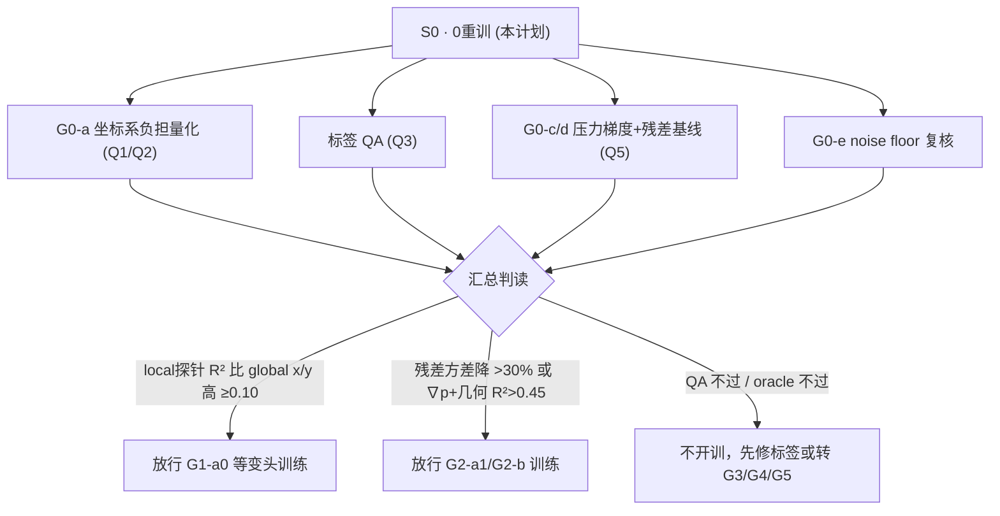

# V3P 路径 G · S0 执行计划与交接（G0 oracle + 标签 QA · 0 重训）

> **性质**：执行计划 + 代码交接文档（供后续 AI 继续开发与复查）
> **创建**：2026-06-06 · **范围**：V3P（`split_AG_v1`），不动 V3D
> **当前进度**：**S0 ✅**（5409 + denylist B + QA 闭合）→ **S1**：G1/G2-a 关闭；主线 **G2-b head 实现 + G3 预研**（§9）
> **索引**：[路径 G 主规划](../00-当前主线/路径G_下一代架构与精度突破方案_2026-06-05.md) · [README](../README.md) · [实验跟踪日志](V3_实验执行跟踪日志.md) · [后续优化待办](V3_后续优化待办.md)

---

## 1. 为什么是这一步（门控逻辑）

路径 A–F 已耗尽，V3P 点级 `wss_r2_wss` 锁死 ~0.40（母版 AsymW-a 4957），最近 5311（PCv2-BLContext）弱 No-Go、5331（val15）强 No-Go。方案 §9 已定下执行顺序：**先 S0 把 G0 oracle 全过一遍 + 标签 QA（1–2 天、0 重训、纯 CPU 后处理）**，用证据回答四个 P0 闭环里的「表示闭环（Q1/Q2）、标签闭环（Q3）、物理闭环（Q5）」，**再决定是否烧 GPU 上 G1/G2**。



---

## 2. 已落地代码（文件清单）

| 文件 | 作用 | 状态 |
| --- | --- | --- |
| `training/scripts/probe_linear_wss.py` | 通用离线 WSS 可学性探针（特征矩阵 + Ridge/GBDT + test R²/Spearman/角度误差 + 组间方差，输出 json） | ✅ 待办 1 完成 |
| `training/scripts/run_v3_g0_oracle.py` | S0 编排：G0-a / QA / G0-c·d / G0-e + Go/No-Go 门控，写 `v3p_g0_oracle_<date>.json` | ✅ Job **5409** 实跑 · `v3p_g0_oracle_20260606_v2.json` |
| `training/cluster/run_v3_g0_oracle.slurm` | node03 / CPU / `GNN` · `OMP_NUM_THREADS=1` | ✅ 已用（5409） |

> 复用资产（未改动）：`training/scripts/run_v3_f0_decision.py`（`oracle_pressure_gradient_wss` / `oracle_gt_wall_diff_v2` / `oracle_residual_stratification` / `todo_27a_seed_bandwidth` / 反归一化与 `_r2_score` 等工具）、`pipeline/local_wss.py`（local frame 投影）、`pipeline/config.py`（`NODE_FEATURE_NAMES`）。

### `probe_linear_wss.py` 关键接口

- `collect_wall_dataset(...)`：按 split 池化壁面点。`target_frame=global` → `wss_x/y/z`（denorm 到物理）；`target_frame=local` → `wss_axial/circ/rad`，`local_source=precomputed` 读 `graphs_local_v1` 的 `y_wss_local`（STL 法向，精确），`knn` 用图内 kNN 法向现场投影。
- `_fit_eval(...)`：Ridge（标准化）+ HistGBDT → test R² / Spearman。
- `_eta_squared_between_cases(...)`：组间方差占比（无量纲），量化跨 case 朝向负担。
- `_vector_angle_error_deg(...)`：矢量夹角中位误差。
- `run_probe(...)` + CLI：对 global/local/both 跑探针，支持 `--max-train-cases/--max-test-cases` 自检。

---

## 3. 待办分解与状态（每个产物对应一个待验证问题）

| # | 待办 | 对应问题 | 状态 | 落点 |
| --- | --- | --- | --- | --- |
| 1 | 通用离线探针 `probe_linear_wss.py` | Q1/Q2 基础设施 | ✅ 完成 | 见 §2 |
| 2 | G0-a 坐标系负担量化（global vs local 探针 + 跨 case 方差 + 旋转一致性） | Q1/Q2 | ✅ **No-Go**（Δ=−0.022） | `g0a` · 5409 |
| 3 | 标签 QA（物理口径 rad_ratio + rad_frac_p95 + wss_p95_degenerate） | Q3 | ✅ **No-Go**（4 例 denylist） | `qa` · 5409 / 口径修复见推进记录 |
| 4 | G0-c/d（压力梯度↔WSS 相关 + GBDT 上限；解析基线残差方差下降） | Q5 | ✅ c **Go**（R²=0.633）· d **No-Go** | `g0c`/`g0d` · 5409 |
| 5 | G0-e noise floor 复核 | 诚实性 | ✅ 读 `v3_f0_oracle_v2.json` | `g0e` · 5409 |
| 6 | 汇总决策 json + 回填文档 | — | ✅ `v3p_g0_oracle_20260606_v2.json` | 5409 + 本文档/跟踪日志/推进记录 |

---

## 4. 运行方式

**环境**：`conda activate GNN`（已校验 `torch 2.5.1+cu118 / sklearn / scipy` 可用）。纯 CPU，不用 GPU。

**自检（登录节点，2 case 极小样本，秒级~分钟级）**：

```bash
conda activate GNN
cd /public/newhome/cy/Digital_twin/GNN
python -m training.scripts.run_v3_g0_oracle \
    --max-cases 2 --max-graphs-per-case 1 --max-wall-per-graph 120 \
    --qa-max-graphs 1 --oracle-max-cases 2 --oracle-max-graphs 1 --n-rot 2 \
    --output-name v3p_g0_oracle_SMOKE.json
```

**全量（集群 node03 / CPU 分区，约 15–20 min）**：

```bash
sbatch training/cluster/run_v3_g0_oracle.slurm
# 监控：squeue -u $USER ; tail -f logs/v3p_g0_oracle_<JOBID>.out
```

也可单独跑探针：

```bash
python -m training.scripts.probe_linear_wss --target-frame both \
    --max-graphs-per-case 3 --max-wall-per-graph 800 \
    --output outputs/field/f0_decision/v3p_g0a_probe_<date>.json
```

---

## 5. Go / No-Go 判据（对照方案 §3 / §10）

| 子项 | Go（放行） | 判据来源 |
| --- | --- | --- |
| **G0-a** | local `circ/rad` 探针 best R² 比 global `wss_x/y` 高 **≥0.10** → 放行 **G1-a0 VNHeadPlain** | 坐标系负担存在，等变头有空间 |
| **QA** | denylist 候选为空 → G1/G2 可开训；否则先修标签（可能需新 split + 新表） | 物理口径：rad_ratio≤0.30 / **rad_frac_p95≤0.35** / wss_p95 非退化 / normal≤0.05 / basis≤0.10 / robust-z≤4 / tangent≥0.90 |
| **G0-c** | GT `\|∇p\|`+几何 GBDT test R² **>0.45** → 放行 **G2-b 压力交叉注意力头** | 压力→WSS 物理耦合上限 |
| **G0-d** | 残差方差降 **>30%** 且残差仍与几何相关 → 放行 **G2-a1 固定 WSS₀ 残差头** | per-case 缩放 Poiseuille 基线（GT 拟合上界，诚实标注） |
| **G0-e** | 仅设「够好」阈值，不作放行依据 | AsymW 三 seed 带宽 CI |

---

## 6. S0 之后的分叉（本计划只到放行决策，不开训）

- **G0-a 过** → 立项 **G1-a0 `V3P-G-54a-VNHeadPlain`** seed1（仅换矢量等变 head，0 图改动），Go 信号 = `wss_x` 或 `wss_y` test R² 破 0.10。
- **G0-d 过** → 并行立项 **G2-a1 固定 WSS₀ 残差头** seed1。
- **QA 暴露脏标签** → 先修标签/denylist，G1/G2 顺延。
- **G0-a 不过且 local 也无结构** → 坐标系负担不是主瓶颈，转 G3（数据）/ G4（2D 换轨）/ G5（兜底叙事），不再扫小超参。

---

## 7. 技术要点与已知坑（交接重点）

1. **数据口径对齐（已核实）**：`wss_x/y/z` 与 `wss_axial/circ/rad` **均为 z-score 归一化**（见 `data_new/normalization_params_global.json` 的 `statistics`）。R² 对目标仿射缩放不变，故 global vs local R² 可直接比较；跨 case 用「组间方差占比 η²」（无量纲）比较。
2. **磁盘资产（V3P 已齐备）**：每 case 同时有 `processed/graphs/`（标准图）与 `processed/graphs_local_v1/`（含 `y_wss_local` + `wss_local_mask`，STL 法向），且病例根目录有 `.stl`。`graphs_local_v1` 用于 local frame；`graphs` 用于 global。
3. **I/O 是主瓶颈**：单图 `torch.load` ≈ **0.9s**（4.3MB，网络盘，大头是用不到的 `edge_index`）。全量跑务必走 slurm（`--time=3:00:00` 充足）；自检用 `--max-cases`。如需提速可考虑缓存或只读所需张量。
4. **不覆盖 F0 产物**：决策 json 写 `outputs/field/f0_decision/v3p_g0_oracle_<date>.json`，**禁止**覆盖 `v3_f0_oracle_v2.json`。
5. **口径纪律**：V3P（`split_AG_v1`）结果禁止与 V3D 0.243 混表；oracle 复用函数硬编码 `data_new/AG`，本轮 V3P 不受影响（无需改三域路径）。
6. **G0-d 诚实边界**：per-case 缩放 c 用 GT 最小二乘拟合，是「无量纲化的上界口径」（mild oracle）；若此上界都不降方差，固定残差头更不会有效。JSON 中已标注。
7. **复查建议**：重点核对 ① local frame 投影方向约定（`axial=w·t̂`、`circ=w·(n̂×t̂)`、`rad=w·n̂`）是否与 `pipeline/local_wss.py` 一致；② 旋转一致性里对 tangent 特征列与 global 目标向量是否同步旋转；③ 压力梯度 lstsq 的 q_idx 先下采样再算（已修，避免逐点全量）；④ **`extract_features`** 已加 `audit_stl_cloud_scale`（STL↔点云 span 比 >20 拒跑，防 ×1000 尺度错误）。

---

## 9. S0 结论与 S1 分叉（2026-06-06 · Job 5409 + denylist B）

### 9.1 最终 gates（`v3p_g0_oracle_20260606_v2.json` + QA 复验）

| 门控 | 结果 | 放行训练 |
| --- | --- | --- |
| **G0-a** | No-Go · Δ=−0.022 | ❌ G1-a0 |
| **QA** | Go（4 例已剔除） | ✅ 标签池闭合 |
| **G0-c** | Go · GBDT R²=**0.633** | ✅ G2-b 物理信号 |
| **G0-d** | No-Go · var↓≈0 | ❌ G2-a1 |
| **G0-e** | 带宽 **0.394±0.005** | 参考 |

### 9.2 路径分叉（按路径 G §9/§11）

| 分支 | 决策 | 下一动作 | GPU |
| --- | --- | --- | --- |
| **G1 等变头** | **No-Go · 封口归档**（5441 · 矢量分量崩，证实 G0-a） | 不再投；如复活须先做旋转特征漂移探针 | ✅ |
| **G2-a 残差** | **关闭**（G0-d） | 不排固定 WSS₀ 头 | — |
| **G2-b 压力耦合** | **可立项**（G0-c Go） | 实现 **kernel-attention wss_head**（当前仅有 concat `wss_pgrad_context`）→ 再 seed1 Probe | 待代码 |
| **G3 预训练/多保真** | **主并行线**（G0-a 指向数据瓶颈） | TODO-58 几何 SSL 资产盘点（81 case 有 STL+merged） | 预研 |
| **G4 2D 换轨** | **可预研**（F0 `pod_2d` R²≈**0.77**>0.6） | 2D 展开预处理链设计 | 预研 |
| **G5 兜底叙事** | 随时 | TODO-62 区域/病例 surrogate 固化 | 低 |

### 9.3 S1 推荐执行顺序（当前窗口）

1. **代码**：`training/core/wss_kernel_attention.py` + `FieldPointNeXt.wss_kernel_attention` **已实现**；配置 `V3P-G-57-PGradKernelAttn_seed1.json` 就绪 → **待 GPU seed1 Probe**。
2. **数据防护**：`extract_features` 已加 STL↔点云尺度审计（`audit_stl_cloud_scale`）。
3. **G3 预研**：统计 AG 81 case 几何-only 预训练可行性（无 WSS 标签泄漏）。
4. **并行（V3P 旧线）**：5311 **clinical-pa eval**（不阻塞路径 G）。
5. **禁止**：在 G2-b head 未实现前提交 GPU 训练；G1-a0 / G2-a1 不重开。

### 9.4 关键产物索引

| 产物 | 路径 |
| --- | --- |
| S0 全量 | `outputs/field/f0_decision/v3p_g0_oracle_20260606_v2.json` |
| QA 闭合 | `outputs/field/f0_decision/v3p_g0_oracle_qa_post_denylist_20260606.json` |
| split（denylist 后） | `training/splits/split_AG_v1.json`（train 57 / test 16） |
| denylist 常量 | `pipeline/export_gap_preprocess_queue.py` · `training/core/denylist.py` |

---

## 8. 回填纪律（执行完后）

按 `experiment-log.mdc`，完成实跑后在 [代码修改与实验推进记录.md](../../../../02-推进与变更/代码修改与实验推进记录.md) **文首**追加，并同步 [实验跟踪日志](V3_实验执行跟踪日志.md) 顶部、[后续优化待办](V3_后续优化待办.md) 对应行（新增 TODO-54/56 行状态）、[README](../README.md) §0 当前状态。
