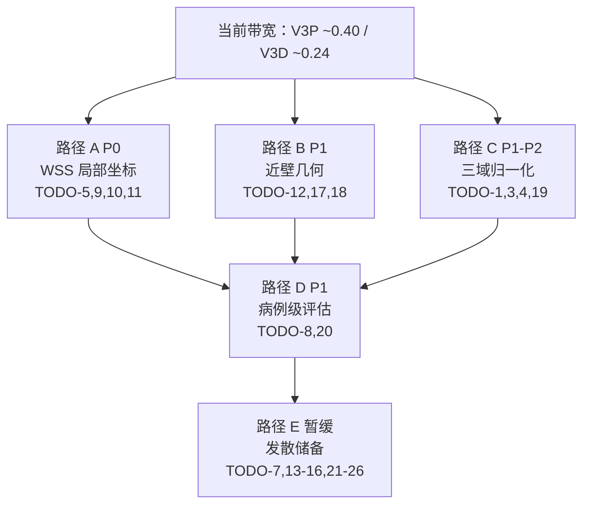

# 任务 A 基线汇报 PPT 补充计划

> **目标 PPT**：`docs/03-汇报材料/任务A基线模型对比汇报_LineG_WSS补充版.pptx`（45 页）  
> **编制日期**：2026-05-23（5/24 实验闭合后更新）  
> **原则**：V3P（`split_AG_v1`）与 V3D（`split_data_new_v3_v3`）**分表**；pre-fix（4771–4774）与 post-4901 **禁止混表**；WSS 主报 **`best_wss_model` → test `wss_r2_wss`**

---

## 1. 向导师汇报叙事主线（建议 15–20 min）

| 阶段 | 信息 | 对应幻灯片 |
| --- | --- | --- |
| **① 问题已闭合** | PENG 剔除后 P/WSS 可学；trainer 修复后早停合理 | 35–36, 38 |
| **② V3P 当前最优** | AsymW-a 三 seed 均值 **0.394±0.005**（峰值 0.399）超过 WSS-a-PW 0.395 与 Main-PW 0.365；增益来自 **wss_z**，x/y 仍 ≈0 | 37–39, 42 + 图 `v3p_wss_*` |
| **③ 瓶颈判读** | 三 seed 钉死后仍触 ~0.40 带宽 → 「全局坐标 + 只学 z」信号；AsymW+Dropout 组合 0.398 未额外抬升 | 42, 46（新增） |
| **④ V3D 进展** | 4901 ✅；Gate-P **0.984**；WSS **0.243**（跨域天花板） | 47–48（新增） |
| **⑤ 下一跳** | 路径 **A（TODO-5 局部坐标）** 为 P0；并行 TODO-8 评估、TODO-19 三域归一化 | 43–45 更新 + 49（已闭合）+ 图 `v3_path_map` |

**核心结论（一句话）**：V3P 在 AG-only 上已通过三 seed 稳定钉在 0.394±0.005 / 峰值 0.399，仍未冲破 ~0.40 经验带；**表示改造（局部坐标系）+ 病例级评估** 是必要条件；V3D 数据修复救回了 P，WSS 仍受跨域分布限制。

---

## 2. 现有幻灯片：更新 vs 保留

| 页码 | 当前标题（摘要） | 动作 | 优先级 |
| ---: | --- | --- | ---: |
| 33 | 与最初研究目标差距 | **保留**（上下文） | P3 |
| 34 | Line W / WSSP | **保留** | P3 |
| **35** | 数据质量诊断（**空**） | **填充** §3.1 | **P0** |
| 36 | V3 探针 P/WSS 可学 | **微调**（补新数据日期） | P2 |
| **37** | 主线 -PW + λWSS=0.05 最高 | **重写** §3.2 | **P0** |
| **38** | trainer 修复 / WSS 上限 | **重写** §3.3 | **P0** |
| **39** | trainer 早停对比（**空/占位**） | **填充** §3.4 | **P0** |
| 40 | WSS 可信性 / top-k | **保留**，脚注补 AsymW | P2 |
| 41 | 路线判断 | **微调**（AsymW 为过渡） | P1 |
| **42** | 横向分量过拟合 | **更新** history 数字 + 插图 | **P0** |
| **43** | 后续重点（过时：待提交病例） | **重写** §3.5 | **P0** |
| **44** | 数据扩容（4901 未体现） | **重写** §3.6 | **P0** |
| **45** | 下一轮矩阵（路径 A–E 缺失） | **重写** §3.7 | **P0** |
| **46–49** | （不存在） | **新增** §4 | **P0–P1** |

---

## 3. 逐页内容规格

### 3.1 Slide 35 — 数据质量诊断（填充）

**标题**：数据质量诊断：V3P 单点 OOD 与 V3D 系统性口径问题

**要点**：
- **V3P**：`PENG_JI_MING` 入口流速 ~0、WSS 275× 异常 → 剔除后 P **0.96**、WSS **~0.40**
- **V3D**：非单点 OOD；`normalize.py` 叶名碰撞 → 226 目录误纳入统计 → Probe-P val/test 撕裂（**−4.45**）
- **4901 修复**：train-only **179** 例；Gate-2 ✅；Probe-P test **0.984**

**表格**：

| 维度 | V3P（AG） | V3D（三域） |
| --- | --- | --- |
| 主要失败模式 | 1 例 PENG 极端 OOD | 跨域尺度 + 归一化非 train-only |
| 处置 | 剔除 PENG，split 更新 | 4901 renorm + v3 split（179 train） |
| P test `r2_p` | ~0.96 | pre-fix −4.45 → post **0.984** |
| WSS test | ~0.40（V3P 探针） | pre 0.255 → post **0.243** |

**参考**：`V3_数据质量与OOD诊断记录.md` §3–§8（V3P PENG 根因 + 重跑验证）、§9（V3D 指针段）；`V3_三域数据.md`（V3D 完整诊断/修复）

---

### 3.2 Slide 37 — V3P 主线 WSS 对比（重写）

**标题**：V3P 主线层：AsymW-a 三 seed 钉死 0.394±0.005（峰值 0.399）

**副标题**：`split_AG_v1` · 主报 `best_wss_model` · 作业 3634/4957/4999/5000/5001/4958

**表格**（test，`best_wss` checkpoint）：

| Exp ID | 作业 | seed | `wss_r2_wss` | `wss_z` | `wss_x` | `wss_y` | `r2_p` | `best_wss_ep` |
| --- | ---: | ---: | ---: | ---: | ---: | ---: | ---: | ---: |
| Main-01-PW | 3634 | 1 | 0.365 | 0.348 | 0.022 | 0.044 | 0.935 | 32 |
| WSS-01-a-PW | — | 1 | 0.395 | 0.381 | 0.026 | 0.012 | 0.931 | 9 |
| **AsymW-a** | **4957** | 1 | **0.399** | **0.387** | 0.018 | 0.007 | 0.943 | 24 |
| **AsymW-a** | **4999** | 2 | 0.389 | 0.376 | 0.008 | 0.010 | 0.948 | 57 |
| **AsymW-a** | **5000** | 3 | 0.395 | 0.365 | 0.015 | 0.005 | 0.954 | 109 |
| **AsymW-a 均值±std (n=3)** | — | — | **0.394 ± 0.005** | 0.376 | 0.014 | 0.007 | 0.948 | — |
| **AsymW+WssDO-a** | **5001** | 1 | **0.398** | 0.378 | 0.033 | 0.012 | 0.943 | 53 |
| WssDO-a 单变量 | 4958 | 1 | 0.379 | 0.366 | 0.030 | 0.037 | 0.943 | 57 |

**要点**：
- AsymW 权重 `[1, 0.05, 0.05, 0.90]` 三 seed 均值 **+0.029** vs Main-PW，seed 间极差仅 **0.010**（可复现）
- **AsymW+WssDO 组合 0.398 ≈ 纯 AsymW seed1**：Dropout **未额外抬升**也未伤害 → **TODO-7 维持暂缓**
- **增益主要来自 wss_z**（z 均值 0.376 vs Main 0.348）；test x/y 仍 ≈0
- **建议将 PW 母版默认 `wss_weights` 升级为 AsymW 配方**（仍标注为全局坐标过渡方案）

**插图**：`figures/v3p_wss_comparison.png`（5 柱多 seed 版，AsymW 柱含误差棒与 3 seed 散点）

**参考**：`V3_实验执行跟踪日志.md` TODO-6/7 块；`outputs/.../summary.json`

---

### 3.3 Slide 38 — Trainer 修复与 WSS 带宽（重写）

**标题**：Trainer 修复合理化了早停，但 AsymW（含组合）仍未突破 ~0.40 WSS 带宽

**要点**：
- val_score / dual checkpoint 修复：Main-PW `best_epoch` 11→**104**（旧 run bug）
- 修复后 WSS 带宽仍 **~0.36–0.40**（Main 0.365 → AsymW 三 seed 均值 **0.394**，峰值 **0.399**）
- AsymW 缓解 **val** x/y 过拟合（seed1 x 最差 −0.187→**−0.022**），**test** x/y 无改善；seed2/3 val x 略差但标量仍稳
- **组合 AsymW+Dropout（5001）= 0.398**，与纯 AsymW 同档 → Dropout 未提供额外带宽
- **判读**：继续调全局权重/正则 → 收益递减；下一跳需路径 A（表示改造）

**对比表（val history 最差 R²）**：

| Exp | val `wss_x` 最差 | val `wss_y` 最差 |
| --- | ---: | ---: |
| Main-PW | −0.187（ep 66） | −0.105（ep 62） |
| AsymW-a seed1 | **−0.022**（ep 14） | **−0.025**（ep 1） |
| AsymW-a seed2 | −0.069（ep 79） | −0.014（ep 2） |
| AsymW-a seed3 | −0.077（ep 96） | −0.025（ep 2） |
| AsymW+WssDO-a | −0.020（ep 35） | −0.020（ep 1） |
| WssDO-a 单变量 | −0.126（ep 83） | −0.080（ep 62） |

**参考**：`docs/01-任务/任务A/03-V3路线/_archive/V3_WSS瓶颈深度诊断_2026-05-08.md` §十一.3；`history.csv`

---

### 3.4 Slide 39 — 训练曲线 / 早停对比（填充）

**标题**：验证集 WSS 分量曲线：train 可学、val x/y 崩盘

**要点**：
- Main-PW：train `wss_x/y` R² 升至 0.24–0.30，val 降至 **−0.17 / −0.07** → 记忆非泛化
- AsymW：val x/y 过拟合显著缓解，但 test x/y 仍 ≈0
- `best_wss_ep` 早（24）vs `best_model_ep`（157）→ val 小样本选 checkpoint 方差大

**插图**：`figures/v3p_val_wss_components_history.png`  
**可选第二图**：`figures/v3p_wss_components.png`（test 分量柱状）

**数据路径**：
- Main-PW：`outputs/field/...main01_geom_pw...20260508_001936/history.csv`
- AsymW-a：`outputs/field/...asymw_a...20260522_124946/history.csv`

---

### 3.5 Slide 42 — 学习瓶颈（更新数字 + 图）

**标题**：瓶颈：全局坐标系下 wss_x/y 缺乏跨 case 共性

**要点**（与 39 呼应，偏结论）：
- wss_z（轴向）可学；wss_x/y（横向 Dean 涡）对几何微扰敏感
- AsymW **实质放弃 x/y** → 标量 WSS 由 z 主导
- 冲破 0.40 **必要条件**：局部坐标系（TODO-5）或 magnitude-only（TODO-9/10）

**插图**：复用 `v3p_wss_components.png`

**参考**：`V3_精度突破路径与发散方案.md` §2

---

### 3.6 Slide 43 — 后续重点（重写）

**标题**：TODO-6/7 已闭合；下一跳 路径 A（TODO-5 局部坐标）+ TODO-8 病例级评估

**替换旧文案**「所有病例已提交」→ 下列事实：

| 项 | 状态 |
| --- | --- |
| 4901 renorm + v3 split | ✅ 2026-05-21 完成 |
| V3D post-4901 探针 | ✅ Gate-P；WSS ~0.24 |
| AsymW seed2/3 + 组合 5001 | ✅ **闭合**（4999/5000/5001 全部完成） |
| AsymW-a 三 seed 汇总 | ✅ **0.394±0.005**（n=3） |
| 下一跳 P0 | **TODO-5** 局部坐标 + **TODO-8** 病例级 eval |

**参考**：`V3_精度突破路径与发散方案.md` §9 阶段 0–1；`V3_实验执行跟踪日志.md` TODO-6/7 块

---

### 3.7 Slide 44 — 数据扩容与 V3D（重写）

**标题**：V3D 数据修复已闭合；扩容须先定归一化口径（TODO-19）

**要点**：
- **4901**：179 train / 257 池；`p.std≈3939`，`wss.std≈3.14`；Gate-2 ✅
- **勿盲目加量**：179 case WSS **0.397→0.243**（V3P→V3D 探针）→ 跨域异构为主因
- **C 路径**：per-domain z-score 试算（TODO-19）→ 再开 `V3D-WSS-01-PW`
- ILO 分域 WSS 最低 **0.229**（Tier 1 观察，非立即剔例）

**参考**：`V3_三域数据.md`；`V3_实验执行跟踪日志.md` 4901 块

---

### 3.8 Slide 45 — 路径 A–E 与实验矩阵（重写）

**标题**：精度突破路径：表示改造（A）> 评估（D）> 数据口径（C）

**插图**：`figures/v3_path_map.png`（**外部工具手工制作**，见 §7.1；仓库内旧版为占位，可替换）

**表格（路径 ROI）**：

| 路径 | 命题 | 优先级 | 关键 TODO | 预期 WSS 收益 |
| --- | --- | --- | --- | --- |
| **A** | WSS 局部坐标 / magnitude | **P0** | 5, 9, 10, 11 | +0.05–0.15（V3P） |
| **B** | 近壁几何与梯度 | P1 | 12, 17, 18 | +0.03–0.08 |
| **C** | 三域归一化 + 数据量 | P0–P2 | 1, 3, 4, 19 | V3D 0.24→0.30+ |
| **D** | 病例级 / top-k 评估 | P1 | 8, 20 | 判读增益真实性 |
| **E** | 暂缓 / 发散（**TODO-6 已闭合，建议升级母版**；TODO-7 维持暂缓） | P2–P3 | 6 ✅, 7, 13–16, 21–26 | 不确定 |

**待办节选图**：`figures/v3_todo_priority.png`（**外部工具手工制作**，见 §7.2；仓库内旧版为占位，可替换）

**参考**：`V3_精度突破路径与发散方案.md` §3–§9；`V3_后续优化待办.md`

---

## 4. 建议新增幻灯片（插入 45 页之后 → 共 49 页）

| 新页码 | 标题 | 内容摘要 | 参考 |
| ---: | --- | --- | --- |
| **46** | 判读：AsymW 三 seed 0.394±0.005 的含义 | 过渡方案；只学 z；三 seed 钉死（误差棒图）+ AsymW+Dropout 0.398 同档 → 仍须路径 A | 精度突破路径 §2.2, §10；图 `v3p_asymw_seed_consistency.png` |
| **47** | V3D post-4901：Gate-P 通过 | 全局 P **0.984**；pre-fix −4.45 作废 | 实验跟踪 post-4901 块 |
| **48** | V3D 分域 test 指标 | AAA/AG/ILO 表 + 图 | `metrics_by_domain.json` |
| **49** | TODO-6/7 实验已闭合汇总 | 4999/5000/5001 三 seed + 组合 真实数据回填 | 实验跟踪 TODO-6/7 块 |

### Slide 48 表格

| 域 | 病例数 | Probe-P `r2_p` | Probe-WSS `wss_r2_wss` |
| --- | ---: | ---: | ---: |
| AAA | 13 | 0.974 | 0.251 |
| AG | 18 | 0.991 | **0.267** |
| ILO | 22 | 0.982 | 0.229 |
| **全局** | 53 | **0.984** | **0.243** |

**插图**：`figures/v3d_per_domain_metrics.png`

### Slide 49 — TODO-6/7 闭合汇总（真实数据回填）

| Exp | 作业 | seed | 状态 | `wss_r2_wss` | `best_wss_ep` | 备注 |
| --- | ---: | ---: | --- | ---: | ---: | --- |
| AsymW-a | 4957 | 1 | ✅ 200 ep | 0.399 | 24 | 三 seed 峰值 |
| AsymW-a | 4999 | 2 | ✅ 200 ep | 0.389 | 57 | 三 seed 下限 |
| AsymW-a | 5000 | 3 | ✅ 200 ep | 0.395 | 109 | — |
| **AsymW-a 均值 ± std** | — | n=3 | ✅ | **0.394 ± 0.005** | — | seed 间极差 0.010 |
| AsymW+WssDO-a | 5001 | 1 | ✅ 166 ep（早停） | 0.398 | 53 | ≈ AsymW seed1 |
| WssDO-a 单变量 | 4958 | 1 | ✅ 160 ep（早停） | 0.379 | 57 | 对照 |

**插图**：`figures/v3p_asymw_seed_consistency.png`（左：横条+均值红线；右：best_wss_ep 散点）

---

## 5. 实施优先级

| 顺序 | 任务 | 依赖 |
| ---: | --- | --- |
| 1 | 35, 37, 38, 39, 42 + 插图 | 图件已生成（含 5/24 多 seed 版） |
| 2 | 43, 44, 45 文案 + 路径图 | 规划文档 |
| 3 | 新增 46–49（49 已回填真实数据） | — |
| 4 | 36, 40, 41 微调 | 无 |
| 5 | ~~4999/5000/5001 完成后更新 37, 49~~ → ✅ **已闭合**（2026-05-24） | — |

---

## 6. 图件生成说明

| 图件 | 生成方式 | 脚本 |
| --- | --- | --- |
| `v3p_wss_comparison.png` | 自动（5 柱：含 AsymW 三 seed 均值±std + 散点 + 0.40 参考线） | `generate_v3_ppt_figures.py` |
| `v3p_wss_components.png` | 自动（z/x/y · Main vs AsymW 均值±std vs AsymW+WssDO；x/y 标注「≈0 横向瓶颈」） | 同上 |
| `v3p_val_wss_components_history.png` | 自动（1×3：Main / AsymW seed1 / AsymW+WssDO；best_wss_ep 竖虚线） | 同上 |
| `v3d_per_domain_metrics.png` | 自动（左右两子图，避免双 y 轴误读；x tick 含病例数；含全局均值参考线） | 同上 |
| **`v3p_asymw_seed_consistency.png`** | **新增**自动（左：3 seed 横条+均值红线；右：3 seed best_wss_ep 散点） | 同上 |
| `v3_path_map.png` | **外部工具（用户手工）** | 见 §7.1 Prompt |
| `v3_todo_priority.png` | **外部工具（用户手工）** | 见 §7.2 Prompt |

**重新生成数据图**（不含 path_map / todo_priority）：

```bash
python3 docs/03-汇报材料/tools/generate_v3_ppt_figures.py
```

---

## 7. 外部图件 Prompt 与参考文档

> 以下两图**不由** `generate_v3_ppt_figures.py` 生成；建议在 draw.io、Figma、Mermaid、Napkin 等工具中按 Prompt 绘制，导出 PNG（16:9，≥200 DPI）后放入 `figures/`。  
> 仓库内现有 `v3_path_map.png`、`v3_todo_priority.png` 为脚本早期占位版，**已弃用**，可保留作参考或直接覆盖。

### 7.1 路径地图 `v3_path_map.png`

**参考文档**（按顺序阅读）：

| 文档 | 路径 | 章节 |
| --- | --- | --- |
| 精度突破路径 | `docs/01-任务/任务A/03-V3路线/V3_精度突破路径与发散方案.md` | **§3** 路径地图 ASCII 图 + ROI 表；**§4–§8** 路径 A–E 详述；**§9** 推荐执行顺序 |
| 后续待办 | `docs/01-任务/任务A/03-V3路线/V3_后续优化待办.md` | 文首「路径地图（2026-05-23）」表 |

**Prompt 建议**（复制到外部工具）：

```text
绘制一张学术汇报用的 V3 精度突破「路径地图」信息图（16:9，白底，中文）。

顶部横幅：当前带宽 V3P ~0.40 / V3D ~0.24（AG-only vs 三域 post-4901）。

主体：5 条路径 A–E，用圆角卡片 + 箭头/层级布局（非纯表格）：
- 路径 A（P0，绿色系）：WSS 表示改造 — 局部坐标 / magnitude；关键 TODO-5,9,10,11；预期 V3P +0.05–0.15
- 路径 B（P1，蓝色系）：近壁几何与梯度；TODO-12,17,18；+0.03–0.08
- 路径 C（P1–P2，黄色系）：三域数据与归一化；TODO-1,3,4,19；V3D 0.24→0.30+
- 路径 D（P1 并行，紫色系）：病例级 / top-k 评估；TODO-8,20；判读增益真实性
- 路径 E（暂缓/发散，灰色）：架构/MTL/PINN；TODO-7,13–16,21–26；ROI 不确定

底部脚注两行：
1) 推荐顺序：阶段0 ✅ TODO-6/7 已闭合（三 seed 0.394±0.005）→ 阶段1 并行 TODO-8 + TODO-5 + TODO-19
2) AsymW 三 seed 均值 0.394 / 峰值 0.399 = 过渡方案（只学 z）；冲破 0.40 须路径 A

风格：Muted 蓝/橙/绿配色，卡片阴影轻，字体清晰，适合 PPT Slide 45。
```

**Mermaid 起点**（可粘贴 draw.io / Napkin 再美化）：



### 7.2 待办优先级表 `v3_todo_priority.png`

**参考文档**：

| 文档 | 路径 | 章节 |
| --- | --- | --- |
| 后续待办 | `docs/01-任务/任务A/03-V3路线/V3_后续优化待办.md` | 文首「路径地图」表 + **「总览」** 全表（ID/标题/路径/状态/优先级/类型） |
| 精度突破路径 | `docs/01-任务/任务A/03-V3路线/V3_精度突破路径与发散方案.md` | **§9** 阶段 0–1 执行顺序；**§11** TODO 映射 |

**Prompt 建议**：

```text
绘制一张 V3 后续优化待办优先级表（16:9 或宽表，白底，中文），用于 PPT Slide 45 或 49。

列：ID | 标题 | 路径 | 状态 | 优先级 | 类型

节选行（按优先级排序，P0/P1 高亮）：
- TODO-5 | WSS 局部坐标系 | A | 未开始（推荐下一项） | P0 | 数据/loss  ← 红色/强调
- TODO-8 | 病例级/高 WSS 区域评估脚本 | D | 未开始 | P1 | 评估  ← 强调
- TODO-19 | 三域 per-domain 归一化 | C | 未开始 | P1 | 数据
- TODO-1 | 全量数据处理与数据集扩充 | C | 进行中 | P0 | 数据
- TODO-6 | WSS 分量非对称权重 AsymW | E→A | ✅ 三 seed 已闭合（0.394±0.005），建议升级母版 | P2 | loss
- TODO-7 | WSS head Dropout | E | 维持暂缓（5001 组合 ≈ AsymW，未抬升） | P2 | 模型
- TODO-12 | 近壁几何特征 | B | 未开始 | P1 | 数据
- TODO-21–26 | 发散储备（TTA/MoE/PINN 等） | E | 未立项 | P3 | 各类

表头深蓝白字；P0 行浅红底、P1 行浅黄底；右下角注「2026-05-23 节选，完整见 V3_后续优化待办.md」。
```

---

## 8. 数据源索引

| 内容 | 文档 / 路径 |
| --- | --- |
| V3P 指标 | `V3_实验执行跟踪日志.md`；`outputs/field/.../summary.json` |
| 瓶颈与路径 | `V3_精度突破路径与发散方案.md` |
| 待办 | `V3_后续优化待办.md` |
| OOD | `V3_数据质量与OOD诊断记录.md` |
| 实验台账 | `docs/00-规范与记录/实验记录表.xlsx` |
| 图件 | `docs/03-汇报材料/figures/` |

---

## 变更历史

| 日期 | 内容 |
| --- | --- |
| 2026-05-24 | TODO-6/7 闭合：4999/5000/5001 数据回填到 §1 主线表、§3.2 Slide 37 表、§3.3 Slide 38 val 表、§3.6 Slide 43、§3.8 Slide 45 路径表、§4 Slide 46/49；§6 图件清单加入新生成的 `v3p_asymw_seed_consistency.png` 与多 seed 版 figures；§7 路径地图 / 待办优先级表 Prompt 中 TODO-6 状态更新 |
| 2026-05-23 | 初版：基于 LineG_WSS补充版 45 页缺口分析 |
| 2026-05-23 | 增补 §6–§7：数据图脚本生成 vs 外部 path_map/todo 表 Prompt |
